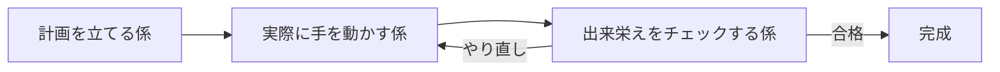

# 手順

1. **日付**: 今日を JST で `<DATE>`（`YYYY-MM-DD`）に確定。引数で日付を渡されたらそれを優先。
2. **取得**: `# 情報ソース` の各行の `[TAG]` に従う。`[RSS]`/`[Atom]`/`[HTML]` は WebFetch、`[API]`/`[JSON]` は `curl -s <URL>` + `jq`。取得できなければそのソースはスキップ。
3. **重複排除**: URL を正規化（`http`→`https`、`utm_*`/`fbclid`/`gclid` 除去、末尾スラッシュ除去）し、一致するものは 1 件に畳む。
4. **分類**: AI / Infra / Backend / Frontend / Others に分類（1 記事 1 ジャンル、迷ったら主題で判断）。件数上限は設けず、まず候補として全件残す。
5. **執筆**: 各ジャンルで、候補の中から**特に重要、または知っておくべきと判断したニュースを 5 件**選び、1 件ずつしっかり要約する。選定基準は〈影響範囲の広さ・技術的インパクト・実務での有用性〉。各トピックは「見出し（記事タイトルをインラインリンクにした H3）＋ 要約 4〜6 文」。要約には〈何が起きたか・技術的な要点・なぜ重要か〉を含める。**専門用語や横文字はそのまま使わず、平易な言葉に言い換えるか、身近な例え（比喩）を添えて初心者にも分かるように書く**（例:「トークンコスト」→「AIを動かす費用（トークン代）」、「レイテンシ」→「応答までの待ち時間」）。処理の流れ・アーキテクチャ・比較など図解した方が伝わりやすい内容には、Mermaid 図（` ```mermaid `コードブロック）を必要に応じて添える（無理に全トピックへ入れる必要はない）。冗長な前置き・締めは書かない。
6. **書き出し**: `docs/blog/posts/<DATE>.md` に書く（同日再実行は上書き）。先頭に下記スキーマの frontmatter、本文は H2 で 5 ジャンル。空のジャンルはセクションごと省略。
7. **commit**: `git add docs/ && git commit -m "report: <DATE>"`。push は任意（手動確認のため）。

# レポートのスキーマ

frontmatter は 2 フィールドのみ（[[feedback-simple-first]]）:

```yaml
---
date: 2026-05-30
title: "一行ヘッドライン"
---
```

本文は H2 で `AI` / `Infra` / `Backend` / `Frontend` / `Others` を区切り、各ジャンル内に重要ニュース 5 件を H3 で並べる。

執筆例（AI、紙面の都合上 3 件のみ抜粋）:

````markdown
## AI

### [複数エージェントを協調させる実装パターン](https://example.com/a)

複数のAI（LLMエージェント）が、まるで会社のチームのように役割分担して1つの仕事を進める仕組みが紹介された。誰かが失敗したときにそれを他のメンバーにどう伝えて立て直すかが設計の一番難しいところで、1人で全部やるより段取りは複雑になる。記事では「計画を立てる係」「実際に手を動かす係」「出来栄えをチェックする係」の3人体制の例を示し、チェック役を挟むことで間違った答えが混ざりにくくなったと報告している。



ただしメンバーが増えるほど、AIを動かす費用（トークン代）と応答までの待ち時間（レイテンシ）も比例して増えるため、仕事の難しさに応じて人数を調整すべきだと結論づけている。

### [LLM 出力の自動評価を CI に組み込む試み](https://example.com/b)

AIが生み出す文章や返答の「できばえ」を、人がいちいち目でチェックしなくても、ソフトのテストと同じように自動でチェックする取り組みが紹介された。AIの答えは毎回微妙に変わってしまうため、「どのくらいズレたら不合格にするか」という合格ラインをどう決めるかが一番の悩みどころだ。記事では、正解に近いお手本とどれくらい似ているかを点数化する方法と、別のAIに採点させる方法を組み合わせるやり方を紹介している。完全に人の目をなくすのは難しいものの、明らかにおかしくなった変化を早めに見つける「見張り役」としては十分役立つとまとめている。

### [小型モデルのローカル運用コスト比較](https://example.com/c)

クラウド上のAIサービスを使う場合と、自分のパソコン（GPU搭載機）で小さめのAIモデルを動かす場合とで、費用と精度を実際に比べた記事。使う回数がある一定を超えると、自前のパソコンで動かした方が安くなる「損益分岐点」があることが分かった。精度は大規模なクラウドAIには一歩譲るものの、要約や仕分けのような決まったパターンの作業なら十分実用に耐えるという評価だ。データを外部に一切送らずに済むという「情報が漏れない安心感」も、用途によっては大きな決め手になると整理している。
````

# 情報ソース

各行末尾の `[TAG]` が最適フォーマット: `[RSS]` / `[Atom]` / `[API]` / `[JSON]` / `[HTML]`。

## 日本 — テック
- はてなブックマーク - 人気エントリー - テクノロジー `[RSS]`: https://b.hatena.ne.jp/hotentry/it.rss
- Publickey 新着記事 `[Atom]`: https://www.publickey1.jp/atom.xml
- Qiita 人気記事 `[RSS]`: https://qiita.com/popular-items/feed
- Zenn トレンド記事 `[RSS]`: https://zenn.dev/feed
- ITmedia 最新記事 `[RSS]`: https://rss.itmedia.co.jp/rss/2.0/topstory.xml
- @IT 最新記事 `[RSS]`: https://rss.itmedia.co.jp/rss/2.0/ait.xml
- Gigazine 最新記事 `[RSS]`: https://gigazine.net/news/rss_2.0/
- Gizmodo JP 新着記事 `[RSS]`: https://www.gizmodo.jp/feed/index.xml
- coliss 新着記事 `[RSS]`: https://coliss.com/feed/
- Findyメディア 新着記事 `[RSS]`: https://api.findy-code.io/rss/media/recent
- はてブ SRE 検索 `[RSS]`: https://b.hatena.ne.jp/q/sre?date_range=5y&sort=recent&target=all&users=3&mode=rss

## 日本 — その他
- はてなブックマーク - 人気エントリー - 総合 `[RSS]`: https://b.hatena.ne.jp/hotentry/all.rss
- はてなブックマーク - 人気エントリー - 暮らし `[RSS]`: https://b.hatena.ne.jp/hotentry/life.rss
- デイリーポータルZ 新着記事 `[RSS]`: https://dailyportalz.jp/feed/headline

## 海外
- Hacker News front page `[API]`: https://hn.algolia.com/api/v1/search?tags=front_page
- TechCrunch `[RSS]`: https://techcrunch.com/feed/
- Dev.to `[RSS]`: https://dev.to/feed/
- HackerNoon `[RSS]`: https://hackernoon.com/feed
- Product Hunt `[RSS]`: https://www.producthunt.com/feed
- Google Cloud Release Notes `[Atom]`: https://docs.cloud.google.com/feeds/gcp-release-notes.xml
- Google Cloud (Medium) `[RSS]`: https://medium.com/feed/google-cloud
- SRE Weekly `[RSS]`: https://sreweekly.com/feed/
- Cloudflare Blog `[RSS]`: https://blog.cloudflare.com/rss/
- CNCF Blog `[RSS]`: https://www.cncf.io/feed/

## Reddit
取得方法は `# 注意` 参照（WebFetch 不可、curl で取る）。
- r/programming `[RSS]`: https://www.reddit.com/r/programming/.rss
- r/ExperiencedDevs `[RSS]`: https://www.reddit.com/r/ExperiencedDevs/.rss
- r/MachineLearning `[RSS]`: https://www.reddit.com/r/MachineLearning/.rss
- r/LocalLLaMA `[RSS]`: https://www.reddit.com/r/LocalLLaMA/.rss
- r/sre `[RSS]`: https://www.reddit.com/r/sre/.rss
- r/devops `[RSS]`: https://www.reddit.com/r/devops/.rss

## セキュリティ
- IPA セキュリティアラート `[HTML]`: https://www.ipa.go.jp/security/security-alert/index.html

# 注意

- 取得に失敗したソース・ジャンルは省略する。
- Reddit は WebFetch 不可（Claude Code がブロック）。`curl -s -H 'User-Agent: knowledge-flow/1.0' <URL>` で RSS を取得する。汎用 UA（`Mozilla/5.0` 等）や `.json` API は弾かれるので、固有 UA ＋ `.rss` を使う。レート制限で一時的に失敗することがあるが、その場合はスキップ。
