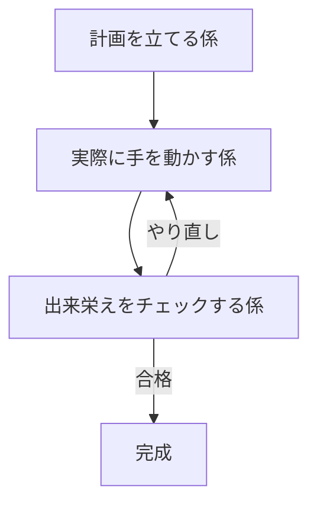

# 手順

1. **日付**: 今日を JST で `<DATE>`（`YYYY-MM-DD`）に確定。引数で日付を渡されたらそれを優先。
2. **取得**: `# 情報ソース` の各行の `[TAG]` に従う。`[RSS]`/`[Atom]`/`[HTML]` は WebFetch、`[API]`/`[JSON]` は `curl -s <URL>` + `jq`。取得できなければそのソースはスキップし、`failures.json` を更新する（`# 注意` 参照）。
3. **日時フィルタ**: 各記事の公開日時（RSS 2.0 の `pubDate` / RSS 1.0（RDF）の `dc:date` / Atom の `published` / Hacker News の `created_at` など）を確認し、基準時刻から**24 時間以内**に公開されたものだけを候補に残す。基準時刻は、`<DATE>` が今日なら実行時の現在時刻（JST）、過去日付（バックフィル）ならその日の 23:59:59 JST とする。フィードの日時は UTC 表記が多いため、JST に換算してから比較する。公開日時が取得できない記事・ソースはそのまま残す（判断材料がないため除外しない）。
4. **重複排除**: URL を正規化（`http`→`https`、`utm_*`/`fbclid`/`gclid`/`ref` 除去、末尾スラッシュ除去）し、一致するものは 1 件に畳む。**本文に書く URL も正規化後のものを使う**（フィードが付ける追跡用パラメータをそのまま残すと、翌日以降の重複判定と食い違う）。**さらに、直近 7 日分の既存レポートに載っている URL は候補から必ず除外する**（同じ記事は 1 度しか載せない）。既出 URL は次で取れる:

    ```sh
    ls -1 docs/blog/posts/*.md | sort | tail -7 | xargs grep -ho '](https\?://[^)]*)' | tr -d '](' | tr -d ')' | sort -u
    ```

    前日分だけを見ていた頃は、2〜5 日空いた重複が素通りしてのべ 40 件たまった。同じ記事が日付違いで並ぶと、カテゴリページ（その技術の歴史を時系列で辿る画面）が用をなさなくなる。**サイト側も同じ URL が 2 記事以上に付いているとビルドを止める**（`src/lib/posts.ts` の `getArticles()`）ため、ここで漏らすと公開が止まる。
5. **分類**: AI / Infra / Backend / Frontend / Products / Others に分類（1 記事 1 ジャンル、迷ったら主題で判断）。件数上限は設けず、まず候補として全件残す。
6. **関連の下調べ**: 手順 7 の基準で各ジャンル 5 件を先に選び、その 1 件ごとに、**過去のレポートに関連する話題がないか**を調べる。`npm run articles > /tmp/kf-index.tsv` で全記事の索引（`日付 \t カテゴリ \t タイトル \t サイト内リンク` の TSV）を作り、記事の主題・固有名詞・カテゴリで grep する。ヒットしたら**その過去記事の本文を実際に読んでから**書く（タイトルだけで内容を推測しない）。詳細は「# 関連記事への内部リンク」参照。
7. **執筆**: 各ジャンルで、候補の中から**特に重要、または知っておくべきと判断したニュースを 5 件**選び、1 件ずつしっかり要約する。選定基準は〈影響範囲の広さ・技術的インパクト・実務での有用性〉。**Products だけは選び方も書き方も違う（「# Products の書き方」参照）。** **選んだ 5 件は、この基準でより重要と判断した順に並べる（ジャンル内の 1 件目が最重要）。** 各トピックは「見出し（記事タイトルをインラインリンクにした H3）＋ 要約 4〜6 文」。**リンク先は必ずその記事・投稿そのものの URL（パーマリンク）にする。** フィード URL や一覧ページ URL（`https://www.reddit.com/r/programming/`、`https://qiita.com/popular-items/feed` など）を貼ってはいけない。パーマリンクは取得したフィードの各エントリが持っている（RSS は `<item><link>`、Atom は `<entry><link href>`、Hacker News API は `url`。`url` が空の Ask HN 等は `https://news.ycombinator.com/item?id=<objectID>`）。エントリから URL が取れなかった記事は、推測で URL を組み立てず**その記事を採用しない**。**URL は書いている記事のエントリから 1 件ずつコピーし、隣の記事のものを貼らないよう確認する。** 貼り違えてもリンク先は正常に開いてしまうため、後から気づく手段がない（実際に 2026-07-20 で、Windows 11 の記事に Gemma 4 の URL が付いていた）。要約には〈何が起きたか・技術的な要点・なぜ重要か〉を含める。**元記事の表現をなぞらず自分の言葉で書く**（「# 引用と著作権のルール」参照）。**要約の中で必ず 1 回、情報の出どころを名指しする**（同ルール参照）。**専門用語や横文字はそのまま使わず、初心者にも分かるように開く**（書き方は「# 専門用語の開き方」参照）。**Mermaid 図（` ```mermaid `コードブロック）は原則入れない。** 文章だけでは構造が掴めないものに限って添える（判断基準は「# Mermaid 図の書き方」参照）。冗長な前置き・締めは書かない。**手順 6 で関連する過去記事が見つかった記事は、要約の中で 1 文触れ、その場にサイト内リンクを張る**（書き方は「# 関連記事への内部リンク」）。**各記事の H3 見出しの直後の行に `<!-- categories: A, B -->` 形式でカテゴリを 1〜3 個付ける**（サイトの `/categories/` ページがこのコメントから導出される。詳細は「# カテゴリの付け方」参照）。
8. **書き出し**: `docs/blog/posts/<DATE>.md` に書く（同日再実行は上書き）。先頭に下記スキーマの frontmatter、本文は H2 で 6 ジャンル。空のジャンルはセクションごと省略。
9. **事実確認**: 書いた要約を 1 件ずつ、取得したエントリの内容と突き合わせる（「# ファクトチェック」参照）。裏が取れない事実は落とす。
10. **校正**: 書いたファイルを読み返し、誤字脱字・変換ミスを直す。特に**外来語がひらがなのまま残っていないか**（`grep -nE '[ぁ-ん]ー' docs/blog/posts/<DATE>.md` で「くろーらー」のような取りこぼしが出る）。観点は [[proofread]] と同じ。あわせて、**報道媒体（Gigazine / ITmedia / @IT / Publickey など）にリンクしている記事の要約に、その媒体名が書かれているか**を 1 件ずつ確認する。抜けていたら足す。
11. **commit**: `git add docs/ && git commit -m "report: <DATE>"`。push は任意（手動確認のため）。

# レポートのスキーマ

frontmatter は 2 フィールドのみ（[[feedback-simple-first]]）:

```yaml
---
date: 2026-05-30
title: "一行ヘッドライン"
---
```

本文は H2 で `AI` / `Infra` / `Backend` / `Frontend` / `Products` / `Others` を区切り、各ジャンル内に重要ニュース 5 件を**重要度順**（1 件目が最重要）に H3 で並べる。各 H3 の直後の行にカテゴリコメントを置く。

執筆例（AI、紙面の都合上 3 件のみ抜粋）:

````markdown
## AI

### [複数エージェントを協調させる実装パターン](https://example.com/a)
<!-- categories: AI Agent, LLM -->

複数のAI（LLMエージェント）が、まるで会社のチームのように役割分担して1つの仕事を進める仕組みが紹介された。誰かが失敗したときにそれを他のメンバーにどう伝えて立て直すかが設計の一番難しいところで、1人で全部やるより段取りは複雑になる。記事では「計画を立てる係」「実際に手を動かす係」「出来栄えをチェックする係」の3人体制の例を示し、チェック役を挟むことで間違った答えが混ざりにくくなったと報告している。


```mermaid
flowchart TD
    A[計画を立てる係] --> B[実際に手を動かす係]
    B --> C[出来栄えをチェックする係]
    C -- やり直し --> B
    C -- 合格 --> D[完成]
```

ただしメンバーが増えるほど、AIを動かす費用（トークン代）と応答までの待ち時間（レイテンシ）も比例して増えるため、仕事の難しさに応じて人数を調整すべきだと結論づけている。

### [LLM 出力の自動評価を CI に組み込む試み](https://example.com/b)
<!-- categories: LLM, CI -->

AIが生み出す文章や返答の「できばえ」を、人がいちいち目でチェックしなくても、ソフトのテストと同じように自動でチェックする取り組みが紹介された。AIの答えは毎回微妙に変わってしまうため、「どのくらいズレたら不合格にするか」という合格ラインをどう決めるかが一番の悩みどころだ。記事では、正解に近いお手本とどれくらい似ているかを点数化する方法と、別のAIに採点させる方法を組み合わせるやり方を紹介している。完全に人の目をなくすのは難しいものの、明らかにおかしくなった変化を早めに見つける「見張り役」としては十分役立つとまとめている。

### [小型モデルのローカル運用コスト比較](https://example.com/c)
<!-- categories: LLM -->

クラウド上のAIサービスを使う場合と、自分のパソコン（GPU搭載機）で小さめのAIモデルを動かす場合とで、費用と精度を実際に比べた記事。使う回数がある一定を超えると、自前のパソコンで動かした方が安くなる「損益分岐点」があることが分かった。精度は大規模なクラウドAIには一歩譲るものの、要約や仕分けのような決まったパターンの作業なら十分実用に耐えるという評価だ。データを外部に一切送らずに済むという「情報が漏れない安心感」も、用途によっては大きな決め手になると整理している。
````

# Products の書き方

`Products` は Product Hunt から「今日世に出たプロダクト」を 5 件紹介するジャンル。ニュースではないので、選び方も書き方も他ジャンルと違う。

- **ソースは Product Hunt だけ。** 他ジャンルに Product Hunt の項目を混ぜない
- 選ぶ基準は〈作っているものの新しさ・開発者にとっての実用性〉。フィードの並び順ではなく、この基準で選び直して並べる
- 1 件 **3〜4 文**で〈何をするプロダクトか・既存のやり方と何が違うか・誰の役に立つか〉。ニュース要約より短くてよい
- 見出しのリンク先は Product Hunt の投稿 URL（`<item><link>`）。プロダクトの公式サイトは貼らない（フィードから確実に取れるのが投稿ページの URL だけのため）
- **キャッチコピーを訳しただけの紹介文にしない。** 「# 引用と著作権のルール」は Products にも同じく適用される

# Mermaid 図の書き方

## 入れるかどうか

**既定は「入れない」。** 図が要るのは、文章で説明すると読み手が頭の中で組み立てないといけない構造があるときだけ。

- **入れる**: 分岐や合流がある流れ、新旧・従来と提案の対比、複数の登場人物がやり取りする順序
- **入れない**: A→B→C と一直線に進むだけの手順（文章で足りる）、箇条書きで足りる列挙、図にしても本文の言い換えにしかならないもの
- 迷ったら入れない。**1 日のレポート全体で 1〜2 個で十分**

## 幅に収める

図は本文の幅（44rem ≒ 704px）に収まらないと縮小され、スマホでは文字が潰れて読めなくなる。**横に広げない**ことが最優先。

- **向きは `flowchart TD`（縦）にする。** `LR` は 4 ノードで本文幅を超える
- **ノードのラベルは 12 文字程度まで。** 長くなるなら `<br/>` で折る
- **subgraph や独立したツリーは横に並ぶ。** 縦に積みたいときは `old --> new` のように矢印でつなぐ（`subgraph old["旧方式"]` と id を付ける）
- 1 つの図にノードを詰め込みすぎない。分岐は 3 本まで

# カテゴリの付け方

サイトはカテゴリコメントから `/categories/<カテゴリ>/` ページをビルド時に導出し、特定の技術のニュースを時系列で辿れるようにしている（H2 のジャンルは自動でカテゴリに加わるため、コメントに含めなくてよい）。

- **既存カテゴリを最優先で再利用する。** 表記ゆれ（`TypeScript` と `typescript` など）は別カテゴリに分裂する。執筆前に既存の一覧を確認する:

  ```
  grep -rho '<!-- categories: .* -->' docs/blog/posts | sed 's/<!-- categories: //;s/ -->//' | tr ',' '\n' | sed 's/^ *//' | sort -u
  ```

- 名前は技術・プロダクトの正式表記（`TypeScript`, `PostgreSQL`, `GitHub Actions`）か、横断テーマ（`Security`, `Incident`, `Supply Chain`, `Business`）。スペースは可、`,` と `/` は不可（`CI/CD` ではなく `CI` など）
- **大文字小文字も公式の表記に厳密に合わせる。** `php` ではなく `PHP`、`typescript` ではなく `TypeScript`。逆に公式が小文字なら小文字のまま（`npm` を `Npm` にしない、`xAI` を `XAI` にしない）。迷ったら公式サイトのロゴ・ドキュメントの表記に従う
- 1 記事 1〜3 個。その技術の「歴史を追いたい人」が見つけられる粒度を選ぶ（記事の主題を優先し、ついでに触れただけの技術は付けない）

# 関連記事への内部リンク

同じ話題を扱った過去のレポートへリンクを張り、サイト内の記事を繋げる。読者が「この話は前にもあった」と時系列で辿れるようにするのが目的。

## 探し方

```sh
npm run articles > /tmp/kf-index.tsv        # 1 日 1 回でよい（全記事の索引を作り直す）
grep -iE 'Microsoft|Windows|DRAM|メモリ' /tmp/kf-index.tsv
```

- 索引の 4 列目がそのまま貼れるサイト内リンク（`/blog/<日付>/#<アンカー>`）。**アンカーはサイト本体と同じ関数で算出しているので、手で組み立てず必ずコピーする**（自分で組むと記号や重複見出しの扱いでズレる。ズレてもリンクは切れず記事の先頭に着地するため、後から気づけない）
- 検索語は記事の主題そのもの（製品名・企業名）に加えて、2 列目のカテゴリ（`Microsoft`, `Incident` など）でも引く。表記が違うだけの関連記事はタイトル検索では出てこない
- ヒットしたら `sed -n` などで過去記事の該当箇所を読む。**読まずにタイトルだけで「以前も〜」と書かない**（内容がズレていても読者には確かめようがない）

## 書き方

```markdown
…ハードとソフトの両側から同時に押し上げられる形になっている。以前の[メモリ価格高騰の鍵を握る中国CXMT](/blog/2026-08-18/#メモリ価格高騰の鍵を握る中国cxmtとはddr5全振りの国策dram企業)でも触れたように、部品価格の上昇は供給構造そのものに原因があり、短期で戻る見込みは薄い。
```

- **`/blog/…` から書く**（`/knowledge-flow/…` と書かない）。公開先の接頭辞はビルド時に付く
- 関連が薄いなら**書かない**。「以前も似た話があった」程度の接続は読者の役に立たず、リンクだけが増える
- 1 記事につき多くても 2 件。同じ過去記事を 1 つのレポート内で何度もリンクしない
- リンクテキストは過去記事のタイトル。長すぎるときは主題が分かる範囲に短くしてよい
- **H3 見出しのリンクは必ず元記事の URL**。サイト内リンクは本文中にだけ置く（見出しの URL は重複チェックの鍵になっている）

# 専門用語の開き方

読者は「その分野を知らない人」を想定する。用語をそのまま置くと、そこで読むのをやめてしまう。ただし**注釈だらけの文章も読めない**ので、開くのは要点に関わる語だけにする。

- **初出の 1 回だけ、`用語（かみ砕いた説明）` の形で添える。** 2 回目以降は繰り返さない
- 説明は **15〜30 字**。「何をするものか」＋「それで何が嬉しいか」が分かる粒度にする
  - ✅ 「RAG（社内文書などを検索してAIに読ませ、根拠のある答えを返させる仕組み）」
  - ❌ 「RAG（検索拡張生成）」（訳語に置き換えただけで、知らない人には何も分からない）
  - ❌ 「RAG（Retrieval-Augmented Generation の略で、外部知識を検索して……）」（長すぎて本文が途切れる）
- **開くのは略語・業界用語**（`k8s`、`オブザーバビリティ`、`量子化`、`レイテンシ`）。一般語（AI、クラウド、アプリ、サーバー）には付けない
- 言葉で説明しづらいものは**身近な例え**を使う（「AIを動かす費用（トークン代。使った文字数ぶんの従量課金）」）
- **1 記事につき 2〜3 語まで。** それ以上必要なら、その記事は要約の切り口を選び直す（全部を説明しようとしない）

# ファクトチェック

このサイトの記事は元記事を読まない読者にも読まれる。**推測で 1 文足すと、それがそのまま事実として伝わる。**

- **数値・固有名詞・日付・金額は、取得したエントリ（または元記事）に書かれていたものだけを書く。** 記憶や相場観で補わない。エントリの要約だけでは裏が取れない数値は、元記事を WebFetch して確かめる。**確かめられなければ、その数値ごと落とす**（「大幅に」とぼかして残さない）
- **影響の大きい話（重大な脆弱性・買収・サービス終了・大きな金額）は一次情報で裏を取る。** 発表元の公式ブログ・リリースを WebFetch して確認する。確認できないまま書くなら、**「〜と報じている」と伝聞であることを本文で明示する**
- **要約の各文が「元記事に書かれていたこと」か、「自分が付けた補足」かを区別する。** 補足は背景説明に留め、事実として断定しない
- **URL と見出しの貼り違えを確認する。** 各 H3 の URL を、その記事のエントリのものと 1 件ずつ突き合わせる（貼り違えてもリンクは正常に開くため、後から気づけない）
- 書き終わったら、リンク先が実在するかを機械的に確かめる。**404 が出たら URL を作ってしまっている**ので、エントリから取り直すか、その記事を落とす:

  ```sh
  grep -o 'https\?://[^)]*' docs/blog/posts/<DATE>.md | sort -u \
    | while read -r url; do code=$(curl -s -o /dev/null -w '%{http_code}' -L --max-time 15 "$url"); \
      [ "$code" = 200 ] || echo "$code $url"; done
  ```

  403 / 429 は取得側を弾いているだけのことが多い（ブラウザで開けば見える）。**404 / 410 は落とす判断をする。**
- **裏が取れずに落とした結果、そのジャンルが 5 件に満たなくてもよい。** 埋めるために不確かな記事を残さない

# 引用と著作権のルール

要約はサイトの中心なので、元記事の著作権を侵さない書き方を守る。事実（誰が何を発表したか・数値・日付）は著作権の対象外なので自由に書けるが、**元記事の「表現」をなぞると翻案（著作権法 27 条）にあたりうる**。要約は引用（同 32 条）では守られない。

- **原文の文をコピーしない。逐語訳もしない。** 記事を読んで理解した内容を、自分の言葉で組み立て直して書く
- **原文の段落構成をなぞらない。** 上から順に言い換えると、実質的な複製に近づく
- **元記事の代わりになる要約を書かない。** 特に日本語のニュース記事（Gigazine / ITmedia / @IT / Publickey など）は、原文と同じ密度で書くと「読まなくても済む」水準になる。要点に絞り、詳細は原文で読ませる
- **要約の中で必ず 1 回、情報の出どころを名指しする。** リンクだけでは、読み手はこのサイトが取材したものと区別できない。**リンク先の媒体が誰かを取材・報道したもの（Gigazine / ITmedia / @IT / Publickey など）なら、発表元だけでなく媒体名を書く。** 「OpenAI が明かした」では、それを報じた媒体の仕事が消える:
  - ✅「Gigazine の記事によると、OpenAI は〜と明かした」／「Publickey が報じたところでは〜」
  - ❌「OpenAI が〜と明かした」（Gigazine 発の記事なのに媒体名がない）
  - リンク先が発表元そのもの（公式ブログ・リリース・個人ブログ）なら、「Cloudflare が公式ブログで公開した」「著者は〜と述べる」のように発表元・著者に触れれば足りる（媒体＝発表元なので重ねて書かない）
- **見出しは元記事のタイトルをそのままリンクにする**（手順 7 のとおり）。原題のままにしておくことが出所の明示として働く
- **本文・画像・図表を転載しない。** コードの引用も、動作を説明するのに要る最小限の行数に留める

これらは公開サイトの掲載方針（`/about/`）として明文にしてある。方針を変えるときは両方を揃える。

# 情報ソース

各行末尾の `[TAG]` が最適フォーマット: `[RSS]` / `[Atom]` / `[API]` / `[JSON]` / `[HTML]`。

## 日本 — テック
- はてなブックマーク - 人気エントリー - テクノロジー `[RSS]`: https://b.hatena.ne.jp/hotentry/it.rss
- Publickey 新着記事 `[Atom]`: https://www.publickey1.jp/atom.xml
- gihyo.jp 新着記事 `[Atom]`: https://gihyo.jp/feed/atom
- Qiita 人気記事 `[RSS]`: https://qiita.com/popular-items/feed
- Zenn トレンド記事 `[RSS]`: https://zenn.dev/feed
- ITmedia 最新記事 `[RSS]`: https://rss.itmedia.co.jp/rss/2.0/topstory.xml
- @IT 最新記事 `[RSS]`: https://rss.itmedia.co.jp/rss/2.0/ait.xml
- Gigazine 最新記事 `[RSS]`: https://gigazine.net/news/rss_2.0/
- Gizmodo JP 新着記事 `[RSS]`: https://www.gizmodo.jp/feed/index.xml
- coliss 新着記事 `[RSS]`: https://coliss.com/feed/
- Findyメディア 新着記事 `[RSS]`: https://api.findy-code.io/rss/media/recent
- レバテックLAB 新着記事 `[RSS]`: https://levtech.jp/media/rss
- はてブ SRE 検索 `[RSS]`: https://b.hatena.ne.jp/q/sre?date_range=5y&sort=recent&target=all&users=3&mode=rss
- PC Watch `[RSS]`: https://pc.watch.impress.co.jp/data/rss/1.0/pcw/feed.rdf
- クラウド Watch `[RSS]`: https://cloud.watch.impress.co.jp/data/rss/1.0/clw/feed.rdf
- AI Watch `[RSS]`: https://ai.watch.impress.co.jp/data/rss/1.0/aiw/feed.rdf
- AKIBA PC Hotline! `[RSS]`: https://akiba-pc.watch.impress.co.jp/data/rss/1.0/ah/feed.rdf
- ASCII.jp トップ `[RSS]`: https://ascii.jp/rss.xml
- ASCII.jp 自作PC `[RSS]`: https://ascii.jp/pc/rss.xml

## 日本 — 企業テックブログ
- DevelopersIO（クラスメソッド）`[RSS]`: https://dev.classmethod.jp/feed/
- メルカリエンジニアリングブログ `[RSS]`: https://engineering.mercari.com/blog/feed.xml
- LINEヤフー Tech Blog `[RSS]`: https://techblog.lycorp.co.jp/ja/feed/index.xml

## 日本 — その他
- はてなブックマーク - 人気エントリー - 総合 `[RSS]`: https://b.hatena.ne.jp/hotentry/all.rss
- はてなブックマーク - 人気エントリー - 暮らし `[RSS]`: https://b.hatena.ne.jp/hotentry/life.rss
- デイリーポータルZ 新着記事 `[RSS]`: https://dailyportalz.jp/feed/headline

## 海外
- Hacker News front page `[API]`: https://hn.algolia.com/api/v1/search?tags=front_page
- Lobsters `[RSS]`: https://lobste.rs/rss
- Techmeme `[RSS]`: https://www.techmeme.com/feed.xml
- TechCrunch `[RSS]`: https://techcrunch.com/feed/
- Dev.to `[RSS]`: https://dev.to/feed/
- HackerNoon `[RSS]`: https://hackernoon.com/feed （WebFetch 不可、`# 注意` 参照）
- Google Cloud Release Notes `[Atom]`: https://docs.cloud.google.com/feeds/gcp-release-notes.xml
- Google Cloud (Medium) `[RSS]`: https://medium.com/feed/google-cloud
- SRE Weekly `[RSS]`: https://sreweekly.com/feed/
- Cloudflare Blog `[RSS]`: https://blog.cloudflare.com/rss/
- CNCF Blog `[RSS]`: https://www.cncf.io/feed/
- Serve The Home `[RSS]`: https://www.servethehome.com/feed/
- TLDR (tech) `[RSS]`: https://tldr.tech/api/rss/tech （1 エントリ＝その日のニュースレター 1 号。個別記事の URL を持たないので、号のページを WebFetch して中の記事 URL を採る）

## プロダクト
`Products` ジャンル専用のソース（「# Products の書き方」参照）。
- Product Hunt `[RSS]`: https://www.producthunt.com/feed

## Reddit
取得方法は `# 注意` 参照（WebFetch 不可、curl で取る）。8 サブレディットを `+` で連結した合成フィードを **1 リクエスト**で取る（個別に叩くと 2 本目以降がレート制限で 429 になる）。
- r/programming + r/ExperiencedDevs + r/MachineLearning + r/LocalLLaMA + r/sre + r/devops + r/learnprogramming + r/softwaredevelopment `[RSS]`: https://www.reddit.com/r/programming+ExperiencedDevs+MachineLearning+LocalLLaMA+sre+devops+learnprogramming+softwaredevelopment/.rss?limit=60

## セキュリティ
- IPA セキュリティアラート `[HTML]`: https://www.ipa.go.jp/security/security-alert/index.html

# 注意

- 取得に失敗したソース・ジャンルは省略する。
- Reddit は WebFetch 不可（Claude Code がブロック）。`curl -s --retry 3 --retry-delay 10 -H 'User-Agent: knowledge-flow/1.0' <合成フィードURL>` で 1 リクエストで取得する（curl は 429 を自動リトライする）。汎用 UA（`Mozilla/5.0` 等）や `.json` API は弾かれるので、固有 UA ＋ `.rss` を使う。各 entry の `category` 要素の `label` 属性がサブレディット名。それでも失敗したらスキップ。**記事のリンクには entry の `<link href="...">`（`https://www.reddit.com/r/<sub>/comments/<id>/<slug>/` 形式のパーマリンク）を必ず使う。** サブレディットのトップ URL（`https://www.reddit.com/r/programming/`）を貼ってはいけない。
- HackerNoon は WebFetch がサイト側に 403 で弾かれる。`curl -s -H 'User-Agent: knowledge-flow/1.0' https://hackernoon.com/feed` で RSS を取得する（UA は何でも通る）。
- **連続失敗の記録**: 取得の成否を `.claude/skills/daily-report/failures.json` に記録する（キーは対象ソースの URL、値は連続失敗回数）。成功したら該当キーを `0` にリセットし、失敗したら +1 する。書き換えたら `docs/` と同じコミットに含めてよい。
- **除外候補マーク**: `failures.json` の連続失敗回数が `3` に達したソースは、`# 情報ソース` の該当行の末尾に `⚠️除外候補（<DATE> 時点で3日連続失敗）` を追記する。**このマークは目印であり、行を削除してはいけない。** 実際に情報ソースから外すかどうかは人間がレビューして判断する。
