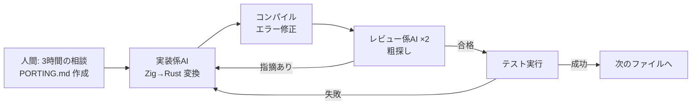
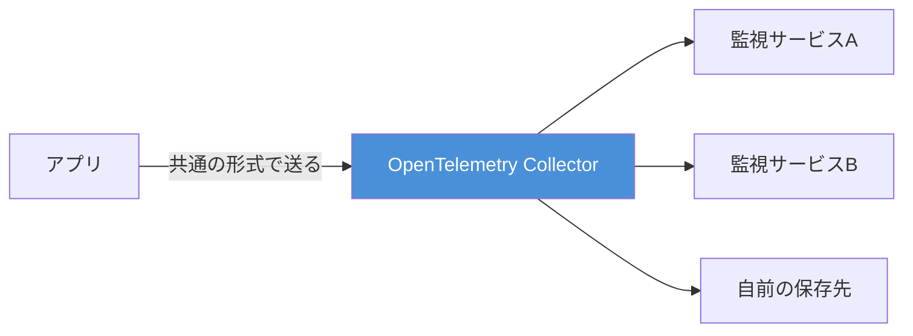
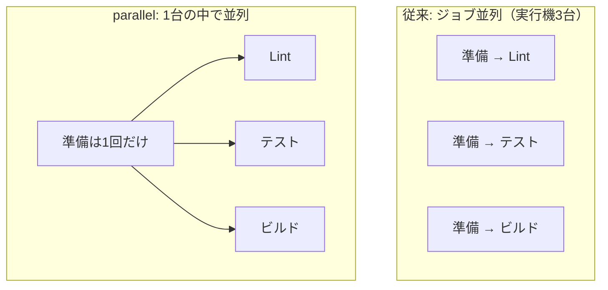
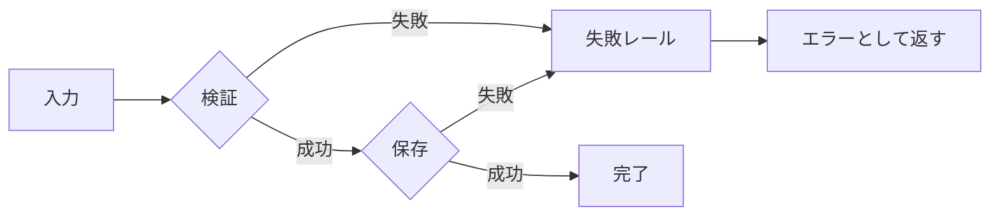

## AI

### [JavaScriptランタイムのBun、Claude Fable 5を11日間稼働させてZigからRustへの移植を実現](https://www.publickey1.jp/blog/26/javascriptbunclaude_fable_511zigrustclaude.html)

JavaScriptを動かすためのソフト「Bun」が、53万5000行という巨大なプログラムを、Zigという言語からRustという別の言語に丸ごと書き換えた。しかもその作業のほとんどをAI（Claude Fable 5）にやらせ、11日間ぶっ通しで走らせ続けたという点が衝撃的だ。開発者はまず3時間かけてAIと「ZigのこういうパターンはRustではこう書く」という対応表を相談し、それを `PORTING.md` という指示書にまとめた。あとは「手を動かす係のAI」1体に対して「粗探しをする係のAI」を2体以上つける体制を組み、変換 → コンパイルエラー修正 → テスト実行、というループをひたすら回した。結果は1448ファイル・6778回のコミット、ピーク時は1分あたり約1300行が生成され、メモリの後始末漏れ（メモリリーク）が消え、実行ファイルのサイズも約20%小さくなった。かかったAI利用料は約16万5000ドル（約2640万円）で、人間チームが数年がかりで挑む規模の作業がこの金額と日数で片づいたことになる。

### [Claude Codeはプロンプトを読む前に33kトークン送っている、OpenCodeは7k](https://systima.ai/blog/claude-code-vs-opencode-token-overhead)

AIコーディングツールが「あなたの質問を読む前」にどれだけの前置き（システム指示や道具の説明書）をAIに送りつけているかを、通信を横から記録して実測した記事。Claude Codeは初回に約3万3000トークン、OpenCodeは約6900トークンで、実に4.7倍の差があった。ここでいうトークンとは、AIに文章を送るときの「文字数の単位」で、そのまま料金に直結する。差の正体は、初期指示文（6.5k対2.0k）と、AIに持たせる道具（ツール）の数（27個対10個）だ。さらに、同じ内容を送り直さずに済ませる「使い回し（キャッシュ）」の効きも大きく違い、ファイル要約タスクではClaude Codeが5万3839トークン、OpenCodeが1003トークンを書き込んでいた。ただし著者は「タスクの出来栄えに差はなかった、違いは純粋にコスト構造だ」とも書いており、設定ファイルを72KBに膨らませたりMCPサーバーを5つ足したりすると両者とも数千〜2万トークン増える点も指摘している。

### [本番のAIエージェントをGPT-5.6に移行したら2.2倍速く、27%安くなった](https://ploy.ai/blog/migrating-a-production-ai-agent-to-gpt-5-6)

実際に動かしているAIエージェントの頭脳を、Claude Opus 4.8からOpenAIのGPT-5.6 Solに差し替えた実録。完了までの時間は8分から3分42秒（2.2倍速）、1回あたりの費用は3.06ドルから2.22ドル（27%減）になり、出力の量も約半分に減った。ただし移行はすんなりとはいかず、失敗の約3分の1は「モデルが悪いのではなく、古いモデル前提で作った採点の仕組み（評価ハーネス）がおかしかった」ことが原因だったという。さらにGPT-5.6は道具を呼ぶとき、必要な2〜3個だけでなく25個の引数を毎回すべて埋めてしまい、それらしい嘘の値を入れる癖があったため、引数の定義を「必須だが空でもよい」形に作り直して対処した。「使い回し（キャッシュ）」の仕組みもOpenAI側では作りが違い、専用の設定を入れて初回のヒット率を0%から83.7%まで引き上げている。モデルを乗り換えるときは、モデルそのものより周辺の仕掛けの作り直しが本番だ、という教訓が詰まっている。

### [Apple、OpenAIと元従業員2人を提訴　「iPhoneの機密を盗んだ」と主張](https://www.itmedia.co.jp/news/articles/2607/11/news038.html)

AppleがOpenAIとその子会社io Products、そして元従業員2人を、企業秘密の侵害で訴えた。Appleの言い分は、OpenAIに転職した元社員が設計図（CAD）や試作品の情報を持ち出し、社内のファイル保管庫にも不正にアクセスしていたというもの。訴状ではOpenAIがこれまでにApple社員を約400人採用してきた点も挙げ、単なる個人の逸脱ではなく組織的な引き抜き戦略があったと主張している。背景には、OpenAIが元Apple幹部を迎えてAIハードウェア（専用端末）を開発していることがあり、Appleは自社のApple Intelligence関連の技術が流出したと見ている。AI業界の人材流動があまりに激しくなった結果、「頭の中の知識」と「持ち出した機密」の線引きが法廷で争われる段階に入ったことを示す一件で、転職時の情報管理は他人事ではない。

### [有名エンジニアの .claude/skills 公開ラッシュから学ぶ、良い Claude Code Skills の書き方](https://note.com/ai_eng_tech/n/n1ef4d57df219)

Claude CodeのSkill（AIに特定の作業手順を覚えさせる仕組み）を公開する人が増えたのを受け、良い書き方の共通点を整理した記事。まず説明文（description）は、冒頭に検索で引っかかる言葉を置き、「何をするか」と「いつ使うか」の両方を書く。手順の要約は書かず本文を読ませるのがコツで、"Helps with documents" のような曖昧な表現は避ける。次に「段階的に情報を出す」考え方が重要で、SKILL.md本体は500行以内に抑え、詳細は別ファイルに逃がし、参照は1階層までにとどめる（読み込むだけで前述のトークン代がかかるため）。さらに、人間が明示的に呼ぶタイプ（副作用のある操作向け）と、AIが自動で呼ぶタイプを意図的に使い分けるべきだと説く。AIがサボる言い訳を先回りして潰す「言い訳テーブル」を書いておく手法も紹介されており、Skillは一度書いて終わりではなく、育てて要らなくなったら捨てるものだと締めくくっている。

## Infra

### [誕生から7年「OpenTelemetry」が異例のスピードでCNCFの“卒業”に](https://atmarkit.itmedia.co.jp/ait/articles/2607/09/news042.html)

システムの動きを記録・観測するための共通の仕組み「OpenTelemetry」が、クラウド関連技術の団体CNCFで最上位の「卒業（Graduated）」認定を受けた。卒業とは「もう十分に成熟していて、安心して本番で使ってよい」というお墨付きのことで、これはKubernetesに次ぐ重要度と位置づけられている。OpenTelemetryは、処理の流れを追う記録（トレース）、出来事の記録（ログ）、数値の記録（メトリクス）という3種類のデータを、どの監視サービスにも同じ形で流せるように統一する存在だ。これがあると、監視ツールを乗り換えるたびにアプリ側のコードを書き直す必要がなくなる（＝特定ベンダーへの囲い込みを避けられる）。2800以上の組織から1200人超が開発に参加し、CPUやメモリの使用状況を継続的に記録する「Profiles」機能なども加わってきた。AIの推論を本番で回すようになり「今このシステムで何が起きているか」をリアルタイムに知る必要性が跳ね上がったことが、追い風になっている。

### [ingress-NGINX の廃止にどう向き合うか](https://www.cncf.io/blog/2026/07/09/navigating-the-ingress-nginx-retirement/)

Kubernetes（コンテナをまとめて動かす基盤）で、外からの通信を受け付ける入口として最も広く使われてきた「ingress-NGINX」が、2026年3月にコミュニティによるメンテナンスを終了した。誤解されがちだが、なくなったのはこの「入口係のソフト」であって、Kubernetesの入口の設計図であるIngress API自体は消えていない。とはいえ使い続けると、セキュリティの穴が見つかっても誰も塞いでくれない状態になるため、移行は避けられない。移行先は大きく2つで、A案はContourなど別の入口係に載せ替える方法（設定ファイルはほぼ流用できるが、`nginx.ingress.kubernetes.io/*` から始まる細かい注釈は互換性がなく手作業での書き換えが要る）。B案は後継仕様のGateway APIに移る方法で、書き換え量は多いものの、インフラ担当と開発者の責任範囲がきれいに分かれ、機能も充実している。時間がないならA案、基盤全体を近代化する計画があるならB案、というのが記事の推奨だ。

### [GitHub Actions の parallel でデプロイは8分→3分、CI はコスト3割減になった](https://zenn.dev/hatsu/articles/github-actions-steps-parallel)

GitHub Actions（テストや配信を自動で走らせる仕組み）に2026年6月25日、ステップ単位で並列実行できる `parallel` が入った。これまでの並列化はジョブ（作業のまとまり）ごとに分ける方式で、分けるたびに実行機を新しく立ち上げ、依存パッケージの用意なども毎回やり直していた。新機能は「同じ1台の中で、複数のステップを同時に走らせる」ため、準備作業を使い回せるのが利点だ。筆者はECSへのデプロイでWeb用とワーカー用を並列にして8分→3分に短縮し、RubyのRuboCopとBrakemanを1ジョブにまとめて重複していた準備を削り、フロントエンドのCIでは約3割のコスト削減を達成した。ただし落とし穴もあり、CPU 1個の実行機にCPUを食う処理を詰め込みすぎると互いに奪い合って逆に遅くなるため、「軽い処理はまとめる・重い処理は分ける」の見極めが要る。

### [34万台超のHDDを運用するBackblazeが2026年第1四半期のHDD故障率レポートを公開](https://gigazine.net/news/20260710-backblaze-drive-stats-for-q1-2026/)

クラウドストレージ企業Backblazeが、自社で動かしている34万5000台超のハードディスクについて、四半期ごとの壊れ具合を公開した。全体の年間故障率は1.39%で、前の四半期より少し悪化したものの、1年前の同じ時期よりは改善している。個別に見ると、HGSTの8TB（HUH728080ALE600）やSeagateの16TB（ST16000NM002J）のように故障ゼロのモデルがある一方、Seagateの14TB（ST14000NM0138）は四半期の故障率が5.78%と突出して悪く、10TB（ST10000NM0086）も3.13%だった。注目すべきは、新しめの20TB以上の大容量ドライブが0.85%と良好な数字を保っている点で、この四半期だけで9404台が投入されている。「大容量＝壊れやすい」という直感は必ずしも正しくないことを、実運用のデータが示しているわけだ。この手の実測レポートは、機材選定の際に「メーカーの公称値ではない現実の数字」として使える貴重な材料になる。

### [SRE NEXT 2026 参加レポートまとめ](https://blog.sre-next.dev/entry/2026/07/12/205027)

国内のSRE（サービスの信頼性を専門に担うエンジニア）向けカンファレンス「SRE NEXT 2026」が7月12日に開催され、参加レポートが各所から次々と公開されている。運営スタッフがそれらを1ページに集約したのがこの記事で、Zenn・Qiita・はてなブログ・noteなどに散らばったレポートをまとめて追える。今年の登壇資料で目立つのは、「CSに"SLO"は要らない、経営層に"99.9%"は伝わらない」のように信頼性の指標を社内の非エンジニアにどう翻訳するかという話題、「念のためのログ保存」をやめるためのポリシー設計といったコスト削減の話、そして「SREの積み重ねがAI駆動開発のガードレールになった」のようにAI時代の運用をSREの土台で支える話だ。技術そのものより「組織にどう埋め込むか」に焦点が移ってきているのが、今年の傾向として読み取れる。

## Backend

### [PostgreSQL 19ベータ版が登場。I/Oワーカーの自動スケール、Autovacuumの改善など新機能](https://www.publickey1.jp/blog/26/postgresql_19ioautovacuum.html)

広く使われているデータベース PostgreSQL の次期版、19のベータが出た。目玉のひとつは、ディスクの読み書きを担当する「I/Oワーカー」が、混み具合に応じて自動的に増減するようになったこと（上限・下限は自分で決められる）。もうひとつは「Autovacuum」の改善で、これは不要になった古いデータの残骸を裏で片づける掃除係のことだ。掃除を複数の担当で分担できるようになり、さらに「どのテーブルから優先して掃除すべきか」を点数で判断する仕組みが入った。外部キー（他のテーブルとの紐づけ）のチェックを伴う書き込みは約2倍速くなり、テーブルを再整理する `REPACK` にはサービスを止めずに実行できる `CONCURRENT` が追加された。加えて、表形式のデータに対して「AとBはつながっているか」といったグラフ的な問い合わせが書ける SQL/PGQ という標準仕様も入っており、関係を辿る検索がSQLだけで書けるようになる。

### [PostgreSQLをクラスタ化した分散DB「Multigres v0.1」アルファ版が登場](https://www.publickey1.jp/blog/26/postgresqldbmultigres_v01.html)

Supabaseが、複数台のPostgreSQLを束ねて1つの大きなデータベースとして扱う「Multigres」のアルファ版を公開した。狙いは、MySQLの世界で実績のある Vitess（YouTubeが生んだ分散化の仕組み）と同等のことを、PostgreSQLでも実現することだ。v0.1の時点では、接続の取りまとめ（コネクションプーリング）、故障時に別のノードへ自動的に引き継ぐフェイルオーバー、各種バックアップ、性能を落とさずに複製ノードを増減させる機能などが入り、最小3台構成で動く。ただし肝心の「シャーディング」——データを複数台に分割して置き、書き込みの負荷そのものを分散させる仕組み——はまだ未実装だ。つまり現時点では「高可用性のためのクラスタ」であって「無限にスケールする分散DB」ではない。それでも、PostgreSQLを使い続けたまま台数を増やして耐えるという選択肢が正式に育ち始めた意味は大きい。

### [Apple、次期macOS 27でSwift言語をシステムカーネル開発に採用](https://www.publickey1.jp/blog/26/applemacos_27swift.html)

Appleが、2026年秋公開予定のmacOS 27で、OSの心臓部であるカーネルの開発にSwiftを使うと発表した。カーネルは長らくC/C++で書かれてきたが、この2言語は「確保していないメモリ領域をうっかり触ってしまう」種類のバグを作りやすく、それが深刻な脆弱性の温床になってきた。Swiftはそうした操作を言語レベルで防ぐ「メモリ安全」な言語で、バッファあふれや解放済み領域へのアクセスを既定で弾く。AppleはすでにファームウェアやドライバでSwiftを使ってきた実績があり、通信規格QUICの実装をSwiftで書き直して高い性能を出した例も挙げている。同じ流れはLinuxのRust採用、MicrosoftのWindowsへのRust導入にも見られ、2024年に米政府が「今後のソフトウェアはメモリ安全であるべき」と提言したことが後押しになっている。要は、OSの最深部でさえ「速いが危ない言語」から「速くて安全な言語」へ移る時代になった、ということだ。

### [Cloudflare Workers の前段に、専用のキャッシュを置けるようになった](https://blog.cloudflare.com/workers-cache/)

Cloudflare Workers（世界中の拠点で動かす小さなプログラム）の手前に、地域ごとの階層キャッシュを置ける機能が追加された。キャッシュとは「一度作った結果を取っておいて、同じ要求が来たら作り直さずに返す」仕組みのこと。今回の特徴は、設定が `{ "cache": { "enabled": true } }` の一行で済み、あとは `Cache-Control` という普通のHTTPヘッダーで挙動を制御できる点だ。効果が大きいのは料金面で、キャッシュに当たった場合はWorkerが一切動かないため、処理時間に対する課金がゼロになる。キャッシュは2階層になっており、各データセンターの下位層と、ネットワーク全体をまたぐ上位層があるので、誰かが1回アクセスして温めておけば、別の地域からの要求もWorkerを起こさずに済む。さらに `ctx.props` を使うと利用者ごとにキャッシュを分けられるため、ログインが必要なAPIのレスポンスも安全にキャッシュできる。

### [TypeScriptで学ぶ Result型とRailway Oriented Programming](https://qiita.com/shun123/items/0eea3c166783347602d6)

エラー処理を `try-catch` で書くと、関数の見た目（型）からは「この関数が失敗しうるのか」が分からない、という問題を出発点にした解説記事。解決策として、戻り値を `Result<T, E>`——つまり「成功した値」か「失敗の情報」のどちらかを必ず包んで返す形——にすると、失敗の可能性が型として目に見えるようになる。Railway Oriented Programming（線路指向プログラミング）はこれを列車の線路にたとえた考え方で、処理は「成功レール」と「失敗レール」の2本を走り、一度失敗レールに乗ったら以降の処理は素通りして失敗がそのまま終点まで流れていく。`andThen` は「成功していたら次を実行、失敗ならそのまま返す」だけの単純な部品で、これがあるおかげで一行ごとにif文でエラーを確認する定型作業が消える。もちろん万能ではなく、非同期処理との相性、失敗時の発生場所を追う情報（スタックトレース）が失われる点、例外を投げてくる外部ライブラリとの境目をどう埋めるかという課題も正直に挙げられている。

## Frontend

### [静的サイトジェネレータ「Astro 7.0」正式リリース、ビルドシステムがVite 8/Rolldownに](https://www.publickey1.jp/blog/26/astro_70vite_8rolldownrust.html)

Webサイトを作るためのフレームワーク Astro のバージョン7.0が出た。中身の大改造が3つあり、1つ目はビルド（ソースコードを配信用のファイルに変換する作業）の土台がVite 8になったこと。Vite 8にはRustで書かれた新しい束ね役「Rolldown」が入っており、これまで開発時と本番時で別々の道具（esbuildとRollup）を使い分けていたのを一本化できる。2つ目は、Astro独自の記法をHTML/CSS/JavaScriptに変換するコンパイラが、Go＋WebAssembly製からRust製に正式に置き換わったこと。この2つの結果、ビルド時間が従来比で15%〜61%速くなったと発表されている。なお、AstroもViteも2026年にCloudflareの傘下に入っており、同じ会社の中で足並みを揃えて開発が進む体制になった点も、今後を見るうえで押さえておきたい。

### [Chrome 150で新しく追加された18個のCSSの機能](https://coliss.com/articles/build-websites/operation/work/chrome-150-adds-18-new-css-feature.html)

Chrome 150でCSS（見た目を指定する言語）の新機能が一気に18個入り、これまでJavaScriptを書かないとできなかったことが軒並みCSSだけで済むようになってきた。特に効くのが `text-fit` で、文字を親要素の幅にぴったり収まるようフォントサイズを自動調整してくれる（今までは文字数に応じて手動でサイズを切り替える処理を書いていた）。`light-dark()` 関数が画像にも対応し、ダークモードとライトモードで背景画像を自動的に切り替えられるようになったのも実用的だ。`polygon()` に角丸のパラメータが付き、多角形の角を丸めるのにベジェ曲線を手計算しなくてよくなった。加えてHTML側では `focusgroup` 属性が入り、矢印キーでの移動を属性ひとつで宣言でき、複雑なtabindex制御のスクリプトが不要になる。全体として「アクセシビリティやテーマ切り替えのために書いていた手続き的なコードが、宣言的な指定に置き換わる」方向の更新だ。

### [OKLCHで知覚的に優れた広色域カラーパレットを生成 -OKLCH Color Palette Generator](https://coliss.com/articles/build-websites/operation/design/wide-gamut-color-palettes-for-ui.html)

UI用の配色（カラーパレット）を作る無料ツール。従来のHEXやHSLで「明度を10%ずつ均等に落とす」といった機械的な作り方をすると、数字の上では揃っていても人の目には色あせて見えるという問題があった。原因は、HSLの「明るさ」の数値が人間の知覚する明るさと一致していないことにある。OKLCHは、人の目が感じる明るさに合わせて設計された色の表し方で、明度と鮮やかさを独立に調整できるため、階調がきれいに揃う。このツールは基準色から明度カーブ・彩度・色相のズレを調整してパレットを生成し、OKLCH/Hex/HSL/RGB/CSS/SCSS/Tailwind/SVG/Figma形式で書き出せる。ライトモードとダークモードのプレビューや、WCAG 2 / WCAG 3（文字の読みやすさを測る国際基準）のコントラスト比チェックも付いているので、「ライトモードでは綺麗なのにダークモードで妙に沈む」といった事故を作る前に潰せる。

### [攻撃者はブラウザを開いて最初の5分で何を見るのか — フロントエンドの実装防御ガイド](https://qiita.com/sei_official/items/3ce11ea5faed795d47fc)

バグバウンティ（脆弱性を見つけて報奨金をもらう活動）で重大な認可不備を報告してきた立場から書かれた、フロントエンド防御の実践ガイド。出発点は「ブラウザに届いた情報は100%攻撃者にも届いている」という前提で、隠すことや読みにくくすること（難読化）は対策ではなく時間稼ぎにすらならないと断じる。最優先はBOLA対策——「URLのIDを他人の番号に書き換えたら他人のデータが見えてしまう」タイプの穴で、サーバー側でオブジェクトごとに持ち主を毎回確認するしかない。Next.jsのMiddlewareで認可を判定するのは補助にとどめ、最終判定は必ずAPIルートやリゾルバ側で行う（過去にMiddlewareを迂回する脆弱性が実在したため）。ほかに、JWTはHttpOnly Cookieに入れてCSRF対策を併用する、`dangerouslySetInnerHTML` を使うならサニタイズ必須、ソースマップや秘密情報を本番に送らない、といった具体策が並ぶ。「画面上でボタンを隠す」のはUXのための措置であって鍵ではない、という線引きが一貫している。

### [生成AI時代、UI/UXデザインに何が起きているか？（NN/G最新論点まとめ）](https://qiita.com/katoriko/items/ce46a3b81793acb3724c)

ユーザビリティ研究で知られるNN/g（ニールセン・ノーマングループ）の最新の論点を整理した記事。まず、これまで「UIデザイナー」と一括りだった職種が、AIツールを使いこなす人、AI機能の画面を設計する人、AIエージェントが読めるようにデータを構造化する人、AIモデルの応答の仕方を定義する人、の4つに分かれ始めているという。AIの出力は毎回変わる（非決定的）ため、デザイナーの中心スキルは「ピクセル単位で正確に指定する」ことから「良い状態とは何かを定義する」ことへ移り、評価→判断→改善のループを回す仕事になる。さらに重要なのが「AIエージェントも新しいユーザーである」という視点で、意味の分かるHTMLタグ（セマンティックHTML）を使い、予測しやすい操作パターンにしておくことが、人にもAIにも効く設計になる。皮肉なことに、誰でも小綺麗な見た目を生成できるようになった結果、「人間が手をかけて作った」ことそのものが新しい信頼の証になりつつある、とも指摘されている。

## Others

### [論文サイト「arXiv」、投稿の約9割で非公開情報が“丸見え状態”か](https://www.itmedia.co.jp/news/articles/2607/13/news021.html)

科学論文の公開サイト arXiv に投稿された約270万件を調査したところ、約9割で本来は見せるつもりのない情報が読める状態だったと判明した。原因は、論文が「完成品のPDF」だけでなく「元原稿（LaTeXのソース）」もセットで公開される仕組みにある。LaTeXのソースには、PDFにすると消えるコメント——査読者への愚痴、書きかけの文章、共著者とのやり取り——がそのまま残る。今回の調査ではそれに加えて、パスワードやAPIトークン（外部サービスを使うための鍵）、Googleドキュメントの限定公開URL、さらには研究者の自宅を示すGPS座標まで見つかったという。対策として、不要なファイルとコメントを正確に取り除くオープンソースのツール「ALC-NG」や、既存の `arxiv_latex_cleaner` の利用が推奨されている。これはarXivだけの話ではなく、「配布物には元データの痕跡が残る」という一般則として受け止めたい（Officeファイルの変更履歴やGitの履歴も同じ構造の問題を抱えている）。

### [Linuxカーネルに15年潜伏した脆弱性が見つかる　攻撃成功率は97％](https://atmarkit.itmedia.co.jp/ait/articles/2607/10/news063.html)

「GhostLock」（CVE-2026-43499）と名付けられた脆弱性が、Linuxカーネルに15年間ひそんでいたことが2026年7月7日に公表された。影響範囲はカーネル2.6.39-rc1から7.1-rc1までで、ほとんどのディストリビューションが既定で有効にしている `CONFIG_FUTEX_PI=y` の設定下で成立する。仕組みは、スレッドの順番待ち行列を管理する `rtmutex` という部品で、待ち行列から外す `remove_waiter()` の処理がエラー時にきちんと後片づけをせず、すでに解放された領域を指したままのポインタ（ダングリングポインタ）が残ってしまうというもの。攻撃者は3つの操作を複数スレッドで組み合わせてこの穴を突き、解放済みメモリを再利用させて任意のコードを実行、97%の確率でroot権限（システムの全権）を奪えた。パッチはすでに各ディストリビューションから出ているので、Linuxを運用しているなら更新を後回しにしないこと。奇しくもこれは、macOSがカーネルをSwiftに移そうとしている理由（メモリ管理のバグが脆弱性の温床になる）を、そのまま実演したような事例でもある。

### [｢半導体インフレ｣消費冷やす　メモリー6倍高騰、スマホ･PC年2億台減](https://www.nikkei.com/article/DGXZQOGN08CW70Y6A700C2000000/)

AIブームによる大規模な設備投資がメモリ半導体を奪い合う形になり、価格が6倍に跳ね上がった結果、その影響が一般の電子機器の値段にまで及んでいる（記事は「チップフレーション」と呼んでいる）。スマートフォンの平均価格は1年で94ドル（約1万5000円）上がり、スマホとパソコンを合わせた出荷台数は年間で2億台減る見通しだという。厄介なのは、最新機種だけでなく型落ち品まで値上がりしていることで、「安く済ませたい人が逃げる先」がない状態になっている。エンジニアの実務に引き寄せると、サーバーやクラウドの単価にも遅れて効いてくる話で、実際にアキバでは500GBのSSDやRTX 3060の12GB版といった「低容量・旧世代」に注目が集まっているという報道もある。AI投資という川上の熱狂が、川下の私たちの調達コストを直撃し始めた、と読むのが正しい。

### [Instagram、他人の公開写真からAI動画を自動生成する機能を無効化](https://www.itmedia.co.jp/news/articles/2607/13/news059.html)

Metaが7月に発表したInstagramの新機能「Muse Image」——利用者の画像を使ってAIが自動的にコンテンツ（動画）を生成する仕組み——が、強い反発を受けて停止された。批判の中心は、本人の明確な同意なしに自分の写真がAIの素材や学習に使われうる点で、Metaも「開発者に直接の了承がないことを示すフィードバックを受け、現在は一時停止している」と説明している。技術的には目新しい仕掛けではないが、「公開されている＝自由に使ってよい」ではないという当たり前の線引きが、プラットフォーム側でも軽視されがちだと露呈した格好だ。AI機能を製品に載せる側としては、データの出どころとオプトイン（利用者が自分から許可する形）の設計を後回しにすると、機能ごと引っ込める羽目になるという実例として記憶しておきたい。

### [「うるう秒」は2026年12月末も挿入されず、最後の「うるう秒」から10年](https://gigazine.net/news/20260710-no-leap-second-at-2026/)

2026年末にも「うるう秒」は入らないことが決まり、最後に挿入された2016年12月から丸10年が経つことになった。うるう秒とは、地球の自転で決まる時刻と、原子時計で決まる正確な時刻とのズレを埋めるために、6月末か12月末に1秒だけ足す調整のことで、その瞬間には「23:59:60」という通常ありえない時刻が出現する。これがIT基盤にとっては厄介で、時刻が連続していない前提で作られていないソフトが誤動作する事故が過去に何度も起きてきた。そうした理由から、2022年の国際度量衡総会で「2035年までにうるう秒を廃止する」ことが決まっている。ところが近年は地球の自転がむしろ速まっており、2029年ごろには1秒を「引く」マイナスのうるう秒が必要になるかもしれないという。1秒を足すのですら事故を起こしてきたのだから、引く方は前例がなく、時刻を扱うシステムにとっては未知の試練になる。
