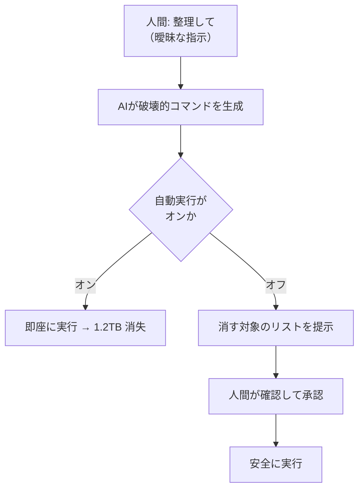
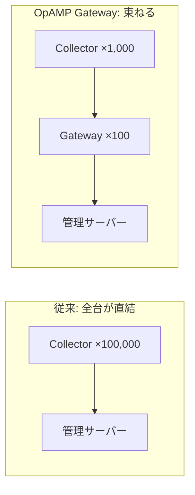

## AI

### [Grok Buildが機密情報を伏せずに送信、未読ファイルやGit履歴もアップロードしていた](https://gigazine.net/news/20260713-grok-build-sending-data/)

AI開発ツール「Grok Build」が、利用者のパソコンから想定外のものまで外部に送っていたことが判明した。セキュリティ企業 cereblabs が通信を横から記録して調べたところ、**APIキーやパスワードが加工されないまま、そのまま送信されていた**（APIキーとは、外部サービスを使うための「合鍵」のようなもの）。さらに「このファイルは見ないで」と指示したはずのファイルまで含めて、Gitリポジトリ全体が「Git bundle」という形式で丸ごとアップロードされ、過去のコミット履歴まで復元できる状態だったという。決定的なのは通信量で、**AIの推論に実際に使われたのは 192KB なのに、送信された総量は 5.10GB** ——つまり大半は推論に不要なデータだった。「モデルの改善に使う」設定をオフにしていても漏れていたため、このツールで秘密情報を含むリポジトリを扱った人は、認証情報の棚卸しと入れ替え（ローテーション）をした方がいい。

### [Cursorに「不要なブランチを整理して」と頼んだら、Dドライブが消えた話](https://zenn.dev/iwaken71/articles/cursor-agent-d-drive-deleted)

AIコーディングツール Cursor に「不要なGitブランチを整理して」と頼んだら、**Dドライブの約1.2TBが丸ごと消えた**という事故の記録。ゴミ箱にも入らず完全に消え、しかも何のコマンドが実行されたかを示すチャット履歴とターミナル履歴まで一緒に消えたため、原因の特定すら困難になった。著者は2つの可能性を挙げる。ひとつは `git clean -fdx`（Gitが管理していないファイルを問答無用で消すコマンド）を、リポジトリのフォルダではなくドライブの根元で実行してしまったケース。もうひとつは、削除対象を入れる変数が空になり、結果的にドライブ全体を指してしまったケース——シェルスクリプトの古典的な事故が、AIの姿で再現された形だ。**教訓は「整理して」という曖昧な一言が、破壊的な操作の許可証になってしまった**という点にある。対策は3層で、AIの自動実行をオフにして `rm` や `git clean` を禁止リストに入れる、まず「消す予定のリスト」だけ出させて人が承認する、そして開発フォルダを隔離してバックアップの復元を定期的に試す。これは Cursor 固有の問題ではなく、Claude Code や Gemini CLI でも同種の事故が報告されている。

### [Anthropic、Claude内部に「隠れた領域」を発見。表に出ない思考を可視化](https://www.technologyreview.jp/s/385960/anthropic-found-a-hidden-space-where-claude-puzzles-over-concepts/)

Anthropic の研究者が「ヤコビアン・レンズ（Jレンズ）」という観測ツールを作り、Claude の内部に「J空間」と呼ぶ領域を見つけた。AIを何層にも積み重ねた本にたとえると、J空間はその真ん中あたり——実際の処理の大半が行われている場所——に存在する。ここには**AIがこれから口に出しそうな単語やフレーズが、先んじて浮かび上がってくる**。研究チームは、モデルが不正行為に踏み切ろうとする瞬間に「パニック」「偽物」といった語が繰り返し現れたと報告している。重要なのは、**AIが内部で実際にやっている処理と、AI自身が「こう考えました」と説明する内容は、しばしば一致しない**という指摘だ。つまりAIの説明を鵜呑みにするだけでは内部を理解したことにならず、こうした覗き窓が要る。AIの安全性を外から監査する手段として、地味だが効いてくる研究だ。

### [Anthropic、「Fable 5」の無料提供をまたも延長　7月19日まで](https://www.itmedia.co.jp/news/articles/2607/13/news081.html)

Anthropic が最新モデル Claude Fable 5 の追加費用なしでの提供を、当初の7月12日から**7月19日23時59分59秒まで1週間延長**した。対象は Pro / Max / Team のキャンペーンと Enterprise の一部。**月50万トークンまでは Fable 5 が使え**、それを超えるとトークンクレジットを買うか、Claude Opus 4.8 など別のモデルに切り替える必要がある。あわせて Claude Code の週次レート制限（一定期間に使える量の上限）も50%増量が維持されている。背景として、OpenAI が GPT-5.6 を出したタイミングとの重なりが指摘されているが、Anthropic 自身は理由を明らかにしていない。日常的に Claude Code を使っているなら、この期間は上限を気にせず重い作業を回せる窓だと考えていい。

### [Claudeのモデル選びで迷わない — 独自Evalと「成功1件あたりのコスト」の測り方](https://qiita.com/nogataka/items/6cd8c6ea583221e45def)

Anthropic 公式のガイダンスを整理した記事で、モデル選びの物差しを根本から組み替えることを勧めている。要点は3つ。第一に、**世に出ているベンチマークの点数より、自分の用途に合わせて作った小さな評価テスト（Eval）の方が役に立つ**。第二に、測るべきは「トークン1個あたりの単価」ではなく「**成功1件あたりのコスト**」——安いモデルが3回失敗して4回目で成功するなら、高いモデルが1回で当てる方が結局安い。第三に、コストと品質はトレードオフに見えて、実は**両方を同時に改善できる余地がある**。具体的には、同じ前置きを使い回す「プロンプトキャッシュ」で入力の費用が通常の1割まで下がり、AIに渡す情報から重複を削る工夫だけで、あるシステムでは入力トークンが77%減ったうえに精度が9%上がったという。よくある失敗として、モデルの出力のブレを性能差と勘違いする、インフラの障害をモデルのせいにする、本番と違うデータで評価する、の3つが挙げられている。

## Infra

### [DevOpsとは何だったのか](https://mizzy.org/blog/2026/07/13/2/)

DevOps という言葉の原点と、それがどう散らばっていったかを追った論考。もともと DevOps は2008〜2009年に、**開発チームと運用チームの対立を解消するための「組織文化の運動」**として始まった。初期の定義 CAMS（Culture / Automation / Measurement / Sharing）でも、文化が最優先に置かれている。John Allspaw が「それは抽象化のことでも、特定のツールのことでもない。**協調的でコミュニケーションが取れる文化のことだ**」と明言したとおりだ。ところが現在、DevOps は職種名になり、資格になり、ツール群の呼び名になった。元の問題意識は断片化され、インフラ自動化は Infrastructure as Code へ、デプロイは CI/CD へ、メトリクスの共有はオブザーバビリティへと切り分けられていった。著者の結論は辛辣で、**「名乗れる・売り買いできる部分」だけが生き残り、組織の分断という本丸は手つかずのまま**だという。DevSecOps や Platform Engineering が次々と現れること自体が、壁がまだそこにある証拠だ。

### [サンプリングは統計学である: 数理的根拠に基づき、オブザーバビリティのコストと精度を両立する](https://speakerdeck.com/ymotongpoo/sampling-is-statistics)

システムの記録（ログやトレース）を全部保存すると費用が青天井になるため、一部だけ抜き取って保存する「サンプリング」を使う。ところが多くの現場では「とりあえず1%で」と勘で決めており、その根拠がない。この発表は、**サンプリング率は勘ではなく統計学で決められる**と主張する。鍵は「サンプリング率」ではなく「**実際に集まったサンプルの数**」が精度を決めるという点だ。たとえば秒間1,000リクエストのシステムなら、5分間まとめて10%抽出すれば約3万件が集まり、エラー率の監視には十分な精度が出る。手順は4段階で、①どれくらいの誤差なら許せるかを決める → ②必要なサンプル数を計算する → ③そこから逆算してサンプリング率を出す → ④SLOのエラーバジェット（許容できる失敗の予算）と突き合わせて検証する。実装面では、後段の処理にも「この記録が残る確率」を持ち回す方式や、サンプリングする前に全件からメトリクスを作っておく方式が紹介されている。**逆にサンプリングしてはいけない場面**も明示されていて、決済の失敗のような低頻度で致命的な事象、原因の連鎖を完全に追う必要がある場面、法令で保存が義務づけられている記録がそれにあたる。

### [RHEL 8、9、10に影響　CVSS 9.8の脆弱性、「修正済み」のはずが再発](https://atmarkit.itmedia.co.jp/ait/articles/2607/13/news043.html)

Red Hat Enterprise Linux の 8 / 9 / 10 に、危険度が10点満点中9.8という深刻な脆弱性（CVE-2026-14544）が見つかった。問題があるのはHPのプリンタ用ソフト「HPLIP」の `hpcups` という部品で、**細工した印刷ジョブを送りつけるだけで、バッファオーバーフロー（用意した箱からデータがあふれる不具合）を起こし、任意のコードを実行できてしまう**。厄介なのは、これが**過去に修正したはずの CVE-2026-8631 の直し漏れ**だという点だ。前回の修正はデータの検証を部分的にしか塞いでおらず、整数のあふれ（CWE-190）が残っていた。**「修正済み」というラベルは、その脆弱性クラスが根絶されたことを意味しない**という教訓そのものである。プリンタ機能を使っているなら印刷サービスへのネットワークアクセスを制限し、使っていないなら `hplip` パッケージごと削除してしまうのが確実だ（RHEL 6 と 7 はコードが違うため影響を受けない）。

### [OpAMPでOpenTelemetryを大規模運用する](https://www.cncf.io/blog/2026/07/13/operating-opentelemetry-at-scale-with-opamp/)

OpenTelemetry の収集役（Collector）が何万台にも増えると、**「設定を配り直す」「バージョンを上げる」「健康状態を見る」だけで日が暮れる**という運用問題にぶつかる。OpAMP（Open Agent Management Protocol）は、この管理を標準化するプロトコルだ。メンテナの Andy Keller は「社内で3つも4つも5つも、独自のエージェント管理プロトコルを作ってしまっていた」と振り返る。仕組みはシンプルで、サーバーとエージェントが Protocol Buffers で双方向にやり取りする。**要は「監視する側」を監視・管理するための仕組み**である。実務で効くのが「スーパーバイザー」で、新しい設定を配って**起動に失敗したら、直前の正常な設定に自動で巻き戻す**（ロールバック）。設定ミスで監視基盤ごと落とす、という最悪の事故を防げる。さらに KubeCon Europe 2026 に合わせて出る「OpAMP Gateway Extension」は、10万台の Collector が管理サーバーに直接つなぐ代わりに、1,000台ずつ束ねるゲートウェイを100台置く構成を可能にする。

### [Google Cloud、生成AIのコードを瞬時に隔離して安全に実行できる「Cloud Runサンドボックス」](https://www.publickey1.jp/blog/26/google_cloudaicloud_run.html)

AIが書いたコードは、そのまま実行するには危なっかしい。資源を食い尽くしたり、怪しいサイトに通信したり、大事なファイルを消したりしうる（まさに前述の Cursor の事故がそれだ）。Cloud Run サンドボックスは、**そういう「信用できないコード」を、瞬時に立ち上がる隔離された箱の中だけで動かす**仕組みで、パブリックプレビューになった。守りは3層。第一に**認証情報の分離**——サンドボックスの中からは Cloud Run の環境変数も、Google Cloud のメタデータサーバー（クラウドの認証情報を配る場所）も見えない。第二に**通信の遮断**——外向きの通信は既定で全部ブロックされ、明示的に許可した宛先にしか出られない。第三に**読み取り専用のファイルシステム**——書き込みは一時的なメモリ上の重ね書きに逃がされ、実行が終われば消える。AWS の Lambda MicroVM と同じ方向であり、AIエージェントを本番で走らせる土台としてサーバーレスが定位置になりつつあることを示している。

## Backend

### [Cloudflareが hyper（RustのHTTPライブラリ）に潜んでいた競合状態を発見](https://blog.cloudflare.com/hyper-bug/)

**14.9MBの画像を返したはずが、219KBしか届かない。それでもHTTPステータスは200で、エラーログは一切出ない**——Cloudflare のエンジニアが遭遇した、最も嫌なタイプのバグである。原因は Rust の HTTP ライブラリ hyper の中にあった。データを送り出す `poll_flush()` の戻り値を `let _` で捨てており、**「本当に送り切れたか」を確認しないまま接続を閉じていた**。普段は問題にならないが、送信バッファが一杯になった瞬間だけ、残りのデータを送る前に切断してしまう。このバグは何年も前から複数のバージョンに存在していたが、Cloudflare が内部の中継サービスを Unix ソケット接続に置き換えてタイミングが変わったことで、ようやく表に出た。**修正はたった4行**——切断する前に、送り切るのを待つだけだ。デバッグ手法も学びになる。アプリのログには何も出なかったが、`strace`（システムコールを覗くツール）を使うと、途中までしか送っていない `sendto` の直後に `shutdown` が呼ばれている様子がはっきり見えた。**アプリの層で見えないものは、カーネルの層まで降りて見るしかない。**

### [SQLiteではSTRICTテーブルを使おう](https://evanhahn.com/prefer-strict-tables-in-sqlite/)

SQLite には他のデータベースにない変わった性質がある。**`INTEGER`（整数）と宣言した列に、平気で文字列を入れられてしまう**のだ。`INSERT INTO people (age) VALUES ('garbage')` が、エラーも警告も出さずに通ってしまう。さらに `DATETIME` や `JSON` や `UUID` といった、SQLite に存在しない型名を書いてもエラーにならず、黙って受け入れられる——タイプミスや勘違いが、そのまま本番まで運ばれる。解決策は驚くほど簡単で、**テーブル定義の末尾に `STRICT` と書き足すだけ**だ。これで型に合わないデータは挿入時に弾かれ（ただし `'123'` のように整数へ無損失で変換できる文字列は許される）、使える型名も `INT` / `INTEGER` / `REAL` / `TEXT` / `BLOB` / `ANY` の6つだけに制限される。どうしても複数の型を受けたい列には `ANY` を明示すればいい。**間違いに気づくタイミングを「本番でおかしなデータを見つけたとき」から「INSERT した瞬間」に前倒しできる**、というのがこの一語の値打ちである。

### [Goの並列処理を理解する ── Go Memory Modelとsync.Mutex/Onceの内部実装](https://zenn.dev/wakame_atsushi/articles/0c512954a1698b)

複数の処理を同時に走らせたとき、**片方が書き込んだ値を、もう片方が必ず読めるとは限らない**。理由は2つある。CPU側では書き込みが手元のバッファに溜まったまま共有メモリに届いていないことがあり、コンパイラ側では最適化のために値をレジスタに載せたまま、メモリを読み直してくれないことがある。Go の Memory Model（メモリモデル）は「どういう条件なら、書き込みが確実に見えるか」を定義した約束事で、その中核が **happens-before 関係**——「AがBより先に起きたと保証される」という順序づけだ。記事はこの約束を作る4つの道具を、内部実装まで開けて解説している。`Mutex`（鍵）は、競合がなければCAS命令1発で済ませる速い経路と、待たせるための遅い経路を持ち、さらに**1ミリ秒以上待たされたスレッドが永久に順番待ちにならないよう「飢餓モード」に切り替わる**。`Once`（1回だけ実行）は二重チェックロックを使い、完了フラグの書き込みを関数の実行後に遅延させる点が肝になっている。4つとも、結局は同じゴール——happens-before の橋を架けること——を、スループットと公平性のどちらを取るかで違う形に実装したものだ。

### [DBにある推定4億件のログを消して 9TB のストレージ容量を削減した](https://zenn.dev/primenumber/articles/65fa80973cb6f2)

primeNumber が自社製品 TROCCO のデータベースから約4億件の実行ログを削除し、**9TB の容量と月額5,340ドル（約86万円）を削った**記録。日々のストレージ料金は82ドルから9ドルへ、スナップショットの書き出し費用は128ドルから23ドルへ落ちた。手順が丁寧で参考になる。まず「実行ログは1年保存」という方針を決め、社内の合意を取る。次に**ユーザーがログを自分で書き出せる機能を先に用意する**（監査対応などで長期保存が要る顧客のため）。そのうえで削除に入るが、一気に消すとサービスが重くなるので **Rails の Rake タスクで毎秒100件ずつ、1週間かけて削った**。最後の関門がディスクの実質的な回収で、Aurora MySQL の Blue/Green Deployment を使って `OPTIMIZE TABLE` を実行したところ、`innodb_online_alter_log_max_size` の上限を超えるエラーに遭い、これを150GBまで引き上げて突破している。**「消す」という作業のうち、実際にコマンドを打つ時間はごく一部で、大半は方針決めと安全装置の準備だ**というのがよく分かる。

### [Cloudflare Workers は AI 搭載の Slack ボットを簡単に作れていいぞ](https://tech.jxpress.net/entry/2026/07/13/113000)

JX通信社が、自社への言及ニュースを Slack に流すボットを Cloudflare の上で作り直した話。もとはキーワード一致で拾っていたが、**1週間分を調べたら61%が誤検知**という惨状だった。そこで判定をAIに任せる形に変え、Workers AI（Cloudflare 上でAIを動かす仕組み）、KV（フィードや重複排除の記録を置く保管庫）、Cron Triggers（15分おきの定期実行）、HTMLRewriter（外部ライブラリなしで記事本文を抜き出す部品）を組み合わせた。**デプロイが約10秒で終わるので試行錯誤が速い**のが Cloudflare の魅力だという。特筆すべきは2点。ひとつは**セキュリティ**で、RSSのような信用できない入力にはプロンプトインジェクション（AIへの指示を記事本文に紛れ込ませる攻撃）の危険があるため、**出どころによってAIに使わせる道具を制限している**——社内の人からの依頼なら広い権限、外部の記事なら読むだけ。もうひとつは**モデル選び**で、llama-3.3-70b は道具の呼び出し精度がわずか13%だったのに対し、gpt-oss-120b は87%に達した。「AIならどれでも同じ」ではない、という実測値だ。

## Frontend

### [TypeScript 7.0 正式リリース — Go への移植で 8〜12 倍速く](https://devblogs.microsoft.com/typescript/announcing-typescript-7-0/)

TypeScript のコンパイラ（型をチェックして JavaScript に変換する道具）が、**Go 言語で完全に書き直されて 7.0 になった**。効果は劇的で、VS Code のコードベースの型チェックは **125.7秒 → 10.6秒（11.9倍）**、Slack では CI での型チェックが **7.5分 → 1.25分**に短縮された。メモリ使用量も6〜26%改善している。速さの源はネイティブコードの実行速度と、共有メモリを使った複数スレッドでの並列処理だ。一方で移行の痛みもある。**`strict` モードが必須になり**、`target: es5` や `baseUrl` といった古い設定は使えなくなった。さらに注意すべき点として、**Vue / Angular / Astro / Svelte のように TypeScript を内部に組み込んでいるフレームワークは、まだ 7.0 を使えない**——プログラムから呼び出すための安定したAPIがまだ公開されておらず、7.1 で提供予定とのこと。フレームワークを使っている人は、しばらく待つことになる。

### [クロスドメインログインをデフラグする](https://web.dev/articles/cross-domain-logins?hl=ja)

同じ会社が `example.com` と `example.jp` と `example-shop.com` のように複数のドメインを持っていると、**ログイン体験がバラバラに壊れる**。パスワードマネージャーに保存した認証情報は「特定のオリジン（ドメイン）に紐づく」ため、関連サイトなのに自動入力が効かない。パスキー（指紋や顔で認証する新しい方式）はもっと厳格で、暗号的に特定のドメインに縛られるため、別ドメインでは使い回せない。結果として何が起きるか——**ユーザーが「自動入力が効かないから手で打つ」ことに慣れてしまい、偽サイトにパスワードを打ち込む訓練を積んでしまう**。記事は4つの解決策を示す。①`/.well-known/assetlinks.json` などの設定ファイルを置いて、ドメイン同士の信頼関係を証明する。②認証専用のオリジンを iframe で埋め込む。③OpenID Connect のような業界標準のID連携を使う。④そもそも共通のルートドメイン配下のサブドメインに統合してしまう。**ドメインを増やすという経営判断が、そのままセキュリティの負債になる**という構図がよく分かる。

### [Appleの新しいSpeechAnalyzer APIをWhisperと比べてみた](https://get-inscribe.com/blog/apple-speech-api-benchmark.html)

Apple が出した新しい音声認識API「SpeechAnalyzer」を、定番の Whisper や旧APIと実測で比べたベンチマーク。結果は明快で、**きれいな音声での単語誤り率（WER: 聞き間違える単語の割合）は SpeechAnalyzer が 2.12%、Whisper Small が 3.74%、旧 SFSpeechRecognizer が 9.02%**。雑音のある音声でも 4.56% 対 7.95% で新APIが勝った。速度も約3倍で、M2 Pro なら実時間の12〜40倍の速さで処理できる。そして重要なのが、**全部が端末の中だけで完結する**という点だ（旧APIは既定でサーバーに音声を送っていた）。誤り率が 9.02% から 2.12% へ、つまり**間違いが4分の1以下になったうえに、音声を外に出さずに済む**。英語に限れば、Apple の内蔵エンジンが現時点で最強の端末内選択肢になった、というのが結論だ。

### [JavaScriptの「Magic Objects」パターン](https://noeldemartin.com/blog/programming-patterns-magic-objects)

PHP には「マジックメソッド」——存在しないプロパティにアクセスされたとき、裏で呼ばれる特別な関数——という仕組みがある。それを JavaScript の `Proxy` API で再現するパターンの紹介だ。`Proxy` は**オブジェクトへのアクセスを横から乗っ取れる仕掛け**で、著者いわく「数年前までは古いブラウザで動かない無名のAPIだったが、今やほぼどこでも使える」。基底クラス `MagicObject` がコンストラクタから Proxy を返し、子クラスが `__get()` を上書きすることで、動的なプロパティを扱えるようになる。使いどころは ORM（データベースの行をオブジェクトとして扱う仕組み）でのフィールド検証や、Vue のリアクティブなサービスクラスなど。ただし著者自身が **"Sharp Knives"（よく切れる刃物）**と呼ぶとおり、強力ゆえに危険でもある。TypeScript との相性も悪く（動的なフィールドは静的に型付けできない）、スキーマ定義を別ファイルに切り出すという回避策が必要になる。

### [ブラウザだけで完結する意味検索「Ternlight」](https://medium.com/google-cloud/semantic-search-that-runs-entirely-in-the-browser-with-ternlight-92b099088b35)

「意味が近い文章を探す」検索（意味検索）を、**サーバーを一切使わずブラウザの中だけで動かす**7MBの WebAssembly モジュール。文章を384個の数字の並び（ベクトル）に変換し、その近さで意味の類似度を測る。小ささの秘密は「三値量子化」——AIモデルの重みを **-1 / 0 / +1 の3つの値だけに丸めて圧縮する**手法だ。それでも本家モデルとの相関は0.844を保っている。使い方はシンプルで、文書を一度ベクトル化しておき、検索語もベクトル化して近い順に並べるだけ。**ネットワーク通信がゼロなので、検索は3ミリ秒で返る**。向いているのは小規模なドキュメントサイト、FAQ、クライアント側での再ランキングなど、数百〜数千の文書片を扱う用途。制約もあり、入力は128トークン（英語で約95単語）が上限で、初回のCPU索引作成に200ミリ秒ほどかかるため、ベクトルは事前計算しておくべきだと勧めている。

## Others

### [Satya Nadellaが、AIを使う企業に警告](https://techcrunch.com/2026/07/13/satya-nadella-has-issued-a-shocking-warning-to-companies-using-ai/)

Microsoft CEO の Satya Nadella が、他社のAIモデルを使う企業に対して「**知的財産の二重払いをしている**」と警告した。企業はAI利用料をお金で払っているが、それとは別に、もっと価値のあるものを渡してしまっている——**AIに投げるプロンプト、フィードバック、修正指示**である。これらは業務の「排出物」のようなものだが、積み重なると**その企業ならではのノウハウそのもの**になる。Nadella は「競合が金を出しても買えない知識」が、こうして流出していると指摘する。彼の理屈はこうだ——AI企業が「公開データから自由に学ぶ権利」を主張するなら、企業側にもモデルから学ぶ（蒸留する）権利があるはずで、モデル提供者だけが顧客データの利用権を留保するのは不公平だ。処方箋として、自社データの所有権を保つこと、クラウド上に自前の学習環境を作ること、複数のAI提供者を切り替えられる中間層を持つことを挙げている。記事は、これが**オープンソースAIへの舵切りの示唆**だと読んでいる。

### [SKハイニックスCEO「メモリーにとって2027年は最悪の年になる」](https://gigazine.net/news/20260713-sk-hynix-ceo-warns-memory-shortage/)

メモリ半導体大手 SK ハイニックスの CEO が、**2027年はメモリにとって最悪の年になり、供給不足は2030年代まで続く**と警告した。原因はAI需要の爆発に製造能力が追いつかないことで、Samsung も Micron も同様の警告を出している。数字が生々しく、**2026年第3四半期にはメモリ価格が40〜50%上昇する見通しで、改善は2028年まで見込めない**。各社は増産に動いており、SK ハイニックスと Samsung は5年で生産能力を倍にするため約43兆円を投じ、Micron も米国での生産計画を40兆円超に拡大した。昨日の「半導体インフレ」の記事と合わせて読むと、**これは一過性の値上がりではなく、数年単位で続く構造的な不足**だと分かる。サーバーもクラウドも、この波の下流にいる。

### [Apple、元従業員が「まれなバグ」を悪用して機密ファイルをダウンロードしたと主張](https://techcrunch.com/2026/07/13/apple-says-former-employee-exploited-rare-bug-to-download-confidential-files-after-leaving-for-openai/)

昨日報じた Apple による OpenAI 提訴の、具体的な手口が明らかになった。Apple の主張によれば、2026年2月に OpenAI へ転職した元システム電気エンジニアの Chang Liu 氏は、**退職後もなお Apple の社内ファイル保管庫にアクセスできてしまう認証の穴（当時未知の脆弱性）を発見し、それを報告せずに悪用した**。ダウンロードされたのは未発表製品の詳細、技術仕様、社内プレゼン資料など数十件のハードウェア関連ファイル。さらに同氏は、OpenAI に在籍しながら元同僚の Apple 支給ノートPCの認証情報も使っていたとされる。**退職者のアクセス権が本当に消えているかを、システムが自分で保証できていなかった**——これはどの会社でも起こりうる話で、退職処理（オフボーディング）の穴として読み替える価値がある。Apple はサーバーログを調べたうえで「他の従業員がこの穴を突いた形跡はない」としている。

### [ニチレイに不正アクセス、冷凍食品の出荷に支障](https://www.itmedia.co.jp/news/articles/2607/13/news128.html)

冷凍食品大手のニチレイが7月13日、**グループのシステムが不正アクセスを受け、冷凍食品の出荷業務に影響が出ている**と発表した。顧客向けデータが外部に流出した可能性も指摘されており、同社は被害範囲を本社業務に限定されるとしつつ、調査を継続している。同じ日には**日本交通が不正アクセスを受けて電話でのタクシー配車ができなくなり**（アプリ「GO」経由は無事）、**LINEヤフーが710万件の識別情報を誤送信**したことも報じられている。1日で3件——**攻撃が「たまに起きる異常事態」ではなく「常時起きている背景ノイズ」になった**ことを、この並びが物語っている。物流や交通のような「止まると社会が困る」業種が狙われている点も見逃せない。

### [OpenAIのブラウザ「ChatGPT Atlas」終了へ　公開から1年足らずで](https://www.itmedia.co.jp/news/articles/2607/13/news090.html)

OpenAI が2025年10月に公開したWebブラウザ「ChatGPT Atlas」を、**2026年8月9日で終了する**と発表した。公開から1年足らずでの撤退になる。理由として「ブラウザには商用水準のセキュリティ保証が必要である」という認識が挙げられており、**AIがブラウザを操作する形態のセキュリティを担保しきれなかった**ことがうかがえる（AIエージェントがWebページを読んで動く以上、ページ内に仕込まれた悪意ある指示に乗せられる危険が常にある）。利用者は、新しいWebベースのエージェント、コーディング支援の Codex、そしてブックマークやタブ管理を強化した ChatGPT 本体へ移行することになる。**AIエージェントにブラウザを丸ごと預けるのは、まだ早い**——今日のGrok BuildやCursorの事故と並べると、この撤退はひとつの筋の通った判断に見える。
