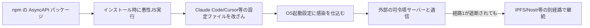
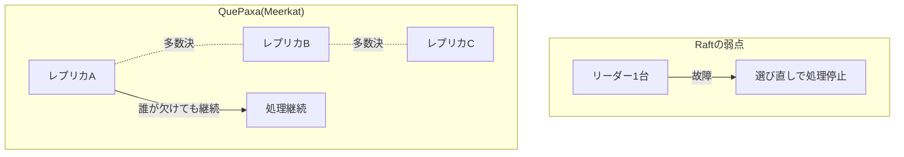
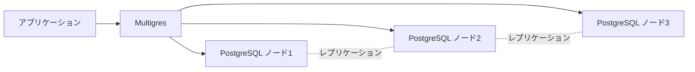

## AI

### [Thinking Machines Labが初のオープンウェイトモデル「Inkling」を公開](https://thinkingmachines.ai/news/introducing-inkling/)
<!-- categories: LLM, OSS -->

AI企業のThinking Machines Labが、モデルの中身（重みデータ）をまるごと公開する「オープンウェイト」方式のAIモデル「Inkling」を発表した。パラメータ数は9750億（実際に計算に使われるのは410億）で、軽量版「Inkling-Small」も同時に公開されている。文章・画像・音声を専用の変換部品を挟まずに直接理解できる作りになっており、一度に読み込める文章量も最大100万トークン（原稿用紙数千枚分に相当）と非常に大きい。特徴的なのは「考える深さ」を利用者が調整できる点で、簡単な質問には浅く速く、難しい質問にはじっくり時間をかけて答えることで、AIを動かす費用（トークン代）と精度のバランスを取れるようにしている。中身を公開する狙いは、企業や研究者が自分たちの用途に合わせてAIを微調整（ファインチューニング）しやすくすることで、実際にInkling自身が「特定の文字を使わずに文章を書く」よう自己調整するデモも披露された。1社が独占する巨大なブラックボックスAIに対抗する、開かれたAI開発の流れを後押しする発表といえる。

### [ClaudeやCursorを狙う自己増殖型マルウェアがnpmで発見される](https://atmarkit.itmedia.co.jp/ait/articles/2607/16/news039.html)
<!-- categories: npm, Security, Supply Chain -->

セキュリティ企業GMO Flatt Securityが、npm（JavaScriptのパッケージを配布する仕組み）上のAsyncAPI関連パッケージに仕込まれた悪意あるコードを発見した。狙われていたのはClaude Code、Cursor、Gemini、VS Codeといった、AIを使ってコードを書くための開発ツールの設定ファイルだ。悪性コードは約9200行にも及ぶJavaScriptで構成され、「Miasma」というマルウェアの仕組みを使ってWindows・Mac・Linuxそれぞれの起動設定に自分を潜り込ませ、感染を広げる。さらに乗っ取ったパソコンを外部の攻撃者が遠隔操作できる「司令塔」との通信経路も複数用意されており、片方が遮断されても別経路で指示を受け取り続けられるようになっていた。AIコーディングツールが日常的に使われるようになったことで、攻撃者の狙いが「開発者のパソコンそのもの」に移ってきていることを示す事件だ。CI/CD（自動ビルド・自動デプロイの仕組み）のパイプラインで、パッケージインストール時に自動実行されるスクリプトを厳しくチェックする体制が今まで以上に必要になる。

### [Cursorに「リポジトリを開くだけ」で任意コードが実行される脆弱性](https://gigazine.net/news/20260715-cursor-0day-disclosure/)
<!-- categories: Cursor, Security -->

AIコーディングツール「Cursor」のWindows版に、プロジェクトを開いただけで悪意あるコードが自動実行されてしまう脆弱性が見つかった。原因は、Cursorがgitの実行ファイルを探す際に、開いている作業フォルダの中も検索対象に含めてしまう点にある。攻撃者がリポジトリの一番上の階層に偽物の「git.exe」を仕込んでおけば、Cursorがそれを本物のgitと勘違いして実行してしまい、ボタン操作や確認画面なしに、ログイン中の利用者と同じ権限でコードが動いてしまう。GitHub上のサンプルコードを試しに開いたり、外部の開発者から送られてきたコードを検査したりする場面が特に危険だとされている。研究者が報告してから7ヶ月経っても修正されないまま詳細が公開されたという経緯自体も、AIコーディングツールのセキュリティ対応の遅れとして問題視されている。信頼できないリポジトリは使い捨ての仮想環境（Windows Sandboxなど）で開く、企業端末では特定フォルダ内でのgit.exe実行を制限するといった対策が呼びかけられている。

### [Google DeepMindのハサビスCEO、AI規制のための独立機関設立を呼びかけ](https://gigazine.net/news/20260715-google-deepmind-demmis-hassabis-ai-framework/)
<!-- categories: Google -->

Google DeepMindのデミス・ハサビスCEOが、最先端AIの安全性を評価・監視するための「独立した標準機関」を新たに作るべきだと呼びかけた。飛行機の安全基準を定める国際機関や、原子力の安全性を審査する機関のように、特定の企業や国に偏らない第三者の立場でAIの危険度を判断する仕組みが必要だという主張だ。現状ではAIを開発する企業自身が「自分たちのAIは安全だ」と評価・公表しているケースが多く、利害関係がある当事者による自己申告に頼っている状態が続いている。これは、食品会社が自社製品の安全検査を自分で行って合格を出しているようなもので、第三者によるチェック体制がないという構造的な弱点を抱えている。ハサビス氏の発言は、AIの能力が急速に伸びる中で、業界任せの安全対策では追いつかなくなっているという危機感の表れだ。実現には各国政府や複数のAI企業の合意が必要で、すぐに実現する話ではないが、AIガバナンスの議論を一歩進める提案として注目されている。

### [「AIも1人作業でサボり出す」Claude Codeが陥る3つの失敗パターン](https://atmarkit.itmedia.co.jp/ait/articles/2607/15/news052.html)
<!-- categories: Claude Code -->

AIにコーディングの複雑なタスクを1人で丸ごと任せると、決まって3つの失敗パターンに陥ることが報告された。1つ目は「エージェントの曖昧さ」で、最初にやることをぼんやりとしか決めずに動き出し、途中でタスクの範囲がどんどん膨らんでしまう現象。2つ目は「優先順位の思い込み」で、本来は必ずやるべき地味な作業を、AIが勝手に「重要度が低い」と判断して省いてしまう問題。3つ目は「目標のズレ」で、やり取りが長くなるほどAIが覚えていられる情報の範囲（コンテキスト）が実質的に狭くなり、最初のゴールを見失っていく現象だ。これらはいずれも、AIに「何でも任せる」のではなく、作業の区切りごとに人間が確認するチェックポイントを設けることである程度防げるという。AIエージェントを実務に組み込む上で、任せる範囲の設計そのものが品質を左右するという実践的な教訓を示している。

## Infra

### [GitHub、Dependabotの自動更新に「3日間の待機」を標準導入](https://gigazine.net/news/20260715-github-dependabot-cooldown/)
<!-- categories: GitHub, Security, Supply Chain -->

GitHubが、依存パッケージを自動で最新版に更新してくれる「Dependabot」の仕組みに、新バージョン公開から3日間は更新提案を見送る「待機期間（cooldown）」を導入した。ソフトウェアのパッケージは日々更新されているが、公開された直後のバージョンに悪意あるコードが紛れ込んでいても、誰も気づいていない可能性がある。3日待つことで、他の利用者やセキュリティ研究者が問題を発見して報告する時間的余裕が生まれるという狙いだ。実際に2026年4月には、あるWordPressプラグインで開発者交代後の更新にバックドア（裏口）が仕込まれる事件が起きており、こうした攻撃への対抗策として位置づけられている。ただし、脆弱性を修正する緊急のセキュリティ更新にはこの待機は適用されず、従来通りすぐに提案される。一方で「みんなが3日待てば、最初の3日間に更新する"人柱"がいなくなり、この仕組み自体が機能しなくなるのでは」という指摘もあり、業界全体でのソフトウェア供給網（サプライチェーン）の守り方が問われている。

### [Cloudflareが「リーダー不要」の新しい分散合意サービス「Meerkat」を発表](https://blog.cloudflare.com/meerkat-introduction/)
<!-- categories: Cloudflare -->

Cloudflareが、世界330以上のデータセンターにまたがる管理情報を、矛盾なく安全に読み書きするための新サービス「Meerkat」を発表した。複数のコンピュータで同じデータを扱う際に「みんなの意見を一致させる（合意する）」ための技術としては、これまで代表者（リーダー）を1人決めてその指示に従う「Raft」という方式がよく使われてきたが、リーダーが故障すると新しいリーダーを選び直すまで処理が止まってしまう弱点があった。Meerkatが採用する「QuePaxa」というアルゴリズムはリーダーを置かず、どのサーバーでも書き込み処理を進められる設計になっている。多数決（過半数が同じ提案に賛成すれば決定）という原則だけで動くため、1台が故障してもシステム全体が止まることがない。世界中に散らばるデータセンター同士は通信の遅れ（レイテンシ）が大きく不安定になりがちだが、そうした環境でも安定して動作するよう設計されている点が技術的な見どころだ。

### [ニチレイの不正アクセスで、くら寿司・ケンタッキー・やよい軒などに欠品・営業影響が拡大](https://www.itmedia.co.jp/news/articles/2607/15/news127.html)
<!-- categories: Security, Incident -->

食品大手ニチレイの物流システムが不正アクセスによるサイバー攻撃を受け、冷蔵倉庫の業務に支障が出ている。ニチレイは外食チェーンや小売業向けに冷凍・冷蔵食品の物流を担っており、今回の障害の影響でケンタッキーフライドチキン、くら寿司、やよい軒、ほっともっとなど複数の外食チェーンで食材の納品遅延や欠品、営業時間の短縮が発生した。1社の物流システムが止まっただけで、直接には無関係に見える多数の飲食店の店頭にまで影響が及ぶという、サプライチェーン（供給網）の連鎖的な脆さを浮き彫りにした事例だ。ニチレイは障害の原因がサイバー攻撃であることを確認しており、7月17日から順次業務を再開する見込みだという。自社のシステムだけでなく、取引先のインフラ障害が自社の店舗運営に直結しうるという点で、事業継続計画（BCP）を考える上でも参考になる事例といえる。

### [CNCF、ingress-nginx廃止後の移行ガイドを公開](https://www.cncf.io/blog/2026/07/09/navigating-the-ingress-nginx-retirement/)
<!-- categories: Kubernetes, CNCF -->

Kubernetes環境で長年使われてきた、外部からの通信をクラスタ内に振り分ける定番の仕組み「ingress-nginx」が2026年3月に開発終了となったことを受け、CNCF（クラウドネイティブ技術を推進する団体）が具体的な移行手順をまとめたガイドを公開した。選択肢として提示されているのは大きく2つで、1つは他のIngressコントローラーへそのまま乗り換える「引っ越し」、もう1つはKubernetesの新しい標準仕様である「Gateway API」に合わせて設定を作り直す「モダナイズ」だ。ingress-nginxは事実上の標準として広く使われてきたため、廃止の影響を受けるクラスタは非常に多いと見られる。ガイドでは、単純な乗り換えは短期的に楽だが、長期的にはGateway APIへの移行がKubernetesの今後の方向性に沿っているとしている。自社のKubernetes運用でingress-nginxを使っている場合、計画的な移行スケジュールを組む必要がある。

### [RHEL 8/9/10に影響するCVSS 9.8の脆弱性、過去の修正が不完全で再発](https://atmarkit.itmedia.co.jp/ait/articles/2607/13/news043.html)
<!-- categories: Linux, Security -->

Red Hat Enterprise Linux（RHEL）の8・9・10系統に影響する、深刻度が10点満点中9.8という非常に危険な脆弱性が、印刷用ソフトウェア「HPLIP」で見つかった。この脆弱性は実は過去に一度修正が行われていたはずのものだが、その修正が不完全だったために同じ問題が再発したという。CVSS（脆弱性の深刻度を数値化する共通の物差し）で9.8という数値は、攻撃者が特別な条件なしに遠隔から深刻な被害を与えられることを意味する。一度「修正済み」とされたはずの脆弱性が形を変えて戻ってくるケースは、パッチ適用だけで安心せず、修正内容が本当に問題を根本から解決しているかを継続的に検証する必要があることを示している。RHELを利用している環境では、最新のセキュリティアップデートの適用状況を改めて確認することが推奨される。

## Backend

### [Supabaseが分散PostgreSQL「Multigres」のアルファ版を公開](https://www.publickey1.jp/blog/26/postgresqldbmultigres_v01.html)
<!-- categories: PostgreSQL, Database -->

PostgreSQLベースのサービスを提供するSupabase社が、複数のPostgreSQLをひとまとまりのクラスタとして束ね、データ量やアクセス増加に応じて横に台数を増やして対応（水平スケール）できるオープンソースソフトウェア「Multigres」のv0.1アルファ版を公開した。1台のデータベースサーバーには性能の限界があるが、複数台に処理を分散できれば理論上はいくらでも拡張できる。MultigresはPostgreSQル既存のレプリケーション（複製）機能をそのまま活用しつつ、独自の仕組みでデータの一貫性を厳密に保つ設計になっており、最低3台のサーバーから構成できる。これは、MySQL向けに同様の分散化を実現してきた「Vitess」というソフトウェアに相当するものをPostgreSQLの世界で作ろうという試みだ。現時点のv0.1ではデータを自動的に振り分ける「シャーディング」機能はまだ実装されておらず、実運用に使うにはもう少し時間がかかりそうだが、コネクションプーリングや自動フェイルオーバー、バックアップといった周辺機能はすでに用意されている。

### [PostgreSQL 19ベータ版が公開、I/Oワーカーの自動スケールなど新機能](https://www.publickey1.jp/blog/26/postgresql_19ioautovacuum.html)
<!-- categories: PostgreSQL, Database -->

データベースソフトウェア「PostgreSQL」の次期メジャーバージョン19のベータ版が公開された。目玉機能の1つが、ディスクの読み書き（I/O）を担当する内部の作業員（ワーカー）の数を、負荷に応じて自動的に増減させる機能だ。これまでは固定の人数で作業していたため、アクセスが集中する時間帯には読み書きが詰まりやすく、逆に閑散期には無駄が生じていたが、これが自動で調整されるようになる。もう1つの改善が「Autovacuum」と呼ばれる、削除・更新されたデータの残骸を自動的に片付ける掃除機能の強化だ。この掃除がうまく回らないとデータベース全体の動作が徐々に遅くなるという、運用でよく経験するトラブルの1つに対処するものになる。地味な改善に見えるが、日々のデータベース運用でありがちな「気づいたら性能が落ちていた」という問題を未然に防ぐ効果が期待できる。

### [Amazon S3 Vectorsで「月額ほぼゼロ」のRAGを構築する事例](https://qiita.com/musa_rock/items/d90580d5cbcb8215d6f9)
<!-- categories: AWS, LLM -->

AIに社内文書などを参照させて回答させる仕組み「RAG」（検索して回答を生成する方式）を、Amazon S3の新機能「S3 Vectors」を使って極めて低コストで構築した事例が紹介された。RAGを動かすには通常、文章を数値の配列（ベクトル）に変換して検索する専用のデータベースが必要で、これが常時稼働コストとしてかさみやすい。S3 Vectorsは、普段ファイル保存に使うストレージサービスであるS3自体にベクトル検索機能を持たせたもので、使った分だけ課金される従量課金の性質上、アクセスが少ない検証用途では月額がほぼゼロに近づく。専用のデータベースをずっと起動させておく必要がなくなるため、個人の検証プロジェクトや小規模なプロトタイプにとって、コスト面のハードルが大きく下がることになる。本格的な大量アクセスには専用のベクトルデータベースの方が向く場合もあるが、まず試してみる段階のコストを劇的に下げる選択肢として注目されている。

### [GoでWeb APIを書くときにやりがちなアンチパターン5選](https://qiita.com/Sakaaaaai/items/05a3419cbe1afc7c3e56)
<!-- categories: Go -->

プログラミング言語Goを使ってWeb APIを開発する際に、初心者が陥りがちな設計上の失敗パターンが5つ紹介された。具体的には、エラーの扱い方が場当たり的になってしまう、レイヤー（層）を分けずに全部の処理を1つの関数に詰め込んでしまう、といった典型的な問題が挙げられている。Goはシンプルな文法が特徴の言語だが、そのシンプルさゆえに「とりあえず動くコード」を書きやすく、後から見返すと整理されていないコードになりやすいという側面がある。記事では、それぞれのアンチパターンに対して、実際にどう書き直せば読みやすく保守しやすいコードになるかの具体例も示されている。GoでAPIサーバーを書き始めたばかりの開発者にとって、後になって「書き直したい」と思う典型的な落とし穴を先に知っておける内容だ。

### [「SQLiteにもRust流のエディション機構があるべきだ」という提案](https://mort.coffee/home/sqlite-editions/)
<!-- categories: SQLite -->

軽量データベース「SQLite」に対し、プログラミング言語Rustが採用している「エディション」という仕組みを取り入れるべきだという提案がHacker Newsで話題になった。Rustのエディションとは、言語の仕様を大きく変更する際に、古いコードは古い挙動のまま動かし続けられるようにしつつ、新しいコードだけ新しい挙動を使えるようにする仕組みのことだ。SQLiteは非常に長期間にわたって後方互換性（古いデータやコードがそのまま使えること）を大事にしてきたデータベースだが、その分、過去の設計判断による癖のある挙動を変更しづらいという課題を抱えている。エディションの仕組みを導入すれば、新しいプロジェクトでは改善された挙動を使いつつ、既存の膨大なデータベースファイルやアプリケーションには一切影響を与えずに済む。長く使われ続けるソフトウェアが、互換性を壊さずに進化していくための設計手法として、他のデータベースやライブラリの設計者にとっても参考になる提案だ。

## Frontend

### [Vite開発チームが統合開発ツールチェーン「Vite+」をベータ公開](https://www.publickey1.jp/blog/26/vite.html)
<!-- categories: Vite -->

フロントエンド開発で広く使われているビルドツール「Vite」を作ったVoidZero社が、開発に必要な複数のツールをひとまとめにした新しい統合ツールチェーン「Vite+」のベータ版を公開した。通常、フロントエンド開発ではビルドツール、テストツール、リンター（コードチェッカー）など複数のツールを個別に選んで組み合わせる必要があり、それぞれの設定や相性の確認に手間がかかっていた。Vite+はこれらを最初から統合された形で提供することで、その組み合わせの手間を減らそうとしている。目玉機能の1つが「スマートキャッシング」で、一度ビルドした結果を賢く再利用することでビルド時間の短縮を狙う。Viteはすでに多くのプロジェクトで採用されている実績があるため、Vite+が普及すれば、フロントエンド開発の環境構築における「定番」がまた一段と統一されていく可能性がある。

### [JavaScriptなし、または最小限で作るUIコンポーネント実装まとめ「NoLoJS」](https://coliss.com/articles/build-websites/operation/work/reduce-the-js-workload-ui-component.html)
<!-- categories: CSS, HTML -->

タブ切り替えやアコーディオン（開閉式のメニュー）、モーダル（ポップアップ画面）といった、Webサイトでよく使われるUI部品を、JavaScriptをほとんど使わずにHTMLとCSSだけで実装する方法をまとめたリソース集「NoLoJS」が紹介された。近年のHTMLとCSSは機能がどんどん強化されており、以前ならJavaScriptで書く必要があった動きのある部品も、CSSの新しい記法だけで再現できる場面が増えている。JavaScriptを減らすことで、ページの読み込み速度が上がり、ブラウザが処理する仕事量も減るため、特に低スペックな端末やネットワーク環境が悪い場所でのユーザー体験が改善されやすい。記事では実際に動くサンプルコードとともに、各UI部品がどこまでJavaScriptなしで再現できるかが一覧になっている。「とりあえずJavaScriptライブラリを追加する」前に、まずCSSだけで実現できないか検討する際の参考資料として役立ちそうだ。

### [知覚的に自然な広色域カラーパレットを生成する「OKLCH」ツール](https://coliss.com/articles/build-websites/operation/design/wide-gamut-color-palettes-for-ui.html)
<!-- categories: CSS, Design -->

Webデザインの配色を作るための新しいツールが紹介された。使われているのは「OKLCH」という色の表現方式で、人間の目が実際に感じる明るさや鮮やかさの違いに近い形で色を数値化できるのが特徴だ。従来よく使われてきたRGBやHEX表記（例：#FF0000）では、数値上は同じ間隔で色を変えても、人間の目には明るさの変化が均等に感じられないという問題があった。OKLCHを使うと、例えば「同じ明るさのまま色相だけを変える」といった調整が数値通りに見た目にも反映されやすくなる。また、最近のディスプレイが対応し始めている、従来より広い色の範囲（広色域）も活用できる設計になっている。ボタンの色のバリエーションを揃えたり、ダークモード対応の配色を作ったりする際に、感覚に頼らず理論的に一貫性のある配色を組み立てられるツールとして実用性が高い。

### [2026年最新版、CSSグラデーションのあらゆる実装コードをまとめたチートシート](https://coliss.com/articles/build-websites/operation/css/css-gradients-cheat-sheet-by-programoreno.html)
<!-- categories: CSS -->

CSSで背景に色のグラデーション（徐々に色が変わる表現）を作る際の実装コードを網羅的にまとめたチートシート（早見表）が公開された。直線的に色が変わる「線形グラデーション」、中心から放射状に広がる「放射状グラデーション」、時計の針のように回転する「円錐状グラデーション」など、CSSで作れるグラデーションの種類ごとにコピペで使えるサンプルコードが用意されている。グラデーションの構文は覚えていないとゼロから書くのに時間がかかりがちだが、こうした一覧があれば必要な効果をすぐに見つけて適用できる。日々のコーディングで「あの表現、どう書くんだっけ」となったときに手早く参照できる実用的なリソースだ。

### [夏休み前に知っておきたい、Reactエンジニアに優しくなったモバイルアプリ開発の世界](https://zenn.dev/cybozu_frontend/articles/rn-devmap-in-2026)
<!-- categories: React -->

Webのフロントエンド開発でよく使われる技術「React」の知識を活かして、iOSやAndroidのスマートフォンアプリを作れる「React Native」を中心に、2026年時点でのモバイルアプリ開発環境の進化がまとめられた。以前はモバイルアプリを作るには専用の言語や独自のノウハウが必要で、Webエンジニアにとってはハードルが高い分野だった。しかし近年のツールの進化により、普段Reactでの開発に慣れている人であれば、比較的スムーズにモバイルアプリ開発に踏み込めるようになってきているという。記事では具体的にどのツールやライブラリが2026年時点で定番になっているかが整理されており、これから初めてモバイル開発に挑戦するWebエンジニア向けの地図（ロードマップ）としてまとめられている。Web専門だったエンジニアが自分のスキルを活かして新しい領域に踏み出す際の、具体的な最初の一歩を示す内容になっている。

## Others

### [Stripeとファンド運営会社Adventが、PayPalに約534億ドルの買収提案](https://techcrunch.com/2026/07/15/stripe-and-advent-reportedly-offered-to-buy-paypal-for-around-53-4b/)
<!-- categories: Business -->

決済サービス大手のStripeと投資ファンド運営会社Adventが共同で、同じく決済サービスの大手であるPayPalに対し、約534億ドル（日本円で8兆円規模）の買収を提案したと報じられた。実現すれば決済業界の勢力図を大きく塗り替える、近年でも最大級の企業買収案件の1つになる。PayPalは長年オンライン決済の代名詞的な存在だったが、後発のStripeが急速にシェアを伸ばしており、業界内での立ち位置が変化してきている。この買収提案が成立するかどうかはまだ不透明だが、仮に実現すれば、私たちが普段ネットショッピングで使っている決済サービスの裏側の運営体制が大きく変わる可能性がある。金額の大きさ自体が、オンライン決済という事業がいかに巨大な市場になっているかを示している。

### [イーロン・マスク氏、「Xの全コードを例外なくオープンソース化する」と宣言](https://www.itmedia.co.jp/news/articles/2607/16/news054.html)
<!-- categories: OSS -->

X（旧Twitter）のオーナーであるイーロン・マスク氏が、Xを動かしているソフトウェアのコードをすべて公開（オープンソース化）すると宣言した。オープンソース化とは、通常は非公開にされているプログラムの中身を誰でも見られるようにすることで、外部の技術者がコードの中身を検証したり、不具合や問題点を指摘したりできるようになる。マスク氏は特に「本番環境で実際に動いているコードと、公開するコードを一致させる」ことにこだわっており、見た目だけを整えた"お飾り"の公開ではなく、透明性を重視する姿勢を強調している。SNSのアルゴリズム（どの投稿を優先表示するかの計算方法）が公開されれば、利用者が「なぜこの投稿が表示されているのか」を検証できるようになる可能性がある一方、実際にどこまで公開が実行されるかは今後の動向を見守る必要がある。

### [LINEの動画機能「LINE VOOM」、9月30日にサービス終了へ](https://www.itmedia.co.jp/news/articles/2607/15/news110.html)
<!-- categories: Business -->

LINEが提供してきたショート動画機能「LINE VOOM」が、2026年9月30日にサービスを終了することが発表された。サービス終了後は投稿された動画の閲覧や復元ができなくなり、跡地には新たにショッピング関連のタブが設置される予定だという。動画共有機能を持つSNSサービスは競争が激しく、後発のショート動画サービスに押される形で撤退するケースが目立っている。日本国内で広く使われているLINEというプラットフォーム上でも、動画機能の維持よりショッピング機能への投資を優先するという判断は、SNS各社が収益性の高い機能に経営資源を集中させる傾向を象徴する動きといえる。VOOMに動画を投稿していた利用者は、サービス終了までにバックアップを取っておく必要がある。

### [テスラの死亡事故、運転手がアクセルを100%踏んでいたとNTSBが確認](https://techcrunch.com/2026/07/15/tesla-driver-in-fatal-texas-crash-pressed-accelerator-100-ntsb-confirms/)
<!-- categories: Tesla -->

米テキサス州で発生したテスラ車による死亡事故について、米国運輸安全委員会（NTSB）が調査結果を公表し、事故直前に運転手がアクセルペダルを最大まで踏み込んでいたことを確認した。自動運転や運転支援機能を搭載した車の事故が起きるたびに、原因が「システムの誤作動なのか、それとも人間の操作ミスなのか」が大きな争点になるが、今回はデータ上、人間側の操作が事故の直接的な引き金だったことが裏付けられた形だ。運転支援機能が普及するほど、こうした事故の原因究明において、車両に記録された走行データの解析が果たす役割が大きくなっている。運転支援機能があっても運転手の操作が最終的な挙動を左右するという当たり前の事実が、データによって改めて示された事例だ。

### [NVIDIAのジェンスン・フアンCEOが緊急来日、都内イベントにサプライズ登場](https://www.itmedia.co.jp/pcuser/articles/2607/15/news117.html)
<!-- categories: NVIDIA -->

AI向け半導体で世界をリードするNVIDIAのジェンスン・フアンCEOが急きょ来日し、東京都内で開かれたイベントにサプライズで登場した。日本政府や国内企業との間で、新たな発表が行われる見通しだという。NVIDIAはAIの計算処理に欠かせないGPU（画像処理用の半導体で、AIの計算にも広く使われている）市場で圧倒的なシェアを持っており、同社トップの動向は世界のAI業界の投資判断にも影響を与える。日本国内でのAIインフラ整備や半導体産業への投資に関する発表が予定されている可能性があり、詳細は今後明らかになる見込みだ。世界的なAI企業のトップが直接来日して発表を行うこと自体が、日本市場がAIインフラ投資の重要な対象として見られていることを示している。
