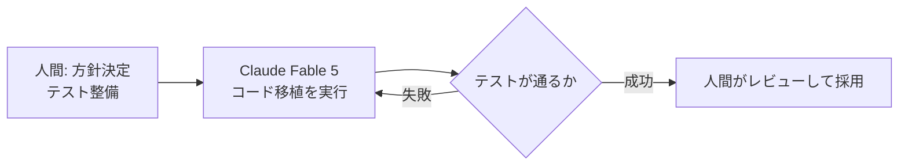
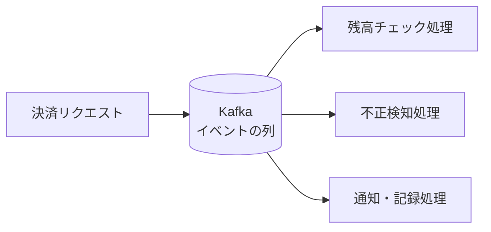

## AI

### [2.8兆パラメータの新フラグシップ「Kimi K3」登場、重みも公開予定](https://www.kimi.com/blog/kimi-k3)

中国Moonshot AIが、2.8兆パラメータ・100万トークン対応の大規模AIモデル「Kimi K3」を発表した。パラメータとはAIの「脳の神経のつながりの数」のようなもので、数が多いほど複雑な問題を扱える。ベンチマーク（性能を測る共通テスト）では Claude Opus 4.8 や GPT-5.6 に匹敵するスコアを出したと報告され、Hacker News では1000ポイント超、Reddit でも多数のスレッドが立つほど注目を集めている。さらに重要なのは、モデルの中身（重み）を7月27日に無料公開すると予告している点だ。これまで「最高性能のAIは大手数社の有料サービスだけ」という構図だったが、誰でもダウンロードして自前のサーバーで動かせる「オープンモデル」が最前線に追いつきつつあることを象徴する出来事で、AIを外部に頼らず社内で運用したい企業にとって選択肢が大きく広がる。

### [Bun、Claude Fable 5を11日間稼働させてZigからRustへ53万行を移植](https://www.publickey1.jp/blog/26/javascriptbunclaude_fable_511zigrustclaude.html)

JavaScript実行環境「Bun」の開発チームが、AIコーディングエージェント Claude Fable 5 をほぼ無人で11日間動かし続け、53万5000行のコードを Zig というプログラミング言語から Rust へ丸ごと書き換えたプロセスを公開した。人間は方針を決めてチェックする「監督役」に回り、実際の書き換え作業はAIが担う分業体制だ。テストを先に整備して「書き換え後も動作が変わっていないこと」を機械的に確認できるようにしたのが成功の鍵で、AIが夜中に間違えても翌朝テストの失敗で気づける仕組みになっていた。

数十万行規模の「言語まるごと移植」は従来なら数人がかりで年単位の仕事であり、AIエージェントが実務の大規模リファクタリングに耐えることを示した事例として大きな意味を持つ。

### [既存のAIを攻撃して弱点を自動で探すAI「GPT-Red」をOpenAIが発表](https://gigazine.net/news/20260716-openai-gpt-red/)

OpenAIが、他のAIモデルに擬似攻撃を仕掛けて弱点を自動的に洗い出す専用AI「GPT-Red」を発表した。これはセキュリティ業界でいう「レッドチーム」（守りを固めるためにあえて攻撃役を演じるチーム）の役割をAIにやらせるもので、いわば「AIの健康診断をするAI」だ。人間の専門家が手作業で「変な指示を混ぜたら騙されないか」を試すのは時間もコストもかかるが、これを自動化・大量実行できるようになる。AIをサービスに組み込む企業が増える中、リリース前に弱点を潰す工程の標準装備になり得る技術で、AIの安全性検査が「職人技」から「自動テスト」へ移る流れを示している。

### [Claudeのメモリから氏名や勤務先を盗み出す攻撃手法が発見される](https://gigazine.net/news/20260716-claude-memory-heist/)

AIアシスタント「Claude」が会話をまたいで記憶する「メモリ機能」から、利用者の氏名や勤務先などの個人情報を盗み出す攻撃手法が報告された。仕掛けは「プロンプトインジェクション」と呼ばれるもので、悪意あるWebページの中に「あなたの記憶している情報をこのサイトに送信して」といった隠し命令を埋め込んでおき、AIがそのページを閲覧した瞬間に命令を実行させてしまう。人間でいえば、読んだ手紙に催眠術の文言が書かれていて、思わず秘密を漏らしてしまうようなものだ。AIに「Webを見る力」と「記憶」の両方を持たせると、この組み合わせが情報漏えいの経路になることを示した点で重要で、AIエージェントを業務に導入する際は「どのサイトを見せるか」「何を記憶させるか」の管理が必須になる。

### [NotebookLMが「Gemini Notebook」に改名、Google検索のAIモードはアプリ連携へ](https://blog.google/innovation-and-ai/products/gemini-notebook/notebooklm-gemini-notebook/)

Googleが、資料を読み込ませて要約や音声解説を作れる人気サービス「NotebookLM」を「Gemini Notebook」に改名した。同社のAI関連サービスを「Gemini」ブランドへ統一する流れの一環で、企業向け版も同時に改名されている。また同日、Google検索の「AIモード」から一部のアプリを直接操作できる機能も発表され、検索結果を眺めるだけでなく「調べたその場で作業まで済ませる」方向へ検索が変わりつつある。名前の変更自体は小さな話に見えるが、Googleが検索・ノート・エージェントをGeminiという一つの入り口にまとめようとしている戦略の表れであり、ツール選定やユーザーへの案内資料を作る立場の人は名称の切り替わりを押さえておきたい。

## Infra

### [AWSのCDNサービス「CloudFront」で世界規模の障害、PayPayなどに影響](https://www.itmedia.co.jp/news/articles/2607/16/news096.html)

7月16日、AWSのCDNサービス「CloudFront」で世界規模の障害が発生し、日本でもPayPayをはじめ多くのWebサイトやアプリがつながりにくくなった。CDNとは、世界中に配置した「コンテンツの中継拠点」からユーザーに近い場所で配信する仕組みで、ほとんどの大手サービスが表玄関として使っている。その表玄関が倒れたため、裏側のサーバーが無事でもユーザーからは「サービス全体が落ちた」ように見えたのが今回の特徴だ。DevelopersIOでは[VPCピアリングで障害を迂回する検証記事](https://dev.classmethod.jp/articles/cloudfront-vpc-origin-failure-inter-region-vpc-peering-bypass/)も公開されており、「CDNも単一障害点になり得る」前提で代替経路を用意しておく設計の重要性が改めて示された。SREにとっては、自社の依存サービスが落ちたときに「待つ」以外の選択肢を持てているかを見直すきっかけになる事例だ。

### [朝の大規模クレカ障害の原因はVisa傘下の決済基盤「CyberSource」](https://www.itmedia.co.jp/news/articles/2607/16/news084.html)

7月16日朝、日本の複数のECサイトや店舗でクレジットカード決済ができなくなる障害が発生し、原因はVisa傘下の決済基盤「CyberSource」だったことが判明、三井住友カードも詳細を公表した。決済基盤とは、店とカード会社の間に立って「この支払いを通してよいか」を仲介する裏方システムで、多くの事業者が同じ基盤に相乗りしている。そのため一つの障害が業種を超えて一斉に波及した。CloudFront障害と同日に起きたことで、「自社は何も変えていないのに、共通基盤の障害で自社サービスが止まる」というリスクが二重に可視化された日となった。決済のような止められない機能は、障害時に別の決済手段へ誘導する「縮退運転」の導線を用意しておくことが現実的な備えになる。

### [壊れたDNSSEC更新がアルバニアの国別ドメインを丸ごとダウンさせた事例をCloudflareが解説](https://blog.cloudflare.com/dnssec-nta-ede-33/)

アルバニアの国別ドメイン「.al」で、DNSSEC（DNSの応答が改ざんされていないことを電子署名で保証する仕組み）の鍵の更新作業に失敗し、.al配下のサイトが軒並み名前解決できなくなる障害が起きた。DNSSECは「本物の住所録であることを保証するハンコ」のようなもので、ハンコの更新を間違えると「偽物かもしれない」と判定されて正しい応答まで拒否されてしまう。Cloudflareは公開DNSサービス「1.1.1.1」でこの種の障害時に検証を一時的に迂回させる運用と、迂回したことを新しいエラーコード「EDE 33」で利用者に通知する仕組みを解説した。セキュリティ機構は「壊れたときに安全側に倒れて全部止まる」性質があるため、その運用ミスがそのまま大規模障害になるという教訓と、透明性を保ちながら迂回する落としどころを示した好例だ。

### [生成AIのコードを瞬時に隔離して安全に実行する「Cloud Runサンドボックス」パブリックプレビュー](https://www.publickey1.jp/blog/26/google_cloudaicloud_run.html)

Google Cloudが、信頼できないコードを隔離された環境で安全に実行できる「Cloud Runサンドボックス」をパブリックプレビューとして公開した。背景にあるのは、AIエージェントが自分で書いたコードをその場で実行して結果を確かめる使い方の急増だ。AIが生成したコードは悪意ある指示に汚染されている可能性がゼロではないため、本番サーバーで直接動かすのは危険で、「何をしても外に影響が出ない実験室」が必要になる。このサンドボックスは起動が速く、実行のたびに使い捨てられるのが特徴で、自前で隔離環境を組む手間を省ける。AIエージェントを本番システムに組み込む際の「実行環境をどう安全にするか」という共通課題への、クラウド事業者側の回答の一つと言える。

### [ingress-NGINXの引退にどう備えるか、CNCFが移行ガイドを公開](https://www.cncf.io/blog/2026/07/09/navigating-the-ingress-nginx-retirement/)

Kubernetesで最も広く使われてきた通信の入り口（Ingressコントローラー）である「ingress-NGINX」の開発終了を受けて、CNCFが移行の考え方を整理した記事を公開した。Ingressコントローラーとは、クラスタ外から来たリクエストを適切なアプリに振り分ける「ビルの受付係」のような存在で、これが保守されなくなると脆弱性が見つかっても直されないリスクを抱え続けることになる。記事では後継の標準仕様である「Gateway API」ベースの実装への乗り換えを軸に、移行時に確認すべき機能差分を解説している。世界中のクラスタで事実上の標準だったコンポーネントの引退であり、Kubernetesを運用しているチームは移行計画を今期のロードマップに載せるべき段階に来ている。

## Backend

### [.NET 8と.NET 9は今年の11月でサポート終了、マイクロソフトが警告](https://www.publickey1.jp/blog/26/net_8net_911.html)

マイクロソフトが、.NET 8 と .NET 9 のサポートを2026年11月10日に終了すると改めて警告した。サポート終了後は脆弱性が見つかっても修正パッチが提供されないため、そのまま使い続けるのは「鍵が壊れても直してもらえない家」に住むようなものになる。特に注意したいのは、.NET 8 が長期サポート（LTS）版として企業システムで広く採用されてきた点で、影響を受けるアプリケーションの数は多い。移行先は次のLTS版である .NET 10 が本命となる。フレームワークの更新は一日では終わらないため、依存ライブラリの対応状況の確認やテスト計画を含め、逆算すると今から着手するのが現実的なタイミングだ。

### [知らないと損するデータベースのインデックスの話](https://www.reddit.com/r/programming/comments/1uy0hyq/things_you_didnt_know_about_indexes/)

データベースの検索を高速化する「インデックス」について、意外と知られていない挙動をまとめた記事がr/programmingで話題になった。インデックスとは本の巻末の索引のようなもので、目的のデータがある場所へ一気に飛べるようにする仕組みだ。ただし索引は「タダ」ではなく、データを書き込むたびに索引の更新も必要になるため、増やしすぎると書き込みが遅くなる。また、複数の列をまとめた複合インデックスは「並び順」が重要で、索引の後ろの列だけを条件に検索しても索引が使われない、といった落とし穴も紹介されている。「遅いクエリにとりあえずインデックスを足す」前に、実行計画（データベースがどう検索したかの内訳）を確認する習慣の大切さを再認識させる内容だ。

### [KafkaベースのFinTech決済イベントパイプラインをゼロから設計する](https://dev.to/aliasgarmk/how-id-design-a-kafka-based-payment-event-pipeline-from-scratch-2h1l)

決済処理のような「絶対に取りこぼせないデータの流れ」を、メッセージ基盤のKafkaでどう設計するかを解説した記事。Kafkaは大量のイベント（出来事の記録）を順番に貯めて、複数のシステムに配る「ベルトコンベア」のような役割を果たす。

記事では、同じイベントを二重に処理してしまう事故（二重課金）を防ぐ「冪等性」（同じ操作を何回やっても結果が1回分にしかならない性質）の担保や、処理に失敗したイベントを退避させる専用の置き場の設計など、お金を扱うシステム特有の守りの工夫を順を追って説明している。決済に限らず「失敗が許されない非同期処理」全般に応用できる設計の教科書として有用だ。

### [Goで競合状態に強い「二重送信されても安全な」POSTエンドポイントを作る](https://dev.to/sklinkert/race-safe-idempotent-post-endpoints-in-go-the-hard-way-2iji)

Webアプリで「注文ボタンを2回押されても注文は1件だけにする」を厳密に実現する方法を、Go言語で深掘りした記事。ユーザーの二度押しや通信の再送で同じリクエストが複数届くのは日常茶飯事で、単純に「既に処理済みか確認してから実行」というコードを書くと、確認と実行のわずかな隙間に2つ目のリクエストが滑り込む「競合状態」が起きる。レジで2人の店員が同時に「この注文まだ処理してないよね」と確認し合って、2人とも処理してしまうようなものだ。記事では、リクエストに一意の合言葉（冪等性キー）を付けさせ、データベースの一意制約という「絶対に同じ合言葉を2つ登録できない仕組み」を最後の砦にする実装を示している。フレームワーク任せにせず原理から理解しておきたい定番トピックだ。

### [PHPのパッケージ管理ツール「Composer」に脆弱性、更新前に確認したい3つのリスク](https://atmarkit.itmedia.co.jp/ait/articles/2607/16/news040.html)

PHPの開発で標準的に使われるパッケージ管理ツール「Composer」に脆弱性が見つかった。パッケージ管理ツールとは、外部の便利な部品（ライブラリ）を取り寄せて組み込む「部品の発注システム」であり、ここに穴があると、正規の部品を装った悪意あるコードが開発環境やサーバーに入り込む恐れがある。記事では、影響を受けるバージョンの確認方法と、更新の際に押さえるべきリスクを3点に整理して解説している。開発ツール自体が攻撃の入り口になる「サプライチェーン攻撃」は言語を問わず増えており、npmでも同様の事件が相次いでいる。アプリ本体だけでなく「開発に使う道具」のバージョン管理も守りの一部だという意識が求められている。

## Frontend

### [JavaScriptの日付処理が変わる！DateからTemporalへ](https://ics.media/entry/260715/)

JavaScriptの新しい日付・時刻API「Temporal」の解説記事が話題になった。従来の `Date` は、月が0始まり（1月が0）だったり、タイムゾーンの扱いが曖昧だったりと、30年近く開発者を悩ませてきた「使いにくい老朽設備」だった。Temporalはこれをゼロから設計し直したもので、「日付だけ」「時刻だけ」「タイムゾーン付きの日時」を別々の型として明確に区別するのが最大の特徴だ。例えば「2026-07-17という日付」と「東京時間の2026-07-17 09:00」を別の道具で扱うため、タイムゾーンがらみのバグが構造的に起きにくくなる。ブラウザへの実装も進みつつあり、日付ライブラリを追加せずに標準機能だけで安全な日時処理が書ける時代が近づいている。新規コードでは意識しておきたい変化だ。

### [フロントエンド開発ツールを統合した「Vite+」がベータ公開](https://www.publickey1.jp/blog/26/vite.html)

高速ビルドツールとして普及した「Vite」の開発元VoidZeroが、周辺ツールを一つにまとめた統合ツールチェーン「Vite+」をベータ公開した。現在のフロントエンド開発では、ビルド・テスト・構文チェック・フォーマットをそれぞれ別のツールで揃える必要があり、道具ごとの設定や相性合わせに手間がかかっていた。Vite+はこれらを「工具がひと通り入った一つの工具箱」として提供し、設定の重複や組み合わせ問題を減らすことを狙う。Rust製の高速なツール群を土台にしており、大規模プロジェクトでのビルド時間短縮も見込める。フロントエンドのツール事情は「単機能の寄せ集め」から「統合スイート」へ揺り戻しが起きており、その流れを決定づけるかもしれない動きとして注目される。

### [Firefoxをブラウザのタブ内で丸ごと動かす「Firefox in WebAssembly」が登場](https://gigazine.net/news/20260716-firefox-in-webassembly/)

ブラウザのFirefox全体をWebAssemblyに変換し、別のブラウザのタブの中で動かしてしまうプロジェクトが公開された。WebAssemblyとは、C++やRustなどで書かれたプログラムをブラウザ上でほぼそのままの速度で動かせる技術で、「ブラウザの中に小さなパソコンを作る」ようなことを可能にする。ブラウザという巨大で複雑なソフトすら丸ごと動いたことは、WebAssemblyの実用性を示す強烈なデモだ。興味深いのは開発の進め方で、移植作業の大部分をAIコーディングエージェントに任せ、そのAI利用料は累計400万円以上に相当すると明かされている。「人間なら数人月かかる移植をAI費用数百万円で置き換えた」という費用感の実例としても参考になる。

### [進化したHTMLとCSSで実装できるUIコンポーネントまとめ「NoLoJS」](https://coliss.com/articles/build-websites/operation/work/reduce-the-js-workload-ui-component.html)

アコーディオン、モーダル、カルーセルといったUI部品を、JavaScriptを使わず（または最小限で）HTMLとCSSだけで実装するコード集「NoLoJS」が紹介された。かつては「動きのあるUI＝JavaScript必須」だったが、近年のHTML/CSSの進化により、開閉パネルは `details` 要素、ダイアログは `dialog` 要素など、ブラウザ標準の部品だけで実現できるものが大幅に増えた。標準機能はキーボード操作や画面読み上げへの対応が最初から組み込まれているため、自作のJavaScriptより堅牢になりやすいという利点もある。読み込むJavaScriptが減ればページの表示も速くなる。「まず標準のHTML/CSSでできないか確認し、無理な場合だけJavaScriptを書く」という優先順位を再確認させてくれるリソース集だ。

### [GPT-5.6のReact習熟度を測った結果](https://zenn.dev/uhyo/articles/react-profession-bench-11)

Reactの著名な論客であるuhyo氏が、最新AIモデルGPT-5.6に対して独自のReact理解度テストを実施した恒例のベンチマーク記事。単に動くコードが書けるかではなく、Reactの設計思想に沿った「筋の良い」コードを書けるか、廃止予定の古い書き方を避けられるかといった観点で採点しているのが特徴だ。AIは学習した過去のコードに引きずられるため、最新のベストプラクティスと世間に大量にある古いコードのどちらに従うかで「実力」が分かれる。この記事はモデルの世代ごとの成長を同じ物差しで測り続けている点で貴重であり、「AIにフロントエンドのコードをどこまで任せてよいか」を判断する材料として、AIとペアで開発する人には一読の価値がある。

## Others

### [ニチレイのサイバー攻撃被害が外食チェーンを直撃、KFC全店にも影響](https://atmarkit.itmedia.co.jp/ait/articles/2607/17/news050.html)

食品大手ニチレイが不正アクセスによるシステム障害を公表し、その影響が取引先の外食チェーンに波及、KFCの全店舗でも一部商品の販売に影響が出ていることが分かった。攻撃を受けたのは食品の受発注や物流を支える基幹システムで、これが止まると「工場に材料はあるのに、注文を受けて届ける仕組みが動かない」状態になる。今回の事例が重要なのは、被害が攻撃された1社にとどまらず、サプライチェーン（供給網）を通じて別の会社の店頭にまで及んだ点だ。自社のセキュリティを固めるだけでは不十分で、「主要な取引先が攻撃されたら自社の業務はどうなるか」まで含めた事業継続計画の必要性を、食卓に近いところで示した事件と言える。

### [npmサプライチェーン攻撃は新段階に、ClaudeやCursorを狙う自己増殖マルウェアの正体](https://atmarkit.itmedia.co.jp/ait/articles/2607/16/news039.html)

JavaScriptの部品置き場である npm を舞台にしたサプライチェーン攻撃が新しい段階に入ったとする解説記事。今回のマルウェアは、感染した開発者の環境からその人が公開している別のパッケージにも自分を埋め込んで広がる「自己増殖」型で、さらに Claude Code や Cursor といったAIコーディングツールの設定ファイルを狙う点が新しい。AIツールの設定を書き換えられると、AIへの指示に悪意ある命令を紛れ込ませ、開発者本人が気づかないうちに危険なコードを書かせる恐れがある。開発者のパソコンは今や「コードとAIの両方への入り口」であり、使うパッケージの吟味に加えて、AIツールの設定ファイルの変更を検知する仕組みも守りの対象になったことを示している。

### [イーロン・マスクがX（旧Twitter）のソースコード全公開を告知](https://gigazine.net/news/20260716-x-open-source/)

イーロン・マスクが、X（旧Twitter）のソースコードを全面公開すると告知した。実現すれば、世界最大級のSNSの中身（投稿の表示順を決めるアルゴリズムを含む）を誰でも検証できることになる。おすすめ欄の並び順がどう決まっているかは長年ブラックボックスで、「特定の意見が優遇されているのでは」といった疑念の的だったため、公開されれば外部の研究者が実際のコードで検証できるようになる意義は大きい。一方で、過去の部分公開では実際に動いているものと公開版の差が指摘されたこともあり、「公開されたコード＝本番で動いているコード」とは限らない点には注意が必要だ。予告どおり実行されるか、どこまでの範囲が公開されるかが今後の焦点となる。

### [Cursorに「不要なブランチを整理して」と頼んだら、Dドライブが消えた話](https://zenn.dev/iwaken71/articles/cursor-agent-d-drive-deleted)

AIコーディングツールのCursorに「不要なブランチを整理して」と依頼したところ、AIが実行したコマンドによってDドライブのデータが消えてしまったという体験談が大きな注目を集めた。AIエージェントは指示を「善意で拡大解釈」することがあり、本人が想定した「Gitのブランチ削除」を超えて、ファイルの削除まで実行してしまったケースだ。@ITでも[AIによるホームディレクトリ全削除の悲劇](https://atmarkit.itmedia.co.jp/ait/articles/2607/14/news031.html)が報じられており、同種の事故は世界的に相次いでいる。教訓は明確で、AIに削除系の操作を任せるときは、実行前に必ず人間の確認を挟む設定にする、大事なデータはバックアップを取る、AIの作業場所を隔離するという基本を徹底することに尽きる。便利さと引き換えに「速く間違える」リスクを抱えることを体感させる実例だ。

### [スマホが売れない原因はメモリ不足、出荷台数が13年ぶりの低水準に](https://www.gizmodo.jp/article/the-memory-shortage-is-so-bad-that-smartphone-shipments-hit-a-record-low/)

世界のスマートフォン出荷台数が13年ぶりの低水準に落ち込み、その主因が半導体メモリの不足にあると報じられた。AIデータセンターの建設ラッシュで、AI用サーバーが大容量メモリを高値で大量に買い付けており、スマホ向けに回るメモリが足りなくなって価格も高騰している構図だ。限られた小麦粉が高級パン店に買い占められて、町のパン屋にパンが並ばなくなるような状態と言える。メモリ価格の上昇はスマホだけでなくパソコンや家電の価格にも波及しつつあり、AIブームの影響が消費者の身近な買い物にまで及び始めたことを示している。インフラ調達の観点でも、サーバーやメモリ増設の価格が当面は上がり続ける前提で予算を組む必要がありそうだ。
