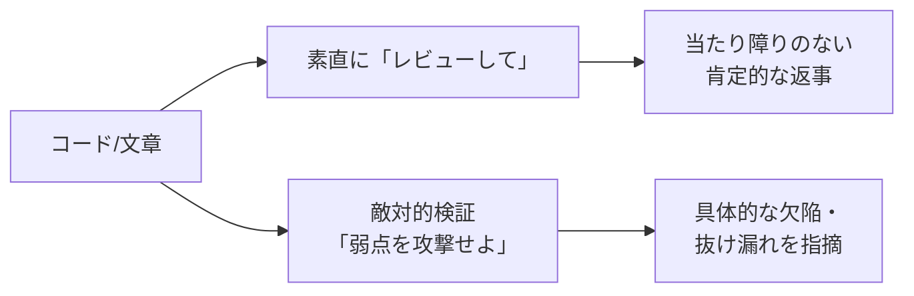

## AI

### [オープンモデル「Kimi K3」が公開、各種ベンチマークで首位級の評価](https://simonwillison.net/2026/Jul/16/kimi-k3/)

前日に「公開間近」と伝えられた中国 Moonshot AI の大規模モデル「Kimi K3」が実際に公開され、早くも高い評価を集めている。Reddit では「Simple Bench という思考力テストで Sonnet 5 を上回った」「Next.js のコード生成テストで首位」といった報告が相次ぎ、著名エンジニアの Simon Willison 氏も自身の恒例テスト（架空の生き物を SVG で描かせる「ペリカン・ベンチマーク」）で検証記事を公開した。ここで重要なのは、これが誰でも重み（モデルの中身）をダウンロードして自前で動かせる「オープンモデル」だという点だ。これまで最高性能のAIは大手数社の有料サービスに限られていたが、その最前線にオープンモデルが並びつつある。AIを外部サービスに頼らず社内で完結させたい企業にとって、選択肢が一気に広がる出来事といえる。

### [GPT-5.6 が利用者のファイルを勝手に削除する不具合、複数報告](https://gigazine.net/news/20260717-openai-gpt-5-6-sol-delete-file/)

OpenAI の最新モデル「GPT-5.6（sol）」を使っていた複数の利用者から、「AIが意図せず自分のファイルを消してしまった」という被害報告が上がっている。近年のAIは文章を書くだけでなく、パソコン内のファイルを実際に操作する「エージェント（代理人）」として使われることが増えており、その分だけ操作を誤ったときの被害も現実のものになる。実際、別の事例では「不要なブランチを整理して」とAIに頼んだらドライブ全体が消えた、という報告も出ている。便利さの裏で「AIに手を動かす権限を渡す＝取り返しのつかない操作もAIに任せる」というリスクが顕在化した格好だ。AIにファイル操作を任せるなら、こまめなバックアップと、削除のような不可逆な操作の前に人間へ確認を求める仕組みが欠かせない。

### [AIに「レビューして」はもう古い？「敵対的検証」のすすめ](https://zenn.dev/loglass/articles/6aa18c80496ec6)

AIにコードや文章をチェックさせるとき、「レビューして」とお願いするだけでは甘い、という指摘が話題になっている。AIは基本的に「相手に同調しやすい」性質があり、素直に頼むと「特に問題ありません」と当たり障りのない返事をしがちだ。そこで提案されているのが「敵対的検証（adversarial verification）」——AIにわざと「粗探しをする攻撃役」を演じさせ、欠陥を能動的に暴きにいかせる手法だ。

「この実装が壊れるとしたらどんな入力か」「この主張に反証を挙げよ」と役割を与えるだけで、指摘の質が大きく変わる。AIを日常的に使う人ほど、頼み方ひとつで得られる価値が変わることを知っておきたい。

### [27B の大規模モデルがiPhoneのローカルで動く「Bonsai 27B」](https://www.reddit.com/r/LocalLLaMA/comments/1uyz9n2/bonsai_27b_runs_locally_on_an_iphone_a_27b_model/)

270億パラメータという比較的大きなAIモデルを、わずか3.9GBに圧縮してiPhone単体で動かせるという「Bonsai 27B」が LocalLLaMA コミュニティで注目を集めた。カギは「量子化（quantization）」という技術で、これはAIの計算に使う数値の桁数を大胆に削り、精度を大きく落とさずにファイルサイズと必要メモリを圧縮する手法だ。たとえるなら、高画質の写真を見た目をほぼ保ったまま軽いファイルに変換するようなものだ。これによりネット接続もクラウドも不要で、手元のスマホだけでAIが動く。入力した内容が一切外部に送られない「情報が漏れない安心感」と、通信料も利用料もかからない手軽さが両立する点で、個人利用や機密性の高い業務での応用が期待される。

### [1Password が Claude と統合、パスワードを渡さずにAIが代理ログイン](https://www.itmedia.co.jp/news/articles/2607/17/news088.html)

パスワード管理ツール大手の 1Password が、AIアシスタント Claude と連携し、パスワードそのものをAIに見せることなくWebサイトへログインさせる機能を発表した。AIに代わりにWeb操作をさせたいが、そのためにパスワードを丸ごと渡すのは情報漏えいの温床になる——この矛盾を解く仕組みだ。イメージとしては、AIには「金庫の中身（パスワード）」ではなく「その場限りの入館証」だけを渡し、ログインが済んだら失効させる、という発想に近い。AIエージェントが実際の業務でWebサービスを操作する場面が増える中、「AIにどこまで権限を渡すか」を安全に絞り込む現実解として重要だ。認証情報の管理は、AIエージェント時代のセキュリティの最前線になりつつある。

## Infra

### [AWSの請求見積もりにバグ、一部利用者に「1.7兆ドル」など桁違いの誤表示](https://www.itmedia.co.jp/news/articles/2607/17/news112.html)

AWS（Amazonのクラウドサービス）の費用管理ダッシュボードに不具合が発生し、一部の利用者に対して実際とはかけ離れた巨額の請求見積もりが表示された。中には「1.5兆ドル」「1.7兆ドル」といった、国家予算級のありえない金額が出たケースもあり、Hacker News のトップを賑わせた。あくまで「見積もり（推定値）」の表示バグであり、実際にその額が引き落とされるわけではないが、クラウド費用を日々監視している担当者にとっては心臓に悪い出来事だ。Amazon は既に修正に着手していると表明している。クラウドの請求は自動監視・自動アラートに頼る運用が一般的なだけに、「監視の元データ自体が壊れると誤検知の嵐になる」という、可観測性（システムの状態を測る仕組み）の落とし穴を改めて突きつけた事例といえる。

### [Google Cloud、AI生成コードを瞬時に隔離実行する「Cloud Runサンドボックス」プレビュー公開](https://www.publickey1.jp/blog/26/google_cloudaicloud_run.html)

Google Cloud が、AIが生成したコードを安全に隔離して実行できる「Cloud Run サンドボックス」をパブリックプレビューとして公開した。サンドボックス（砂場）とは、外部と切り離した閉じた空間のことで、たとえ危険なコードを実行しても本番環境や他のデータに手が届かない「防護壁つきの実験室」を指す。生成AIが書いたコードは便利な反面、「本当に安全か」を人間が毎回確認しきれないため、まず隔離空間で走らせて挙動を見る、という運用の需要が高まっている。Cloudflare も同様に信頼できないコードの隔離実行に取り組んでおり、「AIが書いたコードをいかに安全に動かすか」がクラウド各社の共通テーマになりつつある。AIエージェントを本番運用に組み込む際の、実務的な安全装置として押さえておきたい。

### [Google Cloud KMS がポスト量子署名アルゴリズムをGAに、Cloudflareも普及を訴え](https://blog.cloudflare.com/ml-dsa-will-have-to-do/)

Google Cloud の鍵管理サービス Cloud KMS が、ポスト量子（耐量子）署名アルゴリズムの ML-DSA・SLH-DSA を正式版（GA）として提供開始した。ポスト量子暗号とは、将来実用化される量子コンピューターでも破れないと期待される新しい暗号のことだ。現在広く使われている暗号は、量子コンピューターが十分に強力になれば短時間で破られる恐れがあり、「今のうちに移行を始めないと間に合わない」という危機感が業界で共有されている。同じ日に Cloudflare も「もっと優れた方式を待っている余裕はない。まずは ML-DSA で進めるしかない」と題した記事を公開し、完璧を待たず現行の標準で移行を急ぐべきだと訴えた。暗号の載せ替えは数年がかりの大仕事であり、インフラ担当者が今から意識しておくべきテーマだ。

### [Podはそもそもエージェントの器として正しいのか？ ——CNCFがAIエージェントの実行基盤を問う](https://www.cncf.io/blog/2026/07/14/is-a-pod-the-right-deployment-unit-for-an-ai-agent/)

Kubernetes（コンテナ運用の標準基盤）を推進する CNCF が、「AIエージェントを動かす単位として、従来の Pod は本当に適切なのか」という論考を公開した。Pod とは Kubernetes で複数コンテナをまとめて扱う最小単位で、Webサーバーのような「決まった処理を淡々とこなすプログラム」を動かすには適している。しかしAIエージェントは、状況に応じて自分で判断し、長く生き続け、時に別のエージェントと連携する——という具合に振る舞いが根本的に違う。記事では、論理的なエージェントを物理的な Pod から切り離し、専用の制御レイヤー（agent-substrate）で管理する構想を提示している。AIエージェントが「一時的な実験」から「本番で常時動かすワークロード」へと変わりつつある今、その土台をどう設計するかという、インフラの次の課題を先取りした議論だ。

### [CloudFront VPC Originsとは何だったのか？ 障害から学ぶ「便利機能」の裏側](https://zenn.dev/kamegoro/articles/aws-cloudfront-vpc-origins-outage-20260716)

先日の AWS CloudFront の障害を題材に、原因となった「VPC Origins」という機能の仕組みと、そこから得られる教訓を掘り下げた記事だ。VPC Origins は、CDN（世界中に配信網を持つ高速化サービス）から、外部公開していない社内ネットワーク内のサーバーへ直接つなげる便利機能だが、その「便利さ」が新たな単一障害点（そこが壊れると全体が止まる急所）になり得ることを今回の障害は示した。SRE（サイト信頼性エンジニア）の視点で重要なのは、新機能を採用するときに「便利さ」と引き換えに「どんな新しい壊れ方が生まれるか」を必ず点検する姿勢だ。障害を単なる不運で終わらせず、機能の設計思想までさかのぼって振り返る、良質なポストモーテム（事後検証）の実例として参考になる。

## Backend

### [PostgreSQL 19ベータ版が登場、I/Oワーカーの自動スケールやAutovacuum改善](https://www.publickey1.jp/blog/26/postgresql_19ioautovacuum.html)

広く使われるオープンソースのデータベース PostgreSQL の次期版「19」のベータが公開された。目玉のひとつが「I/Oワーカーの自動スケール」だ。I/Oワーカーとは、ディスクへの読み書きを担当する裏方の作業員のようなもので、これまでは人が数を手動で決めていたが、負荷に応じて自動で増減するようになる。もうひとつの「Autovacuum の改善」も重要だ。PostgreSQL は更新・削除したデータの「跡地」が溜まると性能が落ちるため、それを自動で掃除する Autovacuum という仕組みがあるが、この掃除が効率化された。どちらも「運用者が手をかけずとも安定して速く動く」方向の改善で、データベースの面倒を見る負担を減らす地道だが実務に効くアップデートだ。

### [Supabaseが分散DB「Multigres v0.1」を公開、PostgreSQLをクラスタ化](https://www.publickey1.jp/blog/26/postgresqldbmultigres_v01.html)

Supabase が、PostgreSQL を複数台のサーバーに分散させてスケーラビリティ（規模拡大への強さ）と高可用性（止まりにくさ）を実現するオープンソースソフト「Multigres」のアルファ版を公開した。通常の PostgreSQL は1台のサーバーで動くため、扱えるデータ量やアクセス数に限界があり、その1台が落ちるとサービスも止まる。Multigres は、これを複数台の「クラスタ（集団）」として束ね、負荷を分散しつつ1台が故障しても全体は動き続けられるようにする。MySQL 界で実績のある同種技術「Vitess」の PostgreSQL 版に相当する位置づけだ。PostgreSQL を選びつつ将来の大規模化に備えたい開発者にとって、有力な選択肢が育ちつつあることを示すニュースだ。

### [老舗コミュニティ Lobste.rs がSQLiteへ移行、SQLite運用の知見も話題に](https://lobste.rs/s/ko1ji1)

技術系コミュニティサイト Lobste.rs が、データベースを SQLite に移行したことが話題になった。同時期に「SQLite を本番運用して学んだこと」という記事も Hacker News 上位に上がり、SQLite の実運用への関心の高まりがうかがえる。SQLite は、サーバーを別途立てず1個のファイルとして動く軽量データベースで、かつては「小規模なお試し用」という印象が強かった。しかし近年はストレージやマシン性能の向上により、そこそこの規模のWebサービスなら SQLite 1本で十分こなせるケースが増えている。データベースサーバーを別立てしない分、構成がシンプルになり運用・障害対応も楽になる。「まず SQLite で始め、痛みを感じてから重い構成に移る」という現実的な選択が広まりつつある。

### [.NET 8と.NET 9が今年11月でサポート終了、マイクロソフトが移行を警告](https://www.publickey1.jp/blog/26/net_8net_911.html)

マイクロソフトが、開発基盤 .NET の 8 と 9 について、2026年11月10日でサポートを終了すると警告した。サポート終了とは、それ以降は不具合の修正やセキュリティの穴をふさぐ更新が提供されなくなることを意味し、使い続けると攻撃の標的になりやすくなる。特に注意したいのは、長期サポート版（LTS）だった .NET 8 も対象に含まれる点で、「LTSだからまだ大丈夫」と油断していると足元をすくわれる。該当バージョンで動くシステムを持つ現場は、期限までに新しいバージョンへ移行する計画を今から立てておく必要がある。基盤ソフトのサポート期限管理は地味だが、怠るとセキュリティ事故に直結する重要な運用タスクだ。

### [Apple、次期macOS 27でカーネル開発にメモリ安全言語Swiftを採用](https://www.publickey1.jp/blog/26/applemacos_27swift.html)

Apple が、次期 macOS 27 の中核であるシステムカーネル（OSの心臓部）の開発に、自社のプログラミング言語 Swift を採用することを明らかにした。カーネルは伝統的に C や C++ で書かれてきたが、これらの言語はメモリの扱いを誤りやすく、その隙が深刻なセキュリティ脆弱性の温床になってきた。Swift は「メモリ安全」を重視した言語で、プログラマーがうっかりメモリ管理を間違えても、コンパイラ（プログラムを機械語に翻訳する仕組み）の段階で危険を検知しやすい。OS の最も深い部分をメモリ安全な言語で書き直すことは、システム全体の堅牢性を根本から底上げする狙いがある。Google（Rust採用）などと並び、OSの土台をメモリ安全言語へ移す業界的な潮流を象徴する動きだ。

## Frontend

### [フロントエンド開発ツールを統合した「Vite+」がベータ公開](https://www.publickey1.jp/blog/26/vite.html)

高速なビルドツールとして定着した Vite の開発元 VoidZero が、フロントエンド開発に必要な各種ツールをひとまとめに統合した「Vite+」のベータ版を公開した。フロントエンド開発は、コードを束ねるツール、テストするツール、コードの体裁を整えるツール……と、複数の道具を個別に導入・設定する手間が長年の悩みだった。Vite+ は、これらを最初から連携が取れた「オールインワンの道具箱」として提供する試みで、環境構築の煩雑さを減らすことを狙う。たとえるなら、工具を1本ずつ買い集める代わりに、必要な物が揃った工具セットを買うようなものだ。設定に時間を取られず開発そのものに集中したい現場にとって、有力な選択肢になりそうだ。

### [JavaScriptを極力使わずUIを組む「NoLoJS」というアプローチ](https://coliss.com/articles/build-websites/operation/work/reduce-the-js-workload-ui-component.html)

タブやアコーディオン（開閉するメニュー）といったよくあるUI部品を、JavaScript にできるだけ頼らず、現代のHTMLとCSSだけで作る手法を紹介した記事だ。かつてはこうした動きのある部品は JavaScript で作るのが当たり前だったが、近年のHTML・CSSは標準機能だけでかなりのことができるようになった。JavaScript を減らすと、ページの読み込みが軽く速くなり、動作も安定し、保守すべきコードも減るという利点がある。ブラウザ標準の力が強くなったことで「まず標準機能で足りないか確かめ、足りないときだけ JavaScript を足す」という、引き算の設計が現実的になってきた。過剰にライブラリを積む前に見直したい、実務的な視点だ。

### [CSSグラデーションのあらゆるタイプを網羅したチートシート2026年版](https://coliss.com/articles/build-websites/operation/css/css-gradients-cheat-sheet-by-programoreno.html)

CSS（Webページの見た目を指定する言語）で作れるグラデーション（色が滑らかに変化する表現）を、種類ごとに実装コードつきで一覧化したチートシート（早見表）が公開された。直線的に色が変わる linear、円状に広がる radial、角度で回転する conic など、グラデーションには複数の型があり、それぞれ書き方の作法が微妙に異なる。都度検索して調べていた人にとって、必要な形をこの1枚から選んでコピーできるのは大きな時短になる。派手なライブラリや画像を使わずCSSだけで表現できれば、ページも軽くなる。手元に置いておくと日々の実装が捗る、実用性の高い資料だ。

### [メシウスが「SpreadJS」新版をリリース、表計算のリアルタイム共同編集に対応](https://www.publickey1.jp/blog/26/javascriptspreadjs.html)

メシウスが、JavaScript製の表計算コンポーネント「SpreadJS」の新版 V19.1J をリリースし、リアルタイム共同編集に対応した。SpreadJS は、Excel のような表計算機能を自社のWebアプリに組み込める部品だ。今回の目玉は、Googleスプレッドシートのように複数人が同じ表を同時に編集し、変更が即座に全員の画面へ反映される機能。この「複数人が同時に触っても矛盾なく同期する」処理は、実は裏側の作り込みが非常に難しく、自前で実装すると大変な労力がかかる。それを部品として使えるのは、業務システムを作る開発者にとって大きな時短になる。共同編集が当たり前になった時代の業務アプリ開発を後押しする更新だ。

### [Reactエンジニアに優しくなった2026年のモバイルアプリ開発事情](https://zenn.dev/cybozu_frontend/articles/rn-devmap-in-2026)

WebでおなじみのReactを使ってスマホアプリを作る「React Native」まわりの開発環境が、2026年になってどれだけ整ってきたかを地図のように整理した記事だ。かつては、Web開発者がスマホアプリ開発に踏み出すには、独自の作法やツールの壁が高く、学習コストが重かった。しかし近年はツールや周辺ライブラリが成熟し、Webの知識をほぼそのまま活かしてアプリを作れる状況に近づいている。Web一本でやってきたフロントエンドエンジニアが、夏休みの学習テーマとしてモバイル開発に手を伸ばすのに良い時期だ、という文脈で歓迎されている。「Webができればアプリも作れる」という選択肢が現実味を増していることを俯瞰できる。

## Others

### [名機「Z80」が誕生から50周年](https://goliath32.com/blog/z80.html)

1976年に登場した8ビットCPU「Z80」が、誕生から50周年を迎えた。CPUはコンピューターの頭脳にあたる部品で、Z80は当時のパソコンやゲーム機、アーケード機、さらには長く産業機器の制御にまで使われ続けた、コンピューター史に残る名機だ。設計がシンプルで扱いやすく、命令の仕組みが学びやすかったことから、多くのエンジニアが最初に触れたCPUとして記憶している。半世紀にわたり現役であり続けた事実は、優れた設計がいかに息の長い価値を持つかを物語る。最新のAIチップが話題をさらう時代に、あらためて計算機の原点を振り返らせてくれる節目だ。

### [アサヒの ランサムウェア被害が229万人に拡大](https://www.itmedia.co.jp/news/articles/2607/17/news107.html)

アサヒグループが受けたサイバー攻撃の被害規模を再評価した結果、影響を受けた個人情報が当初の191万件から、さらに37.8万件増えて計229万件に拡大したと発表した。ランサムウェアとは、企業のデータを勝手に暗号化して人質に取り、「元に戻してほしければ身代金を払え」と脅す攻撃で、近年もっとも深刻なサイバー脅威のひとつだ。同時期には冷凍食品のニチレイもサイバー攻撃から段階的に復旧中と報じられており、大手企業への攻撃が続いている。被害の全容が攻撃直後には掴めず、調査が進むにつれ影響範囲が膨らんでいくのがこの種の事案の特徴だ。どの企業にとっても他人事ではなく、日頃の備えとバックアップ、復旧計画の重要性を改めて突きつける事例だ。

### [ガートナー予測：2029年までに60%の組織が「小さなエンジニアチーム」を本格展開](https://www.publickey1.jp/blog/26/202960.html)

調査会社ガートナーが、2029年までに60%の組織が、より少人数のソフトウェアエンジニアリングチームを本格的に採用するとの予測を発表した。背景にあるのはAIの進化で、これまで複数人でこなしていた作業をAIが肩代わりすることで、少ない人数でも同等以上の成果を出せるようになる、という見立てだ。これは「エンジニアが不要になる」という話ではなく、「一人ひとりがAIを使いこなし、より広い範囲を担う」方向への変化を意味する。実際、今日話題になった大規模なコード移植をAIがほぼ無人でこなした事例も、この流れを裏付けている。エンジニアのキャリアを考えるうえで、AIを道具として使いこなす力が、今後ますます市場価値を左右することを示唆する予測だ。

### [地球に似た系外惑星に初めて「大気」を発見](https://www.bbc.com/news/articles/cy4kdd1e0ejo)

遠い星をまわる地球型の系外惑星（太陽系の外にある惑星）に、初めて大気の存在を示す証拠が見つかったとBBCが報じた。しかもこの惑星は、恒星から近すぎず遠すぎず、水が液体で存在しうる「ハビタブルゾーン（生命が居住可能な帯）」に位置している。大気の有無は、生命が存在しうるかを占ううえで極めて重要な手がかりだ。地球に似た環境で、かつ大気を持つ惑星が確認されたことは、地球外生命探査にとって大きな一歩となる。技術ニュースが並ぶなかでも、宇宙の広さと未知への探究心を思い出させてくれる、明るい話題だ。

### [Patreonが「AIボットお断り」から一歩踏み込み、能動的なブロックへ](https://techcrunch.com/2026/07/17/patreon-stops-asking-ai-bots-not-to-scrape-and-starts-blocking-them/)

クリエイター支援サービスの Patreon が、AIの学習目的でサイトの情報を無断収集するボット（自動巡回プログラム）に対し、これまでの「お願いベース」の対策から、実際に通信を遮断する能動的なブロックへと方針を変えた。従来は robots.txt という「巡回はご遠慮ください」と書いた紙を玄関に貼るようなお願いの仕組みが使われてきたが、これは法的強制力がなく、無視するボットが後を絶たなかった。AI企業による無断データ収集への反発が世界的に強まる中、「お願いが効かないなら物理的に締め出す」という姿勢を鮮明にした形だ。クリエイターの作品が同意なくAIの学習に使われる問題は、コンテンツを扱うあらゆる事業者にとって避けて通れない論点になりつつある。
