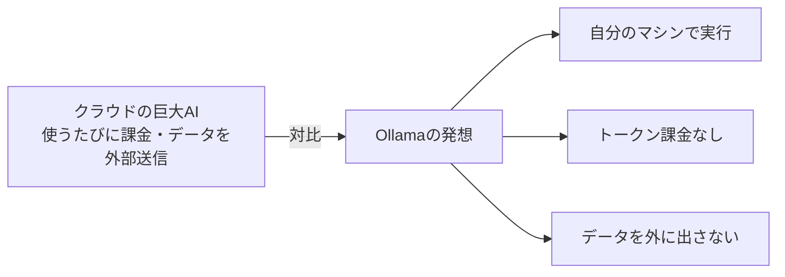
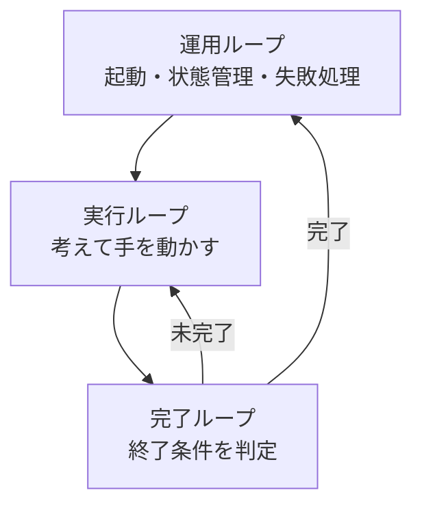

## AI

### [Alibaba、巨大言語モデル「Qwen 3.8」を公開](https://qwen.ai/home)
<!-- categories: LLM -->

中国アリババのAI開発チーム「Qwen」が、新しい大規模言語モデル（人間の言葉を扱うAI）「Qwen 3.8」を公開した。最上位の「Max」プレビュー版も同時に用意され、その内部規模は2.4兆パラメータ（AIの賢さを支える"部品数"のようなもので、多いほど複雑な処理ができる）とされている。利用は使った分だけ払う従量課金（トークン課金）の形で提供される。オープンモデル好きが集まるコミュニティでは「VRAM（GPUに載っているメモリ）を増設して備えろ」という声が飛び交い、期待の大きさがうかがえる。商用の非公開モデルに引けを取らない規模のモデルが次々と表に出てくることで、開発者が選べる選択肢が一気に広がる点が重要だ。

### [Google、オープンモデル「Gemma 4」を大幅高速化](https://www.itmedia.co.jp/pcuser/articles/2607/19/news006.html)
<!-- categories: Google, LLM, NVIDIA -->

Googleが、誰でも入手して自分の環境で動かせるAIモデル「Gemma 4」の性能改善を発表した。NVIDIAの新しいGPU（画像やAI計算が得意な高速チップ）向けに計算方法を最適化し、単位時間あたりにさばける処理量（スループット）が25〜70%向上、質問してから最初の一文字が返ってくるまでの待ち時間も最大31%縮まった。画像の中の文字を読み取る精度（OCR）も上がり、モデルの大きさも小型の2Bから中型の31Bまで幅広くそろえた。クラウド任せにせず手元でAIを動かしたい人にとって、同じ機材でより速く安く動くことは実用性に直結する。オープンモデル陣営の底上げが続いていることを示す動きだ。

### [ローカルAIツール「Ollama」が資金調達、オープンモデル基盤を目指す](https://ollama.com/blog/all-aboard-open-models)
<!-- categories: LLM, OSS -->

自分のパソコン上でAIモデルを手軽に動かせる人気ツール「Ollama」が、8800万ドル（約140億円）の資金調達を発表した。利用者は890万人の開発者に達し、フォーチュン500企業の85%でも使われているという。同社が掲げるのは「あなたのモデル、あなたのマシン、あなたのデータ」という考え方で、使うたびに課金される仕組み（トークン代）がなく、データを外部に一切送らずに済む安心感を売りにしている。投資家にはDocker創業者のSolomon Hykes氏も名を連ね、オープンモデルへの期待の高さを裏づけた。クラウドの巨大AIに頼らず手元で動かす流れが、資金面からも本格的に後押しされ始めたことを示している。

### [「ループエンジニアリング」の本質はどこにあるのか](https://zenn.dev/r_kaga/articles/a27a3879dd3ce4)
<!-- categories: AI Agent -->

AIエージェント（自分で考えて作業を進めるAI）を「自走させる」ことが注目されているが、本当の勘所は運用の仕組みづくりにあると論じた記事。著者はAIの動きを3つのループ（繰り返しの輪）に整理する。実際に考えて手を動かす「実行ループ」、いつ終わるかを判断する「完了ループ」、そして起動・状態管理・失敗時の立て直しを担う「運用ループ」だ。核心は、人間が毎回「これやって」と指示する係から降り、ループそのものを設計・監督する側に回ることだという。バグ報告や顧客の声といった外部の合図をきっかけに開発が自動で回り出す「ソフトウェア工場」の発想が、その到達点として示されている。

### [「Claude Fable 5」が定額プランに統合](https://gigazine.net/news/20260719-claude-fable-5-plan/)
<!-- categories: Claude, Anthropic -->

AnthropicのAIモデル「Claude Fable 5」が、月額の定額プラン（Max・Team Premium）の中で使えるようになった。これまで最上位モデルは別課金や開発者向けの従量課金（API）が中心で、使うほど費用が読みにくかった。定額プランに含まれることで、毎月いくらかかるかがあらかじめ分かり、コストの見通しを立てやすくなる。前日には同モデルを11日間走らせて53万行のコードを別言語へ移植した事例が話題になったばかりで、高性能モデルを「日常的に、予測できる費用で使う」流れが一歩進んだ格好だ。個人や小規模チームが最新モデルを日々の作業に組み込みやすくなる点で意味のある変更だ。

## Infra

### [AWSの「兆ドル」誤課金が「ちょっとした計算ミス」発言で炎上](https://www.itmedia.co.jp/news/articles/2607/19/news010.html)
<!-- categories: AWS, Incident -->

AWS（アマゾンのクラウド）の利用料を確認する画面に、数兆ドル（数百兆円）というあり得ない使用量・請求が表示される不具合が発生した。問題そのものより火に油を注いだのは、AWSがこれを「ちょっとした計算ミス（a little math error）」とジョークめかして説明したことだ。深刻な課金トラブルを軽く扱ったと受け取られ、SNS上で批判が噴出。日本のAWS社員からも「あり得ない」と苦言が出る事態になり、その後あらためて対応がとられた。クラウドの請求は利用者にとって直接お金に響く部分であり、金額表示のバグと、その伝え方の両方が信頼を左右することを示した一件だ。

### [「データベースのリストア、定期的にテストしてる？」が議論に](https://www.reddit.com/r/devops/)
<!-- categories: Database, DevOps -->

「バックアップは取っているが、そこから実際に復元（リストア）できるか定期的に試している人はいるか？」という問いかけが、運用担当者の間で盛り上がった。バックアップは取れていても、いざ障害が起きたときに正しく元に戻せるとは限らず、「取れているつもり」が一番危ないという指摘だ。復元手順が古くなっていたり、バックアップ自体が壊れていたりしても、試さなければ気づけない。だからこそ、火事の避難訓練のように、平常時に復元を定期的に演習しておくべきだという声が多く集まった。地味だが、データを失うかどうかを分ける実務上とても重要なテーマだ。

### [本番システムの「時間」にまつわる落とし穴](https://www.reddit.com/r/programming/)
<!-- categories: SRE -->

うまくいく前提（ハッピーパス）だけを考えて作ると、「時間」の扱いで思わぬ障害に見舞われる、という話題が注目を集めた。サーバーの時計が少しずれる、夏時間やタイムゾーンの切り替え、うるう秒、複数マシンの時刻同期のズレなど、時間には人間の直感に反する落とし穴が数多くある。たとえば「未来の時刻が過去より前になる」ような一見あり得ない状況も、時計の巻き戻しで現実に起こりうる。こうした時間の異常系をあらかじめ想定し、テストしておくことが安定運用の鍵になる。派手ではないが、多くの本番障害の裏に潜む見落としがちな要因だ。

### [自宅サーバーの「死」と「再生」](https://sgt.hootr.club/blog/home-server-rebirth/)
<!-- categories: DevOps, Linux -->

自宅で運用していたサーバー（自分専用の小さなデータセンターのようなもの）が壊れ、それを機に一から作り直した経験を綴った記事。以前は機能を盛り込みすぎて複雑になり、いざ壊れると直すのも一苦労だったという反省から、今回は思い切ってシンプルな構成にやり直した。凝った作りより「壊れてもすぐ立て直せる」ことを優先する考え方は、企業の本番システムにも通じる。自宅サーバーは失敗しても実害が小さいため、こうした技術の実験場として学びが多い。過剰な作り込みを避け、復旧しやすさを設計に織り込む大切さを、身近な題材で伝えている。

### [Windows 11、一部Dell機で性能低下の既知不具合](https://www.itmedia.co.jp/pcuser/articles/2607/19/news006.html)
<!-- categories: Windows, Incident -->

MicrosoftがWindows 11で、一部のDell製パソコンの動作が不安定になる不具合を公表した。原因は6月23日に配られたセキュリティ更新プログラムが、Dell独自の機器管理ドライバー（周辺機器を動かす橋渡しソフト）と衝突することだという。この相性問題により、対象機種では処理速度が予測できない形で上下してしまう。Microsoftは当面、対象機種にはこの問題のある更新を配らないようにして被害の拡大を止めつつ、Dellと協力して修正を進めている。多くの利用者が使うOSの更新は、便利さと引き換えに思わぬ相性トラブルを生むことがあり、企業のIT管理では配布前の検証が欠かせないことを改めて示した。

## Backend

### [import専門の高速リンター「ImportLint」](https://zenn.dev/uhyo/articles/import-lint-intro)
<!-- categories: TypeScript, Rust -->

大きなプロジェクトでは、どのファイルからどのファイルでも自由に読み込み（import）できてしまい、コードの見通しが悪くなりがちだ。この課題を解くのが、TypeScriptのimportの関係だけを専門にチェックする道具「ImportLint」である。`*.package`という名前のフォルダを「まとまり（パッケージ）」として定義し、その境界を越えた読み込みを禁止できるので、部品同士の依存が絡まり合うのを防げる。従来はESLintという定番チェッカーの拡張として提供されていたが、今回Rust言語で作り直したことで、150万行規模の巨大プロジェクトでも1〜2秒で検査が終わり、旧版の100倍以上に高速化したという。チェックが速いほど開発中に何度も気軽に回せるため、コードの構造を健全に保ちやすくなる。

### [500ページ超のWordPressサイトを週末だけでヘッドレス化](https://qiita.com/nogataka/items/606660d788f2b055802f)
<!-- categories: WordPress -->

500ページを超える大規模なWordPress（ブログ・サイト作成の定番ソフト）を、週末の短期間で「ヘッドレス化」した記録。ヘッドレス化とは、記事データを管理する裏側（WordPress）はそのまま使い、実際に見える表示部分だけを別の高速な技術に切り離す手法のことだ。これにより表示速度やセキュリティを改善しやすくなる一方、URLの対応付けや画像の扱いなど、規模が大きいほど地道な移行作業が増える。記事では、どこでつまずき、どう自動化して乗り切ったかが具体的にまとめられている。既存の資産を捨てずに現代的な構成へ移す実践例として、同じ悩みを抱えるサイト運営者に参考になる内容だ。

### [Google社内IDEの歴史](https://www.reddit.com/r/programming/)
<!-- categories: Google -->

Googleの社内で使われてきた開発環境（IDE＝コードを書く・実行する・修正する作業を1つにまとめた道具）の変遷をたどった記事が話題になった。巨大なコード資産を大人数で扱うGoogleでは、市販のツールをそのまま使うのではなく、自社の事情に合わせた独自環境を長年かけて育ててきた。ブラウザ上で動く仕組みへ移していった流れや、その裏にある設計判断が紹介されている。開発者が日々触る道具の使い勝手は、組織全体の生産性を大きく左右する。大規模開発ならではの工夫は、規模の小さいチームが将来を見据えるうえでもヒントになる。

### [AgentCoreでプロンプトキャッシュが効かない問題を追う](https://qiita.com/moritalous/items/03d273f74e6ed63b70c3)
<!-- categories: AWS, LLM -->

AWSのAIエージェント基盤「AgentCore」を使っていて、プロンプトキャッシュが効かなくなる現象を調査した記事。プロンプトキャッシュとは、AIに毎回渡す長い前置き文（指示や設定）を使い回して、費用（トークン代）と応答までの待ち時間を節約する仕組みのこと。ところが前置きの一部がリクエストごとに少しでも変わると、キャッシュが無効になり、節約効果が消えてしまう。記事では、どこで内容が変わってキャッシュが外れているのかを地道に切り分けている。AIエージェントの運用コストは「見えない前置きの差」で大きく変わるため、こうした検証はそのまま費用削減につながる実務的な知見だ。

## Others

### [「ハードウェアは言うほど難しくない」——2500台売って学んだこと](https://chipweinberger.com/articles/20260719-hardware-is-not-so-hard)
<!-- categories: Hardware, Business -->

MIDIレコーダー（音楽機器）を2500台販売した開発者が、「ハードウェアは自分が難しくした分だけ難しくなる」という教訓を語った記事。ソフト出身の著者は、物理的な製品作りは想像より簡単で、むしろ20万行に及ぶソフトの方が大変だったと振り返る。成功の鍵は徹底した単純化で、基板は1枚、ネジは1本、部品は25個に絞り、電源ボタンさえ省いた。あわせて、部品は複数の仕入れ先を確保する、粗利7割以上を目指す、生産前に必ず試作品を確認する、といった実践的な助言を挙げている。ものづくりを始めたい人に「複雑にしなければ怖くない」と背中を押す、地に足のついた内容だ。

### [5ドルのESP32に53万7000ドメインの広告ブロッカーを詰め込む](https://www.tomshardware.com/networking/clever-hacker-fits-537-000-domains-in-a-tiny-usd5-esp32-ad-blocking-dongle-firmware-uses-only-around-50kb-of-ram-and-can-answer-blocked-lookups-in-10-milliseconds)
<!-- categories: Hardware, DNS -->

わずか5ドルの小さなマイコン「ESP32」に、53万7000件もの広告・追跡ドメインの遮断リストを詰め込み、家庭内の広告ブロッカーを作った例が注目を集めた。仕組みはDNS（アドレス帳のように、サイト名を実際の接続先へ変換する仕組み）を横取りし、広告や追跡に使われるアドレスへの問い合わせだけを弾くというもの。驚くのはその効率で、使うメモリはおよそ50KBほど、遮断すべき問い合わせにも10ミリ秒（1000分の1秒の10倍）で応答するという。高価な機材や大きなサーバーがなくても、工夫次第でここまで実用的なものが作れることを示した好例だ。省メモリ・高速化の技術的な面白さと、身近な実用性を兼ね備えた話題だ。

### [クリストファー・ノーラン監督、AIを露骨な「トロイの木馬」と批判](https://techcrunch.com/2026/07/19/odyssey-director-christopher-nolan-calls-ai-an-obvious-trojan-horse/)
<!-- categories: AI, Business -->

映画監督のクリストファー・ノーラン氏が、映像制作へのAI導入を「見え透いたトロイの木馬だ」と厳しく批判した。トロイの木馬とは、贈り物を装って中に敵兵を潜ませ、内側から街を落とした古代の逸話で、「便利さの裏に危険が隠れている」という比喩として使われる。ノーラン氏は、効率化やコスト削減という魅力的な入り口の先で、作り手の仕事や表現の主導権が奪われかねないと警戒しているとみられる。AIによる制作支援が広がる中、クリエイター側からの反発は根強い。技術の利便性と、人間の創造性や雇用をどう両立させるかという、業界全体の緊張を象徴する発言だ。

### [セキュリティの勉強になるサイト138選（2026年版）](https://qiita.com/Nakanishi_RareTECH/items/16fd0b847aa68c152e00)
<!-- categories: Security -->

セキュリティ（情報や仕組みを攻撃から守る技術）を学ぶのに役立つサイトを138件まとめた記事が、多くの支持を集めた。攻撃を仕掛ける側の視点を安全な環境で試せる練習用サイトから、脆弱性（システムの弱点）の最新情報、資格試験の対策まで、幅広い入り口が一覧になっている。セキュリティは範囲が広く、どこから手をつければよいか迷いやすい分野だ。こうした厳選リンク集があると、初心者は自分の目的に合った学習の起点を見つけやすい。攻める技術も守る技術も日々変わるため、良質な情報源を手元にまとめておく価値は大きい。

### [ブラウザから即アップロードできるセルフホスト型ファイル共有「Zipline」](https://gigazine.net/news/20260719-zipline/)
<!-- categories: OSS -->

ブラウザや各種ツールから、ファイルをすぐにアップロードして共有できる無料ソフト「Zipline」が紹介された。特徴は「セルフホスト」できること、つまり他社のサービスに預けるのではなく、自分が用意したサーバーで動かせる点だ。ソースコードが公開されたオープンソースなので、中身を確認したり、自分好みに手を加えたりもできる。ファイルを外部の共有サービスに置きたくない場合でも、自分の管理下でデータを扱えるため、情報の置き場所を自分でコントロールしたい人に向いている。手軽さとプライバシーの両立を求める個人や小規模チームにとって、選択肢のひとつになりそうだ。
