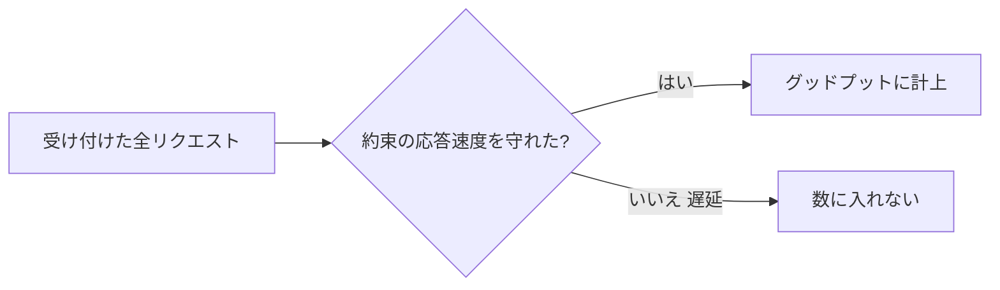

## AI

### [Claude Code を組織一括で管理できる「Claude apps gateway for AWS/Google Cloud」登場](https://www.publickey1.jp/blog/26/claude_codeclaude_apps_gateway_for_awsgoogle_cloud.html)
<!-- categories: Claude Code, Anthropic, AWS -->

会社ぐるみで Claude Code（AI コーディング支援ツール）を使うときの「管理の仕組み」がまとめて提供されるようになった。具体的には、社員が 1 つの ID でログインできる仕組み（シングルサインオン）、チームや個人ごとに「今月はここまで」と使用料の上限を決める機能、全員共通の初期設定をあらかじめ配る機能などが入っている。これまでは各自がバラバラに契約・設定していたため、費用が読めず情報システム部門が管理しづらかった。それを、会社のクラウド（AWS や Google Cloud）の入り口にゲートウェイ（関所）を1つ置いて、そこで一括管理できるようにしたのがポイントだ。AI ツールが「個人が勝手に使うもの」から「会社が正式に配って統制するもの」へ移りつつあることを示す動きと言える。

### [Hugging Face が AI 主導のサイバー攻撃を被弾、防御 AI に商用モデルが「解析拒否」](https://www.itmedia.co.jp/news/articles/2607/20/news010.html)
<!-- categories: Security, LLM, Incident -->

AI モデルの共有サイト大手 Hugging Face が、AI を使った自動サイバー攻撃を受け、内部データセットや認証情報（パスワードにあたるもの）が漏れたと認めた。興味深いのは、攻撃側が AI で攻めてくるのに対し、守る側も AI に解析を任せようとしたところ、一部の商用 AI モデルが「これはサイバー攻撃に悪用されうる内容だ」と判断して協力を拒んだ点だ。安全対策（ガードレール）が、守る側の足まで引っ張ってしまった格好で、最終的に別のモデル「GLM」に切り替えて対応したという。攻撃者は制限のないモデルを平気で使う一方、防御側だけが安全装置で手を縛られるという皮肉な構図が浮き彫りになった。AI 時代の防御では「使う道具の制約」まで含めて備えが要ることを突きつける事例だ。

### [「アメリカの閉じた AI は負けつつある」中国のオープンウェイト戦略を論じた記事が話題](https://werd.io/american-ai-is-locked-down-and-proprietary-its-losing/)
<!-- categories: AI, LLM, Business -->

AI モデルの「中身（重み）」を誰でもダウンロードして自分の環境で動かせる形で公開する中国勢のやり方（オープンウェイト）が、囲い込み型のアメリカ勢を押しつつある、と論じた記事が注目を集めた。アメリカの主要 AI は「うちのサーバー経由でしか使えない」閉じた作りが多く、料金や利用条件を提供元に握られる。一方、公開されたモデルは、いわば「レシピごと配ってしまう料理」のようなもので、世界中の開発者が自由に改良し、自社サーバーで安く動かせる。その結果、開発者コミュニティの支持や実際の利用が中国製モデルに流れているというのが筆者の見立てだ。技術の優劣だけでなく「どう配るか」という戦略が主導権を左右し始めている、という論点として広く読まれている。

### [新着 arXiv 論文の 30% 超が「AI が書いた文章」と読める](https://unslop.run/blog/measuring-ai-writing-on-arxiv)
<!-- categories: AI, LLM -->

研究論文の公開サイト arXiv に投稿される新着論文のうち、3 割以上が AI（大規模言語モデル）に書かれたと思われる文章になっている、という測定結果が公開された。調査では、AI が好んで多用する言い回しや語彙の「くせ」を手がかりに、人間らしい文章か AI らしい文章かを点数化して割合を推定している。もちろん英語を母語としない研究者の下書き補助など正当な使い方も多いが、内容の薄い「量産論文」が増える懸念とも隣り合わせだ。文章の見た目だけでは人か AI かの線引きが年々難しくなっており、学術の世界でも「AI 生成をどう扱うか」が避けて通れない問いになっていることを示している。

### [「AGENTS.md を秘密情報の遮断ラインとして信用していない」という警鐘](https://www.reddit.com/r/devops/comments/1v1fihb/i_dont_trust_agentsmd_as_a_secretredaction/)
<!-- categories: AI Agent, Security, DevOps -->

AI エージェントに「この情報は見せないで」と指示するために使う `AGENTS.md`（エージェント向けの取扱説明ファイル）を、パスワードなど秘密情報の「遮断ライン」として頼るのは危険だ、という現場からの問題提起。要は、AI に「金庫の中は見ないでね」とお願いの紙を貼っておくようなもので、守ってくれる保証はどこにもない、という指摘だ。指示はあくまで「お願い」であって強制力のある壁ではないため、プロンプトの工夫や想定外の動きで簡単に飛び越えられてしまう。秘密情報は、そもそも AI が触れられる場所に置かない・環境変数やアクセス権限といった本物の仕組みで隔離する、という原則を改めて確認させる議論として支持を集めた。

## Infra

### [LLM サービングでは「スループット」より「グッドプット」が重要な理由](https://www.cncf.io/blog/2026/07/20/why-goodput-matters-more-than-throughput-for-llm-serving/)
<!-- categories: LLM, Kubernetes, CNCF -->

AI（大規模言語モデル）を大量のユーザーに提供する際、単純な処理量（スループット＝1 秒あたり何文字さばけるか）だけを追うと逆に体験が悪化する、という解説記事。ここで登場するのが「グッドプット」で、これは「約束した応答速度をちゃんと守れた分だけ」を数える考え方だ。たとえばラーメン屋が 1 時間に 100 杯出せても、半分が伸びて出てきたら「まともに出せたのは 50 杯」と数えるようなイメージで、無理に詰め込むと一杯あたりの待ち時間が延びて全体の満足度が下がる。記事は、詰め込みすぎず「決めた待ち時間の約束を守れる範囲」で回すほうが、結果的に有効な処理が増えると説く。GPU を遊ばせない指標だけでなく、ユーザーとの速度の約束を軸に設計すべきだという実務的な視点だ。

### [AWS CDK の Express モードでリソースのデプロイが最大 4 倍速くなる](https://qiita.com/yosuke-suzuki/items/e6c26b70749abb48df09)
<!-- categories: AWS -->

AWS のインフラをプログラムのコードで組み立てる道具「CDK」に、デプロイ（実際にクラウドへ反映する作業）を最大 4 倍速くする「Express モード」が加わったので実際に試した検証記事。従来はコードから設計図を作り、それを AWS 側が 1 つずつ慎重に組み立てるため時間がかかっていたが、Express モードはこの手順を簡略化して待ち時間を大幅に縮める。開発中は「ちょっと直して反映」を何十回も繰り返すため、1 回あたり数分の短縮でも積み重なると効きが大きい。筆者は実測で速さを確認しつつ、簡略化ゆえに使える条件や注意点があることにも触れている。試行錯誤の回転を速めたい開発現場にとって実利のある改善だ。

### [NAT Gateway が AWS 請求の 80% に、みんなどう抑えている？](https://www.reddit.com/r/devops/comments/1v0xgjh/nat_gateway_is_somehow_80_of_our_aws_bill_how_are/)
<!-- categories: AWS, DevOps -->

「AWS の請求額の 8 割が NAT Gateway（社内サーバーが外部と通信するための出口装置）で占められている。どうやって抑えている？」という嘆きから始まった実務者どうしの議論。NAT Gateway は通した通信量に応じて課金され、しかも料金が地味に高いため、気づかないうちに膨らむ「見えない水道の出しっぱなし」になりやすい。スレッドでは、AWS 内のサービスへは専用の入口（VPC エンドポイント）を使って NAT を経由させない、通信量の多い処理の置き場所を見直す、といった具体策が共有された。クラウド費用は「使った分だけ」なので、どこで何が課金されているかを可視化して初めて手が打てる、という教訓が詰まっている。

### [ArgoCon Japan 2026 レポート、Argo CD 3.5 への道筋](https://www.cncf.io/blog/2026/07/20/argocon-japan-2026-meeting-the-maintainers-enterprise-insights-and-the-road-to-argo-cd-3-5/)
<!-- categories: Kubernetes, CNCF, DevOps -->

Kubernetes（コンテナ運用基盤）への配布を自動化する人気ツール Argo CD の日本イベント「ArgoCon Japan 2026」の報告記事。Argo CD は「Git に書いた"あるべき状態"に本番環境を自動で合わせ続ける」仕組み（GitOps）を担っており、大規模運用ほど恩恵が大きい。記事では開発を支える中心メンバー（メンテナー）との対話や、企業での使いこなし事例、そして次期バージョン Argo CD 3.5 に向けた改善の方向性が紹介されている。世界的に見ても日本のコミュニティが活発であることがうかがえ、クラウドネイティブ運用に関わる人には今後の機能を先取りできる内容だ。

### [2026 年 7 月 16 日の AWS CloudFront VPC Origins 障害まとめ](https://qiita.com/eureka_/items/6bb207fa1da4add1f61b)
<!-- categories: AWS, Incident -->

先日発生した AWS の CDN サービス「CloudFront」の障害について、何が起きたのかを時系列で整理した記事。CloudFront は世界中に置いた"倉庫"に人気コンテンツを配って表示を速くする仕組みで、今回は自社サーバーを配信元にする新機能「VPC Origins」まわりで不具合が出た。記事は、影響範囲・原因・復旧までの流れを分かりやすくまとめており、同じ構成を使っている人が「自分のところは大丈夫か」を確認する手がかりになる。クラウドは便利な反面、土台側で不具合が起きると自分では直せないため、障害情報を素早く読み解いて代替策を判断する力が問われる。過去の障害を教材として振り返る良い題材だ。

## Backend

### [Rust で書き直された Bun、早くも Claude Code アプリで本番投入](https://www.publickey1.jp/blog/26/rustbunclaude_code.html)
<!-- categories: Bun, Rust -->

JavaScript を高速に動かす実行環境「Bun」が、土台の言語を Zig から Rust へ書き直し、その新版が Claude Code のアプリで本番稼働に使われ始めたという報告。実行環境とは料理でいう「コンロ」のような土台で、ここを別の素材で作り直すのは家の基礎を入れ替えるような大工事にあたる。Rust は「メモリの取り扱いミス」をコンパイル時点で防ぎやすい言語として知られ、安全性と速度を両立しやすい。書き直して間もない土台をいきなり実サービスに載せたのは、それだけ完成度に自信があることの表れとも読める。開発言語の選択が、性能と安定性の両面で製品の信頼性に直結することを示す事例だ。

### [Zig が「Rust より本当にメモリ安全な」コンパイルモードを提案](https://www.reddit.com/r/programming/comments/1v1mpxw/zig_proposes_introducing_an_actually_memory_safe/)
<!-- categories: Zig, Rust -->

プログラミング言語 Zig に、「Rust よりも徹底してメモリ安全にする」コンパイルモードを入れる案が出て議論になっている。メモリ安全とは、確保した記憶領域をうっかりはみ出して読み書きするような、深刻なバグやセキュリティ穴につながるミスを防ぐこと。この案は Fil-C という先行研究に着想を得ており、実行時にきちんと見張ることで安全性を高める代わりに、速度は 1〜6 倍ほど遅くなる幅があるとされる。「安全と速さのどちらをどれだけ取るか」を開発者が選べるようにする発想で、常に最速一択ではない現実的な設計だ。安全性を後付けの検査で担保する手法が、言語設計の主流トピックになりつつあることを示している。

### [「The LSM Tree」──書き込みに強いデータベースの仕組み解説](https://www.reddit.com/r/programming/comments/1v1p0a9/the_lsm_tree/)
<!-- categories: Database -->

多くの現代データベースが内部で使う「LSM ツリー」というデータの並べ方を、基礎から解説した記事が話題になった。ざっくり言うと、書き込みをいちいちディスクの正しい場所へ差し込むと遅いので、まずは手元のメモや"追記専用のノート"にどんどん書き足し、あとでまとめて整理する、という発想だ。これにより書き込みがとても速くなる代わりに、読み出すときは複数の場所を見に行く手間が増えるため、裏で定期的に整理統合（コンパクション）する工夫が要る。時系列ログや大量書き込みを扱うシステムでよく使われ、なぜそのデータベースが速い/遅いのかを理解する土台になる。仕組みを知っておくと、性能問題の原因を推測しやすくなる。

### [JVM のプリミティブ型ハッシュテーブルを網羅ベンチマーク](https://www.reddit.com/r/programming/comments/1v1lqdd/comprehensive_jvm_primitive_hashtable_benchmarks/)
<!-- categories: Java -->

Java などが動く JVM 環境で、数値専用の「ハッシュテーブル」（キーから値を素早く引く辞書のような仕組み）を、いくつもの実装で細かく速度比較した記事。標準の仕組みは数値を一度"箱詰め"（オブジェクト化）してから扱うため、大量に回すと無駄な手間とメモリを食う。そこで数値をそのまま扱う専用ライブラリを使うと、この箱詰めコストが消えて速くなる、というのが定番の最適化だ。記事は複数ライブラリを同じ条件で測り、どれがどんな場面で有利かをデータで示している。「なんとなく速そう」ではなく実測で選ぶ姿勢は、性能が効くコードを書くうえで参考になる。

### [PHP Conference 2026: 大規模 EC サイトから学ぶ負荷対策入門](https://speakerdeck.com/ozakikota/phpdezuo-raretada-gui-mo-ecsaitokaraxue-bufu-he-dui-ce-ru-men-in-php-conference-2026)
<!-- categories: PHP -->

PHP で作られた大規模なネット通販（EC）サイトの運用経験から、アクセス集中への備え方を初心者向けに整理した発表資料。セール時などにアクセスが一気に押し寄せると、処理が詰まってサイトが落ちてしまう。資料では、同じ結果を毎回計算し直さず使い回す「キャッシュ」、重い処理を後回しにする仕組み、データベースへの負荷の逃がし方など、王道の対策を実例とともに紹介している。特別な魔法ではなく「よくある詰まりどころ」を一つずつ潰していく地道な積み重ねが効く、という点が伝わる内容だ。急な負荷にどう耐えるかは言語を問わず共通する悩みで、Web を支える人には実用的な入門になる。

## Frontend

### [Async React 時代の宣言的 UI：useActionState でユーザー操作を妨げない](https://zenn.dev/uhyo/articles/async-react-action-queue)
<!-- categories: React -->

React 19 の新しい仕組み `useActionState` を使って、通信中でもユーザーの操作を止めない使い勝手（UX）を作る方法を解説した記事。フォーム送信のように「押したら結果を待つ」処理は、素朴に作ると待っている間ボタンが固まってストレスになりがちだ。この記事は、送信という"操作"を宣言的に（＝手続きをこまごま書かず「こうしたい」と宣言する形で）扱い、連続した操作をうまく順番待ちさせるやり方を示している。書き手は React 界隈でよく知られた uhyo 氏で、実装の勘所が具体的だ。新しい標準機能を使って、待ち時間中も画面が生き生き反応する UI を作る指針として参考になる。

### [Jelly UI：HTML のフォーム部品に"やわらかい物理"を加える実験](https://jelly-ui.com/)
<!-- categories: HTML, CSS -->

チェックボックスやスイッチといった HTML の標準フォーム部品に、ぷるぷると揺れる「軟体（やわらかい物体）の物理演算」を加えて動かす実験的なライブラリが公開された。押すとゼリーのようにたわんで戻る動きが付き、無機質な操作に手触りのある楽しさが生まれる。派手さだけでなく、標準部品の見た目や振る舞いをどこまで拡張できるかという技術的な挑戦としても面白い。実務でそのまま多用すると過剰になりかねないが、要所のアニメーションでユーザーの反応を引き出す発想の引き出しになる。Web の表現の幅を広げる遊び心のある作例だ。

### [白って 1600 色あんねん！──CSS の色指定を掘り下げる](https://qiita.com/ishi720/items/3e4597bc50695fa9bf79)
<!-- categories: CSS -->

「白」と一口に言っても、CSS では表現の仕方によって膨大な種類の"白"を指定できる、という切り口で色指定を掘り下げた記事。色の名前（`white`）だけでなく、光の三原色を数値で混ぜる方法や、色相・彩度・明度で指定する方法、さらに新しい色空間など、同じ白でもわずかに違うニュアンスを無数に作れる。普段なんとなく使っている色指定の裏に、これだけ豊かな仕組みがあると気づかせてくれる。デザインで「なんか白がしっくりこない」ときに、指定方法を変えて微妙な差を作り込む手がかりになる。読み物として楽しみつつ CSS の色の理解が深まる一本だ。

### [note クリエイター向け統計ダッシュボードを個人開発（React / Hono / Chrome 拡張）](https://qiita.com/natsugure/items/e12091867becb931bce0)
<!-- categories: React -->

文章投稿サービス note の書き手向けに、アクセスなどの数字を見やすくまとめるダッシュボードを個人で作った開発記。画面表示に React、サーバー側に軽量フレームワーク Hono、データ収集にブラウザ拡張（Chrome 拡張）を組み合わせ、複数の部品を連携させた構成が具体的に語られている。既存サービスの「痒いところ」を自作ツールで補うという、個人開発ならではの動機と工夫が詰まっている。技術の選び方や、拡張機能でデータを取ってきて自分の画面に流し込む流れは、似たものを作りたい人の設計の下敷きになる。小さく作って自分の不便を解消する、という開発の原点を思い出させてくれる。

### [JavaScript なし、もしくは最小限で作る UI コンポーネント集「NoLoJS」](https://coliss.com/articles/build-websites/operation/work/reduce-the-js-workload-ui-component.html)
<!-- categories: HTML, CSS -->

タブやアコーディオン（折りたたみ）といったよくある UI 部品を、JavaScript を使わない、または最小限に抑えて HTML と CSS 中心で実装する作例をまとめた紹介記事。近年の HTML と CSS は表現力が大きく増し、以前は JavaScript が必須だった動きの一部を、標準機能だけで賄えるようになってきた。JavaScript を減らすと、読み込みが軽くなり動作も安定しやすく、保守もしやすくなるという利点がある。「とりあえず JavaScript で」ではなく、まず素の HTML/CSS でどこまでできるかを考える姿勢を後押ししてくれる。実装の引き出しを増やしたいフロントエンド開発者に便利な参照集だ。

## Others

### [ハッカーがルーマニアの土地登記データベースを丸ごと消去](https://news.risky.biz/risky-bulletin-hacker-wipes-romanias-entire-land-registry-database/)
<!-- categories: Security, Incident -->

ルーマニアの「土地登記データベース」（誰がどの土地を持っているかの公式記録）が、ハッカーによって丸ごと消去されるという深刻な事件が報じられた。土地の所有記録は社会の土台となる情報で、これが失われると売買や相続、権利の証明が立ち行かなくなる恐れがある。単なる情報漏えいではなく「消滅」であり、きちんとしたバックアップ（別の場所への控え）と、そこから確実に戻せる訓練がなければ被害は一気に広がる。国家の基盤インフラですら、備え次第で取り返しのつかない打撃を受けうることを突きつける事例だ。日頃「バックアップは取っているが、戻せるか試していない」システムに警鐘を鳴らす出来事でもある。

### [Netflix、ベン・アフレックの AI 映画制作スタートアップを約 950 億円で買収](https://gigazine.net/news/20260720-netflix-paid-587-million-ben-affleck-ai-startup-interpositive/)
<!-- categories: AI, Business -->

Netflix が、俳優ベン・アフレック氏らが関わる AI 映画制作スタートアップ「InterPositive」を約 950 億円（5 億 8700 万ドル）で買収したことが明らかになった。この会社は AI を使って映像制作の工程を効率化・自動化する技術を持つとされ、Netflix は制作コストの削減や新しい表現の獲得を狙っているとみられる。大手配信サービスが AI 制作技術を「外から買って取り込む」動きは、映像業界における AI の存在感がいよいよ本格化していることを示す。一方で、俳優や制作者の仕事が AI に置き換わることへの懸念も根強く、映像制作の未来像をめぐる議論を一段と加速させそうだ。巨額の買収額そのものが、AI 制作技術への期待の大きさを物語っている。

### [EU が生体情報を米国へ「ビザなし渡航」と引き換えに提供しようとしている](https://edri.org/our-work/the-eu-is-about-to-sell-our-most-sensitive-data-to-the-us-for-visa-free-travel/)
<!-- categories: Security -->

EU が、市民の指紋や顔などの最も機微な個人データ（生体情報）を、ビザなし渡航の維持と引き換えに米国側へ提供しようとしている、とデジタル権利団体が強く警告した。生体情報は変更できない究極の個人識別子で、一度渡せば取り消しがきかず、他の目的に使い回される懸念がつきまとう。記事は、利便性（ビザ不要で行き来できること）のために、後戻りできない形で個人データを差し出すことの危うさを訴えている。監視や国境管理と個人のプライバシーがぶつかる典型的な論点で、私たち一般利用者の情報が国家間の取引材料になりうる現実を示している。技術者に限らず、データの扱いに関わる誰にとっても考えさせられる話題だ。

### [裁判所が 1100 億ドルのパラマウント・ワーナー統合を差し止め](https://techcrunch.com/2026/07/20/judge-pauses-110b-paramount-warner-bros-merger/)
<!-- categories: Business -->

大手メディア企業パラマウントとワーナー・ブラザースによる約 1100 億ドル規模の統合計画を、裁判所が一時差し止めた。巨大メディアどうしが 1 つになると、映画・テレビ・配信の主導権が一部の企業に集中し、競争が損なわれる懸念があるため、その妥当性が問われている。差し止めは統合の"最終決定ではない一時停止"だが、規模が大きいだけに業界の勢力図や、私たちが観られる作品・料金にも影響しうる。エンタメ業界の再編が、技術やサービスを提供するプラットフォームの力関係とも密接に絡む時代であることを示す動きだ。IT・配信サービスに関わる人にとっても、川上の業界再編は無関係ではない。

### [ナンバー誤検知で盗難車の誤認多発、ロス市警がシステム企業との契約を終了](https://gigazine.net/news/20260720-automatic-license-plate-reader-system/)
<!-- categories: AI, Incident -->

車のナンバープレートを自動で読み取って盗難車を見つけるシステムで、読み取りミスによる「盗難車の誤認」が多発し、ロサンゼルス市警がシステム開発企業との契約を打ち切った。試乗レビュー中の一般の人が盗難車と間違えられるなど、誤検知が実際の市民に実害を及ぼしていたという。自動判定は便利だが、間違えたときに人が疑われ、最悪の場合は不当な扱いを受けるリスクがある。精度が一定に届かない自動システムを、人の権利に関わる場面へ安易に持ち込むことの危うさを示す事例だ。AI や自動判定を社会に組み込む際は「間違えたときに誰がどう困るか」まで含めて設計すべきだという教訓になる。
