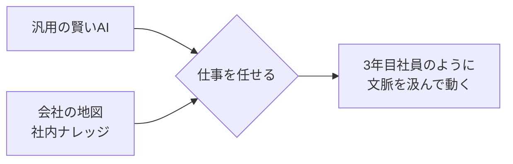
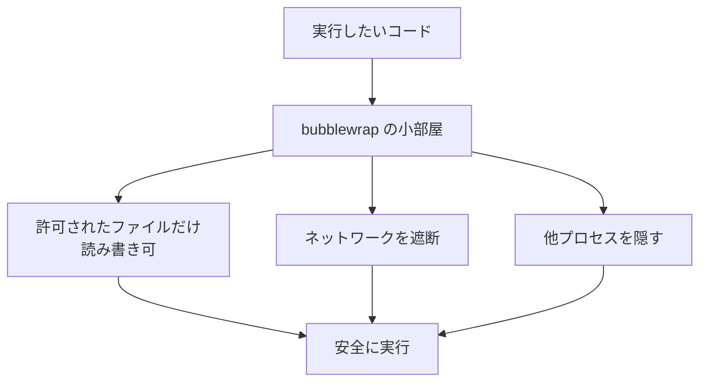

## AI

### [Googleが新Geminiを3つ同時投入、ただし本命の3.5 Proは間に合わず](https://techcrunch.com/2026/07/21/google-releases-three-new-gemini-models-but-no-3-5-pro/)
<!-- categories: Google, LLM -->

Googleが「Gemini 3.6 Flash」「Gemini 3.5 Flash-Lite」「Gemini 3.5 Flash Cyber」の3モデルを一度に公開した。中心となる3.6 Flashは、コーディングや知識作業の力を高めつつ、AIを動かす費用（トークン代）のもとになる「トークン消費」を従来より最大17%減らした――つまり同じ仕事を今までより安くこなせるようになった。Flash-Liteはさらに割安で数をこなす用途向け、Flash Cyberはセキュリティの穴（脆弱性）を見つけて直すことに特化し、政府や認定パートナーだけの限定提供とされた。注目すべきは、最上位の「3.5 Pro」が社内の性能目標に届かず今回間に合わなかった点で、その裏には先に上位版を出したOpenAI（GPT-5.6）やAnthropic（Claude Opus 4.8）との激しい競争がある。安さと速さで数を押さえにいくGoogleの狙いと、旗艦モデルの遅れという弱みが同時に見える発表だった。

### [米政府が中国製AIモデルに制裁をちらつかせる、「知的財産の盗用」を理由に](https://techcrunch.com/2026/07/21/us-threatens-sanctions-against-chinese-ai-models-over-ip-theft/)
<!-- categories: Business, LLM -->

アメリカ政府が、中国製のAIモデルに対して制裁（取引や利用を制限する国としての罰）をかけるかもしれないと警告した。理由は「アメリカ企業の技術やデータを不正に真似て（知的財産の盗用）作られている」というもの。背景には、中国発のオープンなAIモデルが安くて高性能なため世界中で使われ始め、アメリカ企業の商売を脅かしているという事情がある。もし制裁が実現すれば、中国モデルを土台にサービスを作っている世界中の開発者が、使う土台を急に変えざるを得なくなる恐れがある。技術の優劣ではなく「どこの国のAIを使ってよいか」という政治の話がAI選びに割り込んできた、という点で影響範囲が広い。

### [人気殺到でGPUが足りず、中国Kimi K3が新規受付を一時停止](https://www.itmedia.co.jp/news/articles/2607/21/news099.html)
<!-- categories: LLM, Business -->

中国のMoonshot AIが、新型AI「Kimi K3」の人気が爆発した結果、計算用の半導体（GPU）が足りなくなり、新規会員の受け付けを約48時間止めた。Kimi K3は2.8兆個ものパラメータ（AIの賢さを支える調整つまみの数）を持つ大型モデルで、AnthropicやOpenAIの上位モデルに迫る成績を出したことが人気に火をつけた。会社は「限られた計算資源は、今使っている既存ユーザーを優先して割り当てる」として新規を一時締め切った。これは、AIの世界では「良いモデルを作れるか」だけでなく「殺到する利用者をさばくGPUを確保できるか」が同じくらい重要だと示す出来事だ。性能で勝っても土台（インフラ）が追いつかなければサービスが止まる、という現実がよく分かる。

### [LLMの「脳内」を書き換える技術――スタイルも知識も外科手術のように操作する](https://joisino.hatenablog.com/entry/hack)
<!-- categories: LLM -->

AI（大規模言語モデル）が文章を作るときの「頭の中の状態」を直接いじって、振る舞いを狙い通りに変える技術が解説された。たとえば「操舵ベクトル」と呼ばれる向きに内部状態を押しやると、丁寧語を関西弁に変えるといった話し方の切り替えができる。さらに特定の計算層（MLP）だけを書き換えると、「ルーブル美術館はパリにある」という知識を「練馬にある」に、他の記憶を壊さずピンポイントで差し替えられる。全体を再学習し直すより少ない計算で済み、ブラックボックスだったAIの中身が少し見えるようになる点が価値だ。一方で「拒否するよう作られた安全装置」を外す方向にも使えてしまうため、悪用の危うさも併せ持つ、という両面を押さえておきたい。

### [AIに「会社の地図」を持たせたら、3年目社員のように働き始めた](https://note.com/ymdpharm3/n/n8515d151e56d)
<!-- categories: AI Agent -->

AIエージェント（自分で調べて手を動かすAI）に、社内の用語・部署・業務のつながりをまとめた「会社の地図（社内ナレッジ）」を渡したら、まるで入社3年目の社員のように文脈を汲んで動き出した、という実践記録。ポイントは、賢いモデルを選ぶこと以上に「そのモデルに何を前提知識として与えるか」が仕事の質を決めるという点だ。人間の新人が最初はマニュアルや先輩の説明を頼りに一人前になっていくのと同じで、AIも会社固有の事情を地図として渡されて初めて「使える戦力」になる。汎用の賢さと、その会社ならではの文脈知識は別物であり、後者を整えることが導入成功の鍵だと示している。

## Infra

### [AWSがデプロイ最大4倍速の「CloudFormation Expressモード」を提供開始](https://www.publickey1.jp/blog/26/aws4aws_cloudformation_express.html)
<!-- categories: AWS -->

AWSが、インフラ（サーバーやネットワークなどの土台）を設定ファイルからまとめて構築する仕組み「CloudFormation」に、展開（デプロイ）が最大4倍速くなる「Expressモード」を追加した。CloudFormationは「どんな構成にしたいか」を文章で書いておけば、その通りに自動で組み立ててくれる便利な道具だが、これまで反映に時間がかかるのが弱点だった。Expressモードはその待ち時間を大幅に縮め、設定を変えて試す→直すという開発の回転を速くする。インフラを手作業でぽちぽち作るのではなく「コードとして管理する」流れが主流になった今、その反映速度が上がることは日々の開発体験に直結する改善だ。

### [データセンターの電力消費、2035年までに現在の4倍へ](https://techcrunch.com/2026/07/21/data-centers-expected-to-use-4x-more-electricity-by-2035/)
<!-- categories: Datacenter -->

AIの普及で、世界中のデータセンター（大量のサーバーを集めた施設）が使う電気が2035年までに今の約4倍にふくらむ、という予測が報じられた。AIの学習や応答には大量の計算が必要で、その計算をこなすGPUが桁違いの電力を食うためだ。電気の奪い合いは電気代の上昇や、発電が追いつかない「電力不足」につながりかねず、AIの発展そのもののブレーキになりうる。だからこそ、少ない電力で動く小型モデルの活用や、原子力を含む新しい電源の確保が急がれている。AIの話題は賢さの競争に見えて、実はその足元を支える「電気をどう賄うか」というインフラ問題と切り離せない、という現実を突きつける記事だ。

### [AMDとMicrosoftが提携拡大、AIラック「Helios」をAzureに大規模導入へ](https://www.itmedia.co.jp/news/articles/2607/21/news051.html)
<!-- categories: AMD, Microsoft, Datacenter -->

AMDとMicrosoftが戦略的な提携を広げ、AMDの新しいAI用サーバー群「Helios」を、Microsoftのクラウド「Azure」に大量導入すると発表した。Heliosは、AIの計算を担うAMD製チップを「ラック」（サーバーを何十台も収める棚)単位でひとまとめにした構成で、大規模なAI処理を効率よくこなすことを狙う。これまでAI向け半導体はNVIDIAがほぼ独占してきたが、そこにAMDが本格的に食い込む形で、クラウド大手が「調達先を1社に依存しない」動きを強めている。利用者にとっては、供給元が増えて価格や入手のしやすさが改善する期待がある。AIインフラの土台をめぐる大手同士の綱引きが、より鮮明になった一手だ。

### [自社データセンターより「コロケーション」が選ばれる切実な理由](https://atmarkit.itmedia.co.jp/ait/articles/2607/21/news059.html)
<!-- categories: Datacenter -->

自前でデータセンターを建てるのではなく、他社の施設に自社のサーバーを間借りする「コロケーション」を選ぶ企業が増えている理由を解説した記事。自分でデータセンターを一から建てると、土地・電源・冷却・災害対策まで全部自前で用意する必要があり、時間もお金も莫大にかかる。とくに近年はAI向けの高密度なサーバーが大量の電力と冷却を必要とし、既存の自社設備では手に負えなくなってきた。コロケーションなら、電力や冷却が整った箱を借りるだけで済み、増減にも柔軟に対応できる。クラウドか自社かの二択に見えて、その中間の「箱だけ借りる」選択肢が現実解として存在する、という視点が実務で役立つ。

### [2026年ワールドカップがインターネットの通信量をどう動かしたか](https://blog.cloudflare.com/2026-world-cup-internet-traffic/)
<!-- categories: Cloudflare -->

Cloudflareが、2026年ワールドカップ期間中に世界のインターネット通信量がどう変化したかを分析した。試合の開始時刻に合わせて通信が跳ね上がり、とくに深夜・早朝に放送された試合で急増が目立ったという。国ごとの振る舞いの違いも面白く、ハーフタイムに通信が増える国もあれば、逆に一斉に接続を切る国もあった。アルゼンチンが世界中で最も強い関心を集め、アルゼンチン対スイスの準々決勝が通信量への影響が最大だった。大きなイベントは、人々の行動パターンをそのままネットワークの負荷として映し出す――サービスを運営する側にとっては「いつ・どこで急な負荷が来るか」を読む材料になる、実データに基づく観察だ。

## Backend

### [Claude CodeやCodexのサンドボックスを支える「bubblewrap」を自作して理解する](https://www.m3tech.blog/entry/2026/07/21/100000)
<!-- categories: Linux, Security, Docker -->

Claude CodeやCodexといったAI開発ツールが、AIの書いたコードを安全に試し実行するために使っている隔離のしくみ「bubblewrap（バブルラップ）」を、著者が一から自作して仕組みを解き明かした記事。bubblewrapは、コードが触れてよいファイルや通信を厳しく制限し、外に悪さをさせない「安全な小部屋」を作るLinuxの道具だ。記事では、DockerもこのbubblewrapもLinuxの同じ土台機能（namespaceやpivot_rootという、プロセスやファイルの見える範囲を切り分けるしくみ）を使っており、違いは「使い捨ての小部屋か、長く住むコンテナか」という用途の差だけだと示す。著者はPythonで小さな隔離ツールを組み立て、ファイル制限・ネットワーク遮断・プロセス隠しを実際に再現した。AIに任意コードを走らせる時代に、その安全装置の中身を理解しておく価値は大きい。

### [58万人が使う決済アプリ、「4時間たっても原因不明」の遅さをどう解消したか](https://atmarkit.itmedia.co.jp/ait/articles/2607/21/news029.html)
<!-- categories: Observability -->

利用者58万人の決済アプリで突然の「遅さ」が発生し、4時間かけても原因が分からなかった障害を、食品スーパーの技術チームがどう解消したかを追った事例。システムが複数の部品に分かれて連携する現代の構成では、どこか1か所が詰まっても、全体のどこが真の原因かを特定するのが極めて難しい。カギになったのは、システムの各所に「今どこで何秒待っているか」を見える化する監視（オブザーバビリティ）の仕組みだった。勘や当てずっぽうではなく、計測データで詰まっている箇所を突き止められる状態を作っておくことが、いざという時の復旧速度を分ける。障害は起きる前提で「見える化」に投資しておく重要性を、実話として教えてくれる。

### [設定ファイルに秘密情報を置いてはいけない理由](https://www.reddit.com/r/programming/comments/1v2cd9i/secrets_dont_belong_in_config/)
<!-- categories: Security -->

パスワードやAPIキーといった「秘密情報（シークレット）」を、アプリの設定ファイルに直書きすべきでない理由を論じた投稿。設定ファイルはコードと一緒に保存・共有されやすく、うっかりGitに含めてしまうと、そこから秘密が世界中に漏れる事故につながる。過去にもこの手の流出は繰り返されてきた。記事は、秘密情報は設定に混ぜず、専用の「金庫」にあたる秘密管理サービスや、動かす瞬間に環境変数として外から注ぎ込む方式で扱うべきだと説く。設定（どう動くか）と秘密（誰にも見せない鍵）は性質がまったく違うのだから、置き場所を分けるのが基本だ、という当たり前だが破られがちな原則を改めて確認できる。

### [「小さなPRに分ける」ルールをやめた理由](https://rootly.com/blog/why-we-got-rid-of-our-small-pr-rule)
<!-- categories: SRE -->

コード変更を「小さな単位（PR）」に必ず刻んでレビューする、という一般に良しとされるルールを、あえて撤廃した開発チームの振り返り。小さく分けるとレビューは楽になる一方で、変更が細切れになりすぎて「全体として何をしようとしているのか」が見えにくくなる弊害があった。筆者は「本当に厄介なバグは、部品同士の境界や、段階的な展開の途中に潜む」と指摘する。つまり、1つ1つの小さな変更が正しくても、それらが組み合わさった全体像を見ないと危険な不具合を見逃す。ルールを絶対視せず「何のためのルールか」に立ち返って運用を見直す姿勢は、どんなチームにも通じる学びだ。

### [フィーチャーフラグを効果的に使うための実践ポイント](https://dev.to/namingthingsishard/how-to-use-feature-flags-effectively-17ae)
<!-- categories: DevOps -->

新機能を「スイッチ一つでオン・オフできる」ようにする仕組み「フィーチャーフラグ」を、散らからず使うためのコツをまとめた記事。フィーチャーフラグは、機能を本番に置いたまま一部の人だけに見せたり、問題が出たら即座に隠したりできる便利な道具だ。ただし、コードのあちこちに「もしフラグがオンなら〜」という分岐が増殖すると、逆に読みづらく壊れやすいコードになってしまう。記事は、フラグの判定を1か所の関数にまとめ、入れ子の条件分岐を避けることを勧める。便利な道具ほど無秩序に使うと負債になるので、最初に「増えても散らからない置き方」を決めておくのが肝心だ、という実務的な助言だ。

## Frontend

### [Xがイチから作り直したAndroidアプリ、「過去最大級の刷新」に賛否](https://www.itmedia.co.jp/news/articles/2607/21/news081.html)
<!-- categories: Design -->

X（旧Twitter）が、Androidアプリを約1年かけて一から作り直し、「過去最大級の刷新」として公開したところ、使い勝手をめぐって賛否が割れている。作り直しの狙いは、動作の速さや反応の良さを根本から改善することにあり、土台を新しく組み直せば長期的な保守もしやすくなる。一方で、慣れ親しんだ画面配置（UI）が大きく変わったことで、「変わりすぎて使いにくい」「スペース機能が使えない」といった不満の声も上がった。長年使われたアプリの全面刷新は、技術的な改善と、既存ユーザーの慣れを壊すリスクが常に背中合わせだ。作り直しは正解でも、変化の伝え方や移行のなめらかさが評価を左右する、という教訓が見える。

### [Visual Studio Codeに「AIのクレジット浪費」を防ぐコスト管理機能](https://atmarkit.itmedia.co.jp/ait/articles/2607/21/news050.html)
<!-- categories: VS Code, AI Agent -->

Microsoftのコードエディタ「Visual Studio Code」に、AI機能が知らぬ間に使いすぎてしまう「クレジット（利用枠）の浪費」を抑えるコスト管理機能が追加された。AIにコードを書かせる機能は便利な半面、裏で大量の計算を呼び出すため、気づいたら利用枠を使い果たしていた、という事態が起きやすい。新機能は、どれだけ枠を消費しているかを見える化し、上限を決めて使いすぎを止められるようにする。AIを日常的に使う開発が当たり前になるほど、「賢さ」だけでなく「いくらかかるか」を手元で管理できることが実務では重要になる。作る道具の側が費用の見張り役を用意し始めた、という点で時代の流れを映す変化だ。

### [Xの公開ランキングアルゴリズムを読んで分かった「誰に表示されるか」の実態](https://dev.to/codedbytan/i-read-xs-open-sourced-ranking-algorithm-heres-what-actually-decides-who-sees-your-posts-2411)
<!-- categories: JavaScript -->

X（旧Twitter）が公開している「どの投稿を誰に見せるか」を決めるプログラム（ランキングアルゴリズム）を実際に読み解き、表示されやすさを左右する数値を明かした記事。分析によると、「返信」は「いいね」の約27倍、投稿主が会話に加わったやり取りは実に約150倍もスコアが高く評価されるという。つまりXは、ただ眺めて終わる反応より「会話が続くこと」を強く後押しする設計になっている。これは、利用者をできるだけ長くアプリに留めておく（滞在時間を伸ばす）という運営側の狙いと一致する。SNSに何が流れてくるかは偶然ではなく、こうした重み付けの設計で決まっている――その裏側を数字で覗ける貴重な分析だ。

### [PDFやEPUBを男女の声で読み上げる、オフライン対応のmacOSアプリ「Aura Reader」](https://coliss.com/articles/build-websites/operation/work/offline-tts-aura-reader.html)
<!-- categories: Design -->

PDFやEPUB、TXTなどの文書を、男性・女性の声で読み上げる音声ファイルに変換できるmacOS用アプリ「Aura Reader」が紹介された。文章を耳で聞ける「オーディオブック」を、市販品を買わずに自分の手持ち文書から手軽に自作できるのが特長だ。大きな利点は、処理がすべて自分のパソコン内（オフライン）で完結する点で、読ませたい文書を外部のサービスに送らずに済むため、情報が漏れる心配がない。通勤中や作業中に資料を「ながら聞き」したい人にとって、手元の文書を音声化する敷居がぐっと下がる。クラウドに頼らずローカルで完結させる作りは、プライバシーを重んじる最近の流れにも合っている。

### [知っておきたいVS Codeのショートカット](https://dev.to/chrisebuberoland/vs-code-shortcuts-every-developer-should-know-5833)
<!-- categories: VS Code -->

多くの開発者が使うエディタ「VS Code」で、作業を速くする代表的なキーボードショートカット10個を紹介した記事。マウスに手を伸ばさずキー操作だけで、複数箇所を同時に編集する「マルチカーソル」、行の入れ替え、ファイル間の素早い移動などができる。狙いは、網羅的に全部覚えることではなく「毎日よく使う操作」に絞って身につけること。ショートカットは一つ覚えるごとに小さな時短だが、日々何百回と繰り返す操作なので、積み重なると効果が大きい。派手な新機能ではないが、こうした地味な効率化こそが日常の開発体験を底上げする、という実感のこもった内容だ。

## Others

### [WordPressに認証不要でコードを実行される緊急脆弱性、即時更新を](https://www.itmedia.co.jp/news/articles/2607/21/news084.html)
<!-- categories: WordPress, Security -->

世界中のサイトで使われるWordPressに、ログインもユーザー認証もなしに攻撃者が任意のコードを実行できてしまう、最高レベル（Critical）の緊急脆弱性が見つかった（CVE-2026-63030、影響はWordPress 6.9以降）。原因はREST APIのまとめ処理（バッチ処理）の窓口にあり、ここを突かれるとサイトを乗っ取られる恐れがある。同時にSQLインジェクション（データベースへ不正な命令を送り込む攻撃）の脆弱性も別途修正された。対策は最新の7.0.2への更新が必須で、旧系統でも6.9.5・6.8.6で修正が提供される。すぐ更新できない場合はCloudflareなどのWAF（不正な通信を入口で弾く盾）が一時しのぎになる。放置は乗っ取り直結なので、心当たりのあるサイト管理者は最優先で更新したい。

### [AI音楽生成「Suno」で情報漏えい、5500万人に影響](https://techcrunch.com/2026/07/21/ai-music-generator-suno-breach-affects-55m-users-per-have-i-been-pwned/)
<!-- categories: Security, Incident -->

AIで音楽を自動生成するサービス「Suno」で情報漏えいが発生し、約5500万人分の利用者データが流出したと、漏えい確認サイト「Have I Been Pwned」が報じた。生成AIサービスが急速に普及する裏で、大量の利用者情報を抱え込むほど、漏れたときの被害も桁違いに大きくなる、という構図がはっきり出た事例だ。流出した情報の種類によっては、なりすましやフィッシング（本物を装って情報を抜く詐欺）に悪用される恐れがある。利用者は、そのサービスと同じパスワードを他でも使い回していないかを見直し、必要なら変更したい。話題のAIサービスに飛びつく前に「自分の情報がどこに預けられ、漏れたら何が起きるか」を一度立ち止まって考える必要性を突きつける。

### [ランサム復旧「3日」「50日」「73日」の分岐点はどこにあるか](https://atmarkit.itmedia.co.jp/ait/articles/2607/21/news025.html)
<!-- categories: Security, Incident -->

ニチレイの事業停止も引き合いに、身代金要求型ウイルス（ランサムウェア）に襲われた組織が、復旧まで「3日」で済むか「73日」もかかるかを分ける要因を、医療・港湾・物流の被害事例から探った記事。ランサムウェアはデータを勝手に暗号化して人質に取り、業務を止めてしまう攻撃で、いったん食らうと事業そのものが長期間まひする。復旧の速さを分けるのは、身代金を払うかどうかではなく、平時にバックアップ（別の場所に取ったデータの控え）や復旧手順をどれだけ準備していたかだ。攻撃を100%防ぐのは難しいからこそ、「やられた後にどれだけ早く立ち直れるか」の備えが被害の大小を決める。自組織の復旧計画を点検するきっかけになる、実例ベースの警鐘だ。

### [決済の主役交代か、先駆者PayPalが後発Stripeに買収提案](https://www.itmedia.co.jp/business/articles/2607/21/news053.html)
<!-- categories: Business -->

オンライン決済の先駆者PayPalが、後発ながら開発者に支持されて急成長したStripeに買収を提案した、という決済業界の地殻変動を伝える記事。PayPalは早くから普及した老舗だが、Stripeは「開発者が組み込みやすい」使い勝手で新興サービスに次々採用され、勢いで先を行く存在になった。先駆者が後発に買収を持ちかける構図は、市場の主役が入れ替わりつつあることの象徴だ。決済インフラは、ネット通販やアプリ課金など私たちの生活の土台を静かに支えており、その主導権が誰の手に移るかは、多くのサービスの手数料や使い勝手に跳ね返る。派手さはないが、裏方インフラの覇権争いとして知っておく価値のある動きだ。

### [音楽配信Deezer、1日の投稿の半分超がAI生成と発表](https://techcrunch.com/2026/07/21/music-streamer-deezer-says-more-than-50-of-daily-uploads-are-ai-generated/)
<!-- categories: Business -->

音楽配信サービスのDeezerが、毎日アップロードされる楽曲の半分以上（50%超）がAIによって自動生成されたものだ、と発表した。AIで手軽に曲が作れるようになった結果、人間のアーティストの作品とAI製の曲がプラットフォーム上で混ざり合い、その境目が急速に曖昧になっている。大量のAI生成曲は、再生数に応じて分配される収益を薄め、本物のアーティストの取り分を圧迫しかねない。またリスナーにとっても「今聴いているのは誰が作った曲か」が分かりにくくなる。配信側はAI生成の表示や検出の仕組みを迫られており、創作の世界にAIがなだれ込んだときに何が起きるかを、数字で突きつける象徴的なニュースだ。
