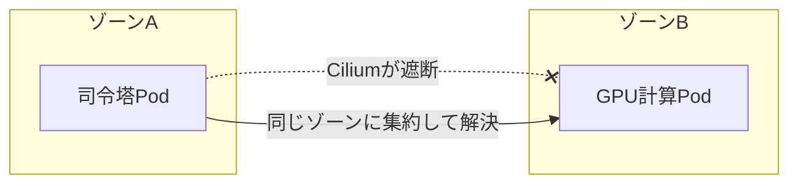

## AI

### [米政府、中国AI「Kimi K3」開発元を批判　Anthropic「Fable」を蒸留したとして](https://www.itmedia.co.jp/news/articles/2607/23/news105.html)
<!-- categories: Anthropic, Business -->

中国のMoonshot AIが公開したAI「Kimi K3」について、米政府が「Anthropicの最上位AI『Fable』を不正に真似て作った疑いがある」と批判した。ここでいう「蒸留（じょうりゅう）」とは、優秀な先生AIにたくさん質問して答えを集め、その答えを教科書代わりに使って生徒AIを安く育てる手法のこと。ゼロから何百億円もかけて学習させる代わりに、既存の高性能AIの「出力」を写経させることで、開発の時間と費用を一気に圧縮できてしまう。米政府はこれを技術の「ただ乗り」とみなし、先端技術が国外へ流れる安全保障上の懸念として問題視している。実際にKimi K3はエージェント性能のベンチマークでFable 5に次ぐ2位につけつつ実行コストは大幅に安く、蒸留の疑いに拍車をかけている。

### [Markdownファイルが、AI時代の負債に？　Googleが提案する「ナレッジ標準化」の一手](https://atmarkit.itmedia.co.jp/ait/articles/2607/23/news055.html)
<!-- categories: AI Agent, Google Cloud -->

複数のAIエージェントに社内の知識を持たせる際、これまで定番だったMarkdownファイルが、かえって足かせになりつつあるという指摘だ。Markdownは人間には読みやすい反面、書き方に決まりがないため、エージェントごとに解釈がバラバラになり、知識を共有しようとすると噛み合わなくなる。Googleが提案する「Open Knowledge Format（OKF）」は、Markdownの先頭にYAML形式のメタdata（`type`／`title`／`description`など、その文書が何者かを示すラベル）を必ず付ける決まりを設け、機械が迷わず扱えるようにする。いわば「バラバラだった名刺の書式をそろえて、誰の名刺でも同じ欄を見れば役職が分かる」ようにする試みだ。知識を扱うツールを作る側にとって、相互運用性を左右する重要な動きになる。

### [音声クローンが可能な音声合成AI「Qwen-Audio-3.0-TTS」が登場、日本語対応でGemini超えの性能](https://gigazine.net/news/20260723-qwen-audio-3-tts/)
<!-- categories: AI, LLM -->

Alibabaが、お手本の音声を少し聞かせるだけでその人の声色でテキストを読み上げる音声合成AI「Qwen-Audio-3.0-TTS」を公開した。「Flash」と「Plus」の2種類があり、上位のPlusは音声合成モデルのランキングで1位となり、Googleの「Gemini 3.1 Flash TTS」を上回る評価を得ている。日本語を含む16言語と20種類の中国方言に対応し、ある言語のお手本音声をもとに別の言語をしゃべらせることもできる。声を数秒で複製できる技術は、ナレーションや翻訳の現場を便利にする一方、本人になりすます詐欺にも転用されうるため、扱いには注意が要る。

### [AI時代、開発チームの人材は“5つの型”に分かれる　Claude Code開発責任者の見立て](https://atmarkit.itmedia.co.jp/ait/articles/2607/23/news015.html)
<!-- categories: Claude Code, AI Agent -->

AnthropicでClaude Codeの開発を率いるBoris Cherny氏が、AIを使いこなす開発チームの人材は5つの「型」に分かれると語った。具体的には、素早く試作する**プロトタイパー**、製品として作り込む**ビルダー**、コード品質を整える**スウィーパー**、規模拡大に取り組む**グロワー**、保守・安定運用を担う**メインテナー**の5つ。重要なのはこれが職種の話ではなく、同じデザイナーでも状況によって型が変わる「役割の傾向」であり、1人が複数を兼ねることもある点だ。AIがコードを大量に書ける時代には、誰が何を得意とするかを見極めてチームのバランスを取ることが、これまで以上に効くという見立てだ。

### [AIが世界中の数学者を80年悩ませた難問を解いてしまった。でも手放しでは喜べないらしい](https://www.gizmodo.jp/article/erdos-unit-distance-conjecture-has-been-refuted-by-ai/)
<!-- categories: AI, OpenAI -->

80年間未解決だった数学の難問「エルデシュの単位距離予想」を、OpenAIのAIが反例を見つけて覆した。この予想は「平面にいくつか点を打ったとき、同じ距離になる点の組は最大でどれくらい作れるか」を問うもので、AIは「離散幾何学」と「代数的数論」という普段は交わらない2分野を組み合わせて突破口を開いた。AIが強かったのは、変なプライドがなく、定説にも平気で反証を突きつけ、複数分野の知識を高速に結びつけられたからだという。ただし数学者たちは喜びきれずにいる。AIの推論過程は「なぜその解き方でうまくいくのか」開発者にも分からないブラックボックスのままで、答えだけでなく「人間がどう考えたか」を大切にする数学の営みが揺らぐという懸念があるからだ。

## Infra

### [Kubeflowとciliumの相性問題で、GPUの60%が遊んでいた話](https://www.cncf.io/blog/2026/07/23/when-kubeflow-meets-cilium-debugging-60-idle-gpus-in-kubernetes/)
<!-- categories: Kubernetes, Observability -->

高価なGPUの6割が仕事をせず遊んでいた原因が、2つの「正しい設定」がかみ合わなかったことにあったという調査記録だ。KubernetesはGPUを使うプログラムを、置き場所（データセンターのゾーン）を気にせず空いている場所へ配置する。一方、ネットワークを守るCilium（シリウム）はゾーンをまたぐ通信を遮断する設定だった。結果、指示役の司令塔と実際に計算するGPU係が別ゾーンに分かれてしまい、両者の会話が静かに遮断されて計算が進まなくなっていた。PrometheusとGrafanaでGPU使用率とゾーンの対応を可視化して原因を特定し、関連部品を同じゾーンに集める制約を加えたところ、使用率は85%まで回復した。

### [Nvidia is sending GPUs to the moon](https://techcrunch.com/2026/07/23/nvidia-is-sending-gpus-to-the-moon/)
<!-- categories: NVIDIA, Hardware -->

NvidiaのJetson（ジェットソン）という小型GPUチップが、月面探査車の「頭脳」として月へ送られる。ロボット企業Lunar Outpostが探査車を作り、Intuitive Machinesが着陸機、Firefly Aerospaceが周回衛星を担い、年内にSpaceXのロケットで打ち上げる計画だ。狙いは、地球からの指示を待たずに探査車自身がその場で判断して動く「自律走行」の実現で、周囲をlidar（レーザーで地形を測る目）で捉えながらAIが即座に進路を決める。地球との通信には往復で数秒の遅れが出るため、極寒・強い放射線という過酷な月面で機械が自分で考えられることが、有人探査の前段階として重要になる。

### [AIチップ新興Etched、懐疑論をよそに評価額10.3B（約1.5兆円）へ](https://techcrunch.com/2026/07/23/ai-chip-startup-etched-defies-skeptics-hits-10-3b-valuation-from-big-name-investors/)
<!-- categories: Hardware, Business -->

ハーバード中退の3人が創業したEtchedが、AIを「動かす」専用チップで評価額10.3B（約1.5兆円）に達した。彼らのチップは、いまのAIの土台である「Transformer」という仕組みだけに的を絞って回路を作り込んでおり、汎用のGPUがなくても動く。何でもできるNvidiaのGPUが「万能ナイフ」だとすれば、Etchedは「その料理専用の包丁」に例えられ、用途を絞ることで消費電力あたりの処理効率を高めている。今回Sequoiaやa16z、SK Hynixなどから300M（約450億円）を調達し、7カ月で評価額を倍にし、1B（約1500億円）分の受注も抱える。AIを使う場面（推論）のコスト競争が、専用チップの側から本格化してきた。

### [政府機関がサイバー攻撃を受け、ルーマニア全土の不動産登記・取引が停止](https://gigazine.net/news/20260723-land-registry-cyberattack-romanias/)
<!-- categories: Security, Incident -->

ルーマニアの国家地籍・土地登記庁（ANCPI）が7月14日にサイバー攻撃を受け、全国の不動産の登記や売買が処理できなくなり、数十万人が影響を受けた。手口は高度なものではなく、以前から警告されていた既知の脆弱性と、流出済みのログイン情報を悪用した「鍵の閉め忘れを突いた」ような比較的単純な侵入だった。アルジェリア拠点を名乗るByteToBreachが犯行声明を出し、システムのソースコードなどを売りに出している。根っこの問題は予算配分で、過去20年でデジタル化に約250億円を投じながら、そのうちセキュリティに回したのはわずか0.2%だったと指摘されている。守りへの投資を後回しにすると、国全体の取引が止まるほどの打撃になりうるという教訓だ。

### [OpenTelemetryを支える人たち：10週間の貢献者育成コホートで見えたもの](https://www.cncf.io/blog/2026/07/23/sustaining-opentelemetry-what-a-10-week-contributor-cohort-actually-looks-like/)
<!-- categories: OpenTelemetry, CNCF -->

システムの動きを記録・観測する標準として広く使われるOpenTelemetryが、開発を手伝う新しい貢献者を計画的に育てる「10週間のコホート（同期の集団）」を実施した記録だ。人気のOSSほど、少数の中心メンバーに負担が集中して燃え尽きやすく、後を継ぐ人を絶やさないことが持続の鍵になる。記事では、いきなり大きな課題を渡すのではなく、段階的に小さな貢献から始めてもらい、メンターが伴走する仕組みが紹介されている。「新人が最初の1歩を踏み出す壁」をどう下げるかという、OSS全般に通じる運営ノウハウとして参考になる。

## Backend

### [Bun v1.4.0がRust移行、正式リリース前にClaude Codeへ組み込まれていたことが判明](https://gigazine.net/news/20260723-claude-code-bun-in-rust/)
<!-- categories: Bun, Rust -->

高速なJavaScript実行環境「Bun」が、その中核となる約53万行のコードを従来のZig言語からRust言語へ移植し、その作業をAIコーディングツール「Claude Code」を使って約11日で終えたと報告された。開発者のSimon Willison氏がClaude Codeの実行ファイルを調べたところ、正式公開前のBun v1.4.0がすでに組み込まれており、多くの利用者が気づかぬうちにRust版を使っていたことが分かった。Rustは、メモリをいつ使い終わるかをコンパイラが自動で見張る仕組みを持ち、「解放済みの領域を誤って触る」といった不具合を動かす前に検出できる。長時間動かし続けるツールの安定性向上が期待できる一方、53万行を11日という速さは、AI支援による大規模移植が現実味を帯びてきたことを示している。

### [Go 1.27からuuid実装が標準ライブラリでサポートされる](https://zenn.dev/layerx/articles/f7124d4e761c1f)
<!-- categories: Go -->

Go 1.27で、これまで外部ライブラリに頼っていたUUID（重複しない識別子）の生成機能が、標準ライブラリに組み込まれる。UUIDとは「世界のどこで作っても、まずかぶらない番号札」のようなもので、データベースのIDなどに広く使われる。新しいuuidパッケージは種類を絞り、ランダムな「v4」と、時刻順に並ぶ「v7」だけをサポートする。特にv7は生成した時刻を先頭に埋め込んで自然と昇順に並ぶため、データベースに保存したとき整理しやすく、性能面で有利だ。約400件のコメントが飛び交った長い議論の末、広く使われてきた`google/uuid`の実績を踏まえた無難な着地となった。

### [JEP 540: Simple JSON API（Java標準にJSONが仲間入り、Incubator段階へ）](https://openjdk.org/jeps/540)
<!-- categories: Java -->

Javaに、標準ライブラリだけでJSONを読み書きできる「Simple JSON API」を追加する提案（JEP 540）が、試験的に導入するIncubator（インキュベーター＝孵化器）段階に進んだ。JSONはWebでやり取りされる定番のデータ形式だが、Javaにはこれまで公式の扱い方がなく、開発者はJacksonやGsonといった外部ライブラリを毎回追加する必要があった。今回の提案は、追加インストールなしで最低限のJSONの解析・生成を賄えるようにするもので、小さなツールや学習用途で依存を減らせるのが利点だ。Incubatorはあくまで「お試し公開」で、利用者の反応を見ながら仕様を固めていく段階を意味する。

### [How MVCC and Transactions Work in RocksDB](https://www.reddit.com/r/programming/comments/1v4jw4i/how_mvcc_and_transactions_work_in_rocksdb/)
<!-- categories: Database -->

高速なキーバリューストア「RocksDB」が、複数の処理を同時に安全にこなす仕組み（MVCCとトランザクション）を解説した記事。MVCC（多版型同時実行制御）とは、データを書き換えるたびに通し番号（シーケンス番号）を振り、古い版も一時的に残すことで、「読んでいる人」と「書いている人」がお互いを待たずに済むようにする方式だ。ある時点の通し番号を記録した「スナップショット（写し）」を持てば、後から他人がデータを変えても、自分は一貫した過去の景色を読み続けられる。トランザクションには、衝突を最後にまとめて確認する「楽観的」方式と、先に鍵をかけて他人を待たせる「悲観的」方式があり、用途に応じて使い分ける。データベースの内側を理解したい人に向いた良い教材だ。

### [.NET MAUI、iOS/AndroidのランタイムがMonoからCoreCLRへ　.NET 11 Preview 6](https://www.publickey1.jp/blog/26/net_mauiiosandoridmonocoreclrnet_11_preview_6.html)
<!-- categories: .NET -->

C#でスマホアプリを作る仕組み「.NET MAUI」で、アプリを実際に動かす土台（ランタイム）が、従来の「Mono」から本流の「CoreCLR」へ完全に切り替わった。ランタイムとは、書いたコードを端末上で実際に走らせる「エンジン」のことで、これが本流に統一されることで、iOSやMac Catalystでは実行速度が向上し、Androidでも起動時間やアプリ容量の増減は10%以内に抑えられているという。マイクロソフトは既存アプリでの動作確認を呼びかけており、互換性の検証が当面の課題になる。ゲームエンジンのUnity 7も同じCoreCLRへ移行予定で、.NET全体が単一のエンジンにそろっていく流れが加速している。

## Frontend

### [Your JS Date Is Lying to You - 本番に流れ続ける落とし穴](https://www.reddit.com/r/programming/comments/1v3bbxx/your_js_date_is_lying_to_you_the_traps_that_keep/)
<!-- categories: JavaScript -->

JavaScriptの日付機能「Date」に潜む、いまだに本番障害を生み続ける罠をまとめた記事。代表例が「月が0から始まる」仕様で、1月を表すのに`0`を渡さねばならず、`11`が12月になる。さらに文字列の解釈も曲者で、`2026-01-01`のようにハイフン区切りだと世界標準時（UTC）扱い、`2026/01/01`のようにスラッシュ区切りだと端末の地域時間扱いと、書式次第で結果が数時間ずれる。Dateオブジェクト自体が書き換え可能で、うっかり元の値を壊してしまう事故も起きやすい。こうした落とし穴を避けるため、標準の新API「Temporal」や専用ライブラリの利用が勧められている。

### [ダークモードは2つ目のCSSファイルにすべきではない](https://dev.to/hasansarwer/why-dark-mode-should-not-be-a-second-css-file-1c5k)
<!-- categories: CSS -->

暗い配色（ダークモード）を実現するのに、明るい版と暗い版で別々のCSSファイルを持つのはやめるべきだ、という主張の記事。ファイルを分けると同じ部品の見た目を2重に管理することになり、片方だけ直し忘れて時間とともにズレていく事故が起きやすい。著者が勧めるのは「セマンティックトークン」というやり方で、色を直接書かず`--color-surface`のような「意味の名前」を付けたCSS変数を部品に参照させる。こうすれば部品側は1つのままで、テーマ切り替え時に変数の中身（実際の色）だけを差し替えればよく、「明暗どちらでも同じ設計図を使い回す」形になる。

### [Justif: Knuth-Plassによる両端揃えと精密タイポグラフィをWebへ](https://justif.lyall.co/)
<!-- categories: CSS, HTML -->

紙の印刷物のような美しい文字組みをWebページで実現するツール「Justif」が話題になった。書籍の組版ソフトで使われる「Knuth-Plass（クヌース＝プラス）法」という、行全体を見渡して単語の間隔を最適に配分するアルゴリズムを取り入れ、ブラウザ標準では難しかった上質な両端揃えを可能にする。ハイフンでの語の分割、文字幅のわずかな伸縮、字間の微調整といった、プロの組版で使われる技を自動で効かせられる。読みやすさと見た目の完成度を、印刷物並みに引き上げたいWebデザイナーにとって注目の道具だ。

### [Vue.jsと一緒にHTMXを使い始めたら、思いのほか気に入った話](https://dev.to/codewiljson/why-i-started-using-htmx-alongside-vuejs-and-didnt-expect-to-like-it-2aho)
<!-- categories: HTMX, Vue.js -->

何でもJavaScriptで作り込むSPA（単一ページアプリ）が常に最適とは限らないと気づいた著者が、小さめの画面ではHTMXを併用し始めた体験記。HTMXは、HTMLに属性を書き足すだけでサーバーから部分的なHTMLを取ってきて画面を更新でき、書くJavaScriptの量を大きく減らせる。著者の結論は「使い分け」で、複雑なダッシュボードや操作の多い画面はVueが向く一方、管理画面やフォーム、社内ツールのように「JavaScript自体が主役ではない」場面ではHTMXが軽快で相性が良いという。流行りの道具を全部に当てはめるのではなく、画面の性格で選ぶ姿勢が参考になる。

### [「プロトタイプ設定が消える」　Figma共同編集でハマりやすいポイントと対策6選](https://atmarkit.itmedia.co.jp/ait/articles/2607/23/news009.html)
<!-- categories: Design -->

デザインツールFigmaを複数人で同時編集するときに起きがちな、地味だが痛い落とし穴と対策をまとめた記事。代表的なのが「プロトタイプ設定の消失」で、画面遷移などのインタラクション設定が複雑になると、共同編集中に予期せず消えてしまうことがあり、編集前にプロトタイプタブで状態を確認しておくとよいという。ほかにも、大元のコンポーネントを変えてもコピー（インスタンス）側に反映されず手直しが要る問題や、ガイドライン用ファイルを分ける運用で「ライブリンク」開放時にスタイルが勝手に更新されてしまう事象などが挙げられている。チームでデザインを扱う現場のヒヤリを減らす実務的な知見だ。

## Others

### [AI企業が「隠れ債務」を積み上げている　簿外で約1.65兆ドル規模との指摘](https://futurism.com/artificial-intelligence/ai-companies-hide-debt-off-balance-sheet)
<!-- categories: Business -->

Alphabet、Microsoft、Amazon、Meta、Oracleといった大手が、決算書の表に載らない「簿外債務」を約1.65兆ドル抱えているとの分析が出た。これは表向きに公表している負債1.35兆ドルを上回る規模だ。手口は、SPV（特別目的会社）という別会社を作って借金をそちらに付け替える会計手法で、2001年に破綻したエンロンが使ったやり方と重なる。Metaだけで約4200億ドルをこの方式で抱えているとされる。データセンターに巨額を投じても十分な利益が出ていない中、「AIバブル」がはじけて需要や評価額が崩れれば、隠れていた借金が一気に表面化し、広く経済を揺らしかねないという警告だ。

### [Silent Replacement of Trusted macOS App Executables（信頼済みアプリの実行ファイルを密かにすり替える）](https://mysk.blog/2026/07/23/macos-overwrite-app-executables/)
<!-- categories: Security, Apple -->

macOSで、ネットからダウンロードした正規アプリの中身（実行ファイル）を、攻撃者が静かにすり替えられる手法が公開された。特別な管理者権限がなくても、アプリを一度アーカイブして復元するという回り道で、通常なら守られている本体を書き換えられてしまう。すり替わったアプリは正規アプリのふりをして、「キーチェーンのパスワードを見せてよいか」「このフォルダにアクセスしてよいか」といった許可の確認をユーザーに求める。利用者は見慣れた正規アプリからの依頼だと思って承認してしまい、暗号鍵や機密ファイルを気づかぬうちに奪われる恐れがある。見た目が本物そっくりな許可ダイアログほど、油断しやすいという怖さがある。

### [Linuxカーネルで432件のCVEが一斉公開　「重要な脆弱性だけ直す」運用は限界か](https://atmarkit.itmedia.co.jp/ait/articles/2607/23/news032.html)
<!-- categories: Linux, Security -->

Linuxカーネルで一度に432件もの脆弱性（CVE）が公開され、「重要なものだけ選んで直す」という従来のやり方が立ち行かなくなりつつある、と警鐘を鳴らす記事だ。CVEは本来、脆弱性ごとに緊急度を示す番号札だが、Linuxカーネルでは番号が大量に振られるため、札を見ても「どれを先に直すべきか」の判断材料になりにくい。結果として、担当者は膨大な件数の前で優先順位付けに溺れてしまう。記事では対策として、自分たちのシステム構成や使い方をLLM（AI）に伝えて対応の優先度を判定させるアプローチが検討されているが、実運用には課題が多いとも指摘している。

### [Everyone Should Know SIMD](https://mitchellh.com/writing/everyone-should-know-simd)
<!-- categories: SIMD -->

CPUの「一度の命令で複数のデータをまとめて処理する」機能SIMD（シムド）を、もっと多くの開発者が知るべきだと説く記事。たとえば8個のバイトを1つずつ順番に比べる代わりに、一度の命令で8個いっぺんに比べられる、というのがSIMDの発想だ。難解に思われがちだが、実際の書き方は「定数を全レーンに配る→ベクトル幅ごとに繰り返す→並列に処理→結果をまとめる→端数は普通の方法で処理」という決まった5段階の型に収まる。大量の連続データをぐるぐる処理するループに出くわしたら、この型を当てはめるだけで4〜8倍の高速化が狙えることも多い、という実用的な指南だ。

### [「検索結果は著作物ではない」と裁判所が判断、GoogleのSerpApiへの訴えを却下](https://gigazine.net/news/20260723-google-loses-lawsuit-against-serpapi/)
<!-- categories: Google -->

Googleが検索結果の収集業者SerpApiを訴えた裁判で、裁判所は「検索結果は著作権で守られる著作物ではない」と判断し、Googleの訴えを却下した。判決は、URLやスニペット（抜粋文）、事実にもとづくインデックス情報は「一般に公開された事実」であり、独占できる創作物ではないと整理している。Googleは、自社が著作権を持たないコンテンツについてもアクセス制限の回避を問題にしようとしたが、本来の著作権者から「守ってほしい」と正式に頼まれた事実を示せなかった点も響いた。この判断は、開発者やAI企業、研究者が検索情報へ公開アクセスし続けられる余地を残し、「開かれたインターネット」を支えるものと評価されている。
