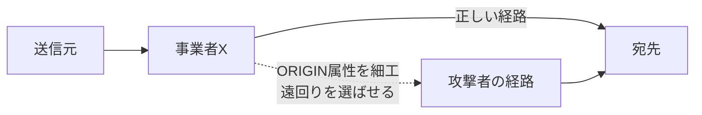
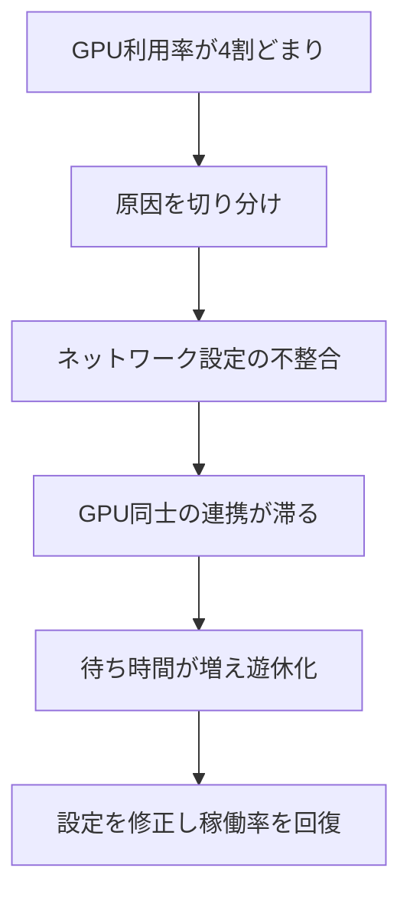

## AI

### [Claude Opus 5 が登場、価格そのままで一段賢く](https://www.anthropic.com/news/claude-opus-5)
<!-- categories: Anthropic, Claude -->

Anthropic が新しいAIモデル「Claude Opus 5」を公開した。値段は前世代の Opus 4.8 と同じ（AIに読ませる文章100万語ぶんで約5ドル、AIが書く文章100万語ぶんで約25ドル）のまま、賢さだけを底上げしたのが目玉だ。とくにプログラミングや、AIが自分で手順を考えて作業を進める「エージェント」的な仕事で成績が良く、自分の答えを自分で見直して直す力が強くなったという。パズル的な推論力を測る「ARC-AGI 3」という試験では次点のモデルの3倍のスコアを出し、有機化学の問題でも前世代より10ポイント以上高い正答率を記録した。加えて「本来やってはいけない振る舞い」をしにくくなった＝安全性も改善したとされる。同じ料金で置き換えるだけで質が上がるため、すでに Claude を使っている開発現場には乗り換えの動機が大きい。

### [NVIDIA・Meta・Microsoft ら20社超、「オープンウェイトAIを慌てて規制するな」と米政府に要請](https://techcrunch.com/2026/07/24/as-us-weighs-response-to-chinese-ai-industry-urges-against-broad-open-weight-restrictions/)
<!-- categories: LLM, Business -->

NVIDIA、Meta、Microsoft、Palantir、Hugging Face など20社以上が連名で、米政府に「オープンウェイトAIへの過度な規制を避けてほしい」と求める書簡を出した。オープンウェイトとは、AIの「頭脳の中身（学習済みの数値データ）」を誰でもダウンロードして自分の環境で動かせる形で公開されたモデルのこと。米国では中国発の高性能AIへの対抗策として輸入・利用の制限が議論されており、その巻き添えで自国の開放的なAI開発まで縛られることを業界が警戒している。企業側は「制限をかけると、むしろ研究や産業の競争力をそぐ」と主張する。国家安全保障と技術の開放性のどちらを優先するかという、今後のAI政策の分かれ道を象徴する動きだ。

### [DeepSeek創業者、「NVIDIAのCUDAという城壁は崩れつつある」と約4時間の講演で発言](https://gigazine.net/news/20260724-deepseek-liang-wenfeng-talk/)
<!-- categories: NVIDIA, LLM -->

中国のAI企業 DeepSeek の創業者・梁文鋒（リャン・ウェンフォン）氏が約4時間の講演を行い、NVIDIA の優位性の源泉である「CUDA」が揺らぎつつあると語った。CUDA とは、NVIDIA製GPU（AI計算を高速にこなす専用チップ）を動かすための土台となるソフトで、開発者がこれに慣れてしまうと他社製チップに乗り換えづらくなる「囲い込み」の役割を果たしてきた。梁氏はこの囲い込みが弱まってきているとの見方を示し、あわせて「目先の利益より、人間並みに何でもこなせるAI（AGI）の実現を目指す」という方針も明かした。NVIDIA一強とされてきたAI用チップ市場に、競争の余地が広がりつつあることを当事者が認めた格好だ。ハードウェア調達の選択肢が増えれば、AI開発のコスト構造そのものが変わる可能性がある。

### [画像・動画・音声をまとめて作れるAI「FLUX 3」が発表](https://bfl.ai/blog/flux-3)
<!-- categories: FLUX -->

Black Forest Labs が、1つで画像・動画・音声のすべてを生成できるAIモデル「FLUX 3」を発表した。これまでは「画像用」「動画用」と目的ごとに別々のAIを使い分けるのが一般的だったが、FLUX 3 は入り口を1つにまとめてしまおうという発想だ。あわせて、条件に応じて最適な生成モデルを自動で選ぶ「Runway Media Router」のような仕組みも他社から登場しており、生成AIは「たくさんのモデルをどう賢く使い分けるか」の段階に入りつつある。作り手にとっては、複数のツールを組み合わせる手間が減り、動画に合った効果音まで一気通貫で用意できる利点がある。表現の幅が広がる一方、本物と見分けにくいコンテンツが増える懸念も同時に大きくなる。

### [Microsoft が自社画像生成AI「MAI-Image-2.5-Pro」を公開、Office へ統合し外部依存を減らす](https://gigazine.net/news/20260724-microsoft-mai-image-2-5-pro/)
<!-- categories: Microsoft -->

Microsoft が独自開発の画像生成AI「MAI-Image-2.5-Pro」をリリースし、Office 製品などに組み込んでいく方針を示した。これまで Microsoft は画像生成の分野で OpenAI の技術に頼る場面が多かったが、自前のモデルを持つことでその依存を薄める狙いがある。表計算やスライド作成の中で、文章から直接イラストや図版を作れるようになれば、資料づくりの手間が大きく減る。裏を返せば、提携先である OpenAI への「一本足打法」を避け、交渉力や安定供給を確保する経営判断でもある。巨大IT企業が主要AI機能を内製化する流れが、また一歩進んだ。

## Infra

### [AMD が NVIDIA に挑むAIラック「Helios」と第6世代EPYC・Instinct MI400 を発表](https://techcrunch.com/2026/07/23/amd-takes-on-nvidia-with-its-helios-ai-rack-scale-system/)
<!-- categories: AMD, Datacenter -->

AMD が、サーバーラック1本まるごとをAI計算用にまとめた大型システム「Helios」と、新しいサーバー向けCPU「第6世代EPYC」、AI用アクセラレータ「Instinct MI400」を発表した。ラック単位（冷蔵庫ほどの棚1本ぶん）で設計するのは、AIの学習に何千個ものチップを密に連携させる必要があるためで、この土俵はこれまで NVIDIA が強かった領域だ。さらに AMD は超高速AI推論の Cerebras とも提携し、応答までの待ち時間（レイテンシ）を極限まで削ったシステムを2026年後半に出す計画も明かした。データセンター向けAIチップ市場で、NVIDIA一強に対する明確な対抗軸が立ち上がりつつある。調達側にとっては価格交渉の材料が増える、実利のあるニュースだ。

### [OpenTelemetry がCNCFを「卒業」、では次に何をするのか](https://www.cncf.io/blog/2026/07/24/opentelemetry-has-graduated-now-what/)
<!-- categories: OpenTelemetry, CNCF -->

システムの動作状況（ログ・処理時間・エラーなど）を集めて可視化する共通規格「OpenTelemetry」が、CNCF の中で最も成熟した段階である「卒業（Graduated）」に到達した。卒業とは、実運用に耐える安定性と広い採用実績を認められた印で、Kubernetes などと同じ格付けになる。記事は「達成したから終わり」ではなく、これから取り組むべき課題を整理している。具体的には、集めたデータの量が増えすぎてコストがかさむ問題や、対応する言語・ツールの足並みをどう揃えるかといった、普及したからこそ出てくる悩みだ。監視の道具選びに迷う現場にとって、事実上の標準がどこへ向かうかを知る手がかりになる。

### [BGPの「経路の出どころ」を書き換える攻撃と、その影響](https://blog.cloudflare.com/bgp-origin-attribute/)
<!-- categories: Cloudflare, Security -->

Cloudflare が、インターネットの通信経路を決める仕組み「BGP」の弱点について解説した。BGP は、世界中の通信事業者が「この宛先へはこの道が近い」と互いに教え合って経路を決める、いわば道案内の伝言ゲームだ。この伝言に含まれる「経路の出どころ（ORIGIN属性）」を細工すると、本来通るはずの道より不自然な遠回りや迂回を相手に選ばせ、通信を意図した経路へ誘導できてしまう。悪用されれば通信の盗み見や妨害につながりかねない。記事はこの手口が実際のインターネットにどう影響するかを計測データで示し、ルーティングの安全性を見直す必要性を訴えている。

### [Kubeflow と Cilium の落とし穴、GPUの6割が遊んでいた原因を追う](https://www.cncf.io/blog/2026/07/23/when-kubeflow-meets-cilium-debugging-60-idle-gpus-in-kubernetes/)
<!-- categories: Kubernetes, CNCF -->

Kubernetes 上でAIの学習基盤（Kubeflow）と高速ネットワーク機能（Cilium）を組み合わせたところ、高価なGPUの約6割が仕事をせず遊んでいた、という原因究明の記録だ。GPUはAI計算の主役だが、複数台をネットワークで密に繋いで協調させないと本来の力を出せない。この事例では、通信まわりの設定がかみ合わず、チップ同士がうまく手をつなげずに待ち時間ばかり増えていた。記事はどこにボトルネックがあったかを段階的に切り分けていく過程を丁寧に追っており、同じ構成を使う現場の「なぜ遅い」の教科書になる。遊んでいるGPUはそのまま無駄な費用に直結するため、稼働率の改善は運用コストに直結する。

### [AWSのDevOpsエージェントは「復旧時間75%短縮・原因特定94%」と主張](https://www.reddit.com/r/devops/comments/1v4nqwx/aws_says_its_devops_agent_delivers_75_lower_mttr/)
<!-- categories: AWS, AI Agent -->

AWS が、障害対応を手伝うAI「DevOps Agent」について、平均復旧時間（MTTR＝障害が起きてから直るまでの平均時間）を75%短縮し、根本原因の特定精度が94%に達したと発表した。従来は障害が起きるとエンジニアがログを追い、原因を手探りで探すため時間がかかっていたが、この手のエージェントは大量のログや構成情報を横断的に読んで「怪しい箇所」を素早く指し示す。Reddit の現場エンジニアからは、宣伝文句どおりの数字が本当に出るのか、どんな条件で測ったのかを問う懐疑的な声も上がっている。とはいえ、障害対応をAIに任せる流れは各社で加速しており、運用の在り方を変えつつある。数字を鵜呑みにせず、自分の環境で試して確かめる姿勢が求められる。

## Backend

### [Go 1.27 で標準ライブラリに UUID 実装が入る](https://zenn.dev/layerx/articles/f7124d4e761c1f)
<!-- categories: Go -->

プログラミング言語 Go の次期版 1.27 で、UUID を標準ライブラリだけで扱えるようになる見込みだ。UUID とは「重複しないID」を作るための世界共通の規格で、データベースの主キーやリクエストの識別などで広く使われる。これまで Go では外部ライブラリを追加して使うのが定番だったが、それが言語標準に取り込まれることで、依存を増やさずに済むようになる。外部ライブラリが減ると、供給元が乗っ取られてマルウェアを混入される「サプライチェーン攻撃」のリスクも下げられる。小さな追加に見えて、多くの現場のコードから外部依存を1つ消せる、地味だが歓迎される変更だ。

### [Go の連想配列を刷新した「Swiss Tables」、その仕組み](https://www.reddit.com/r/programming/comments/1v58vch/golang_maps_how_swiss_tables_replaced_the_old/)
<!-- categories: Go -->

Go の map（キーと値をひも付けて素早く探せる連想配列）の内部構造が、従来の「バケット方式」から「Swiss Tables」という新方式に置き換えられた経緯を解説した記事。map は「名前で電話番号を引く電話帳」のようなもので、目的の項目にいかに速くたどり着けるかが性能を左右する。旧方式は空き部屋（未使用の枠）を辿るのに無駄が多かったのに対し、Swiss Tables は各枠の状態を小さな一覧表にまとめ、一度にまとめて調べることで探索を高速化する。現代のCPUが得意とする「まとめて並列に処理する」動きと相性が良いのがポイントだ。普段は意識しない土台の改良が、書いたコードの実行速度を底上げしてくれる好例といえる。

### [Rust 1.97.0 のセグフォルト、7命令まで読み解く](https://qiita.com/ryuhei-kiso/items/93a86fc17b4f55125571)
<!-- categories: Rust -->

「メモリ安全」を売りにする Rust で、コンパイラの不具合により異常終了（セグフォルト）が起きるバグを、機械語7命令のレベルまで追った深掘り記事。Rust は普通に書けば危険なメモリ操作を防げる言語だが、今回はソースコードを機械語に翻訳するコンパイラ側にミスがあり、正しいはずのプログラムが壊れた命令列に化けていた。しかもこのバグは10リリースにわたって潜んでいたという。著者は生成された機械語を逆から読み解き、どの一手で辻褄が合わなくなるかを特定していく。言語が安全でも、その言語を機械語へ変換する土台にバグがあれば安全神話は崩れうる、という警鐘でもある。

### [.NET 11 Preview 6 公開、MAUI のiOS/Androidランタイムが CoreCLR に](https://www.publickey1.jp/blog/26/net_mauiiosandoridmonocoreclrnet_11_preview_6.html)
<!-- categories: .NET -->

Microsoft が「.NET 11 Preview 6」を公開し、スマホアプリ開発フレームワーク MAUI の iOS/Android 向け実行エンジンを、従来の「Mono」から本流の「CoreCLR」へ切り替えた。実行エンジンとは、書いたプログラムを端末上で実際に動かすための土台部分で、これがサーバーやデスクトップと同じ CoreCLR に統一されることで、性能や挙動の一貫性が期待できる。一方で土台が変わると既存アプリで思わぬ不具合が出る恐れもあり、Microsoft は開発者に早めの動作確認を呼びかけている。プレビュー版のうちに自分のアプリを試しておくことが、正式版での移行トラブルを避ける近道だ。モバイル開発の基盤が静かに、しかし大きく入れ替わろうとしている。

### [JDK 27 以降、Oracle は macOS/x64 版の保守を停止](https://openjdk.org/jeps/541)
<!-- categories: Java -->

Java の次期版 JDK 27 を境に、Oracle のエンジニアが Intel製Mac（macOS/x64）向けの Java の面倒を見なくなることが提案文書（JEP 541）で示された。近年の Mac は Apple 独自チップ（Apple Silicon）へ移行が進んでおり、Intel版 Mac は縮小の一途をたどっている。開発リソースを主流の環境に集中させるため、少数派になった Intel版 Mac のサポートを段階的に手放す判断だ。該当環境で Java を動かしている開発者は、Apple Silicon への移行や、他のディストリビューション（有志が保守する版）への切り替えを検討する必要が出てくる。プラットフォームの世代交代が、開発現場の足元にも及んできている。

## Frontend

### [WebAIM 2026、上位100万ページのアクセシビリティ調査](https://webaim.org/projects/million/#errors)
<!-- categories: Accessibility, HTML -->

アクセシビリティ（誰もが使えるWebにするための設計）を推進する WebAIM が、世界のアクセス数上位100万ページを自動診断した2026年版の結果を公開した。アクセシビリティとは、目の不自由な人が読み上げソフトで使えるか、文字と背景の色の差が十分かなど、あらゆる人がWebをきちんと使える度合いのこと。調査では依然として大多数のページに問題が見つかり、とくに「文字と背景のコントラスト不足」「画像に説明文がない」といった基本的なミスが繰り返し上位を占めた。ツールで自動検出できる初歩的な誤りすら直っていない現状は、Web全体の底上げがまだ道半ばであることを示す。数字を毎年追える定点観測として、制作者が自分のサイトを見直すきっかけになる。

### [WebGPU Unleashed：実践的なチュートリアル](https://shi-yan.github.io/webgpuunleashed/)
<!-- categories: WebGPU -->

ブラウザからGPU（描画や計算を高速にこなすチップ）を直接使える新技術「WebGPU」を、手を動かしながら学べる実践チュートリアルが公開された。これまでブラウザでの3D描画は WebGL が主流だったが、WebGPU は現代のGPUの性能をより素直に引き出せる後継規格として整備が進んでいる。ゲームや3D表現だけでなく、ブラウザ上でAIの計算を走らせるといった用途にも道が開ける。チュートリアルは基礎から順を追って組み立てていく構成で、いきなり難しい概念に飛ばず段階的に理解できるのが利点だ。フロントエンドで重い描画・計算を扱いたい人にとって、最初の一歩をふみ出す手引きになる。

### [「正しさ」を土台に据えたフロントエンドフレームワーク foldkit](https://foldkit.dev/)
<!-- categories: TypeScript -->

「バグの起きにくさ（正しさ）」を最優先に設計された新しいフロントエンドフレームワーク foldkit が登場した。堅牢な型・エラー処理を提供する Effect というライブラリの上に作られ、画面の状態管理には Elm という言語で有名な「一方向の分かりやすい流れ」の考え方を採り入れている。一方向の流れとは、データの変化を「操作→状態更新→画面反映」という決まったルートに限定することで、どこで何が起きたかを追いやすくする設計だ。自由度を少し犠牲にする代わりに、想定外の壊れ方を減らせるのが売りといえる。React などの主流とは異なる思想で、堅さを重んじる開発者に選択肢を増やす動きだ。

### [Justif：Knuth-Plass式の行揃えと微細組版をWebで](https://justif.lyall.co/)
<!-- categories: CSS -->

紙の書籍のように美しく整った文字組みをWeb上で実現する試み「Justif」が公開された。Web の両端揃え（テキストの左右をぴったり揃える表示）は、単語の間隔が不自然に間延びして読みにくくなりがちだ。Justif は、組版ソフト TeX で有名な「Knuth-Plass アルゴリズム」を使い、1行ごとではなく段落全体を見渡して改行位置を最適に決めることで、間延びを抑えた自然な行揃えを実現する。加えて、細かな字間調整などの「微細組版（マイクロタイポグラフィ）」にも対応する。読みやすさや見た目の品質にこだわる制作者にとって、Webの文字表現を一段引き上げる面白い挑戦だ。

### [Astroで日英ブログを作って分かった5つの実装パターン](https://zenn.dev/akari1106/articles/ea85f0a245bb8b)
<!-- categories: Astro -->

高速な静的サイトを作れるフレームワーク Astro を使い、日本語と英語の2言語ブログを構築して得られた実装ノウハウを5つのパターンにまとめた記事。多言語サイトでは、URLの切り分け方、記事の言語ごとの管理、共通部品の使い回しなど、単純に見えて悩みどころが多い。著者は実際に作る中でつまずいた点と、その解決策を具体的なコードとともに整理している。これから多言語対応を始める人にとって、あらかじめ落とし穴を知っておける実務的な地図になる。個人ブログから業務サイトまで、国際化を検討する場面で参考にしやすい内容だ。

## Others

### [欧州委員会がGoogleに約890億円の制裁金、デジタル市場法違反の疑い](https://gigazine.net/news/20260724-ec-fines-google-890-million-euro/)
<!-- categories: Google, Business -->

欧州委員会が Google に対し、8億9000万ユーロ（日本円で約1500億円規模）の制裁金を科した。理由は、巨大IT企業が自社サービスを不当に優遇するのを禁じる「デジタル市場法（DMA）」に違反した疑いだ。DMA は、検索やアプリ配信などで支配的な立場にある企業が、その力を使って競合を締め出すのを防ぐための欧州のルールで、違反には売上に応じた重い罰金が用意されている。今回の制裁は、EUが大手プラットフォームへの監視を緩めていないことを改めて示すものだ。世界規模でサービスを展開する企業にとって、地域ごとの規制対応がますます重い経営課題になっている。

### [監視カメラのログイン画面に GitHub の管理者トークンが埋め込まれていた](https://hhh.hn/hanwha-github-token/)
<!-- categories: Security, GitHub -->

ある監視カメラ製品のログイン画面のソースに、メーカーの GitHub 管理者トークン（社内の全リポジトリを操作できる合鍵のような認証情報）がそのまま埋め込まれていた、という指摘が話題になった。トークンとは、パスワードの代わりにシステムへアクセスするための鍵で、これが漏れれば第三者が正規の権限になりすませてしまう。しかも埋め込まれていたのは、誰でも中身を見られるブラウザ表示用のコードだった。もし悪用されていれば、製品のファームウェアに不正なコードを仕込むといったサプライチェーン攻撃につながりかねない深刻なミスだ。認証情報をコードに直書きしないことの重要性を、改めて突きつける事例といえる。

### [インド政府が GitHub に Bitchat の削除を要求、法的論争に](https://techcrunch.com/2026/07/24/indias-move-against-jack-dorseys-bitchat-sparks-legal-debate/)
<!-- categories: GitHub, Security -->

インド政府が、Jack Dorsey 氏が関わる Bluetooth 経由でやりとりする匿名チャットアプリ「Bitchat」について、GitHub に対しソースコードの削除を命じたことが波紋を呼んでいる。Bitchat はインターネット回線を使わず、近くの端末同士を Bluetooth で直接つないでメッセージを届ける仕組みで、通信網が遮断された状況でも連絡を取り合える点が特徴だ。政府は安全保障上の懸念を理由に挙げるが、オープンソースのコードを国家が削除させることの是非をめぐり、表現の自由や開発者の権利との衝突が指摘されている。プラットフォーム（GitHub）が各国の削除要請にどこまで応じるべきか、という難しい問題を突きつける一件だ。技術の中立性と国家の規制権限のせめぎ合いを象徴している。

### [LINEヤフー、「LINE広告」の記録など約3年半分を誤って削除](https://www.itmedia.co.jp/news/articles/2607/24/news096.html)
<!-- categories: Incident -->

LINEヤフーが、「LINE広告」に関する一部の記録など約3年半分のデータを誤って削除してしまったと発表した。長期間にわたる記録が消えると、広告の配信実績の確認や、過去にさかのぼった請求・分析などに影響が及ぶ恐れがある。こうした事故は、運用作業中の操作ミスや、削除対象の指定を誤ったことが原因になりやすい。大規模サービスでは一度の誤操作の影響範囲が非常に広くなるため、削除処理に二重確認を挟んだり、バックアップから戻せる仕組みを整えたりする備えが欠かせない。便利なサービスの裏側で、データを守る運用がいかに難しいかを示す出来事だ。

### [Google、ログイン方法に「自撮り動画」を追加](https://gigazine.net/news/20260724-selfie-sign-in-google-account/)
<!-- categories: Google, Security -->

Google が、アカウントへのサインイン手段として「自撮り動画」による本人確認を追加した。パスワードや二段階認証のコードを忘れて締め出されたとき（ロックアウト）でも、自分の顔を撮った動画を使えば復旧しやすくする狙いだ。従来の復旧手段はメールや電話番号に頼ることが多く、それらも使えないと詰んでしまう弱点があった。顔という「本人そのもの」を鍵にすることで、閉め出しからの立て直しを助ける発想だ。一方で、顔のような生体情報をどう安全に扱うか、なりすまし動画（ディープフェイク）にどう対抗するかといった新たな課題も伴う。利便性と安全性のバランスをどう取るかが、今後の焦点になる。
