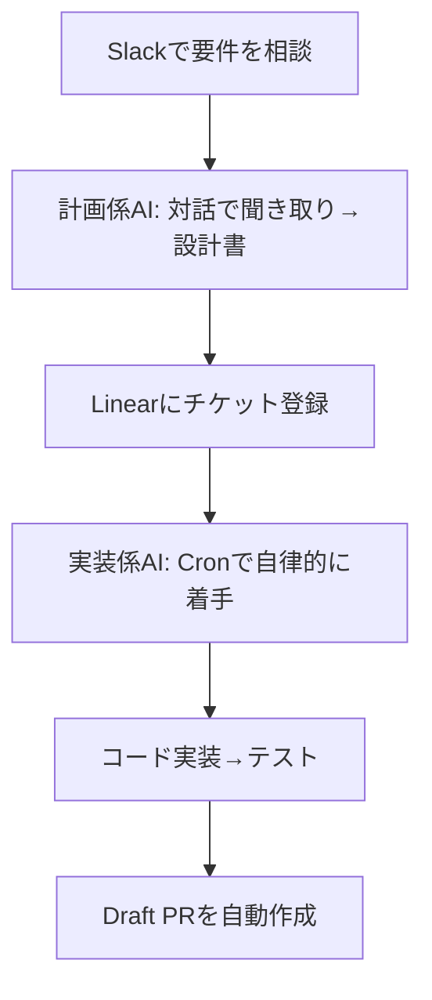
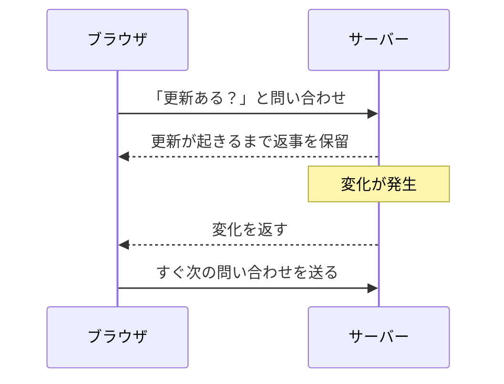

## AI

### [Open Weights and American AI Leadership](https://www.microsoft.com/en-us/corporate-responsibility/topics/open-weight/)
<!-- categories: LLM, OSS, Microsoft -->

マイクロソフトが「誰でもダウンロードして自分の手元で動かせるAI（オープンウェイトモデル）」を強く推す文章を公開した。AIの中身（重み＝モデルの頭脳にあたる数値の集まり）を公開する流れは、1980年代に広まった「ソースコードを公開して皆で育てるソフトウェア」の再来だと位置づけている。公開することで、資金の乏しいスタートアップも高額な利用料を払わずに専用AIを作れ、複数の企業が競い合うことで性能が上がり費用も下がると主張する。さらに中身が見えるぶん弱点も皆で見つけやすく、一部の閉じた大企業にAIの力が集中する危険を避けられるとした。政策担当者には「開かれたAIを早まって規制するな」と呼びかけており、これは中身を公開しないClaude（Anthropic）のような路線への対抗軸でもある。

### [中国の副首相が「中国産AIチップの採用を拒むものは裏切り者である」と発言](https://gigazine.net/news/20260725-china-ai-chip/)
<!-- categories: Hardware, Business -->

中国の副首相が、国内企業に対し「自国製のAI用半導体を使わない者は裏切り者だ」という強い言葉で国産チップの採用を迫ったと報じられた。背景には、AIの計算に欠かせない高性能半導体で長らく米NVIDIA製が世界を独占してきた状況があり、米国の輸出規制で入手が難しくなった中国が国産への切り替えを急いでいる事情がある。前日にはDeepSeekの創業者が「NVIDIAの独占的な強みは崩れつつある」と語ったことも伝えられており、中国はハードとソフトの両面で米国依存からの脱却を国策として進めている。米国側もオープンウェイトAIの扱いで揺れており（上の記事）、AIを巡る主導権争いが「モデルの中身をどこまで公開するか」と「半導体をどこの国から買うか」の二正面で激化している。

### [「165日→30分」1万9000人の全社RAG、大企業が明かすAI共通基盤のリアル](https://atmarkit.itmedia.co.jp/ait/articles/2607/25/news010.html)
<!-- categories: LLM, RAG -->

社員1万9000人が使う「社内文書を検索して答えるAI（RAG）」を実際に作った大企業が、その舞台裏を明かした。RAGとは、AIが勝手に思いつきで答えるのではなく、社内の規程やマニュアルなど正しい資料を先に探し出し、それを根拠に答えを組み立てる仕組みで、うろ覚えで作文しない図書館司書のような役割を指す。記事では、ある業務にかかっていた165日という時間が30分に短縮された事例を紹介しつつ、成功のカギは派手なAIそのものより「元になる社内文書をきれいに整える地道な作業」にあったと説明する。全社規模で使ってもらうには、部署ごとにバラバラな資料の形式や権限管理をそろえる必要があり、そこが最大の壁になると報告している。導入を検討する現場にとって、理想論ではなく実務の勘所が詰まった内容だ。

### [Hermes Agent と Slack で設計し、Linear のチケットから Draft PR まで作成するワークフロー](https://azukiazusa.dev/blog/hermes-agent-slack-workflow/)
<!-- categories: AI Agent, LLM -->

チャット（Slack）で要件を相談すると、そのままタスク管理ツール（Linear）に課題が登録され、コードの下書き（Draft PR）まで自動で作られる仕組みを個人で構築した記事。「計画を立てる係」と「実際にコードを書く係」の2体のAIエージェントに役割を分け、それぞれが使える道具と権限を最小限に絞ることで暴走を防いでいるのが工夫だ。計画係はいきなり作り始めず、対話で要件を聞き出してから設計書に落とし込み、実装係は定期実行（Cron）で自律的にチケットを拾って作業を進める。VPS（借りたサーバー）で常時動かしているため、手元のパソコンを閉じてもスマホから指示でき、長時間AIを走らせ続ける運用に向く。

### [AI工学特論: MLOps・継続的評価](https://speakerdeck.com/asei/aigong-xue-te-lun-mlopsji-sok-de-ping-jia-b257eb10-fb3e-4159-828b-8445b7ff2f37)
<!-- categories: MLOps, LLM -->

AIを「作って終わり」にせず、本番で使い続けながら品質を保つための考え方（MLOps）をまとめた講義資料。ふつうのソフトと違い、AIは世の中のデータや利用者の使い方が変わると、昨日まで正しかった答えが今日は的外れになる「劣化」が起きる。そこで、出来栄えを定期的に採点し続ける「継続的評価」が欠かせないと説く。人が毎回目視するのは限界があるため、正解のお手本とどれだけ近いかを点数化したり、別のAIに採点させたりする自動チェックの仕組みを紹介している。AIを社内に入れる前に「どうやって長く面倒を見るか」を設計しておく重要性を、体系立てて学べる。

## Infra

### [Sending packets directly from BPF](https://lwn.net/Articles/1081696/)
<!-- categories: Linux -->

Linuxの心臓部（カーネル）に安全に小さなプログラムを差し込める仕組み「BPF」から、ネットワークのパケット（データの小包）を直接送り出せるようにする提案が議論されている。これまではデータを送るたびに、いったん通常のプログラム側へ処理を戻す遠回りが必要で、その往復が速度の足かせになっていた。新しい仕組みでは、カーネルの内側からそのまま小包を送れるため、応答までの待ち時間を大きく減らせる。負荷分散やDDoS対策（大量アクセスをさばく処理）など、1秒間に膨大なパケットを扱う場面で効果が大きいとされ、高速通信を支える基盤技術として注目される。

### [Keeping state (connections) alive with Cloudflare workers](https://www.reddit.com/r/ExperiencedDevs/comments/1v66ubm/keeping_state_connections_alive_with_cloudflare/)
<!-- categories: Cloudflare -->

利用者の近くで動く軽量なプログラム（Cloudflare Workers、いわゆるエッジ実行）で、データベースなどへの「つなぎっぱなしの接続」をどう維持するか、という実務相談がエンジニア間で交わされた。エッジの仕組みは、必要なときだけ一瞬立ち上がってすぐ消えるため速くて安いが、その代わり「前回の接続を覚えておく」のが苦手という弱点がある。毎回ゼロから接続し直すと、その準備だけで時間と費用がかさむ。スレッドでは、接続をまとめて使い回す方法や、状態を保持できる専用の仕組み（Durable Objects）へ寄せる案などが挙がった。手軽なエッジ実行を本格的な業務で使う際に必ずぶつかる壁で、経験者の生の知見が集まっている。

### [If a policy changes mid-run, should the worker fail closed?](https://www.reddit.com/r/devops/comments/1v5uytg/if_a_policy_changes_midrun_should_the_worker_fail/)
<!-- categories: DevOps, SRE -->

処理の途中でルール（権限や設定のポリシー）が変わったとき、その仕事を止めるべきか続けるべきか、という設計の悩みが議論された。安全側に倒して止める「フェイルクローズ（閉じて失敗）」にすれば、権限を失った作業が勝手に進む事故は防げる一方、正当な処理まで巻き込んで止めてしまう副作用がある。逆に続行を許すと、たった今禁止されたはずの操作が完了してしまう危険が残る。スレッドでは「作業の開始時点のルールを最後まで適用する」「重要な操作の直前に再確認する」など、止める・続けるの中間案が提案された。自動化を任せるほど避けて通れない、地味だが事故に直結するテーマだ。

### [How do you catch the stuff you never thought to put an alarm on?](https://www.reddit.com/r/devops/comments/1v569m7/how_do_you_catch_the_stuff_you_never_thought_to/)
<!-- categories: Observability, SRE -->

「そもそも監視を仕掛けようと思いつかなかった不具合」をどう見つけるか、という運用の本質的な問いが投げかけられた。障害対策として警報（アラート）を設定するが、警報は「起きると予想した事態」にしか鳴らせない。予想外の壊れ方は、誰も見張っていないので静かに進行してしまう。スレッドでは、あらかじめ決めた指標を見るだけでなく、システムの状態を後から自由に掘り下げて調べられるようにしておく「オブザーバビリティ（観測しやすさ）」の考え方や、普段と違う挙動を機械的に炙り出す異常検知が挙がった。「未知の障害」にどう備えるかは、成熟した運用チームほど重視する論点だ。

### [How do you manage/handle OpenAPI specs sharing between teams?](https://www.reddit.com/r/devops/comments/1v66xq8/how_do_you_managehandle_openapi_specs_sharing/)
<!-- categories: DevOps -->

複数のチームがAPI（プログラム同士がやり取りする窓口）を作るとき、その「仕様書（OpenAPI）」をどう共有し、食い違いを防ぐかが話し合われた。仕様書はいわば「この窓口はこういう形式でデータを受け渡します」という取扱説明書で、これがチーム間でズレると、つないだ途端に動かない事故が起きる。スレッドでは、仕様書を専用の場所（レジストリ）で一元管理する方法、変更があったら自動で関係チームに知らせる仕組み、仕様書を先に決めてからコードを書く進め方などが共有された。組織が大きくなるほど効いてくる、API連携の土台作りに関する実務知が集まっている。

## Backend

### [Postgres LISTEN/NOTIFY Actually Scales](https://www.dbos.dev/blog/postgres-listen-notify-scalability)
<!-- categories: PostgreSQL, Database -->

データベースのPostgreSQLに元から備わる「LISTEN/NOTIFY」という通知機能が、実は大規模でもちゃんと使えることを検証した記事。この機能は、あるデータが変わったら関心のあるプログラムへ即座に「変わったよ」と知らせる仕組みで、専用の通知システム（メッセージキュー）を別に用意しなくても済む手軽さがある。一方で「規模が大きくなると詰まる」と敬遠されがちだった。筆者は実際に負荷をかけて計測し、使い方さえ間違えなければ十分な性能が出ることを示した。すでに使っているデータベースだけで通知を賄えれば、システムの部品を減らせて運用も楽になるため、構成をシンプルに保ちたい開発者に響く内容だ。

### [Watching Go's new garbage collector move through the heap](https://theconsensus.dev/p/2026/07/19/observing-gos-garbage-collector-old-and-new.html)
<!-- categories: Go -->

プログラミング言語Goの新しい「ゴミ集め（ガベージコレクタ、不要になったメモリを自動で片付ける仕組み）」が、メモリ上でどう動くのかを目で見えるように観察した記事。ゴミ集めは便利な反面、動いている間はプログラムが一瞬止まることがあり、その「間（ま）」をいかに短くするかが性能のカギになる。筆者は新旧のゴミ集めを実際に走らせて挙動を可視化し、新方式が古い方式に比べてどう改善されたかを具体的に見せている。言語まかせで普段は意識しない部分だが、応答速度が問われるサービスでは無視できない。中身を理解しておくと、性能が伸び悩んだときの原因究明に役立つ。

### [Delightful integration tests in Rust](https://github.com/alexpusch/rust-magic-patterns/blob/master/delightful-integration-tests/Readme.md)
<!-- categories: Rust -->

プログラミング言語Rustで、部品を組み合わせた状態でまとめて動作確認する「結合テスト」を、書いていて気持ちよくなるくらい快適にする工夫を紹介した記事。結合テストは、データベースなど外部の道具も一緒に動かすため準備が面倒で、書くのが億劫になりがちだ。筆者は、テストごとに使い捨ての環境を自動で用意し、後片付けまで自動化するパターンを示し、テストが「重くて避けたいもの」から「気軽に足せるもの」に変わると説く。テストが書きやすいと自然と数が増え、結果としてバグに早く気づける。Rustに限らず、テストの体験をよくすることが品質につながるという普遍的な学びがある。

### [Writing a (valid) C program without main()](https://www.reddit.com/r/programming/comments/1v68yb8/writing_a_valid_c_program_without_main/)
<!-- categories: C -->

C言語のプログラムといえば必ず`main`という入口の関数から始まる、という常識をあえて破り、`main`なしで正しく動くプログラムを書いてみせた記事が話題になった。種明かしをすると、プログラムが起動する前後にこっそり呼ばれる裏側の仕組みに直接手を入れることで、`main`の代わりを果たしている。実務でそのまま使う技ではないが、「いつも当たり前に書いている入口が、実は言語やコンパイラのどんな段取りの上に成り立っているのか」を裏側からのぞける。普段ブラックボックスにしている足元の仕組みを理解する、良い教材になっている。

### [Reusing Buffers in Multicore OCaml](https://www.reddit.com/r/programming/comments/1v5wthf/reusing_buffers_in_multicore_ocaml/)
<!-- categories: OCaml -->

複数のCPUを同時に使えるようになった新しいOCamlで、データ置き場（バッファ）を使い回して無駄を減らす際の落とし穴を扱った記事。バッファを毎回作り直すと準備の手間がかさむため使い回したいが、複数の処理が同時に動くと「同じ置き場を別の処理が横取りする」事故が起きやすい。筆者は、置き場を安全に共有・再利用するための具体的な手法と、うっかりやると壊れるパターンを整理している。並行処理はほんの少しの油断が再現しづらいバグにつながるため、こうした地に足のついた知見は貴重だ。マルチコア対応が進む言語全般に通じる注意点でもある。

## Frontend

### [UIをツリーに分解する｜Next.jsの考え方](https://zenn.dev/akfm/books/nextjs-basic-principle/viewer/part_2_container_1st_design)
<!-- categories: Next.js, React -->

Next.js（Reactを使ったWeb開発の定番の枠組み）で画面を組み立てるとき、部品を「木（ツリー）」の形に分解して考える設計の基本を解説した章。画面全体をいきなり作るのではなく、大きな箱の中に小さな箱を入れる入れ子構造として捉えると、どこでデータを取ってきて、どこで表示するかの役割分担がすっきり整理できる。特に「データを取ってくる担当（コンテナ）」を先に考える進め方を軸に、責任の切り分け方を丁寧に示している。設計の指針がないと部品が絡み合って手がつけられなくなりがちなので、Next.jsを本格的に使う人にとって土台となる考え方だ。

### [Pushing and Pulling: Three Reactivity Algorithms](https://www.reddit.com/r/programming/comments/1v5qsjv/pushing_and_pulling_three_reactivity_algorithms/)
<!-- categories: JavaScript -->

画面の元データが変わったら表示も自動で更新される「リアクティビティ（反応する仕組み）」を、3つの実現方式に整理して比べた記事。この仕組みは、表計算ソフトで数値を変えると合計欄が勝手に直るのと同じで、多くのUIフレームワークの心臓部にあたる。記事では、変更を「押し出して」伝える方式（プッシュ）と、必要になってから「取りに行く」方式（プル）、その組み合わせの3種類を挙げ、それぞれ何が速く何が無駄になりやすいかを解説する。普段フレームワークが裏でやってくれる部分だが、原理を知っておくと、表示が重いときや意図せず再描画が走るときの原因を見抜けるようになる。

### [Long Polling: The First Time the Web Tried to Feel Alive](https://dev.to/anik_sikder_313/long-polling-the-first-time-the-web-tried-to-feel-alive-2f67)
<!-- categories: HTTP, JavaScript -->

チャットや通知のように「サーバー側の更新をすぐ画面へ届ける」ためにかつて使われた「ロングポーリング」という手法を、歴史をたどりながら解説した記事。もともとWebは、利用者がページを開いたときだけデータをもらう一方通行の作りで、サーバーから自発的に知らせる手段がなかった。そこで考え出されたのが、「更新があるまで返事を保留してもらい、変化が起きた瞬間に受け取る」という工夫だ。今はWebSocketなどより効率的な方法があるが、その前段の発想として重要で、今も対応環境が限られる場面では現役だ。

### [Microformats – building blocks for data-rich web pages](https://microformats.org/)
<!-- categories: HTML -->

Webページの中身に「これは人名」「これは日付」「これは住所」といった意味のラベルを、既存のHTMLの書き方の延長で埋め込む「マイクロフォーマット」の入り口ページ。人間には同じ見た目でも、機械にとってはただの文字の羅列で、どこが連絡先でどこがイベント情報か区別がつかない。そこに決められた印を付けておくと、検索エンジンやアプリが情報を正確に拾えるようになる。新しい専用技術を導入せず、今あるHTMLの属性を活用するのが特徴で、手軽に始められる。派手さはないが、Webを「読める」だけでなく「機械にも扱える」場にする地味に重要な取り組みだ。

### [Building My Developer Portfolio with React and Vite](https://dev.to/dikeshsapkota/building-my-developer-portfolio-with-react-and-vite-21g9)
<!-- categories: React, Vite -->

ReactとVite（表示を高速に確認できる開発ツール）を使って、自分の実績を見せるポートフォリオサイトを一から作った体験談。Viteは、コードを書き換えた瞬間にブラウザへ反映してくれる軽快さが持ち味で、待ち時間が短いぶん試行錯誤がはかどる。記事では、部品ごとに画面を分けて作る手順や、公開までの流れを初心者にも分かる粒度でたどっている。派手な新技術の話ではないが、これから学ぶ人が「まず何をどう組み合わせれば形になるのか」を掴むのにちょうどよい実例だ。手を動かして一つ作り切ることの価値も伝わってくる。

## Others

### [はてな11億円流出事件はなぜ起きたのか　報告書を読んでみた](https://news.yahoo.co.jp/expert/articles/88b665c4276a6dc50af7306101a442fda6caa5a8)
<!-- categories: Incident, Security -->

はてなブックマークなどを運営する「はてな」から、約11億8000万円が不正送金で流出した事件の調査報告書を読み解いた記事。経理部長が、警察を名乗る詐欺グループに「マネーロンダリング（資金洗浄）の疑いを晴らすための捜査協力だ」と嘘で持ちかけられ、遠隔操作アプリを入れさせられた上で自ら送金してしまった。二段階認証さえ本人が承認してしまい、銀行からの警告も通常業務として処理されたという。報告書は、1人で送金の申請と承認ができ上限額もない体制や、パスワードをExcelに保存していた運用など、社内の守りの甘さも指摘している。高度なハッキングではなく人の心の隙を突く「詐欺」で大金が動いた事例で、どんな企業にも起こりうる警鐘だ。

### [Waymoがロボタクシー法案を巡り関係悪化、Uberとの提携解消を検討](https://gigazine.net/news/20260725-waymo-uber-tie-up-to-end/)
<!-- categories: Business -->

Googleグループの自動運転タクシー「Waymo」が、配車大手Uberとの提携を解消する方向で検討していると報じられた。両社はこれまで、Uberのアプリ経由でWaymoの無人タクシーを呼べる形で協力してきた。関係悪化の背景には、無人タクシーの運行を左右する法案（規制の枠組み）を巡る立場の違いがあるとされる。自前で配車網を持つWaymoにとって、Uberと組む必要性が薄れてきた面もある。自動運転タクシーが実験段階から普及段階へ移るなかで、誰がアプリの窓口を握り、どんなルールで走らせるかという主導権争いが表面化してきた動きだ。

### [Appleが中国製メモリの利用許可をトランプ政権に求めるもMicronが反発](https://gigazine.net/news/20260725-apple-micron-clash-trump-chinese-memory-chips/)
<!-- categories: Apple, Hardware -->

Appleが、製品に中国製の記憶用半導体（メモリ）を使う許可を米政権に求めたところ、米メモリ大手のMicronが強く反発していると報じられた。メモリはスマホやパソコンに欠かせない部品で、Appleは調達先を広げてコストを抑えたい一方、Micronは自国産業の保護と安全保障を理由に中国製の流入に反対している。米中対立のなか、企業は「安く安定して部品を手に入れたい思惑」と「政治的な制約」の板挟みになっている。上のAIチップの話と同じく、半導体をどこの国から買うかが一企業の判断を超えた政治問題になりつつあることを示す一例だ。

### [ChromeがGemini呼び出しのグローバルショートカットを勝手に登録](https://unsung.aresluna.org/chromes-breaking-and-entering/)
<!-- categories: Chrome, Google -->

GoogleのブラウザChromeが、利用者に断りなくパソコン全体で効く「ショートカットキー」を登録し、GoogleのAI「Gemini」の小窓を呼び出すようにしていたことが指摘された。グローバルショートカットとは、どのアプリを使っていても効く特別なキー操作のことで、他のソフトが既に使っている操作と衝突すると、本来の機能が奪われてしまう。筆者は、ブラウザが勝手にパソコン全体の操作を横取りするのは行儀が悪いと批判している。AIを自社サービスへ誘導したい各社の競争が、利用者の使い勝手を損なう形で現れた例で、便利さの押し付けにどこまで許容できるかを考えさせる。

### [Debian、プロジェクト内でのLLM利用方針を投票で決める](https://www.debian.org/vote/2026/vote_002)
<!-- categories: OSS -->

歴史あるオープンソースのOS「Debian」が、開発の現場で生成AI（LLM）をどこまで使ってよいかを、正式な投票で決めようとしている。ボランティアが集まって作るDebianでは、方針を一部の人が勝手に決めず、参加者の投票（一般決議）で合意形成するのが伝統だ。AIが書いたコードの著作権の扱い、品質の担保、AIに頼りすぎることへの懸念など、意見が割れる論点を正面から扱っている。同じ悩みは多くのオープンソースや企業の開発チームも抱えており、「AIとどう付き合うかをコミュニティとして明文化する」先行事例として注目される。技術そのものより「使い方のルール作り」が問われる時代を象徴する動きだ。
