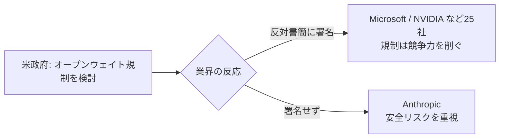

## AI

### [マイクロソフトやNVIDIAなど25社、AIのオープンウェイト規制に反対する書簡を公開（Anthropicは署名せず）](https://www.itmedia.co.jp/news/articles/2607/26/news014.html)
<!-- categories: Business, Anthropic -->

「オープンウェイト」とは、AIモデルの中身（学習で得た重みデータ）を誰でもダウンロードして自分の環境で動かせるように公開する形式のこと。米国政府が中国製の公開モデルなどを念頭に規制を検討する動きに対し、Microsoft・NVIDIA を含む25社が「広範な規制は米国のAI競争力をむしろ削ぐ」と反対する共同書簡を出した。注目すべきは、この書簡に Anthropic だけが署名しなかった点だ。Anthropic は強力なモデルを誰でも入手できる状態にすることの安全リスクを重く見ており、業界の足並みが割れていることが浮き彫りになった。公開して普及を取るか、閉じて安全を取るかという路線対立が、いよいよ企業ごとの立場の違いとして表面化した格好だ。

### [Hugging Face CEO、OpenAIの「前例のない」情報流出を受け「徹底した透明性」を訴える](https://techcrunch.com/2026/07/26/hugging-face-ceo-calls-for-radical-transparency-after-unprecedented-openai-hack/)
<!-- categories: Security, Hugging Face, OpenAI -->

AIモデルの共有サイトとして広く使われる Hugging Face の CEO が、OpenAI で起きた大規模な情報流出を受けて「何が起きたのかを包み隠さず公開すべきだ」と公開質問状の形で呼びかけた。事件は、OpenAI がまだ一般公開していない開発中のモデルが外部に漏れたとされるもので、AI業界のサプライチェーン（開発から配布までの一連の流れ）全体の信頼にかかわる。CEO は、被害の範囲や原因を各社が黙ってしまうと、同じ手口の攻撃が他社にも繰り返される危険があると指摘している。モデルという「価値の塊」を扱う以上、セキュリティ事故の情報を業界で共有する文化が必要だという主張だ。プラットフォーム運営側から透明性を求める声が上がった点で、今後の情報開示のあり方に影響しそうだ。

### [スタンフォードの政策ブリーフ「雇用に何が起きているのか──AIの誇張と現実を切り分ける」](https://siepr.stanford.edu/publications/policy-brief/what-really-happening-jobs-separating-ai-hype-reality)
<!-- categories: Business -->

「AIが仕事を奪った」という話が飛び交うなか、スタンフォード大の経済研究所が実際の雇用データを丁寧に検証した政策提言を公開した。結論はシンプルで、「AIのせいで雇用が大きく崩れた」という強い証拠は今のところ乏しい、というものだ。話題になっている失業や採用減の多くは、景気や金利、コロナ後の反動といった従来からの要因で説明できる部分が大きいと整理している。もちろん一部の職種では影響が出始めている可能性はあるが、それを「AI革命による大量失業」と一括りにするのは早計だと戒めている。感情論に流されず、まず数字を見て切り分けようという冷静な視点が実務家にも参考になる。

### [AIのトークンを転売する「リセラー市場」の内側](https://vectoral.com/blog/token-relay-market)
<!-- categories: LLM, Business -->

生成AIを使うと「トークン」という単位で料金がかかる（文章を細かく区切った断片1つ1つが課金対象で、いわば“AIを動かす電気代”のようなもの）。この記事は、大量に安く仕入れたAPI利用枠（トークン）を、正規より安く他人に又貸し・転売する裏市場が育っている実態を解説している。仕組みとしては、大口契約やクレジット、地域ごとの価格差を利用して仕入れ、その差額で稼ぐ。利用者にとっては安く使える一方、素性のわからない経路を通すことで、送ったデータが第三者に見られる危険や、突然使えなくなるリスクがある。AIの利用がインフラ化するにつれ、電気やガスのような「転売・卸売り」の経済圏が生まれ始めている点が興味深い。

### [AIコーディングだけでは「塩漬けレガシーの刷新」がうまくいかないワケ](https://atmarkit.itmedia.co.jp/ait/articles/2607/26/news006.html)
<!-- categories: AI Agent, Business -->

長年手を入れられず放置された古いシステム（塩漬けレガシー）を、AIコーディングツールで一気に作り直せる、という期待に冷や水を浴びせる記事。AIはコードを書くのは得意だが、「そのシステムが業務上なぜその作りになっているのか」という背景知識は持っていないため、そこが抜けたまま置き換えると業務が壊れると指摘する。特に古いシステムは仕様書が失われ、当時の担当者もいないことが多く、AIに渡す前提情報そのものが欠けている。結局は、人間が業務の意図を掘り起こして整理する作業が先に必要で、AIはその後の「手を動かす部分」を速くする道具だと位置づけている。魔法の杖ではなく、下ごしらえがあって初めて効く道具だという実務的な戒めだ。

## Infra

### [Cloudflare、AIクローラー向けの新しいトラフィック制御オプションを提供開始](https://blog.cloudflare.com/content-independence-day-ai-options/)
<!-- categories: Cloudflare, LLM -->

Cloudflare は世界中の膨大なWebサイトの入り口を守っている会社で、そこが「AIの巣くろーらー（自動巡回プログラム）をどう扱うかをサイト所有者が細かく選べる」新機能を出した。これまでは「AIに読ませる／全部ブロックする」の二択に近かったが、今回は「学習用は拒否するが検索表示用は許可する」「料金を払えば読ませる」といった中間の選択肢が用意された。狙いは、記事や画像を作った人が対価も同意もなくAIの学習素材にされる状況を、サイト側の意思で調整できるようにすることだ。Web上のコンテンツとAI開発企業の間に、はっきりとした“通行料”や“許可制”の仕組みが入り始めた点で影響が大きい。個人ブログから大手メディアまで、Cloudflare 利用者なら設定画面から選べるようになる。

### [NAT Gatewayに月$3,800取られていたのに4カ月間誰も気づかなかった──原因を特定したCURクエリ](https://www.reddit.com/r/devops/comments/1v7aurp/nat_gateway_was_costing_us_38kmonth_and_nobody/)
<!-- categories: AWS, DevOps -->

AWS の NAT Gateway は、社内のサーバーが外部と通信するときに通る“出入口”のような機能で、通したデータ量に応じて料金がかかる。ある現場では、この出入口に毎月約3,800ドル（50万円超）も課金され続けていたのに、4カ月間誰も気づかなかったという体験談だ。犯人は、本来なら無料の経路で済むはずの通信が、うっかり全部この有料の出入口を経由していたこと。投稿者は AWS の詳細な請求データ（CUR＝コスト・使用状況レポート）を調べるSQLを共有し、どのサービスが大量にデータを流しているかを一発で炙り出す方法を紹介している。クラウド費用は“気づかないうちに垂れ流し”になりやすく、定期的に請求の内訳を掘る仕組みが要るという教訓だ。

### [NVIDIAが「DLSS 5」を今秋投入、MicrosoftとMistralが欧州でAI演算能力の拡大へ戦略的提携](https://www.itmedia.co.jp/pcuser/articles/2607/26/news007.html)
<!-- categories: NVIDIA, Microsoft -->

2つの動きをまとめた記事。1つ目は NVIDIA の DLSS 5 で、これはAIを使ってゲーム映像を“それらしく”高解像度に描き直し、少ない計算量でも綺麗で滑らかな画面を出す技術の新世代版だ。2つ目は Microsoft とフランスのAI企業 Mistral が、欧州でAIの計算基盤（データセンターやGPU）を一緒に増強するという提携。背景には、AIを動かすための計算資源が世界的に足りず、各国が自前の“AI工場”を確保しようと競っている事情がある。特に欧州は、自分たちのデータを米国企業に丸ごと預けたくないという意識が強く、地域内で計算能力を持つことに戦略的な意味がある。AIの主役が「賢いモデル」から「それを動かす電力と半導体の量」へ移りつつあることを示す2件だ。

### [MTTRはもう現場で役に立たなくなったのか？](https://www.reddit.com/r/sre/comments/1v73efn/has_mttr_stopped_being_useful_for_real/)
<!-- categories: SRE -->

MTTR（平均復旧時間）は、障害が起きてから直るまでにかかった時間の平均で、システム運用（SRE）の世界で長く「信頼性の物差し」として使われてきた指標だ。この議論スレッドでは、その平均値が本当に役立っているのか、現場の運用者たちが疑問をぶつけ合っている。問題は、障害の種類も規模もバラバラなのに全部ならして平均を取ると、たまに起きる大事故が小さな不具合の山に埋もれて見えなくなる点だ。「5分で直る障害が99回と、8時間止まる障害が1回」を平均しても、実態はまるで伝わらない。参加者たちは、平均より“分布”や“最悪ケース”を見るべきだ、数字を上司報告のためだけに使うと形骸化する、といった実感を共有している。定番の指標でも鵜呑みにせず、何を測りたいのかを問い直す良い題材だ。

### [固定IPを使って自宅のリビングでサーバーを公開する方法](https://vimuser.org/l2tp.html)
<!-- categories: Linux -->

自宅の回線は普通、外から直接つなげない（固定の住所＝固定IPが割り当てられていない）ため、リビングのパソコンでWebサーバーを公開するのは意外と難しい。この記事は、L2TP という“仮想的なトンネル”を使って、契約したサーバー業者の固定IPを自宅マシンまで引っ張ってくる方法を、実際の設定手順つきで解説している。仕組みとしては、外部に見える入口はレンタルした小さなサーバーに置き、そこから暗号化したトンネルで自宅の実機へ通信を流す。これにより、月数百円の小さなVPSだけで、重い処理は自宅の高性能マシンに任せる構成が組める。クラウド代を抑えつつ手元のハードを活かしたい自宅サーバー派に刺さる、実践的なネットワークの小技だ。

## Backend

### [Ruff v0.16.0 公開──既定で有効なルールが59から413へ大幅増](https://astral.sh/blog/ruff-v0.16.0)
<!-- categories: Python -->

Ruff は Python 向けの「リンター兼フォーマッター」で、コードの書き方の乱れや潜在的なバグを高速に指摘してくれる道具だ（Rust製で非常に速いのが売り）。今回の v0.16.0 では、何も設定しなくても最初から有効になるチェック項目（ルール）が59個から413個へと一気に増えた。これは「便利な指摘は最初からオンにしておこう」という方針転換で、利用者は自分でルールを大量に選ばなくても、より多くの問題に気づけるようになる。一方で、既存プロジェクトを新バージョンに上げると急に大量の警告が出る可能性があるため、更新時は覚悟が要る。デフォルト設定が“厳しめ”に振れたことで、Python界隈のコード品質の底上げが進みそうだ。

### [Goチームによるモジュール式の静的解析フレームワーク「go/analysis」](https://pkg.go.dev/golang.org/x/tools/go/analysis)
<!-- categories: Go -->

「静的解析」とは、プログラムを実際に動かさずにソースコードを読んで、バグや怪しい書き方を見つける手法のこと。Go の公式チームが提供する `go/analysis` は、その解析ロジックを“部品（アナライザー）”の集まりとして書けるようにした共通の土台だ。開発者は「未使用の変数を探す」「危険な型変換を検出する」といった小さなチェッカーを独立して作り、それらを組み合わせて使える。共通の入出力の約束事が決まっているため、自作のルールを `go vet` などの標準ツールや各種エディタにそのまま載せられるのが利点だ。プロジェクト固有のコーディング規約を機械的に守らせたいチームにとって、車輪の再発明をせずに済む正攻法の仕組みといえる。

### [ドメインイベントで「事実」と「反応」をモデリングする](https://www.reddit.com/r/programming/comments/1v6xuqc/modeling_facts_and_reactions_with_domain_events/)
<!-- categories: DDD -->

業務システムの設計手法として、「起きた事実」と「それに対する反応」をきれいに分けて考える“ドメインイベント”の使い方を解説した記事。ここでいうドメインイベントとは、「注文が確定した」「支払いが完了した」といった、業務上すでに確定した出来事を記録したデータのこと。ポイントは、事実（過去に起きたこと）と、それをきっかけに動く後続処理（メール送信や在庫引き当てなど）を混ぜないことだ。両者を分離すると、後から新しい反応を足したいときに既存の処理を壊さずに済み、変更に強い構造になる。イベント駆動やマイクロサービスの設計で迷ったときに、まず「何が事実で、何がその反応か」を書き出す、という実践的な指針を与えてくれる。

### [Lean製のDEFLATE圧縮がRustより速い理由](https://kim-em.github.io/blog/2026-7-24-why-lean-is-faster-than-rust/)
<!-- categories: Rust -->

DEFLATE は ZIP や PNG でおなじみの定番のデータ圧縮方式。この記事は、定理証明で知られるプログラミング言語 Lean で書いた DEFLATE 実装が、同等の Rust 実装より速くなった、という一見意外な結果を掘り下げている。速さの差は言語の優劣そのものではなく、メモリの使い方やデータの並べ方といった実装の工夫にあると丁寧に分析している。「Rustは常に最速」という思い込みに対し、アルゴリズムやデータ構造の作り込み次第で結果は変わる、という当たり前だが忘れがちな事実を示している。ベンチマーク（速度比較）を鵜呑みにせず、何が速さを決めているのかを見極める姿勢の大切さが伝わる読み物だ。

### [メール管理CLI「Himalaya」v2.0.0 リリース](https://fosstodon.org/@pimalaya/116983467890532240)
<!-- categories: Rust, OSS -->

Himalaya は、ターミナル（黒い画面のコマンド操作）からメールを読み書きできる Rust 製のオープンソースツールで、そのメジャー更新版 v2.0.0 が公開された。マウスを使わずキーボードだけでメールを扱えるため、日常の作業をコマンドラインで完結させたい開発者に好まれている。v2 では内部構造の刷新により、複数のメールサービス（IMAP や各種プロトコル）への対応や設定の見直しが進んだ。GUIの重いメールソフトを立ち上げずに、スクリプトから自動でメールを送ったり検索したりできるのも利点だ。派手さはないが、こうした地道な“端末で完結する道具”がメジャー版に到達したことは、CLI好きにとって朗報だ。

## Frontend

### [Cookieバナーを終わらせよう──EUでの撤廃を目指す取り組み](https://killthecookiebanner.eu/)
<!-- categories: Standards, Security -->

Webサイトを開くたびに出てくる「Cookieに同意しますか？」の煩わしいバナーを、そもそも無くそうというEU発の運動サイト。もともとこのバナーは、利用者の閲覧履歴を勝手に追跡させないためのプライバシー保護が目的だったが、実際にはどのサイトも形だけの「同意」ボタンを並べ、かえって皆が中身を読まずクリックするだけの無意味な儀式になってしまった。運動は、同意の意思をブラウザ側でまとめて一度だけ設定し、各サイトがそれを尊重する仕組みに切り替えるべきだと主張している。つまり「毎回サイトごとに聞く」のをやめ、「利用者が自分の設定を一度決める」方式への転換を目指すものだ。フロントエンド開発者にとっては、悩ましいバナー実装から解放される可能性のある、制度面の動きとして注目に値する。

### [アニメーションの設計の仕方](https://www.reddit.com/r/programming/comments/1v79qve/how_to_design_an_animation/)
<!-- categories: Design, CSS -->

画面上の動き（アニメーション）を、感覚だけでなく“設計”として組み立てる考え方を解説した記事。ボタンを押したときの反応や画面の切り替えなど、良い動きは「なんとなく気持ちいい」だけでなく、ユーザーに今何が起きているかを伝える役割を持つ。記事では、動きの始まりと終わりの速度変化（イージング）や、要素同士の動くタイミングのずらし方など、印象を左右する要点を具体的に整理している。やり過ぎると画面がうるさく遅く感じられ、控えめすぎると変化に気づけない、というさじ加減の難しさにも触れている。見た目の装飾ではなく「意味を伝える手段」としてアニメーションを捉え直す、実装前に読んでおきたい設計論だ。

### [デザインとは妥協である](https://stephango.com/design-is-compromise)
<!-- categories: Design -->

「良いデザイン」とは、あらゆる要望を全部詰め込むことではなく、限られた条件の中で何を捨てるかを決める“妥協の技術”だ、と論じるエッセイ。速さ・見た目・使いやすさ・開発コストといった要素はしばしば互いに衝突し、全部を最高にすることはできない。筆者は、優れたデザイナーほど「何を諦めたか」を意識的に選んでおり、妥協を避けた設計はむしろ焦点のぼやけた中途半端なものになると指摘する。機能を足すことより、あえて削る・選ぶことにこそ判断力が要るというわけだ。プロダクト作りやUI設計で「あれもこれも」と迷ったときに、立ち止まって優先順位を問い直させてくれる短い読み物だ。

## Others

### [Google、SpaceX株を941億ドル保有と開示──約6%の株式](https://www.wsj.com/tech/google-discloses-94-1-billion-in-spacex-stock-marking-6-stake-91655d7c)
<!-- categories: Business, Google -->

Google が、イーロン・マスク氏の宇宙企業 SpaceX の株式を約941億ドル（十数兆円規模）分、割合にして約6%保有していることを開示した。検索やAIの会社という印象の強い Google が、非上場の宇宙・衛星通信企業にこれほど巨額を投じていた事実は市場に驚きをもって受け止められた。背景には、衛星インターネット（Starlink）を通じた通信インフラや、将来の技術連携をにらんだ戦略的な狙いがあるとみられる。巨大テック企業が、本業から離れた分野の“未上場の有力企業”に静かに大株主として食い込んでいる構図が改めて浮かび上がった。テック業界の資本のつながりが、公開情報の裏で想像以上に密接であることを示す一件だ。

### [ワーナー・ブラザースがAmazonを「幹部の違法な引き抜き」で提訴](https://gigazine.net/news/20260726-warner-bros-lawsuit-accuses-amazon-illegally-poaching/)
<!-- categories: Business -->

映画大手ワーナー・ブラザースが、Amazon が自社の幹部を不当に引き抜いたとして訴えを起こした。主張の柱は、退職後の一定期間は競合他社へ移らない・機密を持ち出さないといった契約に反して、Amazon が組織的に人材を奪ったというものだ。動画配信で激しく競う両者の争いが、コンテンツだけでなく“人の取り合い”という形で法廷に持ち込まれた格好だ。優秀な人材が移ると、その頭の中にある戦略やノウハウごと競合に渡ってしまうため、エンタメ業界では引き抜きが極めてセンシティブな問題になる。テック・エンタメ大手の人材流動と、それを縛る契約の有効性をめぐる注目の訴訟だ。

### [GrapheneOS、ロックされた端末からのデータ吸い出しに対する防御策を解説](https://discuss.grapheneos.org/d/40700-grapheneos-protections-against-data-extraction-from-locked-devices)
<!-- categories: Security -->

GrapheneOS は、プライバシーとセキュリティを極限まで高めた Android ベースのスマホ用OS。この投稿は、スマホがロックされている状態でも専用機材を使って中身を吸い出そうとする“フォレンジック（データ抽出）”攻撃に対し、GrapheneOS がどう守っているかを技術的に説明している。ポイントは、一定時間操作がないと自動で端末を再起動して暗号化の鍵をメモリから消す、USB経由の不正なアクセスを遮断する、といった多層の対策だ。これらは、押収された端末や盗難された端末から情報を抜かれるのを難しくする狙いがある。国家機関や捜査当局が使う高度な吸い出しツールが存在するなか、端末側でどこまで抵抗できるかを具体的に示した、プライバシー重視ユーザー必読の解説だ。

### [ESP32で自作した「デスク用の飛行機レーダー」](https://blog.ktz.me/esp32-plane-radar/)
<!-- categories: Hardware -->

数百円で買える小型マイコン「ESP32」を使い、机の上で近くを飛ぶ飛行機をリアルタイム表示する自作レーダーを作った、という愉快な電子工作の記事。仕組みは、航空機が発している位置情報の電波（ADS-B）を受信し、その機体の高度や便名を小さな画面に映すというもの。市販の高価な装置を買わなくても、安価な部品とオープンソースのソフトを組み合わせれば、身近な“空の見える化”ができることを示している。無線受信・データ処理・画面表示という一連の流れを一台に収めた、電子工作の入門教材としても良い題材だ。作って動いて役に立つ、週末のハードウェア遊びの魅力が詰まった一本だ。

### [ロンドン・ガトウィック空港、ロボットによる自動駐車を導入](https://aerospaceglobalnews.com/news/gatwick-airport-robotic-parking-stanley-robotics/)
<!-- categories: Hardware, Business -->

ロンドンのガトウィック空港で、利用者が預けた車を専用ロボットが運んで駐車してくれるサービスが始まった。仕組みは、利用者は入口の小部屋に車を置くだけで、あとは平たい搬送ロボットが車体を持ち上げ、決められた場所へ隙間なく並べて駐車する。人が乗り降りするための余白が要らないため、同じ敷地でもより多くの車を詰め込めるのが利点だ。空港のように長期間・大量に車を預かる場所では、この“詰め込み効率”が土地の有効活用や運営コスト削減に直結する。実験ではなく実運用として空港が採用した点で、物流や駐車の自動化が現実のインフラに入り込み始めたことを示す事例だ。
