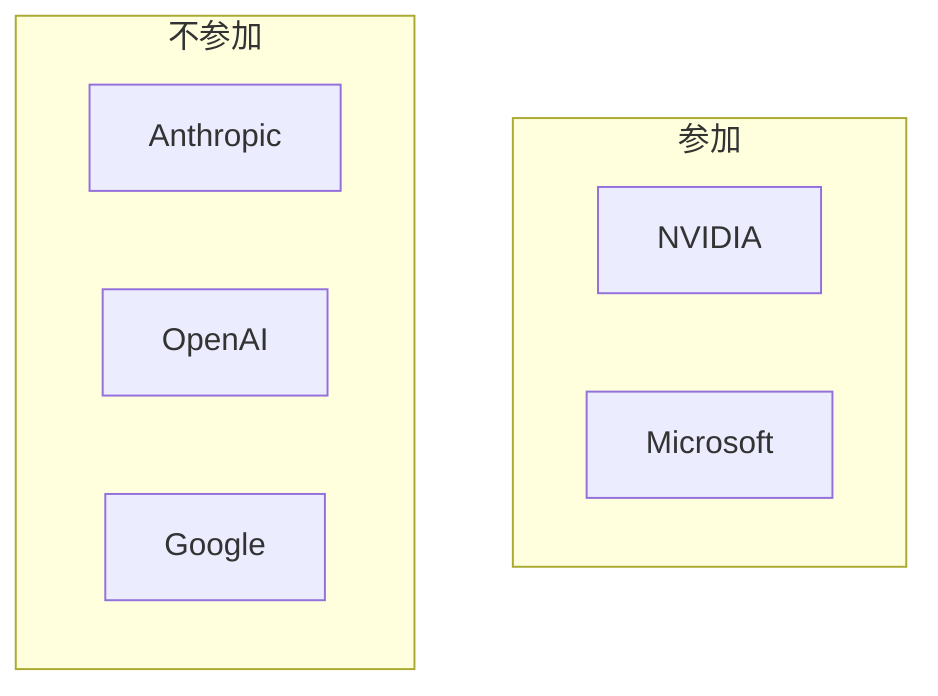

## AI

### [中国製の高性能AI「Kimi-K3」が予定通りオープンモデル化](https://gigazine.net/news/20260728-kimi-k3-open/)
<!-- categories: LLM -->

中国の Moonshot AI が開発した大規模言語モデル「Kimi-K3」が、モデルの中身（重み＝AIの頭脳にあたる数値の集まり）ごと誰でも使える形で公開された。規模は2.8兆パラメーターと巨大で、性能は最上位の商用AI（Claude Fable 5 や GPT-5.6 Sol）に迫るとされる。誰でもダウンロードして自分の環境で動かせるため、「AIを外部サービスに頼らず自前で持てる」時代がさらに進んだことになる。日本でも「NVIDIA B300 を8枚積んだ1台のサーバーで動かせるか」といった検証がさっそく行われている。無料で強力なモデルが出るたびに、商用AIとの値段・性能の綱引きが激しくなる。

### [Google Cloud、脆弱性の発見から修正までAIが自動実行する「CodeMender」を公開](https://www.publickey1.jp/blog/26/google_cloudaicodemender.html)
<!-- categories: Google, Security -->

プログラムの「穴」（脆弱性＝攻撃者に悪用されうる欠陥）を、AIが自分で見つけ、安全な隔離環境（サンドボックス＝本番に影響しない実験部屋）で「本当に危ないのか」を確かめ、直すところまで一気通貫でこなす仕組みがプレビュー公開された。従来は人間のセキュリティ担当が手作業でやっていた工程を、AIが回す。

ポイントは、AIが「直しました」と言うだけでなく、隔離環境で実際に攻撃を再現して裏を取る点だ。誤検知（実際には問題ないのに危険と判断すること）を減らせるため、AIの提案を人がそのまま信じやすくなる。守る側の作業量が一気に減る可能性がある。

### [AMDが自社GPUで学習した独自AIモデル「Instella-MoE」を公開](https://gigazine.net/news/20260728-amd-instella-moe/)
<!-- categories: AMD, LLM -->

GPU（AIの計算を担う専用チップ）大手のAMDが、他社製ではなく自社のGPUだけで訓練したAIモデル「Instella-MoE」を公開した。GoogleのGemma-4-E4Bより高性能な小型モデルだといい、「AMDのチップでもAIの学習が実用レベルで回る」ことを自ら証明した形になる。AIの学習市場はこれまでNVIDIAのGPUがほぼ独占してきたため、AMDが「うちのチップでもここまでできる」と示す意味は大きい。MoE（混合エキスパート＝質問ごとに得意な部品だけを働かせて計算量を節約する方式）を採用し、小さいのに賢い設計になっている。選択肢が増えれば、AIを動かすためのハード費用の高止まりに歯止めがかかる可能性がある。

### [NVIDIA・Microsoftらが「Open Secure AI Alliance」を設立、Anthropic・OpenAI・Googleは不参加](https://gigazine.net/news/20260728-nvidia-open-secure-ai-alliance/)
<!-- categories: Security, Business -->

AIの安全性とサイバーセキュリティを底上げするための業界団体「Open Secure AI Alliance」が、NVIDIAやMicrosoftなどを中心に発足した。一方で、AI開発の最前線にいるAnthropic・OpenAI・Googleはそろって参加を見送った。同じ「AIを安全にしよう」という目標でも、主導権を誰が握るか・どんなルールにするかで各社の思惑が割れていることが表面化した格好だ。

ルール作りは、決めた側に有利になりやすい。だからこそ主要プレイヤーがどの陣営に付くかは、今後のAI業界の力関係を占ううえで見逃せない動きだ。

### [公開1週間、「おバカ回答」が話題だったGemini 3.6 Flashを再検証](https://www.itmedia.co.jp/news/article/2607/28/2000000229/)
<!-- categories: LLM, Google -->

公開直後に「痺れるほどミスを繰り返す」と酷評されたGoogleの軽量AI「Gemini 3.6 Flash」を、1週間経った今もう一度試してみた検証記事。AIモデルは公開後も裏側で調整（チューニング）が続くことが多く、最初の評判が数日で覆ることも珍しくない。記事は当初のおかしな回答が改善されたのかを具体例で確かめており、「出たばかりの評判だけで判断すると足をすくわれる」ことを示している。実務でAIを選ぶときは、リリース直後のSNSの声より、少し時間をおいた実測のほうが当てになるという教訓でもある。無料級の軽量モデルは使う場面が多いだけに、地味だが役立つ検証だ。

## Infra

### [巨大な米電力網、停電回避のためデータセンターへ一時的な電力カットの可能性](https://techcrunch.com/2026/07/28/data-centers-may-face-temporary-power-cuts-to-prevent-blackouts-on-largest-us-grid/)
<!-- categories: Datacenter -->

米国最大級の電力網を運用する事業者が、大規模停電（ブラックアウト）を防ぐため、いざというときにデータセンターへの電力供給を一時的に絞る仕組みを検討していると報じられた。AIブームでデータセンターの電力消費が急増し、家庭や他の産業と電気を奪い合う構図になりつつある。つまり「AIを動かす計算力」が、これまで当たり前だった「電気はいくらでも使える」という前提を揺さぶり始めている。電力を止められれば当然サービスも止まるため、AI企業にとって電源の確保は最重要の経営課題になってきた。今後は「どこにデータセンターを建てるか」が、土地や回線より先に「電気が足りる場所か」で決まっていく可能性がある。

### [Cloudflare、2026年第2四半期の大規模インターネット障害をまとめた報告](https://blog.cloudflare.com/q2-2026-internet-disruption-summary/)
<!-- categories: Cloudflare, Incident -->

インターネットの通り道を支えるCloudflareが、2026年4〜6月に世界で起きた大きな通信障害をまとめて公開した。原因は自然災害から政府による意図的な遮断（特定地域でネットを止める措置）まで幅広い。ふだん意識しないが、インターネットは「どこかが切れれば別の道に迂回する」仕組みで成り立っており、その迂回がどこで起き、どれだけ影響したかを実データで見せてくれるのがこの報告の価値だ。地震などの災害でも通信は真っ先に影響を受けるため、日本の読者にとっても他人事ではない。自社サービスがどの地域のネット事情に依存しているかを見直すきっかけになる。

### [Recursive Superintelligence、Amazonと4.1億ドルの計算資源契約](https://techcrunch.com/2026/07/28/recursive-superintelligence-signs-400-compute-deal-with-amazon/)
<!-- categories: Datacenter, Business -->

AI企業のRecursive Superintelligenceが、Amazonと4.1億ドル（約600億円規模）の計算資源（AIの学習・運用に使うサーバー群）契約を結んだ。AIを鍛えるには膨大な計算力が要り、それを自前でそろえるより、クラウド大手から大量にまとめ借りする流れが定着しつつある。こうした巨額の「計算力の先物買い」が相次ぐことで、AI企業とクラウド事業者・チップメーカーが互いに依存し合う巨大なお金の循環ができている。裏を返せば、AIの実力は「どれだけ計算力を押さえたか」という資金力の勝負にもなっているということだ。契約額の大きさは、AI開発が個人や小さな研究室では追いつけない規模に膨らんでいることを物語る。

### [Amazon、スマホと直接つながる衛星5105基をFCCに申請](https://www.itmedia.co.jp/news/articles/2607/28/news061.html)
<!-- categories: Hardware, Business -->

Amazonが、既存の携帯電話とそのまま通信できる人工衛星を最大5105基打ち上げる計画を、米通信当局（FCC）に申請した。地上の基地局が届かない山間部や海上・被災地でも、特別な機器なしにスマホがつながる世界を狙う。これはSpaceXの「Starlink」などと真っ向からぶつかる分野で、「空からの通信網」の主導権争いが激しくなってきた。通信インフラが地上の電波塔から宇宙へ広がれば、災害時の「圏外で連絡が取れない」問題も和らぐ可能性がある。2028年の配備を目指しており、実現すれば通信のあり方を大きく変えうる。

### [DGX Sparkと同等のAI性能を激安で、独自プロセッサで100BのLLMを走らせるミニPC](https://pc.watch.impress.co.jp/docs/news/2128607.html)
<!-- categories: Hardware -->

NVIDIAの小型AI開発機「DGX Spark」に匹敵するAI性能を、独自プロセッサを積むことで大幅に安く実現したというミニPCが登場した。1000億パラメーター級（100B）の大きめのLLMを、机の上に置ける小さな箱で動かせるという。これまで巨大なモデルを動かすには高価なGPUを何枚も積んだ大型機が必要だったが、そのハードルが下がりつつある。データを外部のクラウドに送らず手元だけで完結できるため、情報漏れの心配が少なく、費用も月額課金ではなく買い切りで済む。個人開発者や中小企業が「自前のAI」を持つ選択肢が、現実味を帯びてきた。

## Backend

### [PostgreSQLの内部動作をシムシティ風の3Dで見られる「PGSimCity」](https://gigazine.net/news/20260728-pgsimcity-postgresql/)
<!-- categories: PostgreSQL -->

広く使われているデータベース「PostgreSQL」が、内部で実際にどうデータを出し入れしているのかを、街づくりゲーム「シムシティ」のような3Dの街として見られるツール「PGSimCity」が公開された。データの読み書き・キャッシュ（よく使うデータを手元に置いて高速化する仕組み）・ディスクへの書き出しといった処理が、建物や道を行き交う様子として可視化される。データベースの中身は普段まったく目に見えないため、初心者が「なぜ遅いのか」「何が起きているのか」を直感的につかむのが難しかった。それをゲーム画面のように眺められるのは、学習教材として非常に強力だ。仕組みを絵で理解できると、性能改善の勘所も見えやすくなる。

### [Zigの増分コンパイルの内部実装](https://mlugg.co.uk/posts/incremental-compilation-internals/)
<!-- categories: Zig -->

プログラミング言語Zigが、ソースコードを実行ファイルに変換する「コンパイル」を高速にやり直す仕組み（増分コンパイル＝変更した部分だけを作り直す方式）の内部実装を解説した記事。ふつうは1文字直すだけでも全体を作り直すため待ち時間が長いが、「どこが変わったか」を賢く追跡すれば、変わった部分だけ作り直して待ち時間を大幅に減らせる。開発中は何百回もコンパイルするため、この数秒の短縮が積み重なると生産性に効いてくる。記事は「変更をどう追跡し、どこまで作り直せば安全か」という難所を具体的に説明している。言語処理系を作る人だけでなく、ビルドの速さがなぜ大事かを知りたい人にも参考になる。

### [Raft実装のバグを見つける](https://www.reddit.com/r/programming/comments/1v90kmd/finding_bugs_in_raft_implementations/)
<!-- categories: Distributed Systems -->

複数のサーバーで「同じ内容」を保ち続けるための合意アルゴリズム「Raft」の実装に潜むバグを、どうやって見つけたかを解説した記事。Raftは、1台が壊れても残りで正しく動き続けるための「多数決で合意を取る」仕組みで、分散システムの根幹に使われる。ただ理屈は正しくても実装は複雑で、めったに起きない順番でメッセージが届いたときだけ壊れる、といった見つけにくいバグが紛れ込みやすい。記事では、あえて意地悪な状況（通信の遅延・順番の入れ替え・障害）を大量に作り出して弱点をあぶり出す手法を紹介している。データの一貫性が命の場面では、こうした地道な検証が信頼性を支えている。

### [GPUのコンピュートシェーダーでJSONを並列にパースする「slurpjson」](https://github.com/friendlymatthew/slurpjson)
<!-- categories: GPU -->

データ交換で広く使われる「JSON」という形式を、GPU（本来は画像処理用の、大量の計算を同時にこなせるチップ）を使って一気に読み解く実験的なライブラリ「slurpjson」。ふつうJSONの解析はCPUが先頭から順番に文字を追うが、これをGPUの「一度に何千個も並列で計算する」得意技に載せ替えて高速化を狙う。文章を頭から1文字ずつ読む処理は本来「順番待ち」が発生しやすく並列化が難しいため、それをGPU向けに工夫した点が技術的な見どころだ。巨大なデータを大量にさばく場面では、こうした発想の転換が処理時間を大きく縮める。定番の処理でも「別のハードに載せ替える」と景色が変わる好例だ。

### [結局マイクロサービスとは何なのか](https://var0.xyz/posts/what-even-are-microservices.html)
<!-- categories: DevOps -->

「マイクロサービス」（大きなアプリを、小さな独立した部品＝サービスに分けて作る設計）という言葉の意味を、あらためて整理し直した記事。人によって指すものがバラバラで、「小さく分ければマイクロサービス」と思われがちだが、本当の勘所は分け方ではなく「各部品が独立して開発・デプロイ・障害対応できるか」にある、と論じる。むやみに細かく分けると、部品同士の連絡が増えて逆に複雑で遅くなる（分けたことによる新たな苦しみ）ことも指摘している。流行り言葉に飛びつく前に「なぜ分けるのか」を問い直させてくれる。設計に唯一の正解はなく、規模やチーム体制に応じて選ぶべきだと気づかせる内容だ。

## Frontend

### [Firefoxの丸みを帯びた新デザインがNightlyで体験可能に](https://gigazine.net/news/20260728-new-firefox-design/)
<!-- categories: Firefox, Browser -->

WebブラウザFirefoxの、角の丸い柔らかな印象の新デザインが、開発版の「Nightly」（一般公開前の実験版）で試せるようになった。タブやツールバーの見た目が刷新され、より現代的な雰囲気になっている。ブラウザは毎日使う道具だけに、見た目の変化はユーザー体験に直結する。新デザインをいきなり全員に配るのではなく、まず実験版で希望者に試してもらってから広げる、という慎重な進め方も特徴だ。気になる人はNightlyを入れれば一足先に触れられる。

### [Google Play、2026年8月31日までにAndroid 16対応を必須化（React Native移行ガイド）](https://dev.to/dainyjose/google-play-requires-android-16-api-level-36-by-august-31-2026-react-native-migration-guide-1d51)
<!-- categories: React -->

Googleのアプリ配信ストア「Google Play」が、2026年8月31日までにアプリをAndroid 16（API レベル36）対応にするよう義務付けた。期限までに対応しないと、アプリの更新が受け付けられなくなる恐れがある。この記事は、スマホアプリを一つのコードで両OS向けに作れる「React Native」を使っている開発者向けに、移行の手順を具体的にまとめたものだ。多くのアプリが影響を受ける「締め切りのある強制対応」なので、該当する開発者は早めの着手が必要になる。放置すると最悪ストアから締め出されるため、実務上の優先度は高い。

### [CSSの`ch`単位と`translateX(ch)`で、拡大縮小してもきれいなローダーを実装](https://coliss.com/articles/build-websites/operation/css/animating-loaders-with-css-ch-units-and-translatex.html)
<!-- categories: CSS -->

読み込み中に表示される「ローダー」（くるくる回る印や進捗表示）を、CSSの`ch`という単位を使ってきれいに作るテクニックの紹介。`ch`は「文字1個分の幅」を表す単位で、文字を使ったアニメーションと相性がよく、画面を拡大・縮小しても崩れにくいのが利点だ。画像やJavaScriptに頼らず、CSSだけで軽く実装できるため、表示も速く保守も楽になる。ちょっとした表示だが、こうした細部の作り込みがサイトの完成度を左右する。コピーして試せる実装コード付きで、すぐ現場に取り入れられる。

### [ルーティングライブラリを自作して最新のWebルーティング事情を学ぶ](https://qiita.com/avaice/items/ee45a384eb5cea796ca1)
<!-- categories: JavaScript -->

Webアプリで「URLに応じて表示する画面を切り替える」仕組み（ルーティング）を、既存のライブラリに頼らず自分で一から作ってみた学習記事。ふだんは便利な道具として何気なく使っているが、中身を自作すると「URLの変化をどう捉え、どの画面を出すか」という裏側の仕組みが腹落ちする。記事では最新のブラウザ機能を踏まえたルーティングの考え方を、手を動かしながら解説している。仕組みを理解しておくと、既存ライブラリで問題が起きたときの原因究明が格段に速くなる。「使えるだけ」から「中身が分かる」へ一歩進みたい人に向いた内容だ。

### [Materialっぽくない見た目のFlutter向けUIキット「fossui」](https://dev.to/fossui/introducing-fossui-a-flutter-ui-kit-that-doesnt-look-like-material-nh9)
<!-- categories: Flutter -->

スマホアプリを効率よく作れる「Flutter」向けに、Google標準の「Material」デザインとは違う見た目を提供するUI部品集「fossui」が公開された。Flutterで作ったアプリは、標準部品を使うとどれも似た「Googleっぽい」見た目になりがちで、独自性を出しにくいという悩みがあった。fossuiはボタンやカードなどをあらかじめ別テイストでそろえており、差し替えるだけで雰囲気を変えられる。オープンソース（無料で中身も公開）なので、気軽に試して自分好みに手を加えられる。「作りやすさ」と「見た目の個性」を両立したい開発者に選択肢を増やす。

## Others

### [注意喚起：Claudeの共有チャットやArtifactがGoogle検索に載っていた](https://techcrunch.com/2026/07/27/psa-your-claude-shared-chats-and-artifacts-may-have-ended-up-on-google/)
<!-- categories: Anthropic, Security -->

AIチャット「Claude」で「共有」機能を使ってやり取りした内容やArtifact（生成した成果物）の一部が、Google検索にかかる状態になっていたと報じられた。共有リンクを作ると、そのページが検索エンジンに拾われ、意図せず第三者の目に触れうる状態だったということだ。便利な共有機能の裏で、「リンクを知る人だけ」のつもりが「検索すれば誰でも」になりかねない落とし穴がある。個人情報や社外秘を含むやり取りを安易に共有すると、思わぬ形で外に出てしまう危険がある。AIとの会話も立派なデータであり、共有ボタンを押す前に「これが公開されても困らないか」を一呼吸おいて考える習慣が大切だ。

### [ある企業が11億円をだまし取られた事件の調査報告書を公開、偽警察・孤立・過重労働が連鎖](https://www.itmedia.co.jp/news/article/2607/28/2000000238/)
<!-- categories: Security, Incident -->

ある企業が、約11億円が社外へ流出した事件について、原因を分析した調査報告書を公開した。手口は「偽の警察官」を名乗る相手が従業員に接触し、口外を禁じたうえで指示を出し続けるという、心理を突いた詐欺（ソーシャルエンジニアリング＝人をだまして情報や操作を引き出す攻撃）だった。背景には、月200時間を超える残業や、相談できない孤立といった職場のほころびがあり、それらが重なって被害が防げなかったと分析されている。システムの穴ではなく「人と組織の弱み」を突かれた点が、この事件の怖いところだ。最新のセキュリティ製品を入れても、追い詰められた個人が孤立していれば守り切れない、という重い教訓を残した。

### [高齢者を狙うAI音声詐欺が急増、たった3秒の音声でクローンが作られる](https://gigazine.net/news/20260728-why-ai-voice-fraud-outruns-defence/)
<!-- categories: Security -->

家族や知人の声をAIで似せて作り出し、電話で高齢者をだます「AI音声詐欺」が急増していると報じられた。恐ろしいのは、SNSの動画などから拾ったたった3秒ほどの音声があれば、本人そっくりの偽の声（音声クローン）を作れてしまう点だ。「オレオレ詐欺」が、AIによって「本物の声」で来る時代になったといえる。声だけでは本人確認にならなくなったため、電話で急にお金の話が出たら、いったん切って別の手段で確認するといった対策が欠かせない。技術の進歩が詐欺の巧妙化を先回りしている現状に、守る側が追いついていない危うさがある。

### [イーロン・マスクの決済サービス「X Money」、米国で正式スタート](https://www.itmedia.co.jp/news/article/2607/28/2000000240/)
<!-- categories: Business -->

イーロン・マスク氏が率いるXが、送金や預金をXアプリの中で完結できる決済サービス「X Money」を米国で正式に始めた。年最大6％の利回りやメタル製カードといった特典を用意し、SNSを「お金も動かす生活の中心アプリ」に育てようとする狙いがうかがえる。中国のWeChatのように「連絡もお金のやり取りも一つのアプリで」という構想（スーパーアプリ）を、Xで実現しようとしている。SNSと金融がくっつくと利便性は上がる一方、アカウントが乗っ取られたときの被害は「情報＋お金」に膨らむため、安全対策の重みも増す。まずは米国からの展開で、今後の広がりが注目される。

### [中国国営企業が半導体製造に必要なDUV露光装置の製造を開始との報道](https://gigazine.net/news/20260728-china-making-duv/)
<!-- categories: Hardware -->

中国の国営企業が、半導体（あらゆる電子機器の頭脳となるチップ）を作るのに欠かせない「DUV露光装置」（回路を微細に焼き付ける精密な製造装置）の製造を始めたと報じられた。この装置は世界でもごく一部の企業しか作れず、輸出規制の対象にもなっているため、中国が自前で作れるようになる意味は非常に大きい。半導体は「作るための装置」からして高度で、そこを外国に握られていると生産が止められるリスクがある。国産化が進めば、規制に左右されずチップを作れるようになり、米中の技術覇権争いの構図を揺るがしうる。真偽や性能はまだ見極めが必要だが、事実なら供給網（サプライチェーン）の勢力図に影響する動きだ。
