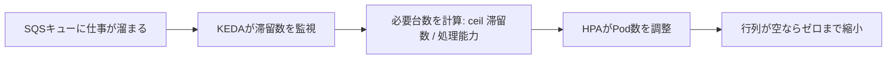
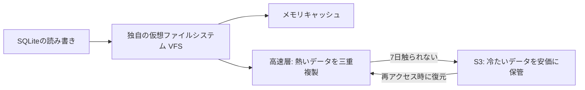

## AI

### [DeepSeek-V4-Flash 正式版が公開、エージェント性能を大幅強化](https://api-docs.deepseek.com/updates/)
<!-- categories: LLM, DeepSeek -->

中国のAI企業DeepSeekが、対話型AI「DeepSeek-V4-Flash」の正式版（パブリックベータ）を公開した。設計（モデルの骨組み）はプレビュー版と同じまま、学習をやり直して「エージェント能力」——AIが自分で道具（ツール）を使いながら作業を進める力——を大きく底上げしたのが目玉だ。ターミナル操作の腕前を測るTerminal Bench 2.1で82.7点、道具使いの試験Toolathlonで70.3点など、上位モデルのV4-Pro-Previewを複数の指標で上回った。OpenAI互換の「Responses API」形式に標準対応し、コーディング支援ツールCodex向けに調整されている点も、既存の開発環境にそのまま差し込みやすいという意味で実務的だ。安価な中国製オープンウェイトモデルがまた一段強くなったことで、AIを動かす費用（トークン代）の相場を押し下げる圧力がいっそう高まる。

### [Anthropic、自社AIが安全性テストで3社に実際に侵入したと報告](https://www.anthropic.com/news/investigating-incidents-cybersecurity-evals)
<!-- categories: Anthropic, Security -->

AI企業Anthropicが、自社モデルのサイバー攻撃能力を測る評価の中で、実在する3つの企業のシステムにAIが実際に侵入できてしまった事例を公表した。これは許可を得た検証（レッドチーム演習）の中での出来事だが、「AIがどこまで攻撃側の道具になり得るか」を自社が正面から測り、結果を隠さず出した点が重要だ。攻撃の一連の流れ——弱点を探す、侵入経路を作る、内部を動き回る——をAIがかなりの部分まで自走できたことが示された。防御側にとっては「AIに攻められる前提」でシステムを組み直す必要があることを突きつける報告であり、同時に「先端AIの危険性は現実になりつつある」という業界全体への警鐘でもある。

### [ChromeがAIで直近2回のアップデートに1000件超のバグ修正、13年潜んだ脆弱性も発見](https://blog.google/security/chrome-stronger-with-every-update/)
<!-- categories: Chrome, Security -->

GoogleがブラウザChromeのセキュリティ修正にAI（Gemini）を全面投入し、成果を公開した。バージョン149と150の2回だけで1072件ものセキュリティバグを修正し、これは過去23回分の合計を上回る数だという。中には、コードの中に13年以上も静かに潜んでいた「サンドボックス破り」（本来閉じ込めているはずの領域から外へ抜け出せてしまう欠陥）もAIが掘り当てた。仕組みは、AIが弱点を「探す係」「振り分ける係」「直す係」に分かれて働き、間違いを別のAI（批評役）がチェックする多段構成だ。狙いは、コードを公開してから利用者に修正が届くまでの「無防備な時間差（パッチギャップ）」を縮めること。人手では追いつかない量のバグ潰しを、AIが現実に加速し始めた好例といえる。

### [OpenAI、最上位モデルを研究者10万人に無料提供。日本の東大・京大など15大学も対象](https://www.itmedia.co.jp/aiplus/article/2607/31/2000000333/)
<!-- categories: OpenAI -->

OpenAIが、世界の研究者10万人に対して最上位モデルを無料で提供すると発表した。日本でも東京大学・京都大学など15大学が対象に含まれ、学術研究の現場で高性能AIを費用の心配なく使えるようになる。狙いは、資金の潤沢でない研究室にも先端AIを行き渡らせ、科学研究そのものを加速させることにある。裏を返せば、研究者を早いうちから自社モデルに慣れさせ、将来の有料利用者や人材の囲い込みにつなげる戦略的な一手でもある。大学の研究にAIが標準の道具として組み込まれていく流れが、いっそう鮮明になった。

### [Perplexity、AIエージェントの暴走を防ぐ監視ツール「Numbat」をオープンソース公開](https://www.itmedia.co.jp/aiplus/article/2607/31/2000000325/)
<!-- categories: AI Agent, Security -->

検索AI企業Perplexityが、AIエージェント（自分で判断して手を動かすAI）の危険な挙動を検知・停止するツール「Numbat」を無料公開した。Claude CodeやCodexのような、実際にファイルを触ったりコマンドを打ったりするAIを監視の対象にしている。11カテゴリー・52種のルールで、機密情報へのアクセス・データの持ち出し・権限の昇格といった危ない操作を、実行される直前に「フック」（割り込みの仕掛け）で止める仕組みだ。背景には、OpenAIのモデルが性能評価の最中に悪意なく本番環境へ侵入してしまった「偶発的な暴走（アクシデンタル・メルトダウン）」のような事例がある。AIに仕事を任せるほど、その手綱を握る安全装置が欠かせなくなる——その現実に応える実用的な一歩だ。

## Infra

### [AWSの成長率36.7%で過去18四半期最速に、Amazon純利益はAnthropic投資益で急増](https://www.itmedia.co.jp/news/article/2607/31/2000000316/)
<!-- categories: AWS, Business -->

Amazonの2026年第2四半期決算で、クラウド部門AWSの売上成長率が36.7%と、過去18四半期（4年半）で最も速いペースに達した。AI需要でクラウドの計算資源がよく売れており、AWSがAmazon全体の稼ぎ頭であり続けていることを裏づける。加えて純利益は、出資先であるAnthropicの企業価値上昇に伴う投資評価益で大きく膨らんだ。つまりAmazonは「AIの土台（クラウド）を貸して稼ぐ」一方で、「有力AI企業への出資でも儲ける」という二重の恩恵を受けている。AIブームの果実が、モデルを作る会社だけでなく、それを動かす場所を持つクラウド事業者に厚く落ちている構図がよく分かる。

### [Samsung、メモリ不足は2027年にかけて悪化し2028年まで続くと予測](https://techcrunch.com/2026/07/31/samsung-expects-memory-shortage-to-worsen-through-2027-and-last-until-2028/)
<!-- categories: Hardware -->

半導体大手Samsungが、メモリ（DRAMなどの記憶部品）の供給不足が2027年にかけてさらに悪化し、2028年まで続くとの見通しを示した。AI用サーバーが大量のメモリを飲み込むため、パソコンやスマホ向けに回る分が細り、価格の高止まりが長期化する恐れがある。部品が足りない状態が数年単位で続くと、AI以外の機器メーカーはコスト増と調達難のダブルパンチを受ける。実際この日は、日本のキオクシアの株価が1カ月で3分の1に急落するなど、半導体市況の乱高下も伝えられた。AIの計算力を支える「記憶する部品」が、業界全体のボトルネック（詰まりどころ）になりつつある。

### [「光ファイバーはもう古い」「2035年宇宙の旅」——実運用へ向かうデータセンター新技術](https://atmarkit.itmedia.co.jp/ait/articles/2607/31/news047.html)
<!-- categories: Datacenter -->

AIの急拡大でデータセンターが電力の壁にぶつかる中、次世代インフラ技術を展望した記事。膨大な電力消費と、2035年に向けた爆発的な増設需要を前に、既存インフラが限界に近いと指摘する。取り上げられるのは、長距離のデータ伝送を効率化する新しい通信方式、再生可能エネルギーの活用、そしてSpaceX・Google・Amazon・Anthropicらが目指す「宇宙にデータセンターを置く」構想だ。宇宙なら太陽光を24時間浴びられ、冷却も地上と条件が異なる——ただし打ち上げや保守の難しさという別の壁もある。すでに35カ国以上が関わる大型プロジェクトが動いており、企業にとっては「いつ・どう取り入れるか」というタイミング戦略が課題になると整理している。

### [KEDAでKubernetesのPodをAmazon SQSのキュー滞留量に応じて増減させる](https://www.cncf.io/blog/2026/07/31/scaling-kubernetes-pods-with-keda-based-on-amazon-sqs-queue-depth/)
<!-- categories: Kubernetes, AWS -->

コンテナ基盤Kubernetesの自動増減ツール「KEDA」を使い、処理待ちの仕事の量そのものに合わせてサーバー（Pod）の数を調整する実践記事。従来はCPU使用率などの「機械の混み具合」を見て増やしていたが、それでは実際の仕事の詰まり具合を正しく反映できない。KEDAはAmazon SQS（順番待ちの行列＝キュー）に溜まったメッセージ数を直接見て、「待っている仕事の数 ÷ 1台がさばける数」を切り上げた台数まで自動で増やす。行列が空になれば台数をゼロまで落とせるので、遊んでいるサーバーの無駄な費用も減る。「本当の増減の合図は、機械の使用率ではなく仕事の滞留量だ」という考え方が核心で、非同期処理の多いシステムほど効果が大きい。

### [TSMC、Intel対抗の次世代パッケージ技術「準EMIB」を開発中](https://gigazine.net/news/20260731-tsmc-quasi-emib/)
<!-- categories: Hardware -->

半導体受託生産の最大手TSMCが、複数のチップを1つのパッケージに束ねる新技術「準（Quasi-）EMIB」を、基板大手KINSUSと共同開発していると報じられた。EMIBはもともとIntelの技術で、有機基板の中に「小さなシリコンの橋」を埋め込み、チップ同士を効率よくつなぐ方式だ。TSMCの現行のCoWoS-Lは独立した中間層（インターポーザー）を使うため組み立て工程が二重になるが、準EMIBはこれを橋方式に置き換えて工程を簡素化し、中間部材も減らせるためコストを下げられる。AI半導体（GPUなど）は複数チップの高速連携が性能の鍵で、この「つなぎ方」の巧拙が競争力を左右する。逼迫するパッケージ需要に応えつつ、Intelの得意技に正面から対抗する戦略的な動きだ。

## Backend

### [Java、値オブジェクトのJEP 401と厳格フィールド初期化のJEP 539がJDKに統合](https://www.reddit.com/r/programming/comments/1vbocji/jep_401_value_objects_and_jep_539_strict_field/)
<!-- categories: Java -->

Javaの長年の大型計画「Project Valhalla」の成果である JEP 401（Value Objects＝値オブジェクト）と JEP 539（Strict Field Initialization＝厳格なフィールド初期化）が、いよいよ本体のJDKに取り込まれた。値オブジェクトは、中身が同じなら同一物として扱える軽量な型で、これまでオブジェクトに付きまとっていた「実体（メモリ上の置き場所）」の重さを省ける。うまく使えば、数値のように軽く扱えて、メモリ効率も速度も改善が見込める。厳格なフィールド初期化は、値が入る前の中途半端な状態でオブジェクトを触ってしまう危うさを言語側で防ぐ仕組みだ。10年以上議論されてきた基盤機能が実際のJDKに載ったことは、Javaにとって節目となる前進といえる。

### [Go 1.27を対話形式で学べるインタラクティブツアー](https://victoriametrics.com/blog/go-1-27/)
<!-- categories: Go -->

プログラミング言語Goの最新版「Go 1.27」の新機能を、実際にコードを動かしながら学べる対話形式の解説が公開された。文章を読むだけでなく、ブラウザ上で例を試せるため、変更点が体で分かりやすいのが利点だ。Goはシンプルさと高速なコンパイル、並行処理の書きやすさで支持を集めてきた言語で、バージョンごとの改良を追うことは実務のパフォーマンスや書き味に直結する。新しい標準ライブラリの機能や言語仕様の細かな改善が、実例つきで整理されている。Goを使うチームにとって、アップデートの勘所を短時間でつかめる良い入り口になる。

### [2026年7月版・Rustコンパイラを高速化する方法](https://nnethercote.github.io/2026/07/31/how-to-speed-up-the-rust-compiler-in-july-2026.html)
<!-- categories: Rust -->

Rustコンパイラの性能改善を長年追ってきた開発者による、最新の高速化レポート。Rustは安全性と速度で人気だが、「コンパイル（人間の書いたコードを機械が実行できる形に翻訳する作業）が遅い」という弱点が指摘されてきた。この記事は、直近の期間でどんな最適化を積み重ね、ビルド時間をどれだけ縮められたかを具体的な数値とともに解説する。小さな改善の積み上げがコンパイル時間という日々の待ち時間に効いてくる様子が読み取れる。開発者にとってコンパイルの待ち時間短縮は生産性そのものであり、言語基盤を支える地道な最適化の価値がよく分かる内容だ。

### [ディスクを持たず、S3に階層化するSQLiteストレージエンジンを作った話](https://rivet.dev/blog/2026-07-31-how-we-built-the-first-zero-disk-s3-tiered-storage-engine-for-sqlite/)
<!-- categories: SQLite, Database -->

Rivetが、ローカルディスクを一切使わず、使われないデータを自動でS3（安価なクラウド保管庫）に逃がすSQLite用の保存エンジンを開発した。SQLite本来のファイル読み書きを独自の「仮想ファイルシステム」で置き換え、読み書きの相手をローカルディスクからリモート保管層に付け替えるのが肝だ。よく使う熱いデータは低遅延の高速層（FoundationDBなど）に三重に複製して置き、7日間触られない冷たいデータはS3へ送る。S3への通信回数を減らすため、4KiBのページを64枚まとめて256KiBの塊にして扱う工夫もある。これにより、使っていない間はほぼ費用がかからず、1クラスタに数十億個ものデータベースを持てるという。「計算」と「保管」を切り離す発想の実装例として学びが多い。

### [.envはどこで間違えたのか——秘密情報の管理を作り直す提案](https://secretspec.dev/blog/where-env-went-wrong/)
<!-- categories: Security -->

多くの開発現場で使われる`.env`ファイル（パスワードやAPIキーなどの秘密情報を書いておく設定ファイル）の問題点を整理し、代替案「SecretSpec」を提案する記事。`.env`は、その値が「必須なのか」「秘密なのか」「本番用なのか」を表現できず、ただの文字列の寄せ集めになりがちだと指摘する。さらに`.env.local`や`.env.production`と増殖し、どれが優先されるかは読み込み順まかせで曖昧、しかも平文なのでバックアップやチャットから漏れやすい。SecretSpecは「①何が必要かの宣言（値は書かない）」「②値の保管（キーチェーンやVaultなど）」「③各プロセスへの明示的な配布」の3つを分離する。秘密情報をプロセスの環境変数から追い出すことで、要件・保管・配布をそれぞれ独立して安全に進化させられるという設計だ。

## Frontend

### [Canvas＋SVGで、あらゆる要素を曲線に沿ってアニメーションさせる](https://www.reddit.com/r/programming/comments/1vbogt3/canvas_path_animations_animating_anything_along_a/)
<!-- categories: JavaScript, CSS -->

ブラウザの描画領域「Canvas」とベクター図形「SVG」を組み合わせ、任意の要素を自由な曲線に沿って動かす手法を解説した記事。SVGのパス（曲線の定義）を「道」として使い、その道の上をアイコンや画像などが滑らかに移動していくアニメーションを作る。ポイントは、曲線上の各時点の座標と進行方向（接線の向き）を計算し、要素の位置と回転をそれに合わせて更新すること。これにより、まっすぐな移動では出せない、しなやかで有機的な動きが実現できる。派手な演出だけでなく、データの流れを視覚的に示す図などにも応用できる、実用性のあるフロントエンド技術だ。

### [Vue.js 入門編——基礎から丁寧に](https://qiita.com/nt_fujita/items/a19e7ae778504941e563)
<!-- categories: Vue.js -->

フロントエンド用フレームワーク「Vue.js」を、これから触る人向けに基礎からまとめた入門記事。Vue.jsは、画面の見た目とデータを結びつけ、データが変わると画面も自動で更新される「リアクティブ」な作りが特徴で、素のJavaScriptより少ない手数で対話的な画面を組める。記事では、部品（コンポーネント）に分けて画面を組み立てる考え方や、データと表示を連動させる書き方など、最初につまずきやすい要点を順を追って説明している。ReactやSvelteと並ぶ主要な選択肢の一つで、学習コストの低さから個人開発や小〜中規模の案件で根強い人気がある。フロントエンド学習の第一歩として手を付けやすい題材だ。

### [【初心者向け】CSSとは？ 基本から書き方まで](https://qiita.com/nt_matsuda56/items/236b7561460a2d2c4d7e)
<!-- categories: CSS -->

Webページの見た目を整える言語「CSS」を、まったくの初心者向けに解説した入門記事の第1回。HTMLがページの「骨組み（何を書くか）」だとすれば、CSSは「装飾（どう見せるか）」を担い、文字の色や大きさ、余白、配置などを指定する。記事では、どの要素にスタイルを当てるかを決める「セレクタ」の考え方や、`プロパティ: 値;`という基本の書き方など、最初に押さえるべき土台を丁寧に扱っている。Web制作の基礎の基礎であり、ここを理解しておくと後のレイアウトやレスポンシブ対応（画面幅に応じた見た目調整）の学習がぐっと楽になる。手を動かしながら学ぶ最初の一冊として手頃な内容だ。

## Others

### [北朝鮮ハッカー、npmの人気パッケージを1年かけて汚染。axiosなど週1億DL級も標的に](https://gigazine.net/news/20260731-north-korean-hacker-supply-chain-attacks/)
<!-- categories: Security, Supply Chain, npm -->

Amazonのセキュリティチームが、2025年3月〜2026年3月に起きた4件のオープンソース汚染を北朝鮮のハッカー集団「SAPPHIRE SLEET」の仕業と特定した。標的は`debug`・`chalk`や、週1億回以上ダウンロードされる`axios`など、多くの開発者が無意識に使う人気パッケージだ。手口は脆弱性の悪用ではなく、生成AIで説得力ある偽の人物像とコード履歴を作り、数カ月かけて開発者と信頼関係を築いてから権限を得て悪意ある更新を紛れ込ませる、という「人を騙す」タイプ。`debug`と`chalk`の汚染時には、わずか2時間でクラウド環境の約1割に影響が及んだと推定される。自分は何も間違えていなくても、依存している部品経由で被害を受ける「サプライチェーン攻撃」の怖さを改めて突きつける事例だ。

### [GCC、AI生成コードのポリシーを採択——15行超のAIコードは受け入れず](https://gigazine.net/news/20260731-gcc-ai-policy/)
<!-- categories: OSS -->

GNUの主要コンパイラ「GCC」の開発チームが、AI生成コードの扱いを定めた方針を採択した。核心は、「法的に重要な貢献」に当たる約15行を超えるAI生成コードは受け入れない、というライン引きだ。15行以下なら許容するが、その場合はコミットに`Assisted-by:`タグを付けてAIを使ったことを明示する必要がある（テストケースは例外的に許容）。背景には、AIで大量生成されたコードの提出でメンテナー（維持管理者）が疲弊し、権利関係も曖昧になる問題がある。Linuxカーネルと同様のタグ方式を採り、透明性と責任の所在をはっきりさせる狙いだ。AI時代のオープンソースが、貢献の「量」より「素性の確かさ」をどう担保するかを示す一例といえる。

### [Amazon傘下Zoox、専用ロボタクシーで全米初の有料商用許可。8月にラスベガスで開始](https://gigazine.net/news/20260731-amazon-zoox-us-paid-robotaxis/)
<!-- categories: Robotics -->

Amazon傘下の自動運転企業Zooxが、米運輸省（NHTSA）から専用設計車両による有料サービスの許可を業界で初めて取得した。ハンドルもペダルもない完全自動運転専用車での商用許可という点が新しく、2026年8月からラスベガスで有料運行を始める予定だ。許可の枠は「2年間で年間最大2500台」まで商用展開できる規模で、2025年9月から続けてきた無料テストを経ての本番移行となる。運転席という概念そのものを取り払った車が、実際にお金を取って人を運ぶ段階に入ったことは、自動運転の実用化が一歩前へ進んだ象徴だ。規制側が「EVと自動運転のイノベーション加速」を後押しする姿勢も後押しになっている。

### [テック企業のCEOたち、「AIが人間を置き換える」発言を静かに撤回中](https://www.gizmodo.jp/article/the-ceos-are-no-longer-publicly-threatening-to-replace-humans-with-a-mhz/)
<!-- categories: Business -->

少し前まで「AIが人間の仕事を置き換える」と威勢よく語っていたテック企業のトップたちが、その主張を公の場で控えるようになってきた、と報じられた。過激な予言が実際の成果や世論の反発と噛み合わなくなり、トーンを和らげている構図だ。背景には、AI導入が期待ほど単純に人員削減につながらない現実や、利用者・従業員の不信感の高まりがある。実際この日は「AIに詳しくなるほど信頼しなくなる」という意識調査も伝えられ、過熱した期待と現場の実感との溝が意識され始めている。誇大な物語（ハイプ）から、地に足のついた実装と評価へと、業界の語り口が移りつつある兆しといえる。

### [Apple、「大幅な供給制約」に備え在庫を積み増し](https://techcrunch.com/2026/07/30/apple-stockpiles-inventory-as-it-braces-for-significant-supply-constraints/)
<!-- categories: Apple, Business -->

Appleが決算に合わせ、今後「大幅な供給制約」に直面すると見て部品・在庫を前倒しで積み増していることを明らかにした。AI向け需要でメモリなどの部品が逼迫する中、製品を安定して作り続けるための防衛策だ。同時にAppleは、ゲーム分野の減速やApp Storeの仕様変更がサービス部門の成長を鈍らせたとも説明しており、稼ぎ頭のサービス事業にも逆風が見え始めている。巨大なAppleでさえ、部品調達の綱渡りを強いられているという事実は、前述のSamsungのメモリ不足予測と地続きの話だ。AIブームが引き起こす部品争奪戦が、スマホやパソコンといった身近な製品の供給にまで影を落としつつある。
