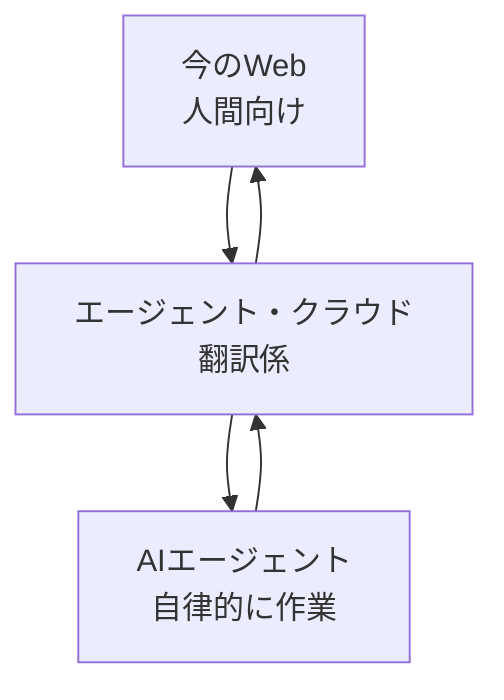
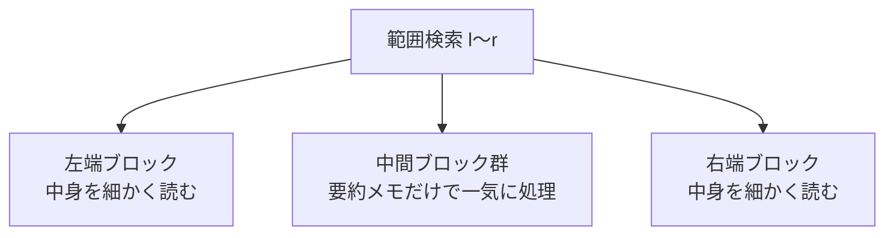
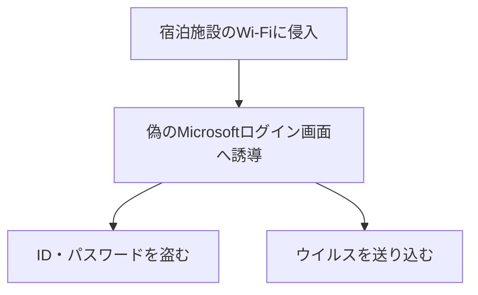

## AI

### [OpenAI、アクティブユーザー10億人超に　導入企業は200万社超](https://www.itmedia.co.jp/news/article/2608/02/2000000346/)
<!-- categories: OpenAI, LLM -->

OpenAIが、ChatGPTなどを使う利用者が10億人を、有料で導入した企業が200万社をそれぞれ超えたと発表した。これは「街の人口」で言えば世界人口の1割以上が触っている計算で、AIが特別な人の道具から生活インフラに変わりつつあることを示す。財務責任者は「登録から半年たった人は、1日に送るメッセージ数が約5割増え、AIに任せる仕事の種類も約2倍になる」と語り、使うほど手放せなくなる様子を説明している。技術面では、AIが会話の流れ（コンテキスト）を覚えて使い回す仕組みを改善し、同じ問題を解く性能テストの点数を13.3％から38.3％へ引き上げつつ、出力にかかる計算量（トークン）を6分の1に減らしたという。この効率化が、最新モデルGPT-5.6の大幅な値下げを支えている。つまり「賢くなったのに安くなる」という、利用者にうれしい流れが続いている。

### [DeepSeek-V4-Flash 284B on 5.3GB of memory](https://www.reddit.com/r/LocalLLaMA/comments/1vdbix4/deepseekv4flash_284b_on_53gb_of_memory/)
<!-- categories: DeepSeek, LLM -->

中国製の大規模AI「DeepSeek-V4-Flash」（総パラメータ2840億）を、わずか5.3GBのメモリで動かせたという報告が話題になっている。ふつう、これほど巨大なAIを動かすには何十GBものメモリを積んだ高価な機材が必要で、個人が手を出しにくい壁だった。カギは「MoE（混合エキスパート）」という設計で、これは巨大な専門家集団を抱えつつ、質問ごとに必要な数人だけを呼び出す仕組みに例えられる。全員を常に待機させる必要がないため、実際に使うメモリを劇的に減らせる。これが本当なら、手元のパソコンでも最先端クラスのAIを動かせる時代が近づいており、データを外に出さずに使える安心感とも相性がよい。

### [薬局チェーンが業務効率化のためにAIを導入したところ遅延・誤った情報提供・プライバシー問題などが発生](https://gigazine.net/news/20260802-pharmacy-chain-ai/)
<!-- categories: LLM, Business -->

米国の薬局チェーンKinney Drugsが、処方薬の受け付けや問い合わせ対応に「Burt」というAIを導入したところ、現場で多くのトラブルが起きていると報じられた。具体的には、処理の遅れ、薬の取り違え、必要な連絡が届かない、といった問題に加え、患者の医療データが外部のAI開発会社にどう共有されるかという不安も出ている。利用者からは「Burtと話すか、さもなくば薬が受け取れない」と、人間の窓口が用意されていない不便さへの不満も上がった。経営側は「薬剤師の負担を減らす」と説明するが、批判する側は「AIの間違いの尻ぬぐいでかえって現場の手間が増える」と指摘する。効率化のつもりが逆に現場を疲弊させる、AI導入の典型的な落とし穴を示す事例だ。

### [I'm (mostly) picking models on speed now, not intelligence](https://martinalderson.com/posts/speed-vs-intelligence/)
<!-- categories: LLM -->

AIモデルを選ぶ基準が「賢さ」から「速さ」へ移りつつある、という開発者の実感を綴った記事。筆者は、いま出回っている上位モデルはすでに「多くの仕事には十分賢い」ため、あと少し賢いが遅いモデルより、多少劣っても速いモデルの方が実用では勝ると主張する。ただし速さにも限界があり、1秒あたり100〜200トークンを超えると、待ち時間の主役はAI本体ではなく、ツール呼び出しや人間の確認作業に移ると指摘する。さらに、GLM-5.2やDeepSeek V4 Flashのような、速さと安さを両立する公開モデルの登場で、2027年には激しい値下げ競争が起きると予想している。「賢さの奪い合い」から「速さと価格の勝負」へと、競争の土俵が変わりつつある。

### [Prevent cognitive debt by manually retyping LLM-generated code](https://ankursethi.com/blog/prevent-cognitive-debt-by-manually-retyping-llm-generated-code/)
<!-- categories: LLM -->

AIが書いたコードをそのままコピペし続けると、自分のプログラムの中身を理解していない「認知的な借金（コグニティブ・デット）」がたまる、と警告する記事。筆者はその対策として、あえて非効率だが「AIが出したコードを自分で手打ちで写す」やり方を実践している。写経のように打ち直すことで、コードの中身に深く向き合わざるを得なくなり、間違いに気づけたり、プログラム全体の「地図」が頭の中にできると説明する。全自動より遅いのは承知のうえで、「生産性より理解を優先する」と割り切っているのが特徴だ。AIに任せきると楽だが、いざ問題が起きたとき誰も中身をわからない、という将来の負債への警鐘といえる。

## Infra

### [日本におけるクラウドネイティブコミュニティの開発者数が約100万人に、CNCFが調査結果を発表](https://www.publickey1.jp/blog/26/100cncf.html)
<!-- categories: CNCF, Kubernetes -->

CNCF（クラウドネイティブ技術を推進する団体）とSlashDataの調査で、日本のクラウドネイティブ開発者が約100万人に達したと発表された。クラウドネイティブとは、Kubernetesなどを使い、アプリを小さな部品に分けて雲の上で柔軟に動かす作り方のことだ。世界全体では1990万人で、日本は過去2年で大きく伸びた一方、海外に比べると自前のサーバー（オンプレミス）への依存が今も強いという特徴も見えた。バックエンド（裏方のサーバー処理）で使う技術は、APIゲートウェイ47％、マイクロサービス39％、Kubernetes27％の順に多かった。伸びてはいるが、日本はまだ「雲」への移行の途中にある、という現在地を示す数字だ。

### [Welcome to Agents Week](https://blog.cloudflare.com/agents-week-welcome/)
<!-- categories: Cloudflare, AI Agent -->

Cloudflareが、AIエージェント（人の代わりに自律的に作業するAI）向けにクラウドの土台をどう作り直すかを議論する「Agents Week」を始めた。中心となる考えは「エージェント・クラウド」で、これは人間向けに作られた今のWebと、AIが主役になる未来の仕組みとの間に立つ「翻訳係」のような役割を担う。1週間で、実行の土台、開発の流れ、安全な権限管理、AI向けに姿を変えるWeb、そして今の人間とAIの協調をどう地に足の着いた形で進めるか、という5テーマを扱う。要は「人間の道具をAIに無理やり使わせる」のではなく、最初からAIの都合（速さ・構造・アクセス権）に合わせてインフラを設計し直そう、という発想の転換だ。

### [Setting up of a 16xGB10 (DGX Spark) cluster](https://www.reddit.com/r/LocalLLaMA/comments/1vdcgpm/setting_up_of_a_16xgb10_dgx_spark_cluster/)
<!-- categories: NVIDIA, GPU -->

NVIDIAの小型AI開発機「DGX Spark（GB10チップ搭載）」を16台つないで、自前のAI計算クラスタを組んだという実践報告。1台ずつは卓上に載る小さな機械だが、これを束ねることで、本来は大企業のデータセンターにあるような計算力を、手元で構築しようという試みだ。複数台をネットワークでつなぎ、1つの大きな計算機のように協調させる設定手順や、つまずきどころが共有されている。大きなAIモデルの学習や推論を、クラウド代を払わず自宅・研究室でまかないたい層にとって、現実的な選択肢が増えつつあることを示す。個人や小規模チームでも「自前のAIインフラ」を持てる時代の空気が伝わる投稿だ。

### [Idempotency in IaC is just an equality check](https://www.reddit.com/r/devops/comments/1vdhrjb/idempotency_in_iac_is_just_an_equality_check/)
<!-- categories: DevOps -->

インフラをコードで管理する「IaC（Infrastructure as Code）」の要である「冪等性（べきとうせい）」を、突き詰めれば「等しいかどうかの照合にすぎない」と整理した投稿。冪等性とは、同じ設定を何度実行しても結果が変わらない性質で、たとえば「部屋の温度を25度にして」という指示を何回出しても、最終的に25度になれば同じ、というイメージだ。TerraformなどのIaCツールは、内部で「今の状態」と「あるべき状態」を比べ、違うところだけを直している。つまり難しそうな概念も、根っこは「現状とゴールを比べて差分を埋める」という単純な照合作業だと説明する。仕組みの本質を一言で捉え直すことで、IaCの挙動が腑に落ちやすくなる視点を与えてくれる。

### [NetBSD 11.0 released](https://blog.netbsd.org/tnf/entry/netbsd_11_0_released)
<!-- categories: NetBSD, OSS -->

さまざまな機器で動くことを重視するOS「NetBSD」の、久々のメジャー更新版11.0が公開された。NetBSDは、パソコンから古い機械、組み込み機器まで幅広く動くことを売りにした、歴史あるオープンソースのOSだ。今回の発表は新機能を派手に並べるより、「かなり遅れてしまった」ことを率直に認め、リリース候補版で入念にテストした過程を強調する、堅実な内容になっている。既知のセキュリティ問題3件も回避策とともに正直に開示し、残りは2か月以内の11.1で対応する予定だという。地味ではあるが、長く使われるOSが誠実な運用姿勢とともに世代交代した、という節目のニュースだ。

## Backend

### [Block decomposition: how ClickHouse, Prometheus, and InfluxDB rediscovered the same fundamental algo](https://hackernoon.com/block-decomposition-how-clickhouse-prometheus-and-influxdb-rediscovered-the-same-fundamental-algo)
<!-- categories: Database, ClickHouse -->

時系列データベース（時刻つきの大量データを扱うDB）であるClickHouse・Prometheus・InfluxDBが、言語もチームも別々なのに、内部で同じ工夫「ブロック分割」にたどり着いていた、という技術記事。ブロック分割とは、データを一定の塊（ブロック）に区切り、各ブロックに「この塊は最小◯・最大◯」といった要約メモを付けておく方法だ。範囲を指定した検索では、範囲にすっぽり入るブロックは要約メモだけで一気に処理し、端っこにかかるブロックだけ中身を細かく読む。これは競技プログラミングで有名な「平方分割」とほぼ同じ考え方で、木構造より単純なのに、データが末尾に追記され続けるDBでは相性が抜群だと解説する。3つの有名DBが同じ結論に自然と収束した、という「良い設計は似る」実例が面白い。

### [Postmortem for Lean Kernel Soundness Bug #14576](https://leodemoura.github.io/blog/2026-8-1-postmortem-for-kernel-soundness-bug-14576/)
<!-- categories: Lean -->

数学の証明を機械でチェックする言語「Lean 4」の心臓部（カーネル）に、誤った証明を通してしまう重大なバグが見つかり、その事後検証が公開された。発覚のきっかけは、AIの助けで作られた「コラッツ予想を証明した」という怪しい証明が、この穴を突いていたことだった。原因は、入れ子になった型を扱う際に「使われていない見せかけの引数（ファントム・パラメータ）」を取り除く処理で、本来は弾くべき型の合わない値をすり抜けさせてしまった点にある。ただし穴は特殊な低レベル操作からしか触れず、通常の書き方なら手前で自動的に弾かれるため、実害は限定的だった。Leanチームは報告から1時間で修正を出し、別実装の検証器が独立に同じ危険を検知していたことが、複数の目で守る価値を示したと締めくくっている。

### [sizeof is surprisingly difficult to parse in C](https://sebsite.pw/w/20260802-sizeof.html)
<!-- categories: C -->

C言語の`sizeof`（データの大きさを調べる演算子）は、コンパイラが文法として読み解くのが意外に難しい、という技術記事。難しさの元は、`sizeof`の後ろに来るものが「値の式」なのか「型の名前」なのか、括弧を見ただけでは区別がつかない点にある。さらに`sizeof(int){0}`のような複合リテラルは、型名のように見えて実は式であり、その後ろに`.x[0]()`のような操作が続くと一段とややこしくなる。効率化のために式と型変換の解析を1つの関数にまとめると、今度は`sizeof(int)+1`を「足し算」と正しく読むための曖昧さが生まれてしまう。普段何気なく使う小さな演算子の裏に、これだけの文法上の落とし穴が潜んでいる、という言語処理系の奥深さを教えてくれる。

### [The Debate of Mockist v Classicist TDD Is Like OOP v FP](https://www.reddit.com/r/programming/comments/1vdnb3e/the_debate_of_mockist_v_classicist_tdd_is_like/)
<!-- categories: Testing -->

テスト駆動開発（TDD）における「モック派」と「古典派」の長年の論争を、「オブジェクト指向 対 関数型」の対立になぞらえて論じた投稿。モック派は、テストしたい部品を周りから切り離すため、依存する相手を「にせもの（モック）」に置き換えて単体で検証する。一方の古典派は、なるべく本物同士をつなげたまま、実際の振る舞いを通して検証しようとする。筆者は、どちらが絶対に正しいという話ではなく、プログラムの設計思想（部品をどう分けて考えるか）の違いが、そのままテストの流儀の違いに表れているだけだと整理する。宗教論争のように見える対立も、「何を独立した単位とみなすか」という視点の差だと捉えると、冷静に使い分けられるという指摘だ。

### [Guarded methods in OCaml](https://xvw.lol/en/articles/oop-refl.html)
<!-- categories: OCaml -->

関数型言語OCamlで、「特定の型のときだけ使えるメソッド」を実現するテクニックを解説した記事。たとえば「中身がリストのときだけ平らにする（flatten）」「中身が整数のときだけ合計する（sum）」といった、条件付きの操作を安全に書きたい場面がある。OCaml自体にはそのための専用構文がないが、`Refl`という「2つの型が実は等しい」ことの証拠を渡すGADTという仕組みを使えば表現できる、というのが要点だ。メソッドの中でこの証拠を取り出すことで、コンパイラに「今このケースでは型が一致している」と納得させ、型安全を保ったまま条件付きの処理を許可できる。オブジェクト指向のメッセージ送信の作法を壊さずに、型で守られた柔軟なAPIを組める、上級者向けの型テクニックだ。

## Frontend

### [The Fixi Project](https://fixiproject.org/docs.html)
<!-- categories: JavaScript, HTMX -->

大きなJavaScriptフレームワークに頼らず、ごく小さな部品でWeb開発を組み立てる思想のライブラリ群「Fixi」が公開された。特徴はとにかく軽いことで、5つのライブラリを合わせても圧縮後わずか4.5KBに収まる（一般的なフレームワークは数百KBになることも多い）。中身は、HTTP通信を担う`fixi.js`、画面を差分で書き換える`paxi.js`、サーバーからの実況配信を扱う`ssexi.js`、画面の自動更新を担う`moxi.js`、通信を書きやすくする`rexi.js`に分かれている。HTMLを主役に据え、最小限のJavaScriptで機能を足していく点は、人気ライブラリhtmxと同じ哲学だ。「必要な分だけを、極限まで小さく」という、重厚なフレームワークへの対抗軸を示すプロジェクトといえる。

### [Should you normalize RGB values by 255 or 256?](https://www.reddit.com/r/programming/comments/1vdjt5i/should_you_normalize_rgb_values_by_255_or_256/)
<!-- categories: Graphics -->

画面の色を扱うとき、0〜255の整数を0〜1の小数に変換する際に「255で割るべきか、256で割るべきか」という、地味だが奥深い問題を掘り下げた記事。255で割ると、最大値255がちょうど1.0に収まり、白や黒などの端の色をきれいに表現できる。一方256で割ると、各色を「等しい幅の区切り」として扱えるため、色を丸めたり刻んだりする処理（ディザリングなど）と相性がよい。つまりどちらが正解というより、「端の色を正確にしたいか」「区切りの均等さを重視したいか」で使い分けるべき、という話だ。何気ない割り算ひとつで、画像の色味や品質がわずかにズレる可能性がある、という色処理の落とし穴を教えてくれる。

### [Web Streams API 入門 ― 基本概念から実践まで](https://zenn.dev/cybozu_frontend/articles/web-streams-api-guide)
<!-- categories: JavaScript, TypeScript -->

ブラウザ標準の「Web Streams API」を、基本から実践まで丁寧に解説した入門記事。これはデータを「一度に全部」ではなく「流れてくる端から少しずつ」処理するための仕組みで、水道の蛇口とホースに例えられる。読み込み役の`ReadableStream`、加工役の`TransformStream`、書き出し役の`WritableStream`をパイプでつなぎ、データの流れ道を組み立てる。利点は、大量データでもメモリを食いつぶさず、待ち時間を抑えて処理できること。処理が追いつかないときは「背圧」という仕組みで流量が自動調整される。大規模データの取り込みや、AIの返答をリアルタイムに少しずつ表示する用途に向いており、TypeScriptなら型安全に書けるため、新規コードではNode.js独自のStreamより推奨されている。

## Others

### [Windowsユーザーは「ホテルのWi-Fiは使うな」マイクロソフトが緊急警告](https://forbesjapan.com/articles/detail/102130)
<!-- categories: Security, Windows -->

マイクロソフトが、ホテルなど宿泊施設のWi-Fiを狙う新たなサイバー攻撃を発見し、旅行者に注意を呼びかけた。ロシア系とされる攻撃グループ「Storm-2945」が、施設のWi-Fiに侵入し、接続した人を「マイクロソフト本物そっくりのログイン画面」へ誘導して、IDやパスワードを盗んだりウイルスを送り込んだりしていたという。この手口は「CaptiveCrunch」と名付けられ、WindowsだけでなくAndroid端末も標的になりうる。同社は「公共や宿泊施設のネット設備は信用できない前提で使うべき」とし、できれば利用を控えるよう勧告している。旅先の無料Wi-Fiという身近な便利さの裏に、こうした罠が仕込まれうる、という警戒を促すニュースだ。

### [大阪・関西万博関連ドメインの一部で起きているドロップキャッチについてまとめてみた](https://piyolog.hatenadiary.jp/entry/2026/08/02/165033)
<!-- categories: Security, DNS -->

2025年の大阪・関西万博が終わり、協会が使わなくなった6つの関連ドメイン（Web上の住所）が、第三者に再取得されていた問題を整理した記事。手放されたドメインをすかさず横取りする行為は「ドロップキャッチ」と呼ばれ、今回それらは成人向けサイトや医薬品の個人輸入サイトなど、万博とは無関係な用途に転用されていた。厄介なのは、注意喚起の前から、複数の企業サイトにこれらのドメインを含む古いメールアドレスやリンクが残っており、利用者が「公式・自治体関係」と誤解しかねない点だ。名古屋市・愛知県・宮崎県でも同様に廃止ドメインが乗っ取られた例が報告され、問題は各地に広がっている。イベントや事業を畳むときは、ドメインの後始末まで含めて考えないと悪用される、という教訓を示している。

### [ブラウザベースのコーディングプラットフォーム「Trinket」、閉鎖予定だったがオープンソースで無料化されて継続](https://gigazine.net/news/20260802-trinket/)
<!-- categories: OSS, Python -->

インストール不要でブラウザ上でPythonやHTMLを書いて動かせる教育向けサービス「Trinket」が、閉鎖の危機からオープンソース化によって存続することになった。2013年に始まり教室でも使われてきたが、運営元はサーバー費用や競争の激化を理由に、2026年8月31日での全サービス終了を発表していた。しかし同社がプログラムのソースコードを公開したことで、教育系企業のStrive Mathがこれを引き継ぎ、コミュニティ運営の無料版を新たに立ち上げた。利用者は自分の過去の作品を書き出して、新しいプラットフォームへ引っ越せるようになっている。一度は消えかけた学習ツールが、コードの公開によって別の担い手のもとで生き延びる、オープンソースならではの救済劇だ。

### [57年前に持ち帰られた「月の石」は、いまだに解けない謎だった](https://www.gizmodo.jp/article/lunar-rock/)
<!-- categories: Science -->

1969年にアポロ11号が持ち帰った月の石が、半世紀を経てもなお謎を投げかけ続けている、という科学記事。当初この石は、月の起源や過去の地質活動を解き明かす大きな手がかりになった。ところが分析技術が進むほど、石から新しい情報が次々と引き出され、月の誕生をめぐる有力な「ジャイアント・インパクト説（巨大衝突説）」などですら、証拠が十分とは言い切れないと分かってきた。つまり研究が進むほど、「わかったこと」より「わからないこと」が増えていくという、逆説的な状況にある。たった数百キロの石が、最先端の科学をもってしても底が見えないほど深い問いを秘めている、という自然の奥行きを感じさせる話だ。

### [リモートワーカーとしての振る舞い - 覚書](https://satoru-takeuchi.hatenablog.com/entry/2026/08/02/102507)
<!-- categories: Remote Work -->

10年近いフルリモート経験を持つ筆者が、在宅で働くうえで心がけるべきことをまとめた覚書。核心は、「何をしているか分からないブラックホール」にならず、進捗や困りごとが周りから見える「透明性」を保つことだという。オフィスより会話の手段が限られる分、分報（作業の実況メモ）やWikiの活用、たまの対面での集まり、そして非同期（好きな時に返す）と同期（その場でやり取り）の使い分けが効くと説く。そして最後に、こうした工夫はリモートワーカー個人の努力だけでなく、チーム全体で試行錯誤し続けることが大事だと結んでいる。リモートは便利だが、実はオフィス勤務より難易度が高い、という前提に立った実践的な助言だ。
