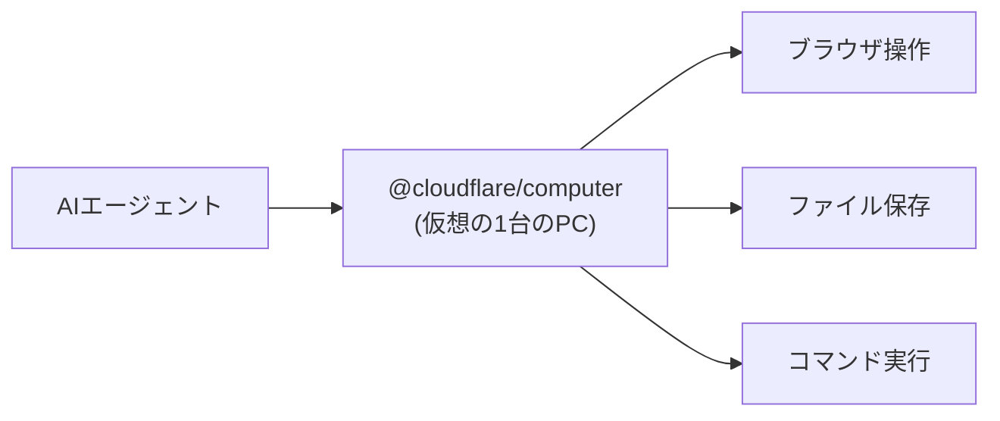

## AI

### [「DeepSeek-V4-Flash-0731」登場、GPT-5.6 Luna より安く同等性能のオープンモデル](https://gigazine.net/news/20260803-deepseek-v4-flash-0731/)
<!-- categories: DeepSeek, LLM, OpenAI -->

中国の DeepSeek が新しい大規模言語モデル「V4-Flash-0731」を、誰でも重み（モデルの中身のデータ）を入手できる「オープンモデル」として公開した。有料の GPT-5.6 Luna と同じくらいの賢さを持ちながら、動かす費用（AIを動かすたびにかかる「トークン代」）はより安いと報告されている。特に注目されたのは、本来なら大型サーバーが必要な高性能モデルなのに、工夫次第で個人のパソコンでも動かせた点だ。実際に愛好家のコミュニティでは「家庭の PC で一線級のモデルが動いた、信じられない」という驚きの報告や、SSD から少しずつデータを読み込ませて動かす実験が相次いだ。クラウドの AI サービスに月額を払わなくても、手元で最新級の AI が使える現実味が一段と増したと言える。

### [OpenAI の次期主力モデル「Astra」が数学・理論計算機科学で10件の新成果、証明を機械検証](https://gigazine.net/news/20260803-openai-astra-lean/)
<!-- categories: OpenAI, LLM -->

OpenAI が近く投入する新モデル「Astra」が、数学と理論計算機科学の未解決に近い問題で10件の新しい成果を出したと発表した。単に「答えらしきもの」を出しただけでなく、証明を「Lean 4」という証明支援ツールの形式で書き、機械が矛盾なく正しいと確認できる状態にした点が重要だ。AI の回答はもっともらしく嘘をつく（ハルシネーション）ことがあるため、人間が読んで信じるのではなく、コンピュータが論理を一段ずつ検算して初めて「本物」と認められる。この「機械が検証できる形で成果を出す」やり方は、AI の主張を鵜呑みにせず裏取りする作法として広がりつつある。数学の研究現場に AI が実質的な貢献を始めた一例として受け止められている。

### [Qwen3.8-Max 公開、コーディングと協働作業で新たな基準](https://qwen.ai/blog?id=qwen3.8)
<!-- categories: LLM -->

アリババ系の Qwen チームが、コード生成と「人と一緒に作業を進める（cowork）」能力を高めた新モデル「Qwen3.8-Max」を公開した。同時に小型版の Qwen3.8-27B も予告され、こちらは 17GB 程度のグラフィックメモリ（GPU の作業用メモリ）で動く軽さが話題になっている。大型版はプログラミング系のベンチマークで、同時期に出た Kimi K3 や前述の DeepSeek V4 Flash と肩を並べる水準とされる。中国系の研究所が立て続けに高性能なオープン寄りモデルを出しており、開発者が選べる無料〜低コストの選択肢が急速に増えている。「どの有料モデルを使うか」ではなく「どの無料モデルで十分か」を考える場面が増えてきた。

### [AI が作った「コラッツ予想の反証」は無効、Lean のカーネルバグを突いていた](https://gigazine.net/news/20260803-collatz-lean-kernel-bug/)
<!-- categories: LLM, OSS -->

AI の支援で作られた有名な数学の難問「コラッツ予想」への反証（間違いだと示す証明）が、実は無効だったと判明した。証明チェックに使われた「Lean」という証明支援ツールの、核心部分（カーネル）に潜んでいた欠陥（バグ）をたまたま突いてしまい、本来通らないはずの誤った証明が「正しい」と誤判定されていたのだ。つまり AI が賢すぎて正解を見つけたのではなく、検算役のソフト自体の穴を利用してしまっていた。前項のように「機械検証できるから安心」と言っても、その検証ツール自体にバグがあれば土台が崩れる、という教訓になった。AI の成果を信じる前に、検証の道具そのものの信頼性まで疑う必要があることを示している。

### [動画生成AI「MiniMax H3」登場、世界2位の実力でオープン公開予定](https://gigazine.net/news/20260803-minimax-h3-video-generation-ai/)
<!-- categories: LLM -->

中国の MiniMax が、文章から動画を作る生成AI「MiniMax H3」を発表した。ランキングで世界2位相当の品質とされ、しかも重みを公開するオープンモデルとして配布予定という点が注目された。音声もモデル内で一緒に生成でき、2K 解像度の動画に対応する。画像生成ツール「ComfyUI」が公開初日から対応し、手元の環境で試せる体制もすぐに整った。高品質な動画生成が、特定企業の有料サービスに限られず、誰でも手元で動かせる方向へ広がりつつあることを示す動きだ。

## Infra

### [エージェントに必要なのはコンテナではなくコンピュータ、Cloudflare が「@cloudflare/computer」発表](https://blog.cloudflare.com/cloudflare-computer/)
<!-- categories: Cloudflare, AI Agent -->

Cloudflare が「Agents Week（AIエージェント特集週間）」の目玉として、AI エージェントに丸ごと1台の仮想コンピュータを与える新機能「@cloudflare/computer」を発表した。従来はエージェントに「コンテナ」という軽量な箱を渡すのが主流だったが、Cloudflare は「エージェントが本当に必要としているのは、ファイルを保存でき、ブラウザを開き、コマンドを打てる本物のパソコン環境だ」と主張する。これにより AI が調べ物をしたり、ソフトを動かしたり、作業結果を保存したりを一続きでこなせる。人間が PC の前に座って作業するのと同じ環境を、AI にクラウド上で渡すイメージだ。エージェントに「道具箱」ではなく「作業机ごと」与えるという設計思想の転換が示された。

### [クラウドインフラのシェア、AWS 28％で首位維持・Google Cloud 15％に上昇、市場は年42％成長](https://www.publickey1.jp/blog/26/aws28google_cloud1154220262synergy_research.html)
<!-- categories: AWS, Google Cloud, Business -->

調査会社 Synergy Research の2026年第2四半期の集計で、クラウド基盤サービスの世界シェアが明らかになった。AWS が28％で首位を保ち、Google Cloud が1ポイント伸ばして15％になった。特筆すべきは市場全体が前年比42％増という過去最高の成長率を記録したことで、AI ブームによる計算資源（サーバーやGPU）の需要が市場そのものを一気に押し広げている。パイ（市場全体）が急拡大しているため、シェアの順位はあまり動かなくても各社の売上額は大きく伸びている。AI 向けインフラへの投資が、クラウド業界全体を史上最速で膨張させている構図がうかがえる。

### [Cloudflare Workers と Containers が受信 TCP 接続と gRPC に対応](https://blog.cloudflare.com/grpc-workers/)
<!-- categories: Cloudflare, HTTP -->

Cloudflare の実行環境「Workers / Containers」が、外部からの TCP 接続を直接受け付けられるようになり、さらに「gRPC」という通信方式にも対応した。これまで Workers は主に Web（HTTP）の入り口として使う想定だったが、これで Web 以外の一般的なネットワーク通信も終端（受け止める側）にできる。gRPC はサービス同士が高速に会話するための仕組みで、マイクロサービス（機能を小さく分けたシステム）同士の連携に広く使われている。対応により、既存のバックエンドをそのまま Cloudflare のエッジ（利用者に近い拠点）へ載せやすくなる。「Web の関数置き場」から「汎用のサーバー実行基盤」へと Workers の役割が広がっている。

### [Cloudflare、Kimi と GLM を大規模かつ安全に動かす「smaller, faster, safer」](https://blog.cloudflare.com/smaller-faster-safer-models/)
<!-- categories: Cloudflare, LLM -->

Cloudflare が、中国系のオープンモデル「Kimi」や「GLM」を自社基盤で大量のユーザーに提供するための工夫を解説した。大きなモデルをそのまま動かすと費用も待ち時間もかさむため、モデルを小さく圧縮し（量子化などで軽くし）、応答を速くしつつ安全性も保つ調整を施している。第三者の公開モデルを、自社の世界中の拠点で安定して配れるように「運用に耐える形」へ仕立て直した点がポイントだ。利用者は特定の巨大 AI 企業に縛られず、複数のオープンモデルを近い使い勝手で選べるようになる。モデルを「作る」競争に加え、他社製モデルを「うまく届ける」競争が本格化していることを示す。

### [分散トレースの Cortex が OSTIF のセキュリティ監査を完了](https://www.cncf.io/blog/2026/08/03/cortex-completes-ostif-security-audit/)
<!-- categories: CNCF, Observability, Security -->

システムの状態を長期間ためて分析するための CNCF プロジェクト「Cortex」が、第三者機関 OSTIF による本格的なセキュリティ監査を完了した。Cortex は監視データ（メトリクス）を大量・長期に保存し、後から遡って調べられるようにする基盤で、多くの企業のシステム監視の土台になっている。監査では専門家がコードを精査し、見つかった弱点を修正した上で「安全性を確認した」とお墨付きを与えている。土台となるソフトほど、一箇所の穴が全体の弱点になりやすいため、こうした外部の目による点検は信頼の担保として重要だ。オープンソースの基盤ソフトが、公的な監査を経て安心して使える状態に整えられた好例と言える。

## Backend

### [Rust の重要方針、「動かせない型」と「確実に走るデストラクタ」を目指す](https://github.com/rust-lang/rust-project-goals/blob/main/src/2026/move-trait.md)
<!-- categories: Rust -->

プログラミング言語 Rust の開発チームが、今後の重点目標として「immobile types（一度置いたらメモリ上で動かせない型）」と「guaranteed destructors（後片付け処理が必ず実行される保証）」を掲げた。Rust は今、値をコピーせず別の場所へ「移動（move）」できることが前提だが、その移動を禁じた型を作れるようにしたいという話だ。これにより、外部の資源（ファイルやネットワーク接続など）を扱うときに「使い終わったら必ず閉じる」処理を、言語レベルで取りこぼしなく走らせられる。うっかり後始末を忘れて資源が漏れる（リソースリーク）事故を、仕組みで防げるようになる。安全性を売りにする Rust が、その安全網をさらに一段深くしようとしている動きだ。

### [Java の Project Valhalla、JEP 401「値オブジェクト」が JDK 28 にプレビュー導入](https://www.reddit.com/r/programming/comments/1vdywwj/project_valhalla_jep_401_value_objects_preview/)
<!-- categories: Java, Standards -->

Java の長年の大型計画「Project Valhalla」の中核である JEP 401「Value Objects（値オブジェクト）」が、次期 JDK 28 に試験導入（プレビュー）されることになった。従来の Java では、たとえ中身が同じ小さなデータでも一つ一つに「識別番号（アイデンティティ）」が付き、メモリや処理の無駄が生じていた。値オブジェクトはこの識別を捨て「中身が同じなら同じもの」として扱えるようにし、より少ないメモリで高速に動かせる。数値の組など軽いデータを大量に扱う処理で、性能改善が期待される。10年以上議論されてきた Java の根っこの改良が、ようやく実際に試せる段階に入った節目だ。

### [SQLite の「重大な脆弱性」は LLM が作った偽物だった？ JFrog が検証](https://research.jfrog.com/post/sqlite-critical-cves-or-llm-slops/)
<!-- categories: SQLite, Security -->

小型データベース SQLite に「重大な脆弱性（CVE）」として登録された報告が、実は AI（大規模言語モデル）が生成したもっともらしいだけの中身のない指摘、いわゆる「AI のゴミ（slop）」ではないかと、セキュリティ企業 JFrog が検証した。近年、AI に自動でコードを調べさせて脆弱性を報告する動きが増えたが、AI は実在しない問題を自信満々に「危険」と報告してしまうことがある。記事では実際のコードに照らして一つずつ真偽を確かめ、本当に問題なのか AI の勘違いなのかを切り分けている。放置すると、開発者が偽の警告への対応に時間を奪われ、本物の危険が埋もれてしまう。AI 任せのセキュリティ報告を、人間が裏取りする必要性を突きつける事例だ。

### [「リトライは結果整合性を直さない」分散システムの落とし穴](https://var0.xyz/posts/retries-dont-fix-eventual-consistency.html)
<!-- categories: Distributed Systems, Database -->

複数のサーバーにデータを分けて持つシステムでよくある誤解、「うまくいかなければ再試行（リトライ）すれば直る」という考えの危うさを解説した記事。分散システムには「結果整合性」という性質があり、書き込んだ直後は各サーバーの持つデータが一時的に食い違い、少し待つとやがて揃う。この「まだ揃っていない」状態に対してリトライを繰り返しても、根本の食い違いは解消せず、むしろ負荷を増やすだけになりがちだ。記事は、リトライで隠すのではなく、揃うまで待つ・揃ったか確認する設計が必要だと説く。エラーを機械的に再実行で握りつぶす前に、その不具合の性質を理解すべきだという実務的な戒めになっている。

### [Rust 製フルスタック Web フレームワーク「Topcoat」登場、Tokio 上で SSR まで一式](https://www.publickey1.jp/blog/26/rustwebtopcoattokio.html)
<!-- categories: Rust, OSS -->

Rust で Web アプリを丸ごと作れる新フレームワーク「Topcoat」が公開された。非同期処理の定番基盤「Tokio」の上で動き、サーバー側で HTML を組み立てる SSR（サーバーサイドレンダリング）、URL の振り分け（ルーティング）、画面部品のライブラリまで一通り揃っている。これまで Web 開発は JavaScript / TypeScript が主流で、Rust は速さと安全性が魅力でも「フロントまで一式」は手薄だった。Topcoat はその隙間を埋め、Rust だけで表も裏も作りたい開発者に選択肢を与える。速度と型安全（間違いをコンパイル時に弾く仕組み）を重視するチームにとって、試す価値のある新顔だ。

## Frontend

### [Octane 登場、React のプログラミング作法を「コンパイル」する](https://octanejs.dev/)
<!-- categories: React, JavaScript -->

React の書き味はそのままに、その内部を事前に「コンパイル（機械が実行しやすい形へ翻訳）」して速くする新しい仕組み「Octane」が話題を集めた。React は本来、画面の変化を実行時にその都度計算するため、複雑な画面ほど処理が重くなりがちだった。Octane は開発者が書いたコンポーネント（画面部品）をあらかじめ最適な形に変換し、実行時の無駄な計算を減らす。書き方を大きく変えずに性能だけ底上げできるのが売りで、既存の React 開発者にも移行しやすい。「書きやすさ」と「速さ」を両立させようとする、フロントエンドの最適化競争の新たな一手だ。

### [ライブラリ不要、ブラウザ仕様差を吸収するモダンUIスライダー9選](https://qiita.com/hrel11/items/aac90460474959a3e389)
<!-- categories: CSS, HTML -->

外部ライブラリを使わず、標準の HTML と CSS だけで作れる、見た目の整ったスライダー（つまみをずらして数値を選ぶ入力部品）の実装例を9種類まとめた記事。スライダーはブラウザごとに標準の見た目や動きが微妙に違い、そのままだとデザインが揃わない厄介な部品だ。記事では、その差を埋めて全ブラウザで同じ見た目にするコツを、コピーして使える形で紹介している。ライブラリを足さない分、ページが軽くなり、依存が増える不安（セキュリティやメンテの負担）も避けられる。実務でそのまま流用できる、地味だが役立つ実装集だ。

### [Kotlin/Java でモダンなデスクトップアプリを作れる「WinUI4K」](https://forest.watch.impress.co.jp/docs/news/2130040.html)
<!-- categories: Java, Microsoft -->

Kotlin や Java を使って、Windows の今風な見た目（WinUI 風のデザイン）のデスクトップアプリを作れるライブラリ「WinUI4K」が公開された。Java 系の言語はサーバー用途では定番だが、見栄えのする Windows デスクトップアプリを作る手段は限られていた。WinUI4K は、慣れた Kotlin/Java のまま、モダンで洗練された画面を持つアプリを組めるようにする。Web ではなく手元で動く本格的なデスクトップソフトを、既存の Java 資産や知識を生かして作りたい開発者に向いている。言語を乗り換えずに UI の選択肢を広げられる点が歓迎されている。

### [Flutter アプリの E2E テスト基盤に「Maestro」を選んだ理由](https://qiita.com/fumiharu-sugawara/items/1f10a16590552181ac98)
<!-- categories: Design, OSS -->

スマホアプリを作る Flutter で、アプリ全体を通しで動かして確認する「E2E テスト（利用者の操作を最初から最後まで再現する自動テスト）」の道具として「Maestro」を採用した経緯をまとめた記事。E2E テストは実機のように画面をタップして進めるため設定が難しく、ちょっとした画面変更ですぐ壊れて手間がかかりがちだ。記事では複数の候補を比べ、Maestro が設定の簡単さと壊れにくさで優れていたと説明している。テストコードが読みやすく、チームで保守しやすい点も決め手になった。似た選定に悩む開発者にとって、実際の比較検討の記録は参考になる。

### [3周年で30フォント、日本語フリーフォント「ひとりっこ」リリース](https://coliss.com/articles/freebies/free-font-niimi-hitoricco.html)
<!-- categories: Design -->

フリーフォント作者「213ちゃん」の活動3周年を記念して、新作の日本語フリーフォント「ひとりっこ」が公開された。パラパラとした軽やかな手書き感が特徴で、見出しや POP、カジュアルなデザインに合う雰囲気を持つ。無料で使えるため、個人サイトや資料作り、趣味の制作物などに気軽に取り入れられる。日本語フォントは文字数が多く作るのに手間がかかるため、質の高い無料フォントの公開は制作者にとってありがたい。デザインの引き出しを増やす一本として押さえておきたい。

## Others

### [BASE の子会社で最大885万件の情報漏えいか](https://www.itmedia.co.jp/news/article/2608/03/2000000355/)
<!-- categories: Incident, Security, Business -->

ネットショップ作成サービス「BASE」の子会社で、最大約885万件もの情報が漏えいした可能性があると公表された。件数が非常に多く、多数の利用者に影響が及びうる大規模な事案だ。詳しい原因や漏えいした情報の種類は調査中とされるが、規模の大きさから注目を集めている。ネット通販の裏側では、利用者や取引先の個人情報が大量に蓄積されており、一度漏れると被害が広範囲に及ぶ。事業者にとって、集めた情報をどう守るかという基本の重さを改めて突きつける出来事だ。

### [ハードウェアウォレット「COLDCARD」の脆弱性を悪用、140億円相当のビットコイン盗難](https://gigazine.net/news/20260803-coldcard-wallet-flaw-bitcoin-theft/)
<!-- categories: Security, Incident, Hardware -->

暗号資産を安全に保管するための専用機器「ハードウェアウォレット」の一つ「COLDCARD」に見つかった弱点が悪用され、3波にわたる攻撃で合計140億円相当のビットコインが盗まれた。ハードウェアウォレットは、ネットから切り離した機器に鍵をしまうことで盗難を防ぐ「金庫」のような存在で、本来は安全性の高い保管方法とされる。その金庫自体に欠陥があると、預けていた資産が根こそぎ奪われる深刻な事態になる。「オフラインだから安全」という思い込みが必ずしも成り立たないことを示した。機器のファームウェア（内部ソフト）を最新に保つことの重要性が改めて問われている。

### [中国の軍事研究者が OpenAI・Anthropic のAIモデルを抽出し軍事システムに利用か](https://gigazine.net/news/20260803-china-ai-distillation/)
<!-- categories: Security, OpenAI, Anthropic -->

中国の軍事関連の研究者が、OpenAI や Anthropic の AI モデルから知識を「抽出（蒸留）」し、国内の軍事システム開発に利用していたと報じられた。「蒸留」とは、公開されている高性能 AI に大量に質問して回答を集め、その受け答えをまねる別のモデルを育てる手口だ。相手の内部データを盗まなくても、外から使えるだけで中身の賢さをある程度写し取れてしまう。この方法は正規の利用に紛れやすく、防ぐのが難しい。高性能 AI をどこまで誰に使わせるか、そして模倣をどう抑えるかという、技術と安全保障が絡む難題を浮き彫りにしている。

### [犯罪捜査に使われるDNA検査ファイルに「検出不能な改ざん」を仕込めると判明](https://gigazine.net/news/20260803-thermo-fisher-dna/)
<!-- categories: Security, Incident -->

犯罪捜査で使われる DNA 鑑定のデータファイルに、後から見破れない形で改ざんを仕込めることが研究で明らかになった。対象は Thermo Fisher 社の検査機器が出力するファイルで、専門家が細工すると、鑑定結果を別人のものにすり替えても痕跡が残らないという。DNA 鑑定は「動かぬ証拠」として裁判で重い意味を持つため、その元データが密かに書き換えられると冤罪や証拠隠滅につながりかねない。デジタル化された証拠は便利な一方、改ざんの検知（本物である証明）を仕組みで担保しなければ信頼できない、という根本問題を突きつけている。証拠データにも、後から手を加えられていないことを保証する電子署名などの対策が求められる。

### [Apple、AIによる報告が殺到しバグ報告の提出件数に上限を設定](https://gigazine.net/news/20260803-apple-ai-bug-reports/)
<!-- categories: Apple, Security -->

Apple が、AI を使って自動生成されたバグ報告が大量に押し寄せた結果、報告の提出件数に上限を設けたと報じられた。近年、AI に製品の欠陥を探させて自動で報告する動きが広がったが、その多くは実在しない問題や中身の薄い「もっともらしいだけ」の報告だという。人間の担当者がその一つ一つを確認するのは大きな負担で、本物の重要な報告が埋もれてしまう危険もある。上限を設けるのは、AI が生む「報告の洪水」に運用が押し流されないための防波堤だ。便利な AI が、受け手側の処理能力を超える副作用を生み始めている現実を映している。
