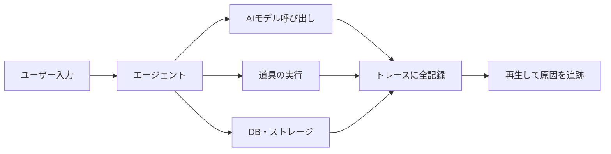

## AI

### [Cloudflareがエージェント運用の総合基盤「Cloudflare Agents」を発表](https://blog.cloudflare.com/agents-on-cloudflare/)
<!-- categories: Cloudflare, AI Agent, Observability -->

AIエージェント（自分で考えて道具を使いこなす自動プログラム）を、動かすだけでなく「中で何をしているか」まで見張れる統合基盤が発表された。従来のアプリ監視は「正常に応答したか（HTTP 200 が返ったか）」しか見ないが、エージェントは正常に応答しながら間違った道具を選んだり、無駄にAIを呼び出して費用（トークン代）を垂れ流したりする。今回の目玉は「エージェントトレーシング」で、1回の実行で呼び出したAI・使った道具・消費したトークンをすべて記録し、会話をあとから再生して「どこで判断を誤ったか」を追える。さらに、処理のどこに時間がかかったかを滝グラフ（ウォーターフォール）で可視化し、データベースやストレージまで含めて無駄を洗い出せるようにした。

### [Google ADKの低権限エージェントを乗っ取り、メンテナー権限を奪う攻撃手法](https://gigazine.net/news/20260804-agent-development-kit-attack/)
<!-- categories: AI Agent, Security, Google -->

GoogleのAgent Development Kit（ADK、エージェントを作るための開発キット）で、権限の低いエージェントを踏み台にして本来は管理者しかできない操作を実行させる手口がセキュリティ企業Pillarによって発見された。攻撃者は「プロンプト（AIへの指示文）を仕込んだコード」をプルリクエスト（変更提案）として送り込み、低権限のエージェントに任意の文言を出力させる。問題は、エージェントがGitHub上で「ボット」ではなく人間と同じ「コラボレーター（共同作業者）」として扱われている点で、これにより人間専用のはずの「メンテナー限定ワークフロー」まで呼び出せてしまう。結果として、プルリクエストの承認や却下といった重要操作を乗っ取られ、開発パイプライン全体が危険にさらされる。

### [DeepSeek-V4-Flashを1台のRTX5090で「100万トークン文脈」まるごと動かす](https://www.reddit.com/r/LocalLLaMA/comments/1vfbcgx/deepseekv4flash0731_full_1m_context_on_a_single/)
<!-- categories: DeepSeek, LLM, GPU -->

新しい省メモリAIモデル「DeepSeek-V4-Flash」を、個人でも買えるGPU 1枚（RTX5090）と普通のパソコン用メモリ（DDR5）だけで、100万トークン（本数冊ぶんの文章量）という長い文脈を丸ごと扱えたという報告が投稿された。カギは「CPU/RAMオフロード」で、GPUに載りきらない部分をパソコン本体のメモリに逃がして分担処理する仕組みだ。投稿によれば、入力を読み込む速度が毎秒約800トークン、返答を書き出す速度が毎秒15トークン以上と、エージェントにコードを書かせる用途なら十分実用的な速さが出ている。数百万円のサーバーがなくても、机の上のPC 1台で長文脈のAIコーディングができることを示した点が注目される。

### [Lilian Wengが説く「ハーネス工学」——モデルの外側を鍛えて自己改善させる](https://lilianweng.github.io/posts/2026-07-04-harness/)
<!-- categories: AI Agent, LLM -->

AI研究者Lilian Wengが、AIモデルそのものではなく「ハーネス（模型の周りを固める骨組み）」を設計・改良する重要性を論じた。ハーネスとは、モデルがどう考え・計画し・道具を呼び・行動するかを取り仕切る運用システムのことで、記憶の管理やワークフローの自動化など、プロンプトの工夫より一段広い「運用層の設計」を指す。記事は、限られた文脈を効率よく使う工夫、進化的探索やコード生成によるワークフロー最適化、失敗分析をもとにエージェントが自分のハーネスを改善する仕組みを挙げる。近い将来の「AIの自己改善」は、モデルの中身（重み）を直接いじるより、この骨組みを進化させる形で進む、というのが中心的な主張だ。

### [OpenAIの音声AI「GPT-Live」がなぜ即座に返事できるのか](https://gigazine.net/news/20260804-openai-gpt-live/)
<!-- categories: OpenAI, LLM -->

OpenAIの音声AI「GPT-Live」が、人が話し終わるのを待たずに自然に会話できる仕組みが解説された。ポイントは「全二重通信（電話のように、聞きながら同時に話せる方式）」で、AIが相手の声を聞きながら話すため、会話の間（ま）が生まれにくい。複雑な処理が必要なときは別のモデルに任せつつ、音声のやり取りは専用の高速経路で途切れさせない設計になっている。さらに独自プロトコル「WARP」で通信開始の手続きを簡略化し、ネットワークの往復回数を6回から1回へ減らすことで、応答までの待ち時間を極限まで削っている。

## Infra

### [テキサス州がデータセンター新設を凍結、送電網の逼迫で監査へ](https://techcrunch.com/2026/08/04/texas-halts-new-data-centers-as-governor-calls-for-audits/)
<!-- categories: Datacenter, AI, Business -->

米テキサス州のアボット知事が、新規データセンター計画の一時凍結を発表し、州の公益事業委員会と送電網運営者ERCOTに監査を命じた。背景には接続申請の爆発的増加があり、今年1月の233ギガワットから8月には474ギガワットへ膨らみ、そのおよそ9割がデータセンターだという。これは主にAI基盤の需要が押し上げたもので、申請の総量はERCOTのピーク需要の5倍以上に達し、送電網の安定が脅かされている。監査で持続可能な解決策が見つからなければ、電気代の上昇とあわせて、テキサスがデータセンター誘致の優位を失う恐れがあると指摘されている。

### [SK hynixとSanDiskが新規格「HBF」を発表、AI推論のメモリ不足を狙い撃ち](https://www.reddit.com/r/LocalLLaMA/comments/1vfa3tq/sk_hynix_in_collaboration_with_sandisk_unveils/)
<!-- categories: Hardware, GPU, AI -->

SK hynixがSanDiskと組み、新しいメモリ規格「HBF（High Bandwidth Flash＝高帯域フラッシュ）」を発表した。これは安くて大容量なNANDフラッシュ（USBメモリなどに使う記憶素子）を、高速メモリHBM並みの太い転送路につないだもので、最大で毎秒3テラバイトの帯域を狙う。AIの推論（学習済みモデルで答えを出す処理）では、計算力よりも「巨大なモデルをどれだけメモリに載せられるか」がボトルネック（詰まりどころ）になりやすく、HBFはその容量の壁を安価に広げることを目指す。高価なHBMを大量に積む代わりに、容量が要る部分をHBFで補えれば、大型モデルを動かすコストが下がる可能性がある。

### [「見えないものはデバッグできない」——AIエージェントの可観測性](https://www.cncf.io/blog/2026/08/04/you-cant-debug-what-you-cant-see-observability-for-ai-agents/)
<!-- categories: Observability, AI Agent, OpenTelemetry -->

CNCFが、AIエージェントは従来のアプリと壊れ方が違うため、監視の考え方も変える必要があると論じた。エージェントは「無限ループに陥る・もっともらしい嘘を出す・トークンを浪費する・微妙に間違った出力を返す」といった失敗をし、既存のアプリ監視ツールでは捉えにくい。記事は3本柱を提案する——(1)判断の履歴を丸ごと残すエージェント専用のトレース、(2)セッション単位と全体で費用の異常を早期に捕まえるコスト監視、(3)後から事実を再現できる改ざん不能な監査ログ。可視化がなければトークン浪費ループやモデルの誤りが予算や品質に響くまで気づけないため、事前のガードレールと自動トレース解析が欠かせないと結論づけている。

### [Cloudflareが「数百万リポジトリぶんのCI」を自社プラットフォーム上で提供](https://blog.cloudflare.com/ci-workflows/)
<!-- categories: Cloudflare, CI -->

Cloudflareが、大量のリポジトリに対するCI（コードを自動で検証・ビルドする仕組み）を、自社のWorkflowsとCI SDKを使って動かせるようにした。各CIステップは「Sandbox SDK」による隔離環境で独立して実行され、キャッシュ・再試行・可観測性がWorkflowsのダッシュボードから扱える。狙いは、自社のコードだけでなく顧客のリポジトリまで含めて大規模にCI/CDを回したいプラットフォーム事業者で、運営側が用意した既定パイプラインと利用者独自のパイプラインを同時に走らせられる。GitHub ActionsなどのCIを、自前基盤の上で桁違いの規模でさばく選択肢が増えた形だ。

### [Kubeflow SDKがダウンロード100万件突破、機械学習基盤の裾野が広がる](https://www.cncf.io/blog/2026/08/03/kubeflow-sdk-evolution-one-million-downloads-and-counting/)
<!-- categories: Kubernetes, MLOps, CNCF -->

Kubernetes上で機械学習のワークフローを回す「Kubeflow」のSDK（開発者向けの部品セット）が、累計ダウンロード100万件を突破したと報告された。Kubeflowは学習・チューニング・推論といった一連の作業を、コンテナ基盤の上で標準化して回すためのツール群で、SDKはそれをPythonコードから扱いやすくする窓口にあたる。100万という数字は、MLOps（機械学習を安定して運用する分野）でKubeflowが定番の選択肢として定着しつつあることを示す。個々のパイプラインを手作業で組む段階から、共通の部品で組み立てる段階へと現場が移りつつある。

## Backend

### [動画処理の定番「FFmpeg 9.0」がリリース](https://github.com/FFmpeg/FFmpeg/blob/n9.0/RELEASE_NOTES)
<!-- categories: OSS -->

動画・音声の変換で世界中のソフトの裏側を支えるオープンソースソフト「FFmpeg」のメジャー版 9.0 が公開された。FFmpegは、YouTubeから手元の変換アプリまで無数のサービスに組み込まれている「縁の下の力持ち」で、対応コーデック（映像や音の圧縮方式）が増えるほど扱える動画の種類が広がる。メジャー番号が上がる更新は、新しい機能の追加とあわせて古い書き方が使えなくなる変更（後方互換の破壊）を含むことが多く、依存しているアプリは移行の確認が要る。動画基盤を運用しているチームは、リリースノートで自分たちが使っている機能に影響がないか目を通しておきたい。

### [AIエージェント向けの道具は、MCPではなく「CLI」として作った——設計の3原則](https://zenn.dev/codatum/articles/80b99faba75704)
<!-- categories: AI Agent, MCP -->

データ分析基盤Codatumが、エージェントに操作させる道具を、話題のMCP（AIと道具をつなぐ標準規格）ではなく、あえて普通のCLI（コマンド操作）として作った理由と設計原則を公開した。核心は「ファイルを中間の受け渡し役として直接使える」ことで、構造化ファイルの中身をいちいちAIの文脈に展開せずに済み、無駄が減る。設計の3原則は、(1)文脈の節約（説明は必要なときだけ取りに行く）、(2)エラーからの自動復帰（詳しいエラー文と画像検証で気づかせ、機械的に直す）、(3)分岐のないシンプルなワークフロー（多段手順を1コマンドにまとめる）。いずれも「エージェントは間違える・文脈は有限」という前提に立った、実務的な割り切りだ。

### [Rustの「借用ルール違反」を実行時に炙り出す「BorrowSanitizer」](https://borrowsanitizer.com/)
<!-- categories: Rust, Testing -->

Rustが安全性の要にしている「借用ルール（データを同時にいじらせない決まり）」の違反を、実際にプログラムを動かしながら検出する解析ツール「BorrowSanitizer」が紹介された。RustはunsafeなコードやC/C++との連携部分でこのルールを破りやすく、放置すると脆弱性につながる。既存のMiriという検査ツールは他言語のコードを見られず、動作も遅くてファジング（大量の入力を投げ込む検査）に向かなかった。BorrowSanitizerはLLVMのサニタイザ（実行時検査の仕組み）として作られ、Rust・C・C++が混ざったアプリでも高速に検査でき、将来の実運用投入を目指している。

### [「Goに足りない機能を足した言語」Soppo](https://soppolang.dev/)
<!-- categories: Go -->

プログラミング言語Goに、実務でよく望まれる機能を足した派生言語「Soppo」が公開された。追加されたのは、取りこぼしを事前に防ぐ「列挙型＋網羅的パターンマッチ」、`if err != nil` の定型文を短く書ける `?` 演算子、そしてnull（値が無い状態）に起因する事故をコンパイル時に防ぐnil安全機構だ。設計思想は「型安全と書き心地、そして完全な相互運用」で、既存のGoコードとそのまま混ぜて少しずつ導入できる。Go本体が慎重に見送ってきた便利機能を、互換性を保ちながら先取りする実験と言える。

### [「Luaコミュニティは前に進むことを学ぶべきだ」——古いバージョン支え続け問題](https://hisham.hm/2026/08/04/the-lua-community-needs-to-learn-to-move-on/)
<!-- categories: Lua -->

軽量スクリプト言語Luaのライブラリ作者に向けて、「いつまでも古い版を支え続けるのはやめよう」という提言が投稿された。著者は、コミュニティが「古いバージョンを永遠にサポートし続ける」麻痺した傾向に陥り、20年以上前のコードとの互換維持に労力を割いていると指摘する。根っこには、バージョン5.2前後で起きたLua本体とLuaJIT（高速化版）の分裂があり、この断片化をライブラリ作者が複数の旧版でテストし続けることで温存してしまっている。上流が定めた「サポート終了（EOL）」の判断に素直に従い、前へ進むべきだ、というのが主張だ。

## Frontend

### [Chrome 151で追加された6つの新機能、カメラを扱うusermedia要素など](https://coliss.com/articles/build-websites/operation/work/chrome-151-adds-6-new-css-feature.html)
<!-- categories: Chrome, CSS, Browser -->

7月30日公開のChrome 151で、Web制作に役立つ6つの新機能が追加された。カメラやマイクへのアクセスを扱う「usermedia要素」、ふりがな（ルビ）のはみ出しを制御する `ruby-overhang` プロパティ、アニメーションイベントの属性追加、`position-anchor` の初期値変更などが含まれる。さらに、アニメーション再生時の自動巻き戻しの廃止や、ホイールイベントの慣性（momentum）属性も実装され、スクロールの細かな制御がしやすくなった。日常のUI実装に直結する変更が多く、対応ブラウザの状況を確認しつつ取り入れたい。

### [なぜ `
` の中に `
` を入れられないのか——HTMLパースの仕様](https://tech.legalscape.co.jp/entry/2026/08/04/111358)
<!-- categories: HTML -->

`
` の中に `
` を書いたつもりが、ブラウザでは意図しない構造になる理由を、HTMLの解析（パース）仕様から解説した記事。HTMLパーサーは `
` に出会うと「開いている `p` を閉じる」という手順を実行するため、`

...

` と書いても自動的に `

...

` に変換されてしまう。これは「テキストとしてのHTML」で `p` の終了タグ省略が許されている（tag omission）ことに由来する挙動だ。見た目のインデントやコード上の入れ子ではなく、パーサーの規則が最終的なDOM（画面の構造）を決めることを示す好例で、レイアウト崩れの原因究明に役立つ。

### [Cloudflareが「ソフトウェア工場」でAstroの未解決issueをほぼゼロに](https://blog.cloudflare.com/astro-issue-triage/)
<!-- categories: Astro, AI Agent, Cloudflare -->

CloudflareがAIエージェントを組み込んだ自動化ライン「ソフトウェア工場」を作り、Webフレームワーク「Astro」の未解決issue（課題）を200件超から約30件へ、8割以上削減した事例を公開した。仕組みは、GitHub Actions上で隔離された複数のエージェントが「不具合の再現→原因の診断→本当にバグかの確認→修正の実装」という4段階を回すというもの。修正案が見つかると自動でプレビュー版を作って報告者に試してもらい、確認が取れたらプルリクエストを開く。管理者は事務的な滞留処理から解放され、フレームワーク本体の開発に集中できるようになったという。

### [「2025年にあえて素のHTML・CSSで書く」理由](https://www.reddit.com/r/programming/comments/1vf6msi/why_im_writing_pure_html_css_in_2025/)
<!-- categories: HTML, CSS -->

フレームワークやビルドツールを使わず、あえて素のHTMLとCSSだけでサイトを作る、という開発者の主張が話題になった。近年はReactなどの道具立てが前提になりがちだが、小〜中規模のサイトなら、ビルド工程（コードを変換して配信用にまとめる作業）が無いぶん構成がシンプルで、壊れにくく寿命も長い、というのが論旨だ。近年のCSSは変数・グリッド・入れ子など標準機能が充実し、以前は道具に頼っていたことの多くが素の言語だけで書けるようになった背景がある。何でも同じ道具立てで始める前に、「本当にそれが必要か」を問い直す姿勢を促す内容だ。

### [ブラウザとNode.jsで「イベントループ」はどこが違うのか](https://dev.to/aniket_misra_e47d1564ab7b/browser-vs-node-where-the-event-loop-actually-diverges-part-23-3j6c)
<!-- categories: JavaScript -->

JavaScriptの実行順序を決める「イベントループ（次に何を処理するか回し続ける仕組み）」が、ブラウザとNode.jsで具体的にどう違うかを整理した記事。ブラウザは「大きな仕事を1つ→細かい後回し仕事（マイクロタスク）を全部→必要なら画面描画」という流れで、見た目の更新と応答性のバランスを取る。一方Node.jsはlibuvの決まった段階（タイマー→ポーリング→チェックなど）で回し、画面描画がない代わりにI/O（入出力）処理を段階的にさばく。Node独自の `process.nextTick()` は「現在の処理の直後、マイクロタスクよりも先」に必ず走るなど、両者の細かな差が実際のバグの温床になりやすいと解説している。

## Others

### [npmサプライチェーン攻撃「Shai-Hulud」が再燃、keyvなど434パッケージに拡散](https://www.aikido.dev/blog/keyv-and-friends-compromised-in-npm-supply-chain-attack)
<!-- categories: Supply Chain, Security, npm -->

8月4日、キャッシュ用ライブラリ「keyv」と関連8パッケージのメンテナーのGitHubアカウントが乗っ取られ、npmインストール時に自動実行される悪意あるファイルが仕込まれた。難読化されたコードは、npmトークン・GitHubの秘密情報・AWSやKubernetes・HashiCorp Vaultの認証情報を盗み、まとめて暗号化してから送信することで検知を逃れる。さらに盗んだトークンで他パッケージへ感染を広げる「ワーム（自己増殖する仕組み）」を備え、最終的に月間合計20億ダウンロードを持つ434以上のパッケージが汚染された。CLAUDE.mdでも警告される「未承認のインストールスクリプトを走らせない」対策の重要性を、あらためて突きつける事件だ。

### [オフラインのハードウェアウォレットから130億円超が流出、鍵生成のバグを悪用](https://techcrunch.com/2026/08/04/hackers-steal-over-130-million-by-exploiting-bug-in-offline-hardware-wallets/)
<!-- categories: Security -->

インターネットに繋がず安全とされる暗号資産の保管装置「ハードウェアウォレット」（Coldcard製）で、鍵を生成するコードのバグを突かれ、約1億3000万ドル（約130億円超）が盗まれた。2021年のコードに欠陥があり、本来ランダムで予測不能なはずの秘密の鍵（シードフレーズ）が推測可能になっていたため、総当たりで割り出されてしまった。攻撃者は端末に触れることもネット接続も無しに、被害者の鍵を再現できたという。「コールド（オフライン）だから安全」という思い込みも、たった1行の欠陥で崩れることを示し、厳格なコード監査の必要性を突きつけた。

### [Appleがイギリス政府の「バックドア作成命令」に再び異議申し立て](https://gigazine.net/news/20260804-apple-uk-backdoor/)
<!-- categories: Apple, Security -->

Appleが、暗号化されたiCloudへのアクセス手段（バックドア＝裏口）を作れというイギリス政府の命令に対し、2度目の異議申し立てを行った。Appleは「過去にマスターキーやバックドアを作ったことはなく、今後も作らない」と明言し、全ユーザーのデータを一括で取り出せる仕組みの構築を拒んでいる。争点は、強力な暗号化機能「Advanced Data Protection」に象徴される、利用者本人しか中身を見られない設計を維持できるかどうかだ。前回の命令は米国の圧力で撤回されたが、今回は米国を巻き込まない形での再命令であり、行方は不透明だと報じられている。

### [IntelliJ IDEAがLSP対応、JavaとKotlinの知能をVS Codeやエージェントへ](https://blog.jetbrains.com/idea/2026/08/intellij-idea-goes-lsp/)
<!-- categories: Java, VS Code -->

JetBrainsが、IntelliJ IDEAのJava・Kotlin解析力を、標準規格LSP（Language Server Protocol＝エディタと言語解析部をつなぐ共通の約束事）経由でVS CodeやCursorなど他のエディタに提供するプレビュー版を発表した。これにより、賢いコード補完・定義への移動・コード解析といったIntelliJ由来の機能を、使い慣れたエディタや端末上のエージェントでも使えるようになる。AIエージェントが実装作業を担う場面が増える中、環境をまたいで一貫した言語支援が得られ、AIに渡す情報量（トークン消費）も抑えられる点が狙いだ。プレビュー中は無料だが、正式版ではIntelliJ IDEA Ultimateの契約が必要になる。

### [ドキュメント変換の万能ツール「Pandoc」20周年——Haskellが支えた個人プロジェクト](https://pandoc.org/twenty-years-of-pandoc.html)
<!-- categories: OSS, Haskell -->

あらゆる文書形式を相互変換する「万能ドキュメント変換器」Pandocが、誕生から20年を迎えた回顧記事。作者John MacFarlaneが2006年にHaskellで作り始めたもので、いまでは入力51形式・出力76形式に対応し、QuartoやJupyterといった学術ツールにも組み込まれている。バージョン2.0でLuaフィルタと入出力の抽象化、3.0でモジュール分割という大きな設計変更を経てきた。作者は、Haskellの強い型システムと純粋関数がボランティア主導の大規模プロジェクトの維持を可能にしたと振り返りつつ、将来のLLMが専用の変換ツールの必要性を減らすかもしれないとも述べている。
