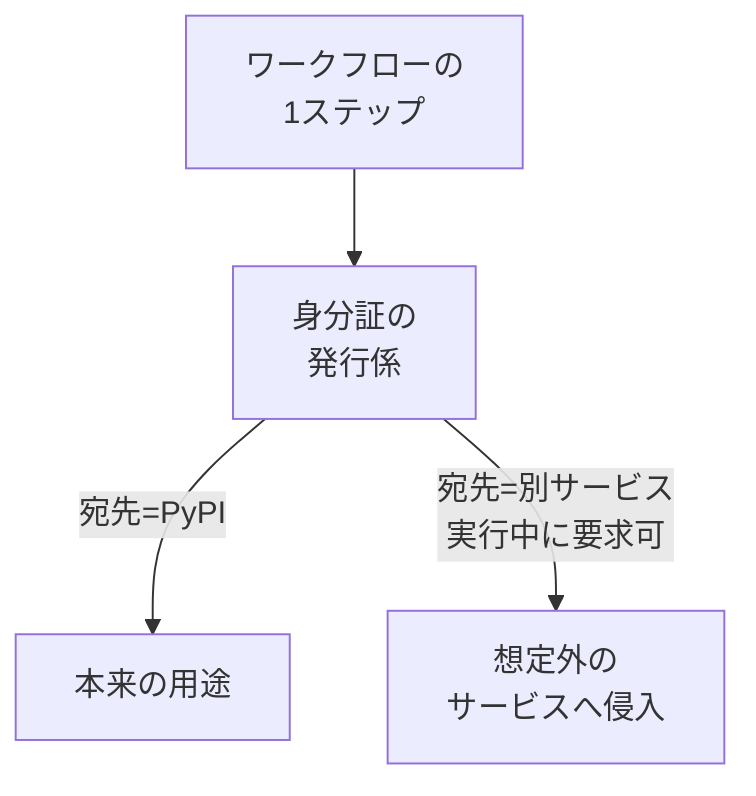

## AI

### [Muse Glimmer — 手元の1枚のGPUで動く30Bのエージェント向けモデル](https://research.meta.ai/blog/introducing-muse-glimmer-open-agentic-model)
<!-- categories: LLM, Meta, AI Agent -->

Metaが、常時動かしっぱなしのAIエージェント向けに設計した300億パラメータのモデル「Muse Glimmer」を公開し、重み（学習結果のデータ）をApache 2.0という制限のゆるいライセンスで配布した。MacやWindows PCに載っている一般向けのグラフィックボード1枚で動く大きさに収めてあり、ネットにつながっていなくても手元でAIを動かせる。狙っているのは、予定の管理・メッセージの下書き・ファイルの整理といった「自分の個人的な情報に深く触れる仕事」で、こうした用途はクラウドに送りたくない情報を扱うため、手元で完結することの価値が大きい。長い作業を最後までやり切る力、道具（外部ツール）を正確に呼び出す力、長い文脈を覚えておく力を、限られたメモリと計算能力の中で成立させるために、大きなモデルの知識を小さなモデルに移す新しい蒸留（じょうりゅう）手法を使ったという。llama.cpp・MLX・ExecuTorchといった、すでに広く使われている実行環境への対応も数日中に入る予定で、Hacker Newsやr/LocalLLaMAでは公開当日から「RTX 3090一枚に本当に載った」といった検証報告が相次いだ。

### [Claude Code、毎回の承認ボタンが不要な「自動モード」が標準設定に](https://techcrunch.com/2026/08/09/anthropic-is-turning-claude-codes-auto-mode-on-by-default)
<!-- categories: Claude Code, Anthropic -->

Anthropicが、Claude Codeの「自動モード」を8月14日からPro・Max・Teamの各プランで初期設定にすると発表した。従来はコマンドを実行するたびに人間に「実行してよいか」を尋ねていたが、自動モードでは「取り消せない操作・破壊的な操作・作業環境の外に出る操作」と判定されたときだけ止まり、それ以外は確認なしで進む。注目すべきは安全性のデータで、1,053人の有料テスターによる調査では、自動モードが有害な操作の89%を食い止めたのに対し、人間による確認では13.6%しか止められなかったという。理由として挙げられているのが「確認が習慣になってしまう」という現象で、実際にユーザーは表示された確認画面の97%をそのまま承認していた。人間の目視確認は、回数が増えるほど形骸化して機能しなくなる——という、レビュー全般に通じる話でもある。

### [AIエージェントの拡張機能をまとめる標準規格「Agent Plugins」登場](https://www.itmedia.co.jp/aiplus/article/2608/10/2000000487)
<!-- categories: AI Agent, MCP, Standards -->

Vercelが、AIエージェントの拡張機能をひとまとめに配布するための共通仕様「Agent Plugins」を発表した。エージェントが作業時に参照する手順書にあたる「Agent Skills」（SKILL.md）と、外部データへのつなぎ方を書いたMCPサーバの設定（mcp.json）を共通の形式で書き、複数のエージェントで同じものを使い回せるようにするのが狙いだ。策定の運営委員会にはOpenAI・Amazon・Cursor・Microsoftが参加しており、VS Code、Cursor、Kiro、GitHub Copilot、ChatGPT、Codexなどがすでに対応している。一方で、Agent Skills自体の発案元であるAnthropicの「Claude Code」「Claude Cowork」は現時点で未対応という、ねじれた状況になっている。同じ設定を各ツール向けに書き直す手間が消える一方、規格の主導権がどこに落ち着くかはまだ見えない。

### [OpenAI、次期モデル「Astra」を初の「サイバー重大リスク」に指定](https://gigazine.net/news/20260810-astra-cyber-capabilities)
<!-- categories: OpenAI, Security -->

OpenAIが、開発中の次期主力モデル「Astra」について、自社の安全基準（Preparedness Framework）におけるサイバーセキュリティ分野で初めて「critical（重大）」に分類したと明らかにした。この分類の基準は、モデルが人間の手を借りずに、実運用中の重要システムに対して未知の脆弱性を突く攻撃コードを作れる場合、あるいは大まかな目標を与えただけで攻撃の筋道を最後まで組み立てて実行できる場合、というものだ。評価はまだ途中だが予備段階で十分な性能が確認されており、「現時点で致命的なリスクを排除できない」と同社は述べている。対応として、隔離されたテスト環境の使用、ツールへのアクセス制限、モデルの重みの暗号化強化、監視の追加といった管理を導入し、条件を満たさない社内の作業は一時停止したという。AIの能力向上が「便利さ」ではなく「攻撃能力」として社内基準に引っかかった初めての事例であり、他社の安全基準にも波及しうる。

### [動画生成AI「MiniMax H3」がApache 2.0への移行を表明、収益制限の撤廃へ](https://pc.watch.impress.co.jp/docs/news/2131995.html)
<!-- categories: LLM, OSS -->

中国MiniMaxが、公開済みの動画生成AI「MiniMax H3」のライセンスを、将来的にApache 2.0へ移すつもりだと表明した。現行の独自ライセンスでは、商用利用自体は認められているものの、年間収益2,000万ドル（約31億円）を超える事業者は事前の書面許諾が必要で、画面上に目立つ形でクレジットを出す義務もあり、さらに米国・EU・英国・韓国のユーザーは利用申請が必要という制約が付いていた。Apache 2.0はこうした条件がほぼ無い代表的なライセンスなので、移行が実現すれば自社サービスへ組み込むハードルが大きく下がる。ただし同社は「著作権関連の問題が解決次第」と条件を付けており、まだ確定ではない。あわせて、画像を高解像度に作り直す「H3-Regenerate-2K」の公開や、計算回数を減らした軽量版、テキストから画像を作るモデルの公開も予告している。

## Infra

### [AIブームでメモリ価格が20年前の水準に逆戻り、DDR4は2年で約10倍](https://gigazine.net/news/20260810-ai-ram-price)
<!-- categories: Hardware, Business -->

AIデータセンター向けの高速メモリ（HBM）の需要急増が、個人向けPCのメモリ価格まで押し上げている。Stanford DAM Projectの長期データによると、2024年頃に1GBあたり約0.9ドルだったDDR4が2026年7月には約8.41ドルまで上がり、およそ2年で10倍規模の値上がりになった。現行世代のDDR5も2025年7月の1GBあたり2.2ドルから2026年7月には11.4ドルへと5倍以上に跳ね上がっている。研究者のダニエル・ルミール氏は、容量あたりの価格が2007〜2008年頃の水準まで戻った、つまり半導体の微細化で20年かけて積み上げた値下がりが数カ月で吹き飛んだと指摘する。イーロン・マスク氏は「生産量は年20%増だが需要は年200%以上」との見方を示しており、サーバーの増設計画も自作PCの見積もりも、当分は従来の常識が通じないことになる。

### [Docker Sandboxes — コーディングエージェントを使い捨ての箱の中で走らせる](https://www.docker.com/products/docker-sandboxes)
<!-- categories: Docker, AI Agent, Security -->

Dockerが、Claude Code・Gemini CLI・Copilot CLI・Codex・Kiro・OpenCodeといったコーディングAIを、隔離された使い捨ての環境で動かす「Docker Sandboxes」を公開した。各エージェントは専用のmicroVM（軽量な仮想マシン）の中で動き、そこにはあなたの開発環境と対象プロジェクトのフォルダだけが持ち込まれる。ホスト（手元のPC本体）には触れられないので、パッケージのインストールも設定ファイルの書き換えも、エージェント自身がDockerコンテナを立ち上げることさえ自由にやらせてよい。売り文句が「YOLOモードを安全に」で、権限確認をすべて飛ばす `--dangerously-skip-permissions` が初期設定になっているのが象徴的だ。前項のClaude Code自動モードと同じ流れ——「1つずつ人間が承認する」のをやめ、代わりに「壊れても困らない壁の中で走らせる」方向へ、業界全体が舵を切っている。

### [GitHub ActionsのOIDCトークンには「宛先」の制限が必要だ](https://blog.yossarian.net/2026/08/10/github-actions-needs-oidc-audience-constraints)
<!-- categories: GitHub Actions, Security, Supply Chain -->

GitHub Actionsは、ワークフローがPyPIなど外部サービスに対して「私は確かにこのリポジトリのこのワークフローです」と証明するために、OIDCという仕組みの身分証（トークン）を発行できる。問題は、この身分証の「宛先」（audience、誰宛に発行するか）を、ワークフローの実行中に何度でも自由に指定できてしまう点だ。GitLabでは宛先をワークフロー定義に静的に書かせるのに対し、GitHubは実行中のスクリプトが好きな宛先で取り直せるため、依存ライブラリの汚染などで1ステップでも乗っ取られると、本来無関係な別サービス宛の身分証まで作られてしまう。

著者は、宛先をワークフロー側で静的に宣言させる構文をGitHubに追加すべきだと提案している。Trusted PublishingやSigstoreといった、いま普及しつつある「鍵を持たない安全な公開」の土台がこの仕組みなので、影響範囲は広い。

### [Cloudflare「Agents Week」で発表されたものまとめ](https://blog.cloudflare.com/agents-week-review-august-2026)
<!-- categories: Cloudflare, AI Agent -->

Cloudflareが1週間かけて発表したAIエージェント向け機能を、自社でまとめ直した記事。初日は土台となる実行環境の話で、「エージェントに必要なのはコンテナではなくコンピュータだ」として、用途に応じて実行環境を選び分ける新ランタイム `@cloudflare/computer` を発表した。ほかに、PythonとJavaScriptのWorkers同士が直接呼び出せるようになったこと、Kimi・GLMといった大規模モデルを効率よく提供する工夫、利用料金をプログラムから取得できるBillable Usage API、音声AIの裏側を作れるTCP/gRPCの受け口の追加などが並ぶ。2日目以降は「エージェント開発ライフサイクル（ADLC）」という考え方と、その部品群が中心になっている。同社が繰り返し強調しているのは、難しさはもうモデル本体ではなく、身元管理・通信・段取り・記憶・監視・安全性の側に移ったという点だ。

### [SK Hynixが約6兆円を投じてメモリ工場を2つ新設](https://gigazine.net/news/20260810-sk-hynix-38b)
<!-- categories: Hardware, Datacenter -->

世界3大メモリメーカーの一角であるSK Hynixが、54兆ウォン（約6兆円）を投じて韓国に新工場2つを建てると発表した。ソウルの南約40kmにある龍仁（ヨンイン）の「Y2」に35.2兆ウォン（約4兆円）を投じ、約113万m²の敷地でHBMをはじめとする次世代DRAMを作る。もう1つは中部・清州（チョンジュ）の「M17」で19.1兆ウォン（約2兆円）、既存のNAND工場群と並べることで電力・水道のインフラを共用し、最短の工期で立ち上げる狙いだ。着工はY2が2027年7月、M17が2027年2月で、最初のクリーンルーム稼働はそれぞれ2029年6月・2028年12月と、供給が実際に増えるのは数年先になる。前述のメモリ価格高騰が短期では収まりにくいことを、この工期そのものが物語っている。

## Backend

### [Djangoが年1回のリリース周期へ移行、すべてのリリースがLTS扱いに](https://www.djangoproject.com/weblog/2026/aug/10/annual-release-cycle)
<!-- categories: Django, Python -->

Djangoの運営委員会が提案「DEP 20」を承認し、2028年1月から機能リリースを年1回にすると決めた。バージョン番号は年をそのまま使い、Django 2028、Django 2029と続く。最大の変更は、すべての機能リリースが従来のLTS（長期サポート）と同じ3年サポート——最初の1年は通常の不具合修正、その後2年はセキュリティとデータ破損の修正——になる点で、「LTS」という区分自体が廃止される。これまでは8カ月ごとのリリースだったため、LTSからLTSへ飛び移るときに2年分の変更を一気に取り込む必要があったが、今後は好きなタイミングで1年ずつ上げていけばよくなる。Pythonが毎年10月に新版を出すサイクルとも噛み合い、各Djangoは公開時点で最新3つのPythonをサポートする形に整理される。2028年より前は何も変わらず、Django 6.2 LTSまでの約束はそのまま維持される。

### [コーディングエージェントに最適な言語はどれか — 「動的型は省トークン」説の検証](https://danluu.com/pl-tokens)
<!-- categories: LLM, AI Agent -->

「動的型付けの言語のほうがコードが短く済むので、AIを動かす費用（トークン代）が安く上がる」——よく引用されるこの主張を、Dan Luu氏が自前の評価で検証した記事。元になった実験はRosetta Codeの簡単な課題を使っており、J言語が平均70トークン、Clojureが109トークンといった「そもそも問題が小さすぎる」比較だったと指摘する。そこで氏は、インターネットに繋がらない箱の中でzstd（圧縮形式）のデコーダを仕様書だけから丸ごと実装させる、という現実的な規模の課題で測り直した。結果は、AIの思考の深さを「中」に設定したときこそ動的型の言語が有利に見えるものの、「最大」に設定すると順位は入り乱れ、上位に静的型の言語のほうが多く並ぶという混合した結果になった。要するに、極端に小さい課題で出た倍率は、実務サイズの課題ではほぼ消える。評価の設計を疑わずに結論だけ引用すると簡単に間違える、という一般的な教訓でもある。

### [ORMは「遅いクエリを出した行」を隠してしまう](https://dev.to/truta446/your-orm-is-hiding-the-line-that-caused-the-slow-query-egm)
<!-- categories: Database, TypeScript -->

Node.js向けに「N+1問題」（一覧を出すために似たクエリを何十回も繰り返してしまう性能上の典型的な失敗）を実行時に見つける道具を作った人の記録。検出自体は初日にできたが、「どのソースコードの何行目が原因か」を突き止める部分に時間がかかったという。素のドライバなら `src/routes/orders.ts:47:38` のように行番号まで出せるのに、Drizzleというライブラリを通すと `<unknown call site>`（呼び出し元不明）になってしまった。原因を推測せず、ドライバが呼ばれた瞬間の呼び出し履歴（スタック）を丸ごと出力して調べる、という地道な進め方が記事の見どころだ。ORMのようにSQLを裏で組み立てる仕組みは便利な反面、問題が起きたときに「自分のコードとの対応」を失いやすい、という設計上のトレードオフがよく見える。

### [C言語の末尾呼び出し最適化は、実は比較的最近の話](https://lwn.net/Articles/1034703)
<!-- categories: C -->

関数の最後で別の関数を呼ぶだけの形（末尾呼び出し）は、呼び出しをジャンプに置き換えればスタックを消費せずに済む——この最適化がCコンパイラで実際に効くようになったのは、意外と最近だという指摘。理由はCの呼び出し規約にあり、引数を積んだ側（呼び出し元）が後片付けをする決まりだったため、呼び出しの直後に必ず後片付けの処理が入り、末尾呼び出しの形が崩れていた。1994年当時のCコンパイラはこの種の最適化をしておらず、GCCでは2001年にMark Probstが別の呼び出し規約を用意して実装したものの、間接呼び出し（関数ポインタ経由）には対応できないという制約が残っていた。投稿者が近年あらためて試したところ、gccもclangもこの形を最適化できるようになっており、インタプリタの命令分岐を末尾呼び出しで書く実装手法が現実的になったと報告している。

### [nixpkgsの雲行きが怪しい — コアチームが解散](https://foxgirl.engineering/blog/nixpkgs-not-hot)
<!-- categories: Nix, OSS -->

Nix／NixOS／nixpkgsの熱心な利用者による、プロジェクトの現状への率直な観察記事。nixpkgs（膨大なパッケージ定義の集まり）のコアチームが、メンバーの離脱が続いたことと、運営委員会（Steering Committee）が機能していないことを理由に解散を表明した。Nixは以前から、創始者による事実上の独裁体制から、複数のチームによる正式な統治体制への移行で揉めており、その構造がようやく落ち着いたと思われた矢先の出来事だ。著者は、Linuxシステムや開発環境の設定を極めて厳密に固定できるNixの価値を認めた上で、その価値が少数の保守者の消耗の上に成り立っている点を心配している。OSSの持続性の問題は目新しくないが、多くの開発環境の土台になっているプロジェクトで起きているという点で、他人事ではない。

## Frontend

### [Edgeも「Manifest V2」拡張機能の無効化を開始、従来型の広告ブロッカーに影響](https://gigazine.net/news/20260810-microsoft-edge-manifest-v3)
<!-- categories: Browser, Microsoft -->

Microsoftが、Edgeで古い拡張機能仕様「Manifest V2（MV2）」を2026年8月から段階的に無効化し、一般ユーザーは年内に移行を完了させると発表した。マニフェストとは拡張機能の名前・必要な権限・使えるAPIを書いた設定ファイルのことで、新仕様のMV3ではセキュリティ・プライバシー・動作速度の改善を目的に、通信を横取りして書き換える強力な仕組みが制限されている。そのため、MV2版のuBlock Originのような従来型の広告ブロッカーは使えなくなる見込みだ。ChromeはすでにMV2を2025年7月に全ユーザーで無効化済みで、Chromiumを土台とするEdgeもこれに追随する形になる。ただし移行はかなり進んでおり、Edge向けストアの主要なMV2拡張の95%はMV3対応済み、一定の利用者がいる残り58種類のうちMV3版が無いのは3種類だけだという。

### [Firefox 153、「コンテナ」機能が拡張機能から本体標準へ](https://blog.mozilla.org/en/firefox/firefox-containers-preview)
<!-- categories: Firefox, Browser -->

Mozillaが、Firefox 153で「コンテナ」機能を本体標準機能としてプレビュー公開した。コンテナとは、同じウィンドウの中で「仕事」「買い物」「個人」「銀行」といった区画を分け、それぞれでCookieや広告追跡の情報を切り離す仕組みだ。パーティー用の帽子を1回検索しただけで、その後何週間も帽子の広告が付いて回る——といった追跡が、区画をまたがなくなる。これまでは「Multi-Account Containers」という拡張機能として10年近く提供されてきたが、探して入れる必要があったため、標準搭載にして最初から見える状態にした。Mozillaは、既存の拡張機能の使い勝手・柔軟さ・見た目をそのまま引き継ぎつつ、正式な機能として今後も投資を続けると説明している。

### [ブラウザ内蔵AI（Built-In AI API）は思ったより悪くない](https://d.potato4d.me/entry/20260808-chrome-build-in-ai)
<!-- categories: Chrome, JavaScript, LLM -->

Chromeに内蔵されたAIを使うBuilt-In AI APIについて、実際の使いどころを整理した記事。翻訳・要約・言語判定に特化したAPIが2025年6月から、汎用的に使えるPrompt APIが2026年5月から利用でき、今年の春にPrompt APIがChromeへ既定で組み込まれた。最大の利点は、APIキーの用意も課金も不要で、処理がすべて利用者の端末の中で完結すること——鍵の漏洩も使いすぎによる高額請求も起きない。一方の弱点はモデルの小ささで、中身はGemini Nanoという2B〜4Bクラスの専用モデルに固定されており、性能はGemma 3n〜Gemma 4程度と見られる。したがってアプリの根幹を任せる用途には向かず、「自由入力のバリデーションをちょっと賢くする」程度の、外れても致命的でない補助に使うのが現実的だという整理だ。

### [トグルスイッチは有害である](https://ignorethecode.net/blog/2026/08/09/toggles_considered_harmful)
<!-- categories: Design, Accessibility -->

macOSの設定画面に、オン・オフを切り替えるトグルスイッチが4種類の異なるグレーで並んでいる——という指摘をきっかけに、そもそもトグルという部品自体が悪いのだと論じた記事。物理世界のトグルスイッチが機能するのは、両脇にオン・オフのラベルがあり、通電を示すランプが付いているからで、スイッチ本体は左右対称でそれだけでは状態が分からない。画面上のトグルも同じで、「左が切、右が入」と知っている人以外には現在の状態が読み取れず、Appleが状態を分かりやすくしようと色を足した結果が、あの4種類のグレーだという。解決策はシンプルで、状態がひと目で分かる部品（チェックボックスなど）を使えばよい。なおmacOSには「色に頼らず区別する」というアクセシビリティ設定があり、これを有効にするとトグルに小さなオン・オフ表示が付く。

### [ライト／ダーク／システム設定の切り替えUIをどう作るか](https://vale.rocks/micros/20260810-0330)
<!-- categories: CSS, Design -->

Lea Verou氏の「ダークモードの切り替えは2状態で十分」という主張への反論として書かれた短い記事。2状態案では「システム設定に従う」がボタン上の見た目に溶け込む形になるが、著者はそれを「魔法じみていて、自分から操作権を取り上げられた感じがする」と評し、実際にデモを触っても毎回引っかかってしまうと述べている。かといって著者自身がこれまで使ってきた「押すたびにライト→ダーク→システムと巡回するボタン」も最適とは言えず、全部押してみるまで選択肢が見えない、システム設定と同じ見た目のテーマへ切り替えたときに何も変化せず操作した実感が消える、といった問題を抱えていると認めている。トグルの状態が読み取れないという前項の話とも地続きで、「省スペース」と「状態と選択肢が一目で分かること」のどちらを取るかという設計上の綱引きになっている。

## Others

### [AI議事録サービスtl;dv、18万件超の会議データが誰でも見られる状態だった](https://bobdahacker.com/blog/tldv-hack)
<!-- categories: Security, Incident -->

Google MeetやZoomの通話にボットを入れて録画・文字起こしをするAI議事録サービス「tl;dv」で、181,874件もの会議記録が、利用者なら誰でも他人の分まで読める状態になっていたという報告。原因は、認証後に払い出されるFirebaseのトークンで参照できるデータベースの `meetings` コレクションに、テナント分離（利用者ごとの仕切り）が一切無かったこと。取得できるのは作成者のメールアドレス、会議のID、録画状態、日時などで、録画中の会議IDはそのまま参加できる生きた会議室の入り口になっていた。報告者は実際にマレーシア教育省の157人が参加する会議に外部から入れてしまったと書いている。最も重いのは時系列で、2026年1月28日に報告してから半年以上、CTOからの返信は無く公開時点でも修正されていないという点だ。商談・採用面接・人事評価といった中身を預けるサービスだけに、影響は大きい。

### [物流大手Ceva Logisticsへの侵入被害が、銀行・小売・Steamユーザーにまで波及](https://techcrunch.com/2026/08/10/a-data-breach-at-shipping-giant-ceva-logistics-is-rippling-across-banks-retailers-steam-gamers-and-beyond)
<!-- categories: Security, Incident -->

世界最大級の物流企業Ceva Logisticsが不正侵入を受け、同社に配送を委託していた複数の企業から「うちの顧客の個人情報も盗まれた」という報告が相次いでいる。同社はTechCrunchに対し、欧州で商品配送に使っている少なくとも8つの倉庫に影響が出ていると認めた。業界誌FreightWavesによれば侵入は7月29日に始まり、該当倉庫の商品の配送遅延を引き起こしている。Cevaはフランスに本社を置き、2025年の売上高は183億ドル、世界に1,000以上の倉庫を持つ。物流大手が近年狙われやすくなっているのは、トラックやコンテナの動きに手を出せば現物の商品そのものを奪えるからで、被害が自社の情報にとどまらず取引先の顧客情報へ連鎖する点が、委託先のセキュリティを見る難しさを示している。

### [noreply.netを買った研究者のもとに、企業の秘密が届き続けている](https://arstechnica.com/security/2026/08/a-researcher-bought-noreply-net-companies-started-sending-him-secrets)
<!-- categories: Security, DNS -->

セキュリティ研究者のCory Solovewicz氏が `noreply.us`（2020年取得）と `noreply.net`（2024年取得）というドメインを持ったところ、企業が誤って送った他人の個人情報や社内の機密が大量に届くようになった。2024年12月以降、片方のドメインだけで401,796通、1日平均700通のペースだという。届いた中身は、自治体からの事故報告、ピザの注文確認、学校のプラットフォームのアカウント開設通知、修理の作業指示、テスト環境の認証情報など幅広い。原因は、企業が「返信不要」を示すつもりで `会社名@noreply.net` のような宛先を送信元や送信先に設定し、そのドメインが実在して誰かの手にあるとは考えていないこと。氏自身が「偶然できたハニーポット（おとりの罠）」と表現しているとおり、設定ファイルに何気なく書いた架空のドメインが、実際には他人の受信箱につながっている可能性がある。

### [防いだはずのSpectre v2が再燃、割り込みを差し込むと最新の対策をすり抜ける](https://pc.watch.impress.co.jp/docs/news/2131904.html)
<!-- categories: Security, Hardware -->

MITのCSAILの研究チームが、2018年に大騒ぎになったCPUの投機実行脆弱性「Spectre v2」への緩和策に、いまだ隙が残っていることを発見した。Spectre v2は、CPUが処理を先読みして実行する仕組みを悪用し、分岐予測に使う内部バッファをわざと汚染することで、本来読めないカーネル内の機密データを読み出させる攻撃だ。これに対する定石の防御は、カーネルへ入る瞬間などにバッファの中身を強制的に消す「無効化」だった。研究チームが突いたのは、バッファを消してから実際にそれが使われるまでのごくわずかな時間差で、そこに割り込みを差し込むことで対策をすり抜けられるという。ハードウェア設計に起因する脆弱性は、ソフト側の対策が「消した直後は安全」といった前提に立つ限り、こうしたタイミングの隙が繰り返し見つかることを示す例だ。

### [冷やさなくていい国産量子コンピューター「MoQuren」が本格稼働](https://www.gizmodo.jp/article/moquren_launch)
<!-- categories: Science, Hardware -->

産業技術総合研究所（産総研）と東京大学発のベンチャーOptQCが、常温・常圧で動く光方式の量子コンピューター「MoQuren（モクレン）」の稼働を発表した。先行している超伝導方式は、量子ビットの状態を保つために絶対零度（マイナス273℃）近くまで冷やし続ける必要があり、巨大な冷却装置と専用の設置場所が要る。光方式は光の粒（光子）を量子ビットとして使うため極低温も高真空も不要で、特別な部屋を用意しなくてよいのが最大の売りだ。設置先は産総研G-QuATが構築中の計算基盤「ABCI-Q」で、スーパーコンピューターと複数方式の量子コンピューターを組み合わせる実験場に、光方式の駒が1つ加わった形になる。OptQCはSDKを無償提供し、実機が空くのを待たずに手元のPCで動作を試せる環境も順次整えて、年内にはクラウド経由での利用を目指すという。
