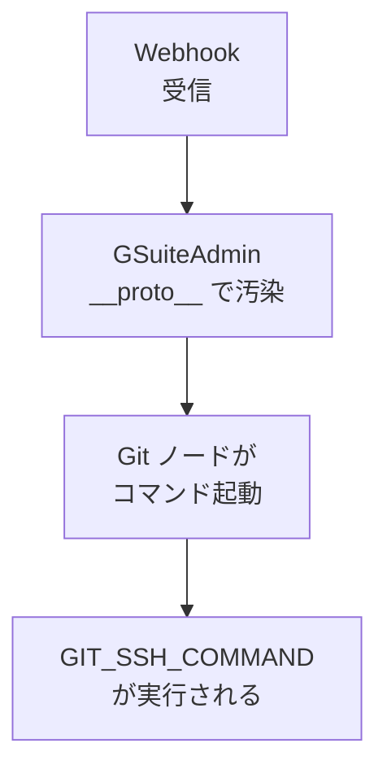

## AI

### [タブもテーマも拡張機能もないAI専用の超軽量ヘッドレスブラウザ「Kitesurf」、Cloudflareが発表](https://www.publickey1.jp/blog/26/aikitesurfcloudflare.html)
<!-- categories: Cloudflare, AI Agent, Browser -->

Cloudflareが、AIエージェント専用に作り直したブラウザ「Kitesurf」をベータ公開した。人間が使うブラウザに必要なタブ・ブックマーク・拡張機能・パスワード管理といった機能を最初から一切持たず、「AIがWebページを読み取る」という一点だけに絞った設計になっている。中身はRust言語で書かれてWebAssembly（ブラウザやサーバーで動く軽量な実行形式）にコンパイルされ、Cloudflare Workers上で走る。ChromiumやNode.jsに依存しないため、CPUとメモリの効率がChromium比で3〜7倍良いとされ、同じサーバー費用でずっと多くのAIエージェントを同時に動かせる。既存のPuppeteerやPlaywrightといった自動操作ツールがそのまま繋がる（Chrome DevTools Protocol対応）ので、乗り換えのハードルも低い。AIエージェントにWeb操作をさせる構成が当たり前になりつつある今、その土台のコストを一桁下げにいく動きとして重要だ。

### [アリババのAI「Qwen」が6カ月間に30億回ダウンロードされる世界1位のAIモデルに](https://gigazine.net/news/20260816-alibaba-qwen-3-billion-downloads)
<!-- categories: Qwen, OSS, Hugging Face -->

アリババが公開しているAIモデル「Qwen」が、直近6カ月で累計30億回ダウンロードされ、世界一の座に立った。AIモデルの公開場所として使われるHugging Faceでの2026年のダウンロード数を見ると、Qwenの20億回に対しBAAIが5億1900万回、Googleが4億1800万回、OpenAIが3億2900万回と、大きく引き離している。Qwenをもとに誰かが手を加えて作り直した「派生モデル」も15万1448個あり、Googleの8万2506個の約2倍にあたる。強さの理由として記事は、リリースの頻度が高いこと、小さいものから大きいものまでサイズの選択肢が広いこと、そして商用利用も改造も自由なApache 2.0ライセンスを採っていることを挙げている。実際にダウンロードされたモデルの47%は10億〜80億パラメータの中小型で、手元のPCで動かせる実用サイズが支持されていることがわかる。

### [Claude: System Prompts](https://platform.claude.com/docs/en/release-notes/system-prompts)
<!-- categories: Anthropic, Claude, LLM -->

Anthropicが、claude.aiやスマホアプリで使われている「システムプロンプト」（AIに毎回こっそり渡している基本の指示書）を公開しているページが、Hacker Newsで大きく注目を集めた。Claude Opus 5、Fable 5、Opus 4.8、Opus 4.7、Sonnet 4.6などモデルごとに全文が載っており、どんな製品があるかの説明、児童保護に関する厳格な禁止事項、武器や悪意あるコードの依頼を断る方針、箇条書きを多用しない文章のトーン指定、知識の締め切り時期、政治的に割れる話題を公平に扱う指示などが並ぶ。API経由では適用されないため、同じモデルでもチャット画面とAPIで振る舞いが違う理由がここから読み取れる。Fable 5では危険度の高い話題を自動的にOpus 5へ振り向ける仕組みが入っているなど、モデルの内部設計が透けて見える点で、プロンプトを書く人にとって一次資料として価値が高い。

### [The AI Credit Resale Economy](https://vectoral.com/blog/who-are-the-token-brokers)
<!-- categories: LLM, Business -->

OpenAIやAnthropic、Google、Microsoftが配った「使い切れなかったAPI利用枠（クレジット）」を安く買い集めて転売する、いわば金券ショップのような二次流通市場が育っているという調査記事。売り手はアクセラレータや販促キャンペーンで大量の枠をもらったまま使い残しているスタートアップで、仲介業者（トークンブローカー）が定価の40〜50%引きで買い取り、別の会社へ流している。専用のマーケットサイト、大量購入をうたう「格安ルーター」、Telegramや非公開グループでの闇取引まで経路は幅広く、受け渡し方法もAPIキーを直接渡すものから、複数の認証情報をまとめて中継するプロキシ経由まである。後者は仲介業者が直接の責任を負いにくくする狙いがあると指摘されている。筆者は「トークンが疑似通貨になった」と表現しており、各社の利用規約違反として取り締まりが入るのは時間の問題だとみている。安いからと手を出すと、ある日突然アカウントごと止まるリスクがある話だ。

### [Zed開発チームが「Delta」発表。人間とAIの全対話とコード変更履歴をコンテキストとして保存共有するコラボレーションツール](https://www.publickey1.jp/blog/26/zeddeltaai.html)
<!-- categories: AI Agent, OSS -->

コードエディタ「Zed」の開発チームが、人間とAIエージェントの共同作業を丸ごと記録する新ツール「Delta」を発表した。AIとのチャット内容、与えた指示（プロンプト）、そこから生まれたコード変更のすべてを「DeltaDB」というデータベースに保存し、チームで共有する。狙いは「なぜこのコードはこう書かれたのか」という背景の保存だ。AIに書かせたコードは、後から読んだ人（半年後の自分を含む）にとって意図がわからず手を出せない、という問題が起きやすい。Deltaはそのとき当時の議論をそのまま引ける状態にする。Webブラウザからもアクセスでき、Claude Codeとの連携も予定されているため、Zed利用者以外にも波及しうる。コードそのものより「決定の経緯」が希少資源になりつつある状況への回答になっている。

## Infra

### [テクノロジー企業がデータセンターのエネルギーコストを負担しなければならないとする法案が進行中](https://gigazine.net/news/20260816-tech-company-pay-data-center-cost)
<!-- categories: Datacenter, Business -->

アメリカ下院のエネルギー・商業委員会が、料金負担者保護法案（H.R.9340）を賛成52・反対0の全会一致で可決した。内容は、ピーク時に合計100MW以上の電力を使うデータセンターを運営する企業と契約する電力会社に対し、その電力を届けるために必要な発電所・送電線・配電設備の費用を全額その企業から回収するよう義務づけるものだ。当初は「100MW以上を使う全企業」が対象だったが、鉄鋼メーカーなど製造業の負担が重すぎるとして、ITインフラとデータ保管・計算システムを運用する企業に絞る修正が入った。これまでAmazonやGoogle、Metaは「自分たちの分は自分で払う」と自主的に宣言するだけだったが、法律として強制力を持つ形に変わる。AI向けデータセンターの建設ラッシュで一般家庭の電気代が上がる、という不満への直接的な回答であり、可決すればクラウドの原価構造にそのまま効いてくる。

### [How we cut our Prometheus / VictoriaMetrics storage bill 60% ($4,900 → $1,950/mo) with a cardinality audit](https://www.reddit.com/r/sre/comments/1vq1348/how_we_cut_our_prometheus_victoriametrics_storage)
<!-- categories: Observability, SRE -->

監視データの保管費用が月4,900ドルまで膨れ上がり、「監視がデータベースより高いのはなぜか」と経理から突っ込まれたチームの改善記録。1週間かけて指標を1つずつ「誰かがこれを検索しているか、ラベルの値は全部必要か」と点検した結果、時系列データを3億4000万本から1億2800万本に減らし、月1,950ドル（60%減）まで下げた。ダッシュボードもアラートも壊していない。最大の犯人は1つの指標で、URLを`/users/:id`のようなパターンにまとめず、ユーザーIDや注文IDが埋まった生のURLをそのまま記録していたため、それだけでクラスタ全体の16%を占めていた。ほかに「30日以上誰も検索していない指標が340個そのまま課金され続けていた」こと、「集計ルール（recording rules）は検索を速くするだけで保管費用は減らない」という誤解も指摘されている。再発防止として`sample_limit`を入れ、ラベルが暴走したら翌月の請求書ではなくその場でエラーとして気づけるようにした。

### [障害対応の「優先順位」を仕組みにできないか - Operation Decision Recordsという着想](https://zenn.dev/yyoosshh/articles/d7b3fcdbd90de2)
<!-- categories: SRE, Incident -->

障害が起きたとき「まず何から手を付けるか」の判断が、結局その場にいるベテランの経験頼みになっている——という問題意識から、運用上の判断基準を文書として残す「Operation Decision Records（ODR）」を提案した記事。設計判断を残すADR（Architecture Decision Records）の運用版という位置づけで、対象は設計ではなく運用、書かれるタイミングは設計レビュー時ではなく障害対応の最中、読み手は開発者ではなくオンコール担当者とAIエージェント、という違いがある。特徴は「陳腐化しやすい」ことを最初から前提に置いている点で、`Review-by`（いつ見直すか）と`Invalidation`（どうなったら無効か）を書式に組み込み、古い判断基準がそのまま生き残らないようにしている。暗黙知を外に出す型として軽く、AIに引き継ぐ前提で設計されているのが今風だ。

### [Terraform Provider Plugin Cache を使ってください。](https://dev.classmethod.jp/articles/terraform-provider-plugin-cache-must-use)
<!-- categories: Terraform, DevOps -->

Terraformを複数プロジェクトで使っていると、各プロジェクトの`.terraform`フォルダに同じプロバイダー（AWSなどを操作する部品）のバイナリが何度もコピーされ、ディスクを静かに食い潰す。筆者の環境では累計81GBに達していた。これを防ぐのがProvider Plugin Cacheで、ダウンロード済みのバイナリを共通の置き場に1つだけ保管し、各プロジェクトからはそこへのショートカット（シンボリックリンク）を張る仕組みだ。導入後、あるプロジェクトの`.terraform`は778MBから0Bになった。設定は環境変数`TF_PLUGIN_CACHE_DIR`を指定するか、`$HOME/.terraformrc`に`plugin_cache_dir`を書くだけで済む。バージョンが違うプロバイダーは別々に保管されるため複数バージョンを使うと容量は増えるが、同一バージョンの重複はなくなる。プロジェクト数が多いほど効く、コストゼロの改善。

### [Cloud Run でキャッシュを保持したいなら、課金モードではなく最小インスタンス数](https://qiita.com/k-nakatani/items/4e0b46f0fb4bfe7ff4a1)
<!-- categories: Google Cloud -->

Google CloudのCloud Runで「メモリ上のキャッシュを消したくないから、課金モードを常時CPU割り当て（instance-based）にしなければ」と思い込み、月40ドルほど無駄に払っていたという検証記事。実際には2つの設定は役割が別物で、キャッシュが残るかどうかを決めるのは「最小インスタンス数」（コンテナを起動しっぱなしにする設定）であり、課金モードはリクエストを処理していない間もCPUを割り当てるかどうかを決めているだけだ。したがって最小インスタンス数を1以上にしておけば、課金モードをリクエスト単位（request-based）に戻してもキャッシュは消えない。常時CPU割り当てが本当に必要なのは、リクエストが来ていない間にもバックグラウンドで処理を走らせたい場合に限られ、定期実行が目的ならCloud Schedulerなど外部から叩く形にすれば不要になる。アクセスがまばらなサービスほど効く見直しどころだ。

## Backend

### [CVE-2026-33696: From a Schema Name to RCE in n8n](https://simonkoeck.com/writeups/n8n-gsuiteadmin-prototype-pollution-rce)
<!-- categories: Security, JavaScript -->

業務自動化ツールn8nに、HTTPリクエスト1発でサーバー上の任意のコマンドを実行できる深刻な脆弱性（深刻度9.4）が見つかった報告。原因はGSuiteAdminノードが、ユーザーの入力したスキーマ名を検証せずそのままオブジェクトのキーに使っていた点にある（`customSchemas[schemaName] ??= {}`）。ここに`__proto__`という特別な名前を入れると、JavaScriptの全オブジェクトが共通して参照する「ひな型」を書き換えられてしまう（プロトタイプ汚染）。汚染しただけでは何も起きないが、後続のGitノードが外部コマンドを起動する際、ひな型に仕込まれた`GIT_SSH_COMMAND`という環境変数を一緒に持って行ってしまい、そこに書いた任意のシェルコマンドが実行される。

n8nは各種サービスの認証情報を暗号化して保管しているため、乗っ取られると全部の鍵が持ち出される。修正は、キーとして使う前に`__proto__`・`constructor`・`prototype`を弾くか、`Object.create(null)`でひな型を持たないオブジェクトを使う、という定石どおりの対応だ。

### [What's missing to have reproducible builds on PyPI](https://snarky.ca/whats-missing-to-have-reproducible-builds-on-pypi)
<!-- categories: Python, Supply Chain -->

Pythonのパッケージ配布サイトPyPIで「再現可能なビルド」（同じソースから誰がビルドしても1ビットも違わない成果物が出ること）を実現するには何が足りないか、を整理した記事。これができると、配布されているファイルが本当にそのソースコードから作られたものかを第三者が独立に検証でき、ビルドの途中で悪意あるコードを混ぜ込むタイプの攻撃を検知できる。SolarWindsの事件がまさにこの型だった。足りないピースは3つ挙げられている。1つ目は「どのソースコードから作られたか」の記録がパッケージに入っていないこと。2つ目は、wheel形式にはビルドに使ったツールの一覧（SBOM）を入れられるが、sdist形式は「PKG-INFOが入っただけのtarball」なので置き場所がないこと。3つ目は、ビルドを実行した環境そのものの記録が残らないこと。解決案として、信頼できる検証者が再ビルドを試み、成功したらPyPIに知らせて「検証済み」と表示する仕組みが提案されている。

### [Protecting the Rust standard library from accidental breakage](https://predr.ag/blog/protecting-the-rust-stdlib-from-breakage)
<!-- categories: Rust, OSS -->

Rustの標準ライブラリが、うっかり互換性を壊す変更を入れてしまう事故を防ぐため、`cargo-semver-checks`という自動チェックツールを導入した話。過去には、2020年に安定版のトレイトへ未安定のメソッドを足して`async-std`が壊れた、2021年に`where Self: Sized`を書き忘れて`BuildHasher`がトレイトオブジェクトとして使えなくなった、2022年にイテレータの変更で`Send`/`Sync`が消えた、といった事故が繰り返し起きており、人間のレビューでは毎回見落とされてきた。導入にあたって難しかったのは、標準ライブラリには「まだ安定していないAPI」が大量にあり、それらは壊してよいという点だ。そこで、rustdocのJSON出力に`Item::stability`など安定性を示す情報を新たに載せ、既存の`#[doc(hidden)]`（内部用として隠されたAPI）を扱う仕組みに相乗りさせることで、数百あるチェック項目を書き直さずに済ませた。新しく書くチェックも自然に正しく動く設計になっている。

### [I thought I was building a C replacement. I was wrong](https://c3-lang.org/blog/i_thought_i_was_building_a_c_replacement)
<!-- categories: C, OSS -->

プログラミング言語C3の作者Christoffer Lernöが、自分の言語の位置づけを長年伝え間違えていたと認めた記事。彼はC3を「Cの代替」と紹介してきたが、この言葉は今と昔で意味が違う。かつてのCは普通のアプリを書くための言語だったのに、現在のCはOS・組み込み・性能が要る一部のライブラリに使われる言語になっている。そのため「Cの代替」と聞いた人は「OSや組み込みでCを置き換えるもの」と受け取ってしまい、作者が本当に意図していた「Cを現代的に手直しして、また普通のアプリを書ける快適な言語にする」——つまりC++やJava、Swiftが使われている領域を狙う——という話が伝わらなかった。設計思想として彼は、オブジェクト指向が最初に構造を決めておくことを要求するせいで、思いついたそばから書き換えていく探索的な開発がしづらくなる点を挙げ、C3は手続き型の素直さを保ったまま文字列・配列・メモリ安全性といった現代的な使い勝手を足す方向を選んだと述べている。

### [無料で使える「Delphi 13 Community Edtion」提供開始。Windows x86/Arm、Mac、iOS、Androidのネイティブアプリなど開発可能](https://www.publickey1.jp/blog/26/delphi_13_community_edtionwindows_x86armmaciosandroid.html)
<!-- categories: Windows -->

エンバカデロ・テクノロジーズが、統合開発環境Delphiの最新版13を無料で使えるCommunity Editionとして提供開始した。対象は学生、趣味の開発者、年間売上5,000ドル以下の個人開発者、従業員5人以下のスタートアップで、条件を満たせば有償のProfessional Editionとほぼ同じ機能が使える。1つのソースコードからWindows（x86とArmの両方）、macOS、iOS、Androidそれぞれのネイティブアプリを生成でき、今回から64ビット対応になった。コード補完などを担うLanguage Serverによる高速化や、作業に集中するためのフォーカスモードなども入っている。Delphiは業務システムの現場に古くから根を張っている環境で、無料版の敷居が下がることは既存資産の保守要員を育てるうえでも効いてくる。

## Frontend

### [Adobe Acrobatの自動更新が有効になっていると、Adobe Express Photosが勝手にインストールされる件](https://coliss.com/articles/build-websites/operation/work/adobe-express-photos-is-being-installed-automatically.html)
<!-- categories: Windows -->

Windows環境でAdobe Acrobatの自動更新を有効にしていると、頼んでいない「Adobe Express Photos」が勝手にインストールされる、という2026年6月初旬からの挙動についての注意喚起。厄介なのはアンインストールしても次の自動更新でまた入ってくる点だ。実害として報告されているのは画面キャプチャ周りの乗っ取りで、Print Screenキーや`Win+Shift+S`をこのアプリが横取りするほか、Outlookにスクリーンショットを貼ろうとすると本文に画像として入らず添付ファイルになってしまう。対象になるのはWindows環境でAcrobat StudioまたはAcrobat Expressを使い、自動更新が有効な場合。回避策としてレジストリの`HKEY_LOCAL_MACHINE\SOFTWARE\Policies\Adobe\Adobe Acrobat\DC\FeatureLockDown`に`bDisableHarmonyInstallationFeature`（REG_DWORD、値1）を作る方法が示されている。業務PCを配布している側は、社内で同じ問い合わせが来る前に手を打っておきたい。

### [You can just choose how many bugs you want now](https://nolanlawson.com/2026/08/16/you-can-just-choose-how-many-bugs-you-want-now)
<!-- categories: Testing, LLM -->

AIを使ったコーディングが広まってもソフトの品質が上がっていないのはなぜか、を論じた記事。筆者の見立てはこうだ——AIエージェントは何年も誰も気づかなかった細かいバグを次々に掘り出せるようになった。つまり「バグを見つける能力」は手に入ったが、「それを直す動機」は手に入っていない。だから今や「自分のソフトにバグをいくつ残すかは選べる」状態になった。直しても目立たないバグ修正より、目に見える新機能のほうが評価される。開発速度が10倍になれば、増えるのは品質ではなく機能の数だ。加えて、AIが出してくるバグ報告を人間が1件ずつ精査する作業は消耗が激しい。対処として筆者は、場当たりの修正を重ねる（記事の言葉で「周転円を足す」）のをやめて構造から直すこと、エージェントを正しい方向へ導くためにテストを厚くすること、そしてシングルページアプリではなく複数ページ構成にするなど設計そのものを単純にしてバグの発生余地ごと消すこと、の3つを挙げている。

### [Stop Hand-Rolling Chat UIs: Streaming LLM Tokens Into React Native Without the Jank](https://hackernoon.com/stop-hand-rolling-chat-uis-streaming-llm-tokens-into-react-native-without-the-jank)
<!-- categories: React, LLM -->

チャット画面は「吹き出しの一覧と下部の入力欄」だけに見えて、React Nativeでまともに作るのは非常に難しい、という実装記。理由は、スマホで最も扱いにくい2つの要素——ソフトウェアキーボードと、見ている最中に高さが変わるスクロールリスト——の上に成り立っているからだ。しかもAIの返答をトークン単位で流し込む（ストリーミング）と、数百ミリ秒ごとに末尾の吹き出しが伸び続け、リストが毎フレーム成長する。その間もユーザーは入力したりスクロールしたりキーボードを閉じたりする。この一点が「FlatListで済むだろう」を数週間の作業に変える。筆者は定番のreact-native-gifted-chatが古くなってデータ構造への制約が強いことから自作に踏み切り、崩壊の原因を突き止めるのに1週間かかったと書いている。AIチャットをアプリに載せる案件が増えている今、同じ罠を踏む前に読んでおく価値がある。

### [How I Run A/B Tests in a Chrome Extension (Without Re-Releasing to the Store)](https://hackernoon.com/how-i-run-ab-tests-in-a-chrome-extension-without-re-releasing-to-the-store)
<!-- categories: Chrome, Testing -->

利用者35万人のデザイン比較ツールPerfectPixelの作者が、ブラウザ拡張機能でA/Bテスト（2案を出し分けて反応を比べる実験）を回すための仕組みを自作しOSS公開した話。Webサイトと違い拡張機能は、更新のたびにストアの審査と配信を通す必要があり、行き渡るまで数週間かかることもある。だから「実験の開始・停止をアプリの更新なしに切り替えられること」が必須要件になる。設計の要は、リモートサーバーに置いた静的なJSONファイルを司令塔にする点だ。実験ごとに有効・無効を切り替えられ、勝ちパターンが決まったら`pin`フィールドで全員をそちらに固定できる。サイト側のCORS/CSP制限を避けるため、設定の取得はservice worker側で行い、各画面からはメッセージ経由で受け取る。振り分け結果は`chrome.storage.local`に保存され、拡張機能を更新しても消えず、Webページや他の拡張からは読めない。

### [AIエージェントの作業結果、マークダウンで読むの辛くない？ →「HTML共有くん」を作りました](https://qiita.com/minorun365/items/320b4230c0b0c169ba13)
<!-- categories: AWS, AI Agent -->

Claude CodeなどのAIエージェントに仕事を任せると、成果物のHTMLファイルが案件フォルダにどんどん溜まる。それをスマホから見たりチームに渡したりするのが面倒だ、という不満から作られた共有ダッシュボードのOSS。`file://`で開くURLはiPhoneのSafariが対応しておらず、Google Driveは権限設定が煩雑、チャットを閉じると成果物にたどり着けない——といった細かい詰まりを潰しにいっている。構成はS3とCloudFrontというシンプルなもので、認証はCognito（パスキー方式、緊急時はメールにワンタイムコード）。期限付きの共有URLはHMAC-SHA256の署名方式にしてあり、サーバー側に状態を持たないため管理が要らない。認証と署名の検証はCloudFront Functionでエッジ側に寄せている。配信時にAIが動かないのでAWS費用もトークン代もほぼかからず、日本語で指示するだけで自動公開される点が特徴だ。

## Others

### [Anthropic CEO says AI backlash is 'fundamentally a crisis of trust'](https://techcrunch.com/2026/08/16/anthropic-ceo-says-ai-backlash-is-fundamentally-a-crisis-of-trust)
<!-- categories: Anthropic, Business -->

AnthropicのCEOダリオ・アモデイが、投資家Gavin Bakerからの「あなたの安全性に関する警告がAIへの世間の反発を煽っている」という批判に反論した。アモデイは自分の発信は「リスクと恩恵でほぼ均等」であり、明るい未来像を描いたエッセイ「Machines of Loving Grace」も書いていると述べたうえで、問題の本質を別のところに置いた。「これは根本的に信頼の危機だ」——人々は企業も政府もテック業界も信じておらず、それは何十年もかけて積み上がってきた不信であって、AIへの反発はその最新形にすぎない、という見立てだ。そのうえで最も的を射た批判として「我々はまだ世界に役立つという大きな約束を果たしていない」ことを認めた。規制についても、AIを野放しにするか権力が集中するかの二者択一は誤りだとし、Anthropicは自社を含む最先端企業に不利で小規模事業者に有利になるよう提案を設計していると説明している。

### [Software Engineering fundamentals matter more than ever](https://rhonabwy.com/2026/08/15/software-engineering-fundamentals-matter-more-than-ever)
<!-- categories: LLM -->

AIエージェントの話題が過熱するほど、ソフトウェアエンジニアリングの基礎の価値は上がる、と論じた記事。筆者Joseph Heckは「LLMは推論しているのではなく予測している」「人類の知識を圧縮したもの」だと整理し、動くコードは書けても「どう組み合わせるか」という設計判断は苦手なままだと指摘する。彼は溶接の経験を引き合いに、「できるかどうか」と「組み替えられ、デバッグでき、保守できるものを作れるか」はまったく別の技能だと述べ、本当の腕の見せどころはAPIやインターフェイスといった「継ぎ目」の管理にあるとする。一方でAIを否定しているわけではなく、テストを先に書いて赤→緑で進めるTDDとエージェントの組み合わせは品質を上げる、簡潔で良質なデータと機械的に正誤を判定できる道具を渡せばAIは自分で誤りを直せる、という具体策も挙げている。抽象化の選び方や認知負荷の管理といった、道具が肩代わりしてくれない部分こそ意識的に鍛えるべきだ、という結論だ。

### [【インシデント報告】Defender が有効なのに、開発機で5日間マイニングされていた](https://qiita.com/claudecat/items/fd8f449f1dddcc9f31fe)
<!-- categories: Security, Incident, Windows -->

自宅のWindows 11開発機で、暗号通貨の採掘プログラム（XMRig）が管理者権限のまま約5日間動き続けていた、という詳細なインシデント報告。20コア中15コアを常時占有され、累計CPU時間は9時間54分に達していたが、筆者は当初「AIがコードを壊したせい」だと誤認していた。Windows Defenderは有効だったのになぜ止まらなかったのか——答えは「除外リストを書き換えられていた」から。マルウェアは自分の置き場所（`AppData`配下）をDefenderの検査対象外に登録していた。除外リストの追加には管理者権限が要るため、侵入時点ですでに権限を奪われていたことになる。居座りの手口も巧妙で、`\Microsoft\Windows\Shell\FamilySafetyRefreshingTask`のようなWindows正規のタスク名を騙った偽タスクを5つ仕込んでいた。見分けるには名前ではなく実行ファイルのパスを見るしかない。駆除の順番（偽タスク削除→パスでプロセス特定→除外解除→ファイル削除→フルスキャン）と、`Get-MpPreference`で除外リストを定期確認するチェックリストが載っており、そのまま自分の環境で試せる。

### [「3日」で戻る企業、「73日」かかる企業　ランサム被害の明暗を分ける“ある要素”](https://atmarkit.itmedia.co.jp/ait/articles/2608/16/news003.html)
<!-- categories: Security -->

ランサムウェア（データを人質に身代金を要求する攻撃）の被害から立ち直るまでの時間が、企業によって3日と73日という桁違いの差になっている、という調査記事。分かれ目として最も効いているのは「バックアップが存在し、かつ実際に復旧に使えるか」という一点だ。3日で戻る企業は定期的にバックアップからの復元を試す訓練を回し、システムを冗長化してある。一方73日かかる企業は、バックアップが不完全だったり、復旧手順が文書として確立されていなかったりする。もう一つの差は組織側にあり、サイバー攻撃を想定した事業継続計画（サイバーBCP）を事前に作り、経営層まで含めた意思決定の順番を決めてある企業ほど復旧が速い。バックアップを「取っている」ことと「戻せる」ことは別物だ、という当たり前を数字で突きつけている。

### [ゼロトラストの壁は「製品」ではなかった　トヨタが4年以上かけて見直したもの](https://atmarkit.itmedia.co.jp/ait/articles/2608/16/news007.html)
<!-- categories: Security -->

トヨタが4年以上かけて進めてきたゼロトラスト（社内ネットワークの内側だからといって信用せず、毎回本人と端末を確認する考え方）の導入事例。詰まったのは製品選定ではなく、1000を超える拠点と業務プロセスにまたがる「承認の最適化」だった。誰がどのシステムに触れてよいかを決め直す作業は、情報システム部門だけでは終わらない。経営層、各アプリケーションの担当者、運用保守の現場までを巻き込まないと、そもそも現状の承認フローが把握できないからだ。システムの冗長化、運用フローの作り直し、部門間の意思疎通、そして導入後に回し続ける体制づくりが同時に絡み合う。トヨタは製品を入れることと並行して経営層と現場の合意形成を進めることで、段階的に環境を移していった。ゼロトラストを「買えば済む対策」と捉えている組織にとっては、必要な時間軸を見積もり直す材料になる。
