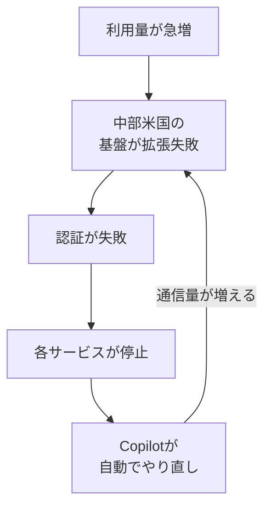

## AI

### [DeepSeek-V4-Flash-Vision-Exp](https://api-docs.deepseek.com/guides/vision)
<!-- categories: DeepSeek, LLM -->

中国のDeepSeekが、主力モデル「V4 Flash」に画像を読ませられる実験版を公開した。公式APIドキュメントによると、写真の内容を説明させる、画面を撮った画像から文字を読み取る、グラフを読んで分析させる、といった使い方ができる。制限もはっきり書かれていて、1回のやり取りに添付できる画像は最大600枚、1枚あたり32MiB（ファイル用APIを経由すれば64MiB）まで、縦横の長さは最大8192ピクセル（15枚以上をまとめて送るときは4096ピクセル）。画像1枚が消費する「トークン」（AIの利用料を数える単位）は最大384で、写真を足しても文字換算では意外と軽い。画像を添付できるのは利用者側の発言だけで、AI側やシステム側の発言に混ぜるとエラーになる点は実装時の落とし穴になりそうだ。Bloombergの報道では、画像を絡めた自律作業のテストでAnthropicのOpus 4.8に迫る成績だとされている。[「DeepSeek-V4-Flash-0731」登場、GPT-5.6 Luna より安く同等性能のオープンモデル](/blog/2026-08-04/#deepseek-v4-flash-0731登場gpt-56-luna-より安く同等性能のオープンモデル)で話題になった「安くて手元でも動く」路線に、画像という入り口が加わった形になる。

### [Anthropic、8月末にもIPO申請書類を公開か 調達額はSpaceXの過去最大に匹敵と米報道](https://www.itmedia.co.jp/news/article/2608/21/2000000688)
<!-- categories: Anthropic, Business -->

ITmediaが伝えたところによると、Claudeを開発するAnthropicが、早ければ8月末にも株式上場（IPO）の申請書類を公開する準備を進めているという。元になっているのは米Bloombergが8月20日（現地時間）に報じた内容で、市場から集める金額はSpaceXがこれまでに実施した最大のIPOに並ぶか、それを超える見通しとされる。上場すると四半期ごとに売上や損益を公表する義務が生じるため、これまで断片的な報道でしか見えなかったAI企業の採算が、初めて数字で確認できるようになる。[Anthropicの年換算収益が10兆円超で2025年末実績の約7倍に](/blog/2026-08-19/#anthropicの年換算収益が10兆円超で2025年末実績の約7倍に四半期売上高は前年同期比14倍以上)でも触れられていたIPO準備が、具体的な日程として動き出したことになる。ClaudeやClaude Codeを業務の土台に据えている開発チームにとっては、提供元の資金体力と値付けの方針を読む材料が増えるという意味で他人事ではない。

### [Slack、AIとチームで協働する「Slack Code」を発表 ClaudeやDevinを専用チャネルで操作](https://www.itmedia.co.jp/news/article/2608/21/2000000667)
<!-- categories: Slack, AI Agent -->

Slackが、プログラミングを代行するAI（コーディングエージェント）とチャット上で一緒に作業するための機能「Slack Code」を発表したと、ITmediaが報じている。AIをメンション（@付きで呼びかけ）すると専用の「コードチャネル」が自動で作られ、AIが立てた作業計画、変更したコードの差分、動かした結果のプレビューを、その場で確認しながら次の指示を出せる。ClaudeやDevinなど複数の会社のAIに対応しており、1つの窓口から使い分けられるのが特徴だ。実際に処理を走らせる前に人間の承認を挟む設計になっているため、AIが勝手に本番環境をいじる事故を防ぎやすい。開発の会話がもともとSlackに集まっている職場では、「AIへの指示だけ別のツールで行う」という分断がなくなる点が効いてきそうだ。

### [Anthropic、AIの活用方法を学べる「Claude Academy」を公開](https://gihyo.jp/article/2026/08/claude-academy)
<!-- categories: Anthropic, Claude -->

AnthropicがClaudeの使い方を体系的に学べる学習サイトを無料公開した。gihyo.jpの記事によると、掲載されているコースは22件で、基本操作や指示文（プロンプト）の書き方といった入門から、「Code 101」「Cowork入門」などの製品別コース、APIを使った開発やMCP（AIに外部ツールを繋ぐ共通仕様）の入門といった開発者向け、さらに言語モデルの仕組みや限界を扱うAIの基礎まで幅が広い。教育者・学生・非営利団体向けの講座も用意されている。Claudeのアカウントでサインインすると学習の進み具合が保存され、対象コースでは修了バッジがもらえる。社内でAI導入を進める立場の人にとっては、「まずこれを読んで」と渡せる共通の教材ができたことの価値が大きい。

### [Does telling an LLM to "be concise" actually save you money? We measured it across 9 models.](https://www.reddit.com/r/MachineLearning/comments/1vulfei/does_telling_an_llm_to_be_concise_actually_save)
<!-- categories: LLM -->

「AIに短く答えさせれば安くなるのか」を9つのモデルで実測した研究が、投稿者本人の手でr/MachineLearningに紹介された。試したのは2通りで、①出力を短くさせる指示と、②入力する指示文そのものを削る方法。結果は対照的で、①は正答率をほぼ落とさないまま費用が平均1.5倍安く、最も効果が出た条件では3倍安くなった。英語以外の11言語でも同じ傾向だったという。ところが②は逆効果で、最も悪いベンチマークでは費用が96％も増え、しかも正答率まで下がった。削った情報を埋め合わせようとAIが長々と答えてしまうためだ。AIの利用料は入力より出力のほうが単価が高いので、「削るなら入力ではなく出力」という結論は理屈とも合う。ちょうどClaude Codeが簡潔に答える出力スタイルを追加した直後の投稿で、日々AIを呼び出す仕組みを運用しているチームにはすぐ効く知見だ。

## Infra

### [The August 17 outage, and the work ahead](https://github.blog/news-insights/company-news/the-august-17-outage-and-the-work-ahead)
<!-- categories: GitHub, Incident -->

GitHubが、7時間47分に及んだ8月17日の大規模障害について公式ブログで原因と対策を公表した。引き金はコードや設定の変更ではなく、純粋な容量不足だ。利用量が過去最高を更新した際、米国中部のデータセンターにある重要な基盤が自動で拡張できず、その圧力が認証（ログイン確認）の失敗という形で広がり、各サービスを巻き込んだ。復旧の途中では、Copilotのエラーを受けた利用者側のソフトが自動で何度もやり直しを試み、その通信がさらに負荷を増やして立ち直りを遅らせたという。背景として、月間のコミット数が4月の14億から8月には29億へと倍増した数字が挙げられている。対策としては、300万以上のCPUコアと120ペタバイトの高速ストレージの追加、Azureが受け持つ処理の割合を12％から58％へ引き上げること、サービス横断でのやり直し回数の上限統一、重要システムの切り離しなどが並ぶ。[GitHubが世界中でダウン](/blog/2026-08-19/#githubが世界中でダウン)の時点では「原因分析は追って共有する」とされていたが、その約束が果たされた形だ。

### [Starcloud raises $250 million for orbital data centers as launch options dry up](https://techcrunch.com/2026/08/21/starcloud-raises-200-million-for-orbital-data-centers-as-launch-options-dry-up)
<!-- categories: Datacenter, NVIDIA -->

TechCrunchによると、宇宙にデータセンターを置く構想を進めるStarcloudが2億5000万ドルを追加調達し、評価額が23億ドルになった。3月の1億7000万ドルに続く増資で、NVIDIAが2500万ドルを出資したほかCiscoやBenchmarkなども名を連ねる。同社の衛星はAIの推論（学習済みAIに答えを出させる処理）を軌道上でこなし、米政府機関も顧客に含まれる。急いでいる理由は打ち上げ手段の先細りで、SpaceXのFalcon 9が2028年に運用終了予定なのに対し、Blue OriginのNew GlennやULAのVulcanはまだ安定的に飛んでいない。2027年に計算能力8kWの衛星2機を相乗りで打ち上げ、2028年後半にはより高性能なチップを載せる計画で、最終的には8万8000機の運用を申請済みだという。技術的な難所はチップの温度管理と放熱板の大きさ、宇宙線から守る遮蔽の配置、打ち上げの衝撃に耐える設計だ。[「光ファイバーはもう古い」「2035年宇宙の旅」——実運用へ向かうデータセンター新技術](/blog/2026-08-01/#光ファイバーはもう古い2035年宇宙の旅実運用へ向かうデータセンター新技術)で構想として紹介されていた話が、資金と打ち上げ日程を伴う段階に入っている。

### [How to turn slow queries into actionable reliability metrics with OpenTelemetry](https://www.cncf.io/blog/2026/08/21/how-to-turn-slow-queries-into-actionable-reliability-metrics-with-opentelemetry)
<!-- categories: OpenTelemetry, Observability -->

データベースの「遅い問い合わせの記録（スロークエリログ）」は何が重かったかを教えてくれるが、それがどのサービスから来ていて利用者に影響したのかまでは分からない。CNCFのブログが、この隙間をOpenTelemetry（システムの動きを記録する共通仕様）で埋める手順を実例つきで示している。流れは3段構えで、まずアプリ側で問い合わせを記録に残し、次にOpenTelemetry Collectorのspanmetricsという機能で「サービス名・DBの種類・問い合わせ内容」ごとの所要時間の分布に変換し、最後に過去の平均からのブレ幅で異常を検知する。固定のしきい値ではなく普段の値を基準にするので、サービスごとに閾値を手で決め直す手間が要らない。ダッシュボードは「単純に遅い順」「回数を掛けて影響が大きい順」「いつもと違う挙動」の3段階で作られており、性能改善と障害対応で見る画面を分けている点が実務的だ。

### [カプコンが障害時のデータ復旧を「8時間→2時間」に高速化 何を変えた？](https://atmarkit.itmedia.co.jp/ait/articles/2608/21/news058.html)
<!-- categories: Database, Incident -->

@ITが、カプコンのデータ基盤刷新の事例を紹介している。ゲーム運営で生まれる利用者の行動データなどを集めて分析する基盤で障害が起きると、データを元に戻すのに約8時間かかることがあったという。同社はクラウド型のデータ基盤Snowflakeと、集計結果を見るためのツールTableau Cloudを組み合わせた構成に移行し、復旧にかかる時間を2時間まで縮めた。分析用データは「止まっても本番サービスは動く」ため後回しにされがちだが、意思決定の材料が丸一日欠けると運営判断そのものが遅れる。復旧時間という分かりやすい1つの数字を目標に置いて構成を見直した進め方は、同じ悩みを抱えるデータ基盤の担当者に参考になる。

### [Cut our alert volume way down. The pages that survive are somehow harder to act on at 3am](https://www.reddit.com/r/sre/comments/1vue666/cut_our_alert_volume_way_down_the_pages_that)
<!-- categories: SRE, Incident -->

インドでSREを務める投稿者が、8カ月かけて警報（アラート）の数を大幅に削った結果、思っていたのと違う困りごとが出てきたとr/sreに書いている。呼び出し（ページ）の回数自体は確かに減った。ところが、絞り込みを生き延びた障害は「1時間前のデプロイ」「依存先の障害」「遅い問い合わせの増加」が同時に怪しい、という複合的なものばかりになった。以前はそれぞれ別々の警報として飛んできたので、最初に鳴ったものから掘っていけばよかった。今は全部の情報が1通にまとまって届くので、深夜3時に「どれから手を付けるか」という判断そのものを迫られる。同僚の「昔の警報はどこを見ればいいか教えてくれた」という言葉が的確で、警報を減らす取り組みは仕分けの手間を消す代わりに判断の重さを人に返す、というトレードオフが見えてくる。

## Backend

### [DuckDB V2 PEG-based SQL parser](https://duckdb.org/2026/08/20/duckdb-20-peg-parser)
<!-- categories: DuckDB, Database -->

手元で動く分析用データベースDuckDBが、SQLの文法解析部分をPostgreSQL由来のものから自作の新方式に置き換えた経緯を公式ブログで詳しく説明している。従来はBisonという道具で生成する方式で、2018年当時は妥当な選択だったが、`GROUP BY ALL`のような独自構文を足すたびに既存の文法規則とぶつかり、直すのが年々つらくなっていた。新方式のPEGは「書いた順に候補を試し、最初に成立したものを採用する」という素直な仕組みで、規則同士の衝突が原理的に起きない。効果として挙げられているのが、括弧を閉じ忘れたSQLの扱いだ。開き括弧が19個並ぶ壊れた文を捨てるのに以前は10.6秒かかっていたのが、途中結果を覚えておく工夫（packrat parsing）で0.001秒になった。拡張機能が独自の文法規則を直接足せるようになった点も大きい。[A Preview of DuckDB v2.0](/blog/2026-08-18/#a-preview-of-duckdb-v20)で一行だけ触れられていた変更の、中身の解説にあたる記事だ。なおPythonも3.9で同じくPEGへ移行しており、言語を育てやすくするという動機は共通している。

### [Announcing Rust 1.98.0](https://blog.rust-lang.org/2026/08/20/Rust-1.98.0)
<!-- categories: Rust -->

Rust公式ブログが1.98.0の公開を告知した。目玉の1つが小数計算向けの新しいメソッド群（`algebraic_add`や`algebraic_mul`など）で、「足し算の順番を入れ替えても数学的には同じ」といった性質をコンパイラに使わせ、まとめて計算する最適化を効かせられる。C言語などの`-ffast-math`に相当する機能を、危険な範囲を限定した形で持ち込んだものだ。もう1つは整数を文字列に変換する`format_into`の安定化で、専用の受け皿（`NumBuffer`）に直接書き込むことで、外部ライブラリ`itoa`と同等の速さを標準機能だけで出せるようになった。他にも文字列の範囲を求める`substr_range`、UTF-16からの変換、`NonZero::from_str_radix`などが追加されている。派手さはないが、外部依存を1つ減らせる類いの改善が並ぶ回だ。

### [Enabling the next-generation trait solver on nightly](https://blog.rust-lang.org/2026/08/21/enabling-next-solver-on-nightly)
<!-- categories: Rust -->

Rustコンパイラの中で「この型はこのトレイトを満たすか」を判定する部分（トレイトソルバー）が、新実装に置き換わってnightly版で既定有効になったと公式ブログが伝えている。旧実装は設計上の限界から、Type Alias Impl TraitやReturn Type Notationといった機能を正式版にできず、型システムの穴（unsoundness）も直せないままだった。新実装は既知の不具合200件以上を解消し、特に`impl Trait`の戻り値まわりと`for<'a>`を含む高階の型推論の誤りを改善する。BevyやMiniJinjaのような広く使われるクレートが影響を受けていた箇所だ。速度面の効果も大きく、以前はコンパイルが終わらなかったチェスの実装が1分で通るようになり、`datafusion`は8倍速くなったという。従来の誤った挙動に頼っていたコードは動かなくなる可能性があるため、nightlyで試して報告してほしいと呼びかけている。

### [うんこミュージアム情報漏れに学ぶ 「DBに保存しない」設計でどう安全を守るか](https://atmarkit.itmedia.co.jp/ait/articles/2608/21/news033.html)
<!-- categories: Security, Database -->

@ITが、うんこミュージアムの公式サイトが受けた不正アクセスを題材に、問い合わせフォームの設計を考え直す記事を出している。事案自体は、第三者製ソフトウェアの脆弱性を突かれてサイトが改ざんされ、改ざん期間中（8月10日17時〜11日24時）に送信された4人分の氏名・メールアドレス・電話番号などが第三者に渡った可能性がある、というものだ。記事が着目するのは「そもそも自分のデータベースに個人情報を溜めない」という考え方で、外部のフォームサービスに預けて自社での保管を最小限にする、認証で利用を絞る、といった選択肢を挙げる。ただし万能ではない点も明示していて、フォームからサーバーに届くまでの経路で抜き取られる余地は残る。持たないデータは漏れない、という発想はシンプルだが、どこまで手放せるかの線引きは設計者の判断になる。

### [What happens when a GPU reads memory](https://blog.doubleword.ai/what-happens-when-a-gpu-reads-memory)
<!-- categories: GPU, Hardware -->

GPUが「メモリから1つの値を読む」という何気ない処理の中で、実際に何が起きているかをRTX 4090で追いかけた解説記事だ。著者は実測値を並べていて、いちばん近い一時置き場（L1キャッシュ）に当たれば15.4ナノ秒、その次のL2キャッシュなら127ナノ秒、本体のメモリまで行くと255ナノ秒かかる。差は約17倍で、どこまで取りに行くかで速さがまるで変わる。途中には、32本の処理の要求を隣り合ったまとまりに束ねる仕組み（coalescing）や、36個に分かれたL2への振り分けなど、専用の段取りが挟まっている。面白いのは、この255ナノ秒という待ち時間自体はGPUにとって大した問題ではないという点だ。1つが待っている間に6000以上の別の処理を走らせるので、待ち時間は隠れてしまう。代わりに上限を決めるのはメモリの転送量（RTX 4090で毎秒約576GB）で、LLMを動かすときに「GPUのメモリ帯域が効く」と言われる理由がここにある。

## Frontend

### [Android 17はメモリを使い過ぎるアプリを強制終了](https://pc.watch.impress.co.jp/docs/news/2134666.html)
<!-- categories: Android, Google -->

PC Watchによると、Googleは8月19日、Android 17でメモリを使い過ぎるアプリへの対処を段階的に強めると発表した。第1段階では、そのアプリが使っているメモリの中身を圧縮領域（zRAM）へ強制的に移す。データは消えないが、圧縮と展開の処理が挟まるぶん、画面がカクついたり反応が遅れたりする可能性がある。それでも使用量が増え続けて次の閾値を超えると、システムがアプリを終了させる。まずPixelから展開される予定だ。これまで「メモリを多めに掴んでおく」実装で通っていたアプリは、体感速度の悪化という形で利用者に跳ね返ることになる。Google側もメモリ使用量を見直す機会にしてほしいとコメントしており、メモリの価格が上がり続けている状況を踏まえると、端末側の余裕に頼る前提そのものが崩れつつある。

### [VS Codeベースのエディターをターミナル内で使える「terminal-code」が登場](https://gihyo.jp/article/2026/08/terminal-code)
<!-- categories: VS Code -->

gihyo.jpが、ターミナル（黒い画面のコマンド入力窓）の中でVS Code相当のエディターを動かす「terminal-code」を紹介している。作者はRob Pruzan氏で、8月19日に公開された。仕組みは、ブラウザ上でVS Codeを動かすcode-serverと、ターミナル内でブラウザを動かすterminal-browserの組み合わせで、ツールバーや枠を消した表示モードを使うことで、見た目としてはエディターだけが端末に収まる。うれしいのは、SSH（別のサーバーに繋いで作業する仕組み）越しでもそのまま使えることと、ターミナルの背景色・文字色・配色をそのまま読み取って合わせたテーマを自動生成してくれることだ。導入はインストール用のコマンド1行で、あとは`tode`コマンドでファイルやフォルダを開く。Windowsは公式ビルドがなく、描画に使うKitty graphics protocolの対応も限られるため、WSL内でLinux版を入れる形になる。

### [Small, native web tricks worth remembering](https://htmlcat.net)
<!-- categories: HTML, CSS -->

htmlcat.netが、ライブラリを足さずにHTML・CSS・JavaScriptの標準機能だけでできることを、動く例と一緒に並べている。HTML側では、操作を無効化する`inert`属性、モーダル用の`dialog`要素、重ねて表示するPopover API、閉じたままでもページ内検索に引っかかる`hidden=until-found`、`name`属性で1つだけ開くアコーディオンにできる`details`などが挙がる。CSS側はさらに幅広く、親要素を条件で選べる`:has()`、明暗テーマを1行で書き分ける`light-dark()`、`@scope`によるスタイルの適用範囲の限定、スクロールに連動するアニメーション、CSSだけで作るカルーセルなど、ここ数年で入った機能が実演つきで並ぶ。JavaScriptも`Intl.NumberFormat`での金額表示やCSS Custom Highlight APIといった小技が中心だ。「これ、まだライブラリで書いていたな」と気づく項目を探す用途に向いている。

### [Webの制作現場ですぐに役立つ情報が満載！ アクセシビリティへの取り組みを解説した良書 -Webアクセシビリティの教科書](https://coliss.com/articles/book-review/isbn-9784862466617.html)
<!-- categories: Accessibility, Design -->

colissが『具体例と解決策で学ぶ Webアクセシビリティの教科書』（伊原力也・太田良典 著、ボーンデジタル、2026年6月16日刊）の書評を掲載している。全10章の構成で、なぜ必要かという前提から、要件定義、ナビゲーション設計、フォームやビジュアルの作り込み、意味を持つHTMLの書き方といった実装、そして組織としてどう定着させるかまでを通しで扱う。書評が価値を置いているのは、サッポロビールや東京都の新型コロナ対策サイトといった実際の現場の資料と解決策が載っている点で、WCAGやJIS X 8341-3といった規格の解説だけで終わらない構成になっている。初心者にはやさしく、中級者以上には新しい情報を、という書き分けも紹介されている。前日に取り上げた[「アクセシビリティ対応、何をどう進める？」](/blog/2026-08-21/#アクセシビリティ対応何をどう進めるuiデザイナーによる実践事例と課題)が1サイトの実践記録だったのに対し、こちらは体系立てて学び直したいときの入り口にあたる。

### [社内アプリ開発したら『ダークモード実装してくれませんか？』の声がめちゃくちゃ多くてビビった](https://togetter.com/li/2735756)
<!-- categories: Design, Accessibility -->

社内向けアプリを作った開発者の「ダークモードの要望が想像以上に多かった」という投稿から広がった議論をTogetterがまとめている。理由として最も多く挙がったのが目の疲れで、明るい画面が眩しくて痛くなる、ドライアイなので暗い画面でないとつらい、といった声が並ぶ。有機ELの画面では黒い部分がほとんど電力を使わないため、電池の持ちを理由にする人もいた。開発側からは「後付けは大変なので試作の段階から入れておくべき」という現実的な指摘が出ている。画面を白黒表示にしている人や、常に明るさを最低にしている人まで含めると、表示設定の好みは想像以上に人によって違う。社内ツールだから最低限でいい、という判断が使われ方の実態と合っていないことがある、という話として読める。

## Products

### [Antigravity IDE Extensions](https://www.producthunt.com/products/google-antigravity)
<!-- categories: AI Agent, VS Code -->

GoogleのAIコーディング基盤Antigravityを、いま使っているエディターの中から呼び出せるようにする拡張機能。VS Code、Visual Studio、JetBrains系、Zedに対応する。単体アプリ版が複数のAIを束ねて長時間の開発を回す用途なのに対し、こちらは軽量な位置づけで、AIとの会話や共有した文脈を保ったまま、変更差分の確認・作業計画の点検・デバッグ・複数手順の作業の引き継ぎをエディター内で済ませられる。エディターを乗り換えたくないがAIエージェントは使いたい、という層向けの選択肢だ。

### [ShogunAI](https://www.producthunt.com/products/shogunai)
<!-- categories: AI Agent -->

手元のパソコンで動く個人向けAIエージェント。人・案件・約束・未処理の項目を仕事の流れの中から自動で拾って蓄え、毎回「この案件はこういう経緯で……」と説明し直す手間をなくすことを狙う。設計方針がはっきりしていて、読み取りは自動で行うが、メール送信のような外部への働きかけは必ず人の承認を待つ。作者は「AIの限界は賢さではなく、文脈があちこちのツールに散らばっていることだ」と主張している。現在はmacOS版のみで、Windows版とモバイル版、チーム向けは開発中。

### [PixelRead AI OCR](https://www.producthunt.com/products/pixelread-ai-ocr)
<!-- categories: OCR -->

Mac の画面上にある文字を、範囲を囲むだけで取り出せるツール。ショートカットキーを押して領域を指定すると、画像・動画・PDF・Webサイト・アプリのどこからでも文字を抜き出し、そのまま翻訳・読み上げ・要約・書き換えまでできる。特徴は処理がすべて端末内で完結し、外部のサーバーに画像を送らないこと。エラー画面のスクリーンショットやスタックトレースから文字を起こす用途と相性がよく、社外に出せない画面を扱う場面でも使いやすい。macOS 15.2以降で無料、翻訳とAI機能はmacOS 26以降が必要。

### [Project SKY](https://www.producthunt.com/products/project-sky)
<!-- categories: AI Agent, Windows -->

Windows のOS側に常駐するAIアシスタント。ブラウザのタブに閉じ込められた対話型AIとは違い、画面上の任意の場所を丸で囲んで「これ何？」と話しかけるだけで、いま見ているものを前提に答えが返る。音声のやり取りは待ち時間が短く、セッションをまたいで記憶が残るため、毎回状況を説明し直す必要がない。複数アプリをまたぐ作業の自動実行にも対応する。作業を中断せずにAIを挟みたい開発者・デザイナー・調査職向けで、Windows版が無料で公開された。

### [Flunkey](https://www.producthunt.com/products/flunkey)
<!-- categories: AI Agent, Windows -->

話した内容を文字に起こし、そのままタスクや文脈として残すWindows向けの音声入力レイヤー。単なる文字起こしと違い、その場でAIに質問して答えを得たり、アプリをまたいで文脈を持ち回ったりできる。ソースコードが公開されている点も、社内で使う際に中身を確認したい向きには効いてくる。学生・研究者・情報を大量に扱う職種を想定したベータ版で、無料。

## Others

### [I accidentally logged hundreds of thousands of phone calls to military bases](https://lina.sh/blog/hijacking-e164-arpa)
<!-- categories: DNS, Security -->

電話番号をDNS（インターネット上の住所録）で引ける形にする「ENUM」という2000年代初頭の仕組みが、ほぼ使われないまま放置されていた。著者はその配下の3つの国番号ゾーンが、期限切れのドメイン名を参照したままになっていることに気づく。そのドメインを5ユーロで買い直したところ、セントヘレナ島・ディエゴガルシア島・アセンション島宛ての問い合わせが自分の管理下に入ってしまった。記録を取ってみると半年でおよそ40万件、完全な電話番号・時刻・送信元IPアドレスが流れ込んできた。しかもほとんどがディエゴガルシアとアセンション、つまり米軍基地からの通信だった。悪意ある者が同じことをしていれば、これらの通話をまとめて中継して盗み聞きできた計算になる。当初の報告は「ITUの委員会が絡む」という理由で相手にされず、軍が関係すると伝えて初めて英国の国家サイバーセキュリティセンター（NCSC）が動き、ドメインを引き取ったという。使われなくなった仕組みを放置することの危うさが、これ以上ないほど具体的に示された例だ。

### [楽天ブックス関係会社のPCに不正アクセス、ユーザー3万3333人分の個人情報などが漏えいの可能性](https://internet.watch.impress.co.jp/docs/news/2134682.html)
<!-- categories: Security, Incident -->

INTERNET Watchによると、楽天グループで出版取次を手掛ける楽天ブックスネットワークの端末が不正アクセスを受け、個人情報の漏えいの可能性が公表された。対象は利用者の配送先情報3万3333件（氏名・郵便番号・住所・電話番号）、取引先担当者2101件（氏名・メールアドレス・電話番号）、従業員339件（氏名・業務用メールアドレス・電話番号・生年月日）で、クレジットカード情報は含まれていない。同社が不正アクセスを検知したのは2026年4月5日で、直ちに該当端末をネットワークから切り離して調査に入り、発表時点では実際に情報が外部に持ち出された事実は確認していないとしている。検知から公表まで4カ月以上かかっている点は、調査の重さを物語ると同時に、利用者側が自衛を始められる時期の遅れでもある。

### [YouTubeの有料動画広告がマルウェア配布に悪用されていた事例をセキュリティ企業が報告](https://gigazine.net/news/20260821-youtube-malware)
<!-- categories: Security, Google -->

Gigazineが伝えたところによると、YouTubeの有料広告を入り口にした攻撃が確認された。手口は3段構えで、「取引ツールTradingViewの有料機能が無料で使える」とうたう広告を出し、本物そっくりの偽サイトに誘導し、普通のインストーラーに見せかけたファイルを自分でダウンロードさせる。SafeDepiが2026年にmacOS版を発見し、それ以前のWindows版はCheck Point ResearchとBitdefenderが記録していた。規模も大きく、Windows版では2025年上半期だけで3万5000件を超える悪意ある広告が確認され、数日で18万回以上再生された動画もあった。macOS版は広告をクリックしてから端末が乗っ取られるまで約2分だという。攻撃者はGoogle Adsに正規の広告費を払っており、自動審査をすり抜けている点が厄介だ。対策は単純で、有料ソフトを不自然な条件で配る広告を経由せず、公式サイトから入手することに尽きる。

### [ExcelのAI関数「=COPILOT」が一般展開されないままお蔵入り](https://pc.watch.impress.co.jp/docs/news/2134594.html)
<!-- categories: Microsoft, AI -->

PC Watchによると、セルに自然言語で指示を書くとAIが処理してくれるExcelの`=COPILOT`関数が、正式提供に至らないまま2026年9月14日に廃止される。2025年8月に試用プログラムで公開されてから約1年での撤収だ。理由として挙げられているのは、生成AIである以上まちがった答えを返すことがあり、正確さと「同じ入力なら同じ結果」が求められる数値計算では標準の関数を使うべきだという点、Copilotの契約が必須である点、10分あたり100回までという計算回数の制限、そして法務・コンプライアンス上のリスクだ。表計算という「結果が合っていて当然」の領域にAIを直接埋め込む難しさが出た形になる。[Microsoft、個人・ビジネスCopilotアプリを統合。Deep Researchなど廃止](/blog/2026-08-15/#microsoft個人ビジネスcopilotアプリを統合deep-researchなど廃止)と同じく、広げた機能を絞り込む動きが続いている。

### [Oura faces lawsuit accusing it of misleading consumers about sleep-tracking accuracy](https://techcrunch.com/2026/08/21/oura-faces-lawsuit-accusing-it-of-misleading-consumers-about-sleep-tracking-accuracy)
<!-- categories: Business, Science -->

TechCrunchによると、指輪型の健康トラッカーを販売するOuraが、睡眠計測の精度について消費者を誤解させたとして集団訴訟を起こされた。原告側の主張は、睡眠の質や睡眠段階（浅い・深い・レム睡眠）を判定するには頭皮の電極や眼球の動きを測るセンサーが必要で、指輪ではその信号を取れない、というものだ。にもかかわらず同社は300ドル以上の製品を医療機関並みの精度として売り、「79％の精度」、後には「睡眠段階の判定精度95％」と宣伝したと訴えている。根拠としては、精度への不満を訴えるRedditの投稿が何年も積み上がっている点が挙げられており、独立した科学的検証は本記事では示されていない。TechCrunchの取材にOuraからの回答はなかった。健康データを根拠に生活を変える人が増えるほど、「何をどこまで測れているのか」の説明責任は重くなる。
