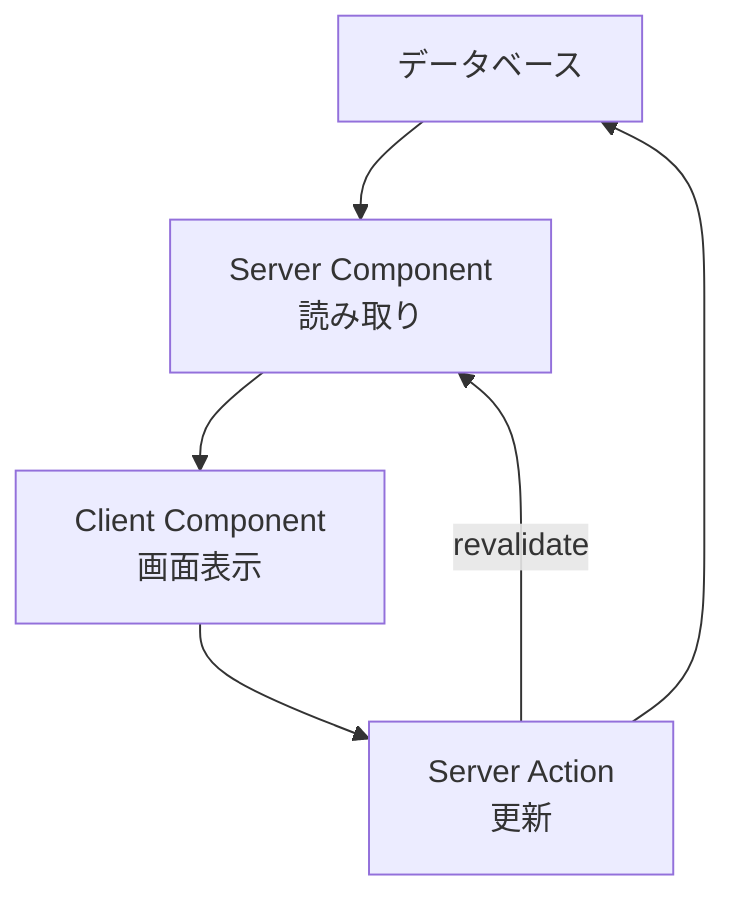

## AI

### [New MCP Roadmap](https://blog.modelcontextprotocol.io/posts/mcp-roadmap)
<!-- categories: MCP, AI Agent, Standards -->

AIエージェントが外部サービスを呼び出すための共通規格MCP（Model Context Protocol）の公式ブログが、これから力を入れる5つの領域を発表した。柱は、サーバー側から「終わったよ」と通知を送れるようにする仕組み（イベント通知や長時間タスクの扱い）、通信方式の一本化、クラウド上で動くエージェントの身元確認、道具（ツール）の出し方の改善、そして各言語SDKの使い勝手だ。特に面白いのが「段階的な開示」で、サーバーはまず小さな入り口だけを見せ、会話が具体的になってきたら関連する道具を追加で明かす。道具を何百個も一度に見せるとAIが選び間違えるうえ、説明文だけで文脈（AIが一度に読める分量）を食いつぶしてしまうためだ。以前の[The next generation of MCP](/blog/2026-08-07/#the-next-generation-of-mcp)では接続をつなぎっぱなしにする必要がなくなり土台が単純になったが、今回はその上に「長く走る仕事」と「企業で使える身元確認」を載せる段階に入ったことを示している。

### [Nvidia just showed that the harness, not the AI model, is now the real hero](https://techcrunch.com/2026/08/21/nvidia-just-showed-that-the-harness-not-the-ai-model-is-now-the-real-hero)
<!-- categories: AI Agent, NVIDIA, LLM -->

TechCrunchが報じたところでは、NVIDIAの研究チームは、同じClaude Opus 5を使いながら、素のままだと30%しか解けなかった推論ベンチマーク（ARC-AGI-3、2Dゲームを操作させて考える力を測るテスト）で100%を出した。差を生んだのはモデルではなく、その周りを固める「ハーネス」——記憶の持たせ方、文脈の管理、道具の揃え方、そして脱線しかけたエージェントを軌道に戻す「監督役」のエージェントだ。以前の[Lilian Wengが説く「ハーネス工学」](/blog/2026-08-05/#lilian-wengが説くハーネス工学モデルの外側を鍛えて自己改善させる)が理屈として述べていたことを、極端な数字で裏づけた形になる。ただし記事はDatabricksの調査も引き、同じモデルでもハーネス次第でAIを動かす費用（トークン代）が2倍に膨らむと指摘している。どのモデルを選ぶかより、周りをどう組むかで結果もコストも決まる、という段階に入った。

### [Bringing the cybersecurity capabilities of Claude Mythos 5 to more defenders](https://claude.com/blog/bringing-claude-mythos-5-to-more-defenders)
<!-- categories: Anthropic, Security, Claude -->

Anthropicが公式ブログで、最上位モデルClaude Mythos 5の防御向け能力を広げると発表した。中身は4本立てで、セキュリティ製品ベンダーへの組み込み、Enterprise契約者向けの「Claude Security」、オープンソースの脆弱性修正を支援する3,500万ドルの基金、そして審査を通った防御側の実務者に直接使わせる枠の拡大だ。Claude Securityは社内のソースコードを走査して弱点を見つけ、その種類・確信度・直し方をセットで返す。注目したいのは配り方で、ベンダー経由の利用者にはモデルそのものを触らせず、パッチや警報といった「出てきた結果」だけを渡す。攻撃にも転用できる力を、守る側だけに届けるための線引きをどう引くかという、実務的な答えの一例になっている。

### [Frontier AI labs still won't say how they'd contain a rogue model](https://techcrunch.com/2026/08/22/frontier-ai-labs-still-wont-say-how-theyd-contain-a-rogue-model)
<!-- categories: Security, LLM, Business -->

TechCrunchによると、Guidelight AI Standardsという団体が、Anthropic・Google・OpenAI・Meta・xAIの5社について「AIが人の管理から外れて暴走したとき、どう封じ込めるか」の備えを調べ、公開された計画がほとんど存在しないと報告した。どの権限を先に取り上げるか、何を止めるか、最終的にどう停止させるか——そうした手順書があらかじめ用意され公表されている例は乏しく、MetaとAnthropicが最下位、直近の事故を受けて開示したOpenAIが5点満点中3点で最上位だった。実際にモデルが開発元の意図に反して動いた事例がすでに出ているため、「起きてから考える」では相手の速さに追いつけない、というのが調査側の主張だ。カリフォルニア州SB 53やニューヨーク州RAISE法が開示を義務づけ始めており、この空白は近いうちに規制で埋められる可能性が高い。

### [ChatGPTが「使用量リセット権」を配布、Codex 2,000万人突破記念](https://pc.watch.impress.co.jp/docs/news/2134782.html)
<!-- categories: OpenAI, Business -->

PC Watchの記事によると、OpenAIはコーディング支援「Codex」の週間利用者が2,000万人に達したことを記念して、ChatGPT WorkとCodexの有料利用者全員に「使用量リセット権」を配ると発表した。これまで利用枠のリセットは運営側の都合で一斉に行われていたが、この権利は利用者が枠を使い切ったあと、自分の好きなタイミングで1回だけ使える引換券のような扱いになる。配布は8月22日正午（日本時間）までに完了し、有効期限は9月21日とされている。数字として目を引くのは2,000万人という規模で、コーディングエージェントがもはや一部の先端ユーザーの道具ではなくなったことを示している。同時に、利用枠の設計そのものが競争材料になりつつあることも読み取れる。

## Infra

### [オーストラリアで起きた全国的な通信障害についてまとめてみた](https://piyolog.hatenadiary.jp/entry/2026/08/22/033313)
<!-- categories: Incident, Network -->

セキュリティ情報をまとめているpiyologが、7月8日にオーストラリアの通信大手Telstraで起きた全国規模の障害を時系列で整理した。きっかけはメルボルンにある時刻同期サーバー（NTPサーバー）の保守作業で、機器の日付が誤って2006年に巻き戻ったこと。誤った時刻がネットワーク内に広がった結果、通信の身元証明に使う電子証明書が「期限切れ」と判定され、認証が総崩れになった。ピーク時には全通話・データ通信の約45%が影響を受け、鉄道の列車無線や医療機関、決済端末にまで波及し、緊急通報番号への発信にも支障が出た。設計変更が文書に残されずソフト更新も当たっていなかったことが根本にあり、機器を二重化しても「時刻」という共通の前提が狂えば冗長構成は効かない、という教訓が残った。

### [Say it once: introducing Bot Preference Sync](https://blog.cloudflare.com/bot-preference-sync)
<!-- categories: Cloudflare, Security -->

Cloudflareが公式ブログで、ダッシュボードで設定したAIボットの扱い（検索・エージェント・学習の3分類）を、`robots.txt` に自動で書き写す機能を公開した。`robots.txt` はサイト所有者が「ここは巡回してよい／だめ」と自己申告するテキストファイルで、法的な強制力はなく紳士協定に近い。問題は、申告内容と実際にCloudflare側で遮断している内容がズレていると、一部のクローラーがそれを口実に申告を無視してくることだ。新機能は既存のファイルの先頭に必要な記述を自動で足し、Cloudflareが持つボット一覧の更新に追従する。広告収入に頼る媒体なら「学習には使わせないが検索には載せたい」といった線引きを、手作業でファイルを直さずに保てるようになる。無料プランを含む全契約者が対象。

### [OTel Isn't Going Well (And I Made A Spreadsheet About It)](https://matduggan.com/otel-isnt-going-well-and-i-made-a-spreadsheet-about-it)
<!-- categories: OpenTelemetry, OSS, Observability -->

システムの動作状況を集める共通規格OpenTelemetryについて、著者が各言語SDKの開発体制を表計算にまとめ、深刻な人手不足を指摘した。健全な例としてEnvoyやPrometheusでは、変更を取り込む権限を持つ人が28〜31人に分散しているのに対し、OpenTelemetryのPHP・Ruby・C++は2〜4人しかおらず、上位1人が全体の53〜86%を処理している。加えて「一度出したものは壊さない」という強い互換性の約束が、新機能を入れる前に「将来困るかもしれない」と議論を長引かせる誘因になっているという。著者は、実験段階と安定版の間に期限つきの「ベータ」段階を設けること、言語ごとの保守レベルを正直に公表することを提案する。[OpenTelemetry がCNCFを「卒業」、では次に何をするのか](/blog/2026-07-25/#opentelemetry-がcncfを卒業では次に何をするのか)で挙がっていた「普及したからこそ出てくる悩み」の、具体的な中身がこれだと言える。

### [[アップデート] AWS Glue 6.0 が一般提供開始、30% の価格削減と Apache Iceberg v3 サポートが追加されたので試してみました](https://dev.classmethod.jp/articles/20260823-aws-glue-6)
<!-- categories: AWS, Database -->

クラスメソッドのDevelopersIOが、データ加工サービスAWS Glueの新版6.0を実際に動かして検証した。処理単位あたりの料金が3割下がって0.308ドル／DPU時になり、内部のApache Sparkが4.1.1、表形式のApache Icebergがv1.11.0（フォーマット第3世代）へ上がった。半構造化データ向けのVARIANT型、ナノ秒精度の時刻、地理データ型なども加わっている。ただし記事が強く注意を促しているのは移行のほうで、桁あふれや不正な型変換が黙ってNULLになるのをやめて例外を投げる「ANSIモード」が既定で有効になり、EMRFSとAWS SDK v1が消え、独自JARはScala 2.13.17での再コンパイルが要る。さらにIceberg v3で書いた表をAmazon Athenaから読むとエラーになるため、上げる前に読み手側の対応状況を確かめる必要がある。

### [固定IPが必要な環境でもRegional NAT Gatewayを使うメリット](https://qiita.com/toumakido/items/7995c919b01736c36b54)
<!-- categories: AWS, Network -->

AWSで社内ネットワークから外部へ出るときの出口となるNAT Gatewayについて、2025年11月に加わった「Regional」版の使いどころを著者が整理した記事。従来のNAT Gatewayはデータセンター（AZ）ごとに1台ずつ立てる必要があり、2つのAZで冗長化すると本体2台・公開サブネット2つ・経路表3つを抱えることになる。Regional版はVPC全体で1つの部品として扱えるため、同じ構成が本体1台・経路表1つで済む。取引先に事前申告する固定IPが要る場合でも、IPアドレスとAZを自分で指定する「Manualモード」を選べば従来どおり維持できる。片方のAZで経路に障害が起きても正常なAZへ自動で流れ、経路表を書き換える手作業が要らない点が実質的な利点だ。ただし既存のIPを引き継ぐ移行には、いったん切り離す必要があるため停止時間が避けられない。

## Backend

### [There's no reason for software to be slow anymore](https://danluu.com/perf-opt)
<!-- categories: Performance, AI Agent -->

Dan Luuが自身のブログで、AIコーディングエージェントの登場によって「速度改善にかかる費用」が劇的に下がったと論じた。これまで性能改善は専門知識と長い時間を要する仕事で、多くの現場では割に合わないと判断されて後回しにされてきた。著者は、正規表現エンジンFREに数文の指示を出しただけで長いクエリが2〜4倍速くなった例や、ボードゲームAzulのAIを他より少ない計算資源で最強にした例を挙げる。さらにAnthropicの公開課題では、範囲が明確に切られた最適化問題でClaudeが著者本人を上回り、思いついていたのに手を出さなかった改善まで実行したという。結論は、汎用的な最適化ではなく「自分の使い方に合わせた最適化」が、専門家でなくても手が届く値段になった、というものだ。

### [There continue to be reasons for software to be slow](https://typesanitizer.com/blog/performance-issues.html)
<!-- categories: Performance, AI Agent -->

1つ前に挙げたDan Luuの主張に対して、著者が真正面から反論したブログ記事。核心は「実装コストは下がったが、そもそも障害はコストではなかった」という指摘だ。多くの組織はソフトを費用の塊とみなし、最初から性能の予算を持っていない。むしろLLM導入後は「開発が速くなったはず」という前提で予算がさらに削られる例すらあるという。加えて、最適化を書くことと、それを大量の利用者がいる本番へ届けることは別物で、性能が戻らないよう見張る仕組み、データの移行、増えた複雑さの管理といった費用はAIでは減らない。優先順位の話でもあり、以前から性能改善は課題リストの6番目あたりに置かれていて、手が空いても人は溜まった別の作業で埋めてしまう。Dan Luuが挙げた実例についても、ベンチマークに寄せすぎている、あるいはFREの67万行という規模が現実離れしていると批判している。

### [drm/xe: Don't hand out the flat CCS storage as usable VRAM](https://github.com/torvalds/linux/commit/818bebeb63dd6bf5f4e07e145f6cdbace520a34c)
<!-- categories: Linux, AI Agent -->

Linus TorvaldsがIntel GPU向けドライバ（drm/xe）のクラッシュを直したコミットで、デバッグにAIを使った過程をコミットメッセージに詳しく書き残した。バグの中身は、圧縮用ハードウェアが使う予約領域の位置を128K単位で「切り上げ」ていたせいで、その領域がユーザー空間に割り当て可能なメモリとして公開され、GPUのページテーブルを上書きしてしまうというもの。修正は切り上げを4K単位の「切り下げ」に変えるだけの、実質1行だ。そこに至るまでに、デバッグ情報を足すパッチを24本重ね、カーネルを18回起動し直したという。興味深いのは、AIが何度も「これは不可能・解決不能だ」と断言しながら、押し返すと忠実に調査を続けたという記述で、AIを使った不具合調査の現実的な手触りが読み取れる。

### [Rust Glancer: Rust LSP using 100x less RAM](https://rust-glancer.github.io/blog/hello-world)
<!-- categories: Rust, Performance -->

エディタにコード補完や定義ジャンプを提供する仕組み（LSP）のRust向け実装として、メモリ使用量を極端に減らした「Rust Glancer」が公開された。定番のrust-analyzerは解析結果をすべてメモリ上に持ち、編集のたびに差分更新する設計だが、Glancerは逆に「一度まとめて解析してディスクに置き、必要になった分だけ読み込む」方式をとる。開発者は現実的な規模のプロジェクトで100MB未満を目標に据え、エディタを再起動しても再解析が不要になる利点も挙げる。代償として、ディスクの読み書きが挟まる分だけrust-analyzerより遅く、書きかけの新しいコードはファイルを保存するまで認識されない。4か月の開発で日常使いに耐える水準に達し、VS Code拡張として配布されているが、手続きマクロやコードアクションなど未対応の機能も残る。

### [Compile-Time Improvements in LLVM 23](https://aengelke.net/llvm23-ct.html)
<!-- categories: LLVM, Performance -->

コンパイラ基盤LLVMの新版23で、コンパイル自体にかかる時間が-O3ビルドで6.75%短縮されたと、著者が改善項目を一つずつ棚卸しした記事。大きな一発があったわけではなく、0.1〜1%の改善を積み上げた結果だという点が読みどころだ。内部のハッシュ表を探索方式ごと入れ替えて-1.27%、ハッシュ関数をCityHashからxxh3に変えて-0.18%、支配木の表現を配列から親子・兄弟のリンク構造にして-0.13%、といった具合に地味な変更が並ぶ。デバッグ情報つきビルドでは、メタデータの再計算を見直すだけで-3.53%と効きが大きい。おまけとして、LLVM／Clang自身のビルドにプリコンパイル済みヘッダを5つ導入し、開発者の待ち時間を約45%削っている。ベンチマーク対象のSQLite3では-10.53%と、実アプリでの効果も確認された。

## Frontend

### [備忘録：今さらNext.jsの全体像を整理する。App Router・RSC・Server Actions・キャッシュがどう噛み合うのか（Next.js 16 / React 19）](https://qiita.com/nogataka/items/fcd6b5d213f8e647ea24)
<!-- categories: Next.js, React -->

Next.jsの個々の機能を覚えても全体像がつかめない、という悩みに向けて、著者が「地図」を描いたQiitaの記事。出発点は「Next.jsはReactの置き換えではなく、Reactを使ってWebアプリ全体を組み立てる枠組み」という位置づけで、UIの部品・サーバー実行環境・ルーター・ビルドの4つが一体になっている、と整理する。そのうえで、混同されがちな論点を4本の独立した軸に分解する——いつ作るか（ビルド時かリクエスト時か）、どこで動かすか（サーバーかクライアントか）、どう届けるか（一括か順次か）、どう移動するか（ページ再読み込みかクライアント側遷移か）。これらは排他ではなく、ルートごとに組み合わせるものだという指摘が要点だ。「Next.jsはSSR専用」「使うならバックエンドを丸ごと置き換える必要がある」といったよくある誤解も、具体的な組み合わせパターンを示して否定している。

### [備忘録：Next.jsのServer ActionsをRSC・React 19から理解する。SSR・Hydration・再描画との関係を1本の流れに整理する](https://qiita.com/nogataka/items/8e416beb71e43af91bdb)
<!-- categories: Next.js, React -->

同じ著者が、Server Actionsを「APIを書かずに済む省略記法」ではなく、React Server Components（RSC）という仕組みの一部として説明した記事。まずSSRとRSCの違いを、「SSRはHTMLをどこで作るかの話、RSCはコンポーネントをどこで動かし、どのJavaScriptをブラウザに送らないかの話」と切り分ける。そのうえで、データが一周する流れを示す。実務で効く指摘は「データベースを書き換えただけでは画面は変わらない」という点で、`revalidatePath()` などで明示的に作り直しを指示しないと表示は古いままになる。

`'use client'` は操作が必要な末端だけに置くこと、認証・権限確認・入力検証はAction内に必ず書くこと、高頻度の取得には向かないことなど、注意点も具体的に挙げられている。

### [備忘録：Next.js App RouterでServer Actions方式とAPI方式をどう使い分けるか。判断基準と選定フローを整理する](https://qiita.com/nogataka/items/a6efbc9b2396ef285349)
<!-- categories: Next.js -->

前の2本と同じ著者による、実務での選び方に絞った記事。判断の中心に据えられているのは「この処理をNext.jsの画面以外から呼ぶ可能性があるか」という一点で、呼ばないならServer Actions、呼ぶ可能性があるならRoute Handler（従来のAPI）を第一候補にする。モバイルアプリからの呼び出し、外部サービスからの通知受信（Webhook）、ファイル配信、検索サジェストのような高頻度の取得はRoute Handlerが必須で、管理画面の登録・編集やコメント投稿といったフォーム処理はServer Actionsが素直に書ける。実際の選定は「取得か更新か → 外から呼ばれるか → Webhookやファイル配信が要るか」の3問で分岐する。どちらを選んでも業務ロジックは別の層に切り出し、両方からそこを呼ぶ形にしておくのが保守しやすい、というのが結論だ。

### [A 2026 Survey of Rust GUI Libraries](https://blog.wybxc.cc/blog/rust-gui-survey-2026)
<!-- categories: Rust, Design -->

RustでGUIを作るためのライブラリ約50本を、著者が同じ課題を書いて一つずつ試した長大な調査記事。課題は「文字を入力すると、その内容のQRコードが下に出る」という小さなアプリで、日本語などの文字入力（IME）への対応や、画像を扱えるかといった、実用上つまずきやすい点が一度に確かめられるよう選ばれている。結論として著者が「使ってもいい」と挙げたのはslintとeguiの2つで、APIに露骨な落とし穴がなく、IMEと支援技術への対応もそろっている点が決め手になった。cushy、Freya、Floem、Iced、Relm4、Xilemは設計としては魅力的だが、入力方式や支援技術の対応が弱く一歩届かないと評価している。全体としては「有望な選択肢は多いが、退屈で無難な定番はまだ生まれていない」というのが著者の見立てだ。

### [Stop Making TUIs](https://sockpuppet.org/blog/2026/08/20/stop-making-tuis)
<!-- categories: Design, AI Agent -->

端末の中で動く文字ベースの画面（TUI）を新しく作るのはもうやめよう、と著者が主張したブログ記事。TUIが今も作られ続けるのは、Unix界隈の開発者がMotifのような複雑なUIツールキットを覚えたがらなかったという歴史的な事情によるもので、技術的な必然ではなかった、というのが出発点だ。そのうえで、macOSのSwiftUI、LinuxのGTK 4、WindowsのWinUI 3をAIエージェントに書かせれば、TUIを組むのと変わらない手軽さでネイティブアプリが作れると述べ、Markdownビューアや電卓、音楽プレイヤーなどを実際にそうやって作った例を挙げる。キーボード操作の速さ、情報の詰め込みやすさ、SSH越しに使えることといったTUI擁護の定番も検討したうえで、スクロール・ドラッグ＆ドロップ・文字選択・画像表示が最初から動くネイティブの利点には見合わないと退けている。遠隔で使いたい場合は、処理はCLIに任せて画面だけ手元のネイティブアプリにすればよい、という代案も示す。

## Products

### [Zero](https://www.producthunt.com/products/zero-15)
<!-- categories: AI Agent, Vercel -->

Vercelが公開した、AIエージェントが書くことを前提に設計された実験的なプログラミング言語。人間がテキストのソースコードを編集するのではなく、プログラムを意味の網の目（セマンティックグラフ）として保持し、エージェントがそこへ問い合わせて部分的に書き換え、その都度コンパイラが正しさを検証する。人はやりたいことを伝え、必要なときだけ結果のコードを見る、という役割分担になる。トークン効率・ビルド速度・省メモリ・依存ゼロを掲げており、「AIが書く時代の言語はどうあるべきか」という問いに正面から答えようとした一本だ。

### [fx (by Vercel)](https://www.producthunt.com/products/fx-by-vercel)
<!-- categories: AI Agent, OSS -->

同じくVercelから出た、Zigで書かれた小さなオープンソースのコーディングエージェント。約6MBのネイティブバイナリ1つで配布され、ほぼ待ち時間なく起動する。設計思想がはっきりしていて、システムプロンプトと道具の数をあえて絞ることで、AIが一度に読める分量（文脈）を道具の説明で食いつぶさないようにしている。使うモデルは手元でもクラウドでも選べ、スキルやプラグイン、MCPで機能を足せるほか、自分のソフトに組み込んで使うこともできる。重量級のエージェントに疲れた開発者向けの、Unix的な小道具といった位置づけだ。

### [Checksum AI](https://www.producthunt.com/products/checksum-ai)
<!-- categories: Testing, AI Agent -->

プルリクエストのたびに、画面操作の通しテストとAPIテストを自動生成・実行し、壊れたテストを自分で直す継続テストの基盤。2つのエージェントが役割分担しており、片方が変更を検知してテストを作り直し、もう片方は失敗を見て「本物の不具合か、単に画面が変わっただけか」を判定する。後者を自動化した点が肝で、AIにコードを書かせる量が増えるほど、テストは書くことより保たせることが負担になるからだ。出力は標準的なPlaywrightのコードとして自分のリポジトリに入るため、独自形式に囲い込まれない。

### [Plow Latch](https://www.producthunt.com/products/plow-latch)
<!-- categories: AI Agent, Security -->

AIエージェントにMacのブラウザとコマンドラインを操作させつつ、触れる範囲を仕事ごとに絞れるようにするmacOSアプリ。パスワードなどの資格情報は金庫にしまわれ、エージェント自身にも中身が見えない仕組みになっている。特徴的なのは「敵対的なLLMの門番」を挟む設計で、別のAIがエージェントの行動を監視し、許可されていない操作や資格情報の読み出しを止める。データは端末内に留められ、Claude.aiなど既に使っているサービスと組み合わせられる。エージェントにPCを丸ごと預けたくはないが、細かい設定もしたくない人向けの落としどころだ。

### [Router by Ramp](https://www.producthunt.com/products/ramp-router)
<!-- categories: LLM, Business -->

複数のAIモデル提供元を1つの窓口にまとめ、リクエストごとに「必要な性能を満たす中で最も安いモデル」へ自動で振り分けるサービス。簡単な仕事に高価なモデルを使ってしまう無駄を減らし、推論費用が平均で4割下がるとうたう。経費管理サービスRampが作っているだけあって、トークンの使用量をチームや予算に紐づけて見られる会計面の作り込みが、同種のサービスとの違いになっている。複数のエージェントを並べて動かし始めて請求額が跳ね上がったチームが、最初に試す価値のある種類の道具だ。

## Others

### [RTX 5080は30万円の時代へ――止まらないグラボ高騰の中で6万円台前半の16GB版Radeon RX 9060 XTなど、お盆明けアキバ事情](https://www.itmedia.co.jp/pcuser/articles/2608/22/news017.html)
<!-- categories: GPU, Hardware -->

ITmediaが伝えた秋葉原の売り場報告によると、グラフィックスカードの値上がりが一段と進み、GeForce RTX 5080が約30万円、RTX 5070 Tiが約25万円という水準に達した。最上位のRTX 5090は100万円超えの価格帯に入り、供給不足が深刻だという。値上がりの主因はカードに載るメモリの逼迫で、以前の[グラボ高騰が止まらない！ RTX 5090は100万円超えの可能性も](/blog/2026-08-16/#グラボ高騰が止まらない-rtx-5090は100万円超えの可能性も組むなら8月中の声)から1週間で、価格はさらに上の段へ移った形だ。一方で記事は、16GBを積んだRadeon RX 9060 XTが6万円台前半で買える点を挙げ、メモリ容量あたりの価格では魅力的だと店員の評価を紹介している。在庫は限られ、値下げが続く見込みは薄いという。

### [Waymoがロボタクシーの性能向上のためカスタムASICチップを開発](https://gigazine.net/news/20260822-waymo-brain)
<!-- categories: Hardware, Robotics -->

Gigazineの記事によると、自動運転タクシーを運行するWaymoが、車載処理専用のASIC（用途を限って設計した半導体）を自社開発した。TSMCの5nmプロセスで作られ、単体で1000TOPSを超える機械学習性能を持ち、13台の高解像度カメラからの映像を同時に処理できる。汎用のGPUではなく専用チップに切り替えるのは、走行中の判断は「大量のデータをまとめて処理する」より「1件を最短で返す」性能が重要で、その条件に合わせて回路を作れるからだ。暗い場所での認識精度が上がったほか、故障に備えて1台の車に2個載せる冗長構成が予定されている。AI向け半導体の自社設計は大手クラウド各社が先行してきたが、その波が走る車の中にも及んできたことを示す事例だ。

### [Apple is reportedly cutting hundreds of jobs from Siri, Vision Pro teams](https://techcrunch.com/2026/08/21/apple-is-reportedly-cutting-hundreds-of-jobs-from-siri-vision-pro-teams)
<!-- categories: Apple, Business -->

TechCrunchがBloombergの報道として伝えたところでは、Appleが200人以上の人員削減に踏み切り、内訳はVision Proチームが約100人、Siriと端末へのAI統合を担う部門が約100人だという。Appleは削減を認めたうえで、事業をより良い体験の提供に向けて進化させるため、と説明している。Vision Proは発売以来苦戦が続き、設計を見直してAIグラスへ軸足を移す判断がすでに下されていた。SiriもAI競争のなかで立て直しの途上にあり、体制を組み替えている最中の削減となる。AI基盤への投資でメモリ需給が逼迫し、MacやiPadの値上げにつながっているという費用面の圧力も背景にあると記事は指摘している。

### [テスラが中国で約300万台をリコール、禁止予定の格納式ドアハンドルが理由](https://gigazine.net/news/20260822-tesla-recalls-3-million-cars-china)
<!-- categories: Business, Hardware -->

Gigazineの記事によると、テスラが中国でModel 3・Model Y・Model S・Model Xの約298万台をリコールすると届け出た。問題になっているのは、走行中は車体に格納されているドアハンドルで、バッテリーが切れたり電気系統が故障したりすると外から開けられなくなる。車内には緊急用の解除レバーがあるものの、見つけにくく操作しづらい場合があり、中国では実際に脱出できずに死亡した事故が起きている。中国当局は2027年1月1日から、隙間のない完全格納式のドアハンドルを禁じる新しい安全基準を施行する予定で、今回のリコールはその流れに沿ったものだ。見た目や空力のための設計が、停電時という例外状況で人命に直結しうるという、設計上の教訓を含んでいる。

### [「Pythonを超えた人気言語」「AI時代の新職種FDE」、急速に変わる開発現場のいま](https://atmarkit.itmedia.co.jp/ait/articles/2608/22/news011.html)
<!-- categories: TypeScript, Business -->

@ITが、8月上旬の1週間でよく読まれた記事を10本並べ、開発現場の関心がどこへ向かっているかをまとめたランキング記事。目を引くのは言語人気の順位で、TIOBEインデックスの2026年1月調査でTypeScriptが前年比2.94ポイントという最大の伸びを見せ、Pythonを上回った。もう1つの話題が「FDE（Forward Deployed Engineer）」という職種で、顧客の現場に入り込んで実装まで踏み込む役回りを指す。調査では68.3%が関心を示し、72.0%が自分の職務が変わると予想したという。ほかにも、AI導入によってデータ管理が複雑になり、システム更新の頻度が上がり、インフラ計画の作り直しが必要になっている、といった課題が上位に並んでいる。
