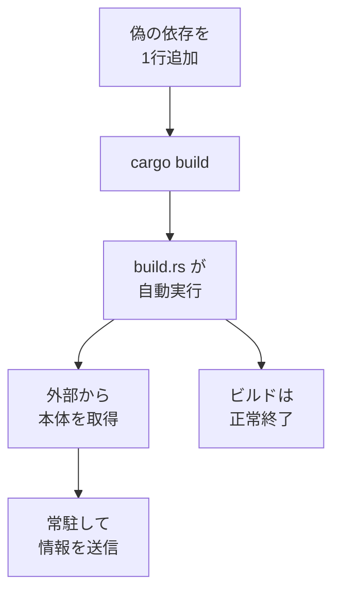

## AI

### [オープンモデルの「Gemma 4 31B」がタスクによっては「Claude Sonnet 5」と同じ品質を40分の1のコストで実現可能](https://gigazine.net/news/20260823-gemma-4-benchmark)
<!-- categories: LLM, Google, Anthropic -->

Gigazine が伝えたところによると、文書分析サービスを手がける AlphaSense が、財務データを扱う245問のテストで各AIモデルの精度と費用を測った結果を公開した。誰でも入手して自分の環境で動かせる「Gemma 4 31B」が、有料の Claude Sonnet 5 とほぼ同じ正答率を出しながら、1問あたりの費用は約40分の1で済んだという。鍵になっているのは、関連しそうな資料を丸ごとAIに読ませるのではなく、別の検索の仕組みで必要な箇所だけを抜き出して渡すやり方だ。読ませる文章が短くなればそれだけAIを動かす費用（トークン代）も下がるので、モデルの賢さだけでなく「何を読ませるか」の設計が効いていることになる。以前の[Google、オープンモデル「Gemma 4」を大幅高速化](/blog/2026-07-20/#googleオープンモデルgemma-4を大幅高速化)でも触れたように、Gemma 系は手元で動かしたときの速さと安さを武器にしており、大量に繰り返す定型作業ほど最上位モデルを使う理由が薄れていく。

### [Slack上の開発チームの会話をAIエージェントが把握してコーディング。ドキュメント作成もする「Slack Code」登場](https://www.publickey1.jp/blog/26/slackaislack_code.html)
<!-- categories: AI Agent, Slack, Claude Code -->

Publickey が報じたところでは、Slack が開発チームのチャットにAIエージェントを同席させる新機能「Slack Code」の提供を始めた。Claude Code、Claude Tag、Cognition の Devin、GitHub Copilot、Vercel Agent に対応し、OpenAI の ChatGPT も予定に入っている。特徴は、エージェントがそれまでのチャットの流れをそのまま前提知識として受け取る点で、「このボタンがダークモードで見えない」といった雑な依頼でも文脈から作業を始められる。作業は「Code Channel」と呼ばれる一時的なチャンネルに切り出され、途中でエージェントが「文字色は何にすべきか」と質問すると、デザイナーが答えてそのまま修正が進む。指示・議論・進捗・成果物が全部チームの目の前に並ぶので、これまで個人の端末の中で完結していたAI作業がチームの共有物になるという点が大きい。

### [Sources: Nvidia plans to use its $6B deal with Poolside to build an open-weight AI model to compete with Chinese models like DeepSeek and Kimi (Robbie Whelan/Wall Street Journal)](https://www.techmeme.com/260822/p16)
<!-- categories: NVIDIA, LLM, OSS -->

Techmeme がまとめた Wall Street Journal の報道によると、NVIDIA はコーディング支援AIの Poolside と結んだ60億ドル規模の提携を、重みを公開するAIモデル（誰でもダウンロードして自分の環境で動かせるモデル）の開発に使う計画だという。狙いは DeepSeek や Kimi といった中国発のオープンモデルへの対抗で、アメリカ側にも開かれたAIの土壌を作りたいという構想だ。GPUを売る側が自らモデルまで作りに行くのは、自社チップの上で動くソフトの選択肢を増やして囲い込みを避ける動きとも読める。オープンモデルは現在、中国勢が事実上の標準になりつつあるため、実現すれば勢力図が変わりうる。ただし現時点では関係者の話に基づく報道で、NVIDIA からの正式発表ではない点に注意がいる。

### [ChatGPTが危険な医療アドバイスをしたとしてOpenAIが提訴される、病気の牧師に「神はあなたの体が永遠に壊れ続けるようには設計していない」と助言](https://gigazine.net/news/20260823-openai-lawsuit-chatgpt-medical-advice)
<!-- categories: OpenAI, Business -->

Gigazine の記事によると、フロリダ州の牧師が「ChatGPT の助言に従った結果、重い肺塞栓症（肺の血管が血の塊で詰まる病気）の治療が遅れて死にかけた」として OpenAI を訴えた。訴状では、6週間続いた不調を相談したのに受診は不要と返され、症状を別の病気と取り違えた説明もあったとされる。この男性は過去に医師へ症状を取り合ってもらえなかった経験から自分で調べる習慣がつき、的確に見える回答を返す ChatGPT を次第に全面的に信頼するようになっていったという。求めているのは損害賠償に加えて、緊急の受診が必要そうな場合に会話を自動で打ち切る仕組みの導入だ。AIを医療情報の入り口として売り込む一方で、どこまで安全策を組み込む義務があるのかを問う裁判で、同種の訴訟が続いていることもあわせて注視したい。

### [AIエージェントが実際にどのように動いてトークンを使っているかが後から見てわかるようにできる「Langfuse」、オープンソースでセルフホスト可能](https://gigazine.net/news/20260823-langfuse)
<!-- categories: AI Agent, Observability, OSS -->

Gigazine が紹介した「Langfuse」は、AIエージェントが答えを出すまでにたどった道筋を丸ごと記録して、あとからブラウザで追える道具だ。エージェントの内部では「AIに問い合わせる → 検索する → 道具を実行する → 結果をまたAIに渡す」といった処理が何度も往復していて、外からは結果しか見えない。Langfuse はこの一連の流れを「Trace（足跡）」として保存し、どのAIを呼んだか、何を検索したか、各段階で何秒かかって何トークン使い、費用はいくらになったかまで表示する。OpenTelemetry や LangChain、OpenAI SDK などと繋がり、オープンソースなので自社サーバーに置いて運用できる。エージェントが遅い・高いと感じたときに、どこが原因かを推測でなく記録から特定できるようになるのが利点だ。

## Infra

### [Sources: some of Nvidia's top customers have been told that prices will jump 15%+ on systems, including Vera Rubin and Grace Blackwell, starting in early 2027 (Bloomberg)](https://www.techmeme.com/260822/p11)
<!-- categories: NVIDIA, Hardware, Business -->

Techmeme 経由の Bloomberg の報道によると、NVIDIA は主要顧客に対し、2027年初めから AIチップを載せたサーバーの価格を15%以上引き上げると伝えたという。対象には次世代の Vera Rubin と現行の Grace Blackwell が含まれる。AIデータセンターの建設費はチップ代がそのまま効いてくるため、15%は投資計画の桁を動かす数字だ。クラウド事業者が値上げ分を吸収しきれなければ、GPUを借りる側の時間単価にも遅れて響いてくる。関係者の話に基づく報道で正式発表ではないものの、AI向け計算資源の値段が当面下がらない方向に振れていることは確かだろう。

### [Samsung Evolving HBM Base Die at Hot Chips 2026](https://www.servethehome.com/samsung-evolving-hbm-base-die-at-hot-chips-2026)
<!-- categories: Hardware, Datacenter -->

半導体の学会 Hot Chips 2026 で Samsung が発表した内容を、ServeTheHome が講演を聞きながら書き起こした記事。HBM（GPUの隣に積んで使う超高速メモリ）は、記憶する層を何段も重ね、その一番下に「ベースダイ」という土台のチップを敷く構造をしている。この土台はこれまで信号を通すだけの通り道に近かったが、Samsung は HBM4 世代から4nmという最先端の製造技術で作り、GPU側が担っていた処理の一部を肩代わりさせる構想を示した。土台にある通信回路を小さくできればGPUの面積が空くので、その分をGPUの計算能力に回せるという理屈だ。ただし回路が小さく高密度になるほど熱が一点に集まるため、熱を逃がす専用の層を挟む案も同時に出している。以前の[HBMの速さとSSDの大容量を兼ね備えた「HBF」](/blog/2026-08-08/#hbmの速さとssdの大容量を兼ね備えたhbf)と同様、AIの性能はいまメモリの周辺で決まりつつある。

### [Micron Evolving Memory Architectures for AI at Hot Chips 2026](https://www.servethehome.com/micron-evolving-memory-architectures-for-ai-at-hot-chips-2026)
<!-- categories: Hardware, Datacenter -->

同じく ServeTheHome が現地から伝えた Micron の講演。話の中心は「メモリの壁」で、AI用チップの計算能力は2年でおよそ3倍に伸びるのに、そこへデータを送り込む HBM の帯域（1秒あたりに運べる量）は2年で2倍に届かない。計算が速くなってもデータが間に合わず、待たされる時間の方が支配的になるという構図だ。数字として印象的だったのは、12段重ねの HBM4 を8個載せた構成では、パッケージ全体で1万2000平方ミリを超え、メモリ側のシリコン面積がGPU本体の8倍以上になるという指摘。さらに、同じ容量を用意するのに HBM3E は DDR5 のおよそ3倍のシリコンを食うため、速さの代償が製造コストに直結していることも示された。メモリが足りない・高いという話が続く背景を、供給の都合ではなく物理と設計の側から説明した講演といえる。

### [バックアップが「戻せる」かを 5 段階で測る](https://zenn.dev/unchox/articles/backup-restorability-levels)
<!-- categories: SRE, Observability -->

バックアップ処理が正常終了したことは「指示した作業が最後まで走った」以上のことを何も保証しない、という前提から出発した記事。著者は確かめられることを①走ったか（終了コード）②あるか（保管先に実在するか）③開けるか（復元に要る要素が入っているか）④足りているか（件数・容量）⑤戻せるか（別の場所で実際に使う）の5段階に整理し、どの段も次の段を保証しないと述べる。面白いのは⑤の扱いで、実際に復元すれば②と③は同時に確かめられるが、通った経路の外は何も見ていないため④は含まない。10万件のうち3万件が欠けていても、1ファイル開ければサービスは起動してしまう。さらに「前日と比べて減っていないか」の監視は、最初から書き出されていなかったものは差がゼロのままなので永久に捕まらない、という指摘も刺さる。自動化できるのは検査の実行までで、結果を見る人がいなければ①で止まっているのと変わらない、と結んでいる。

### [Kubernetesのポリシー運用ってどうやるの？既存構成にモヤモヤして、Kyvernoと責任分離の設計を一から調べて整理してみた【前編】](https://zenn.dev/scalar_sol_blog/articles/aae32e93fd5680)
<!-- categories: Kubernetes, SRE -->

Kubernetes の土台を作った後、アプリを1つ足すたびに Terraform と Argo CD と Kyverno の設定を手で書き足す羽目になった、という失敗談から始まる調査記録。Kyverno は「特権コンテナは禁止」「このラベルは必須」といったルールを、リソースが作られる瞬間に割り込んで強制する仕組みだ。記事は最新仕様の整理が中心で、検証・書き換え・生成が1つの型に同居していた旧来の ClusterPolicy が v1.20 で廃止見込みとなり、判定だけの ValidatingPolicy、書き換えの MutatingPolicy、生成の GeneratingPolicy などに役割ごとに分かれたことを表でまとめている。とくに NamespacedValidatingPolicy はクラスタ全体の管理者権限なしでアプリチームが自分の範囲だけ管理できるため、インフラ側とアプリ側の責任分界点をどこに引くかの設計材料になる。なお筆者自身が断っているとおり、一部を除いて実運用での検証前の設計案という位置づけだ。同じ Kyverno を扱った[ポリシーエンジンに「本番だと錯覚させる」](/blog/2026-07-23/#ポリシーエンジンに本番だと錯覚させるオフラインテストの工夫)とあわせて読むと、導入後のテストまで見通しが立つ。

## Backend

### [ビルド時に不正コードが実行されるRustパッケージの改ざんについてまとめてみた - piyolog](https://piyolog.hatenadiary.jp/entry/2026/08/23/033006)
<!-- categories: Rust, Supply Chain, Security -->

先日の[Supply chain attack on arrayref](/blog/2026-08-21/#supply-chain-attack-on-arrayref)で速報した Rust のライブラリ乗っ取りについて、piyolog が各社の分析を突き合わせて全体像をまとめた。攻撃者は本物の `proc-macro2` に1文字違いで似せた `proc-macro1` を用意し、乗っ取った3つのライブラリのマニフェストに依存を1行足しただけで攻撃を成立させている。Rust ではビルド時に `build.rs` が自動実行されるため、そのライブラリの機能を1行も呼んでいなくても `cargo build` するだけで不正なプログラムが走る。とくに巧妙なのが、悪性版を公開した24秒後に正規の旧バージョン5つを次々と取り下げた点で、これによって cargo が「取り下げ済みのバージョンを使っている、更新を検討せよ」と警告を出し、素直に従った開発者が悪性版を掴む流れができていた。

ダウンロード数の規模も大きく、The Hacker News が crates.io の API を照会したところ arrayref は累計2億4500万回、直近90日で5390万回に達していた。

### [JIT Compiling Code in 5μs](https://malisper.me/jit-compiling-code-in-5-us)
<!-- categories: Database, Rust -->

JIT（実行しながらその場で機械語を作る仕組み）は速いプログラムを作る強力な手段だが、コンパイル自体に時間がかかるため、データベースでは「重いクエリにだけ適用する」といった妥協が普通だった。著者は PostgreSQL 互換の pgrust を作る中で、LLVM のような既存のコンパイラ基盤を経由せず直接アセンブリを吐く方式を採り、5マイクロ秒でコンパイルできるようにしたと述べる。ここまで速いと、選り好みせず全てのSQLをJITにかけられるので、pgrust が速い理由の一端になっているという。記事は簡単な正規表現エンジンを題材に、木構造を解釈して回る素朴な実装から機械語を直に組み立てる実装へ進む手順を追える形で書かれている。著者はアセンブリを直接書く難所をAIの支援で越えられたとしており、これまで一部の専門家の技芸だった領域の敷居が下がりつつあることも示している。

### [Optimizing memory use in a Markdown parser](https://blog.kowalczyk.info/a-n8wf/optimizing-memory-use-in-markdown-parser.html)
<!-- categories: C -->

Rust の Markdown パーサを C++ に移植したところ、構文木の1ノードが232バイトに膨らんでしまい、それを16バイトまで削った過程を著者が公開している。膨らんだ内訳は、16バイトの文字列が8本、24バイトの可変長配列が2本、行と桁の位置情報が24バイト、真偽値が6個で1バイトずつ、そして詰め物（アライメント）。どの種類のノードも全部のフィールドを持つ設計だったため、文字列1本しか使わないテキストノードまで満額を払っていた。最初の一手はポインタ圧縮で、確保領域の先頭からの差分を32ビットで持つことで8バイトのポインタを4バイトに縮め、文字列1本あたり16→8バイト、ノードあたり64バイト削っている。すべての確保をアリーナ（後からまとめて捨てる前提の連続領域）に寄せているので使用量の計測も簡単で、64KBの原稿を食わせたときの実測値を段階ごとに並べているのが実践的だ。

### [単体テストはシンプルに書くべきだと思う](https://k-sasaki.net/entry/2026/08/23/102342)
<!-- categories: Testing, Java -->

テストコードが保守の重荷になっている現場の原因は、たいてい「テストが複雑すぎること」にある、という主張の記事。著者は、ビジネスの決まりごと自体は本質的に複雑になるものだと認めたうえで、テストは「入力→期待される出力・状態変化」という単純な対応づけに徹すべきだと説く。そしてテストが書きにくいと感じたら、それはテストの書き方ではなくテスト対象の設計が複雑だというサインで、まず責務の分割を検討すべきだとする。網羅的に確かめたいときは手でケースを並べず、入力値と期待値の組を表のように並べるパラメータ化テストを使う。加えて、仕様変更で意味を失った「死んだテスト」を残すとCIの時間を食うだけでなく「通っている＝安全」という誤った安心感を生むので、遠慮なく消すべきだとしている。JUnit5 のアノテーションを使ったサンプルも付いている。

### [[新機能]Feature Policy Rules が一般提供となったので TEMPORARY テーブルとサーバーレスタスクの作成だけをブロックしてみた](https://dev.classmethod.jp/articles/snowflake-feature-policy-rules-ga)
<!-- categories: Snowflake, Database -->

クラスメソッドの DevelopersIO が、データ基盤 Snowflake の Feature Policy Rules が正式提供になったのを受けて実機で検証した記事。Feature Policy は「このデータベースの中では何を作ってよいか」をユーザーやロールではなく入れ物（データベース）単位で縛るガバナンス機能だ。従来は「タスクは一切作らせない」といった種類ごとの全部か無かの制御しかできなかったが、今回の更新で YAML に条件式を書き、たとえば「ウェアハウスを指定しないサーバーレスタスクだけ禁止」「一時テーブルだけ禁止」といった細かい線引きができるようになった。条件式の中では、作成しようとしているオブジェクトが一時的か、どのウェアハウスを使うかといった属性を参照できる。コストが読みにくい機能だけを塞ぎたい、といった実務的な要求に応えやすくなる更新だ。

## Frontend

### [How to Design an Animation](https://www.reddit.com/r/programming/comments/1vw91lz/how_to_design_an_animation)
<!-- categories: Design -->

「デザイナーの動画を見て、これをどう実装するんだと固まった経験」から始まる、アニメーションを感覚ではなく設計するための記事。著者の出発点は「アニメーションはすべてグラフである」という見方で、フェードインなら横軸が時間・縦軸が不透明度のグラフ、視差効果なら横軸がスクロール量になる。同じ始点と終点でも曲線の形が変われば印象がまるで違うので、望む形の曲線を作ることが設計の中心であり、その道具が数学だという流れだ。イージングとベジェ曲線、指数的に近づく動き、バネの動き、三角関数による周期運動といった部品を並べ、それらを組み合わせて複雑な動きを分解・再構成する手順を示している。数学の中身を深く理解する必要はなく、それぞれの道具がグラフの形をどう変えるかの感覚さえ持てばよい、という書き方なので入り口として読みやすい。

### [Mermaid VS PlantUML: Your Flow Is Mine!](https://hackernoon.com/mermaid-vs-plantuml-your-flow-is-mine)
<!-- categories: Design -->

HackerNoon に載ったシステムアナリストの記事で、図をコードで書く（diagram-as-code）2大ツールを UML のシーケンス図に絞って比べている。図を絵として手で並べると、やり取りの順番が変わるたびに半分作り直す羽目になるが、コードで書いておけば差分を見て直せて、ドキュメントと同じ場所に置いておける、というのがこの手法の利点だ。著者の判断基準は機能の多さではなく「開発者から UML を初めて見る人まで、全員にとって図が見て分かるか」という点にあり、その物差しでは何度比べても PlantUML に軍配が上がったという。プロジェクト側に Mermaid の描画基盤が既に整っていても PlantUML を推したことがある、と自分の肩入れを認めているのは正直な書き方だ。どちらを標準にするか迷っているチームには、比較軸の立て方として参考になる。

### [Screendrop](https://github.com/fayazara/screendrop)
<!-- categories: OSS, Design -->

スクリーンショットと画面録画をまとめて扱う macOS 向けのオープンソースツールで、画面収録の共有サービス Loom の代替を狙っている。撮った直後に浮かぶプレビューから、コピー・圧縮・保存・注釈・アップロードまでを続けて行えるほか、元画像を壊さずに描き込み・切り抜き・伏せ字処理・背景付けができる。録画側では、カメラ・マイク・システム音声を別々に編集できる素材として記録し、ズームやカーソルの再構成、打鍵内容の字幕化、書き起こし文を切って動画を切るといった編集にも対応する。共有は自分の Cloudflare アカウントを通す設計なので、業務の画面を他社のサーバーに預けずに済むのが利点だ。開発途上で macOS 26.4 以降が必要と明記されている点は注意がいる。

### [clicky: A clickwheel iPod emulator](https://github.com/daniel5151/clicky)
<!-- categories: WebAssembly, Rust -->

クリックホイール式の iPod（第4世代・白黒画面）を丸ごと再現しようとしている Rust 製のエミュレータ。作者によれば、非公式ブートローダの ipodloader2 や音楽プレイヤーの Rockbox に加えて、Apple 純正のファームウェア RetailOS の起動まで到達しており、リポジトリにはデスクトップ版とブラウザ向けの WebAssembly 版が並んでいる。難所は、搭載チップ PP5020 のメモリ空間に用途の分かっていない領域が多く残っていることで、RetailOS が何をしようとしているのかを解析しながら埋めていく必要がある。一般利用にはまだ向かないと本人が明記しており、協力者を募っている段階だ。2000年代前半の携帯機器がどう作られていたかを、動かしながら読み解ける教材になっている。

### [New qwen3.8:27b on a 39k line C to single-file HTML / three.js port](https://www.reddit.com/r/LocalLLaMA/comments/1vwde84/new_qwen3827b_on_a_39k_line_c_to_singlefile_html)
<!-- categories: Qwen, Three.js -->

r/LocalLLaMA の投稿者が、3万9000行・2.1MBのC言語で書いた自作シューティングゲームを「1回の指示だけで単一のHTMLファイル＋three.js に移植せよ」という無茶な課題でAIに与えた記録。ソースは約60万トークン相当で、モデルが一度に読める量の2倍以上あるため、AIは自分でファイルを歩いて要点を拾う必要がある。手元のRTX 6000 Pro（96GB）で動かした qwen3.8:27b は2種類の実行環境でそれぞれ4時間18分と1時間40分かけたが、どちらも動くものにならず、クラウドの Opus 5 が21分で出した結果だけがかろうじて遊べる水準だった。投稿者の結論は「同じ重みでも指示が薄ければ結果は同じで、作り込まれた実行環境は薄い指示を救わずGPU時間を燃やすだけ」というもの。1回ずつの試行なので統計的な話ではないが、手元のモデルで大きなコードを一括変換させる難しさが具体的な数字で見える。

## Products

### [Claude Academy](https://www.producthunt.com/products/claude-academy)
<!-- categories: Anthropic, Claude -->

Anthropic が公式に用意した、Claude の使い方を学ぶための無料の学習サイト。指示の書き方の基礎から始まり、Claude Code、MCP（AIに外部の道具を繋ぐ共通の仕組み）、複数のAIを分業させる構成まで、開発者・制作者・経営層といった立場別の道筋が用意されている。動画とレシピ集と手を動かす演習を組み合わせた形式で、修了の証明を取る道も用意されている。断片的な記事を拾い集めて学んでいた領域に、提供元自身が体系立てた教材を置いた形だ。

### [Epho](https://www.producthunt.com/products/epho-claude-code-in-the-cloud)
<!-- categories: AI Agent, Claude Code -->

Claude Code や Codex、OpenCode といったコーディング用AIを、クラウド上の隔離環境で走らせるAPI。メッセージを送ると、あらかじめ用意された作業環境が立ち上がってリポジトリを取り込み、AIが作業した内容が流れて返ってくる。自前でサンドボックスや認証まわりを組む代わりに、稼働した秒数だけ払う課金で、APIキーは利用者が自分のものを持ち込む形だ。「AIエージェントを機能として自分の製品に組み込みたいが、そのための土台は作りたくない」という開発者に向いている。

### [FetchSandbox MCP](https://www.producthunt.com/products/fetchsandbox)
<!-- categories: MCP, Testing -->

外部サービスとの連携が本当に直ったかを、AIエージェントに証明させるためのテスト環境。Stripe や GitHub、Twilio など70種類以上の模擬環境が用意されていて、本物のAPIの利用枠を消費せずに、通知の受け取りや再送、失敗したときの挙動まで試せる。MCP 経由で Cursor や Claude Code から使えるので、「200 OK が返った」で終わらせず、実際に状態が正しく変わったかの証跡を残させてからプルリクエストを通す運用が組める。AIが書いたコードはテストを通しつつデータを壊すことがある、という問題への具体的な備えになっている。

### [Dockhand](https://www.producthunt.com/products/dockhand)
<!-- categories: Docker, OSS -->

手元のマシンから遠隔のサーバー、NAT の内側にある機械まで、あちこちに散らばった Docker を1つの画面から扱う管理ツール。Git リポジトリから Compose 構成をそのまま配備して同期させたり、ログや使用状況を眺めたり、ブラウザの中からコンテナのシェルに入ったりできる。配備前に Grype や Trivy でイメージの脆弱性を調べる機能や、1Password や HashiCorp Vault から機密情報を差し込む連携も入っている。SSH の窓をいくつも開いて回るのをやめたい個人の自宅サーバーから業務環境まで、自分で立てて使える点が売りだ。

### [Pocket by Meta](https://www.producthunt.com/products/pocket-by-meta)
<!-- categories: Meta, AI Agent -->

作りたい遊びを言葉で説明すると、AIがその場で遊べる小さなゲームに仕立ててくれる Meta のアプリ。できたものはTikTokのような縦の流れに並び、他の人が遊んだり、作り替えて自分の版を出したりできる。触る・傾ける・声を出す・カメラに写すといった入力に反応させられるので、画面をなぞるだけの操作に留まらない。プログラムを書かずに作ったものを、投稿として消費されるところまで一続きにした点が新しい。

## Others

### [Sources: Iran-linked hackers shut down a small UK power plant for four days, coinciding with a wave of Iran-affiliated attacks on US water utilities (Telegraph)](https://www.techmeme.com/260822/p15)
<!-- categories: Security, Incident -->

Techmeme がまとめた Telegraph の報道によると、イランと関係があるとみられる攻撃者がイギリスの小規模な発電所を4日間停止させた。同時期にアメリカでは水道事業者を狙ったイラン関連の攻撃が相次いでおり、一連の動きの一部と見られている。発電や水道のような社会基盤の制御システムは、外から切り離されている前提で長年運用されてきた古い機器が多く、更新も止めにくいため後回しになりがちだ。金銭目的の攻撃と違って、止めること自体が目的の攻撃には身代金交渉のような出口がなく、復旧までの時間がそのまま被害になる。関係者の話に基づく報道だが、この種の攻撃が「実際に止められた」段階に来ていることを示す事例として重い。

### [640億円の支払いでTikTokがアメリカ司法省との児童オンラインプライバシー保護法違反に関する訴訟に和解](https://gigazine.net/news/20260823-doj-tiktok-settle-400-million-coppa)
<!-- categories: Privacy, Business -->

Gigazine の記事によると、TikTok と ByteDance がアメリカ司法省と4億ドル（約640億円）で和解した。2024年に「何百万人もの子どものデータを違法に集めている」として提訴された、児童オンラインプライバシー保護法（COPPA）違反をめぐる訴訟の決着だ。支払いは即時の3億ドルと、前身サービス Musical.ly に対する過去の命令が取り消された時点での1億ドルに分かれる。司法省は、この金額が COPPA 関連の和解としては過去最大級だとしている。子ども向けの年齢確認や保護者による監督は各国で規制が強まっている領域で、金額の大きさはそのまま「守らなかった場合の相場」として他社にも効いてくる。

### [First Android malware targeting automotive head units](https://securelist.com/android-head-unit-malware/121106)
<!-- categories: Security, Android -->

Kaspersky の研究チームが自社ブログ Securelist で、車載ディスプレイ（ヘッドユニット）を狙った Android マルウェアを初めて確認したと報告した。感染の入り口は、ファームウェア更新を担う正規のシステムアプリ TWCore で、「まだ入っていないアプリだけを確認する」という判定の穴を突かれ、利用者の同意なしに不正なアプリを入れられてしまう。仕込まれるのは3段構成で、画面を持たない投下役がXORで暗号化された部品を復号し、機器の情報を送って次の部品を受け取り、最終的に広告を自動でクリックして稼ぐ役と、他人の通信を中継させる出口にする役が動く。Kaspersky は、BADBOX という大規模なボットネットに関わる MoYu Group の仕業と見ている。車の画面が誰かの匿名通信の中継地点にされる、という構図は、ネットに繋がる機器がどこまで管理対象なのかを考え直させる。

### [Appleからの警告はスルー厳禁。「傭兵型スパイウェア」が活動中](https://www.gizmodo.jp/article/apple-is-sending-out-a-huge-wave-of-spyware-warnings)
<!-- categories: Security, Apple -->

ギズモード・ジャパンが TechCrunch の報道をもとに伝えたところでは、Apple が110カ国の利用者に対して「傭兵型スパイウェア」に狙われた可能性があるという警告を大量に送っている。傭兵型スパイウェアとは、民間企業が開発して政府機関などに売る監視用ソフトのことで、NSO Group の Pegasus が知られる。相談先として案内されているデジタル権利団体 Access Now には過去最多の相談が寄せられ、件数は通常より3〜4割多かったという。増えた理由の一つは表示方法の変更で、今年からメールだけでなく iPhone のロック画面や設定アプリにも警告が出るようになり、見逃しにくくなった。警告は侵入されたという意味ではなく「狙われた可能性が非常に高い」という通知だが、届いたら機能を意図的に制限するロックダウンモードを有効にするよう勧められている。

### [出社するよりも完全リモートワークの方が幸福度が高いという研究結果](https://gigazine.net/news/20260823-remote-workers-highest-well-being)
<!-- categories: Science, Business -->

Gigazine が紹介したコロラド大学ボルダー校の研究で、アメリカの大規模医療機関の従業員7704人分の回答を勤務形態別に比べたところ、完全リモートが5点満点で4.22と最も高く、ハイブリッドが4.12、完全出社が3.89だった。研究チームは当初、在宅の柔軟さと対面の交流を両取りできるハイブリッドが最も高くなると予想しており、結果は意外だったという。一方で、職場とのつながりの強さや1年後の離職率については、勤務形態による差は統計的に確かとは言えない水準にとどまった。ただし対象が1機関に限られ、完全リモートには事務・分析職、完全出社には臨床職が偏っているという弱点も明記されている。研究チームは、働く場所そのものを議論する前に「離職率を下げたいのか、つながりを強めたいのか」を先に決めるべきだと提案している。
