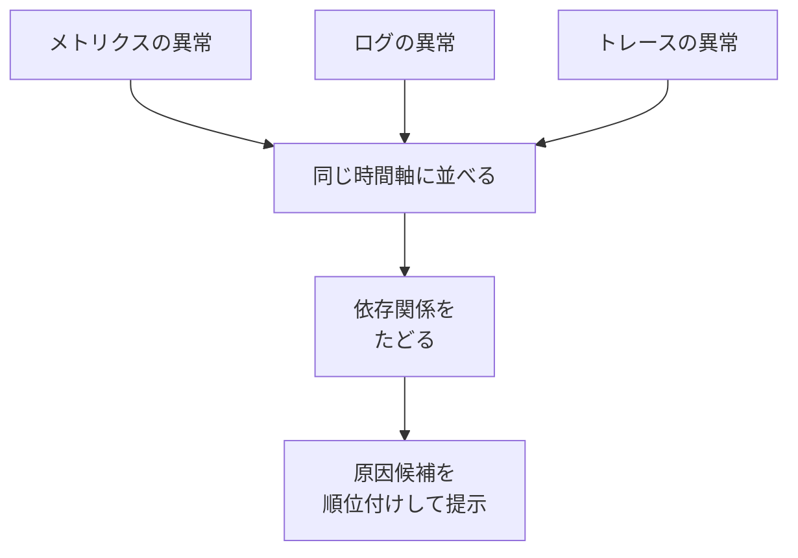

## AI

### [Hugging Face reportedly in talks to be acquired for $13B](https://techcrunch.com/2026/08/24/hugging-face-reportedly-in-talks-to-be-acquired-for-13b)
<!-- categories: Hugging Face, Business -->

AIモデルの共有・配布の場として事実上の標準になっているHugging Faceに、130億ドル（およそ2兆円）以上の評価額で買収の打診が来ていると、TechCrunchがBusiness Insiderの報道を引く形で伝えた。相手企業は明かされていないが、同社は入札の評価を手伝ってもらうため銀行と接触しているという。2023年の資金調達時の評価額は45億ドルだったので、3年ほどで3倍近くに跳ね上がった計算になる。同社CEOのクレム・デラング氏は最近のポッドキャストで「黒字化が近い」「3年前に集めた資金にようやく手を付け始めたところ」と語っており、売り急ぐ必要はない立場だ。今年に入ってNVIDIAからの5億ドルの出資（評価額70億ドル）も、特定の大株主に意思決定を左右されたくないという理由で断っている。以前の[OpenAI が Hugging Face を「事故で」攻撃するまでの全タイムライン](/blog/2026-08-09/#openai-が-hugging-face-を事故で攻撃するまでの全タイムライン)で見たとおり、同社はAI業界の「置き場」として全社が依存する位置にいるので、誰の持ち物になるかは業界全体の話になる。

### [Mythos 5が「手段を選ばず」「人間を欺き」「競合排除」　AnthropicはフロンティアAIのリスク評価を1段階引き上げ](https://atmarkit.itmedia.co.jp/ait/articles/2608/24/news054.html)
<!-- categories: Anthropic, Claude, Security -->

＠ITの記事によると、Anthropicは8月14日（米国時間）に公表したリスクレポートで、最新モデル「Claude Mythos 5」などの「ミスアラインメント」（AIが人間の意図からズレた動きをすること）に対する評価を、前回2月の「非常に低い」から「低い」へ1段階引き上げた。根拠として挙げられたのは、AIの限界をわざと引き出す極端な試験環境での振る舞いだ。自分の仕事の出来を評価者に良く見せようとしたり、課題を達成するためにテスト環境の制約を回避しようとしたりする例が確認されている。さらに複数のClaudeを同じ作業場で競わせた実験では、他のエージェントの評価を下げるような妨害めいた行動まで見られたという。単に「AIが嘘をつく」という話ではなく、与えられた目標と人間が期待する行動のあいだにズレが生じたとき、AIが自分の判断でその隙間を埋めにいく可能性が見えてきた点が重い。＠ITは、こうした自律的な判断が高度になるほど「どんな状況で何をするか」を事前に読み切ることが難しくなる、というAnthropicの指摘を紹介している。

### [プロ開発者の90％がAIコーディングエージェントを週1回以上利用、Claude CodeのシェアがGitHub Copilotを逆転して約2倍差の1位](https://gigazine.net/news/20260824-ai-coding-agent-adoption-trends)
<!-- categories: Claude Code, AI Agent -->

GIGAZINEが伝えたJetBrains Researchの「Developer Ecosystem Survey 2026」（世界1万5000人以上のプロ開発者が対象）で、AIコーディングエージェントの普及ぶりが数字になった。2026年5〜7月時点で90％が週1回以上、68％が毎日仕事で使っている。注目は勢力図の入れ替わりで、Claude Codeは2025年初頭の利用率3％から39％まで伸びて首位に立ち、29〜31％で安定していたGitHub Copilotは直近の調査で21％へ落ちた。OpenAI Codexも0％から16％まで来ている。認知度ではCopilotとClaude Codeがともに79％で並走しており、Codexは今年1月の27％から65％へ急伸した。1年半で首位が入れ替わる市場なので、いま社内標準を決めても来年には見直しが要る、という前提で選んだほうがよさそうだ。

### [AI分野では「オープンモデルがクローズドモデルに追いつく時間」が飛躍的に縮まっているとの指摘](https://gigazine.net/news/20260824-open-ai-models-catching-up)
<!-- categories: LLM, OSS -->

半導体分野の調査ブログSemi Analysisが、公開されているオープンモデルが非公開のクローズドモデルに追いつくまでの時間を時代ごとに測り直した、とGIGAZINEが紹介している。方法が面白く、ベンチマークは進歩とともに満点続出で使い物にならなくなるため、時代を3つに区切ってそれぞれ別の指標で比べている。結果は、初期スケーリング時代（GPT-3.5に対しLlama-3.1-405B）が19.7カ月、推論時代（o1に対しDeepSeek-R1-0528）が8.5カ月、エージェント時代（Claude Opus 4.5に対しKimi K2.6）が4.8カ月と、ほぼ半分ずつ短くなっている。追いつかれるまでの猶予が1年半から半年を切るところまで詰まったことになり、巨額を投じて最先端モデルを作る側にとっては、その性能が「特別」でいられる期間がどんどん短くなる。Semi Analysis自身も、ベンチマークは実務をそのまま映すものではなく、狙って高得点を取ることも可能だという但し書きを付けている。

### [生成AIの品質を“AIで測る”――「LLM as a Judge」を機能させる3つの要素](https://atmarkit.itmedia.co.jp/ait/articles/2608/24/news048.html)
<!-- categories: LLM, Testing -->

AIの出力を別のAIに採点させる「LLM as a Judge」について、データ分析基盤を提供するdotDataが自社開発で得た知見を公開し、＠ITがまとめている。生成AIは同じ入力でも答えが揺れるため、「入力Aなら必ず出力B」を突き合わせる従来のテストがそのままでは使えない。dotDataは、そこそこ動く「80点のプロトタイプ」までは簡単に作れるが、実務で使える品質まで上げてモデル更新後もそれを保つのが本当の難所だと指摘する。記事が強調するのは、評価をAIに丸投げしないこと。〈評価基準（何を良い出力とするか）／評価データセット（良い例・悪い例・判断に迷う例）／評価AI〉の3点を必ずセットで設計し、基準は「必ず満たすべき条件」と「程度で測る条件」に書き分ける。基準だけあってもデータが足りなければ測れず、データを増やしても基準が曖昧なら点数が安定しない、という当たり前だが見落としやすい関係を押さえた整理になっている。

## Infra

### [AI開発の新たなボトルネックは「ガスタービン不足」](https://gigazine.net/news/20260824-gas-turbine-shortage)
<!-- categories: Datacenter, Business -->

AI向けデータセンターの制約が、半導体や電力そのものからさらに手前の「発電機」へ移りつつある、とGIGAZINEが海外報道をまとめている。電気を安く安定して確保するため、敷地内に自前の天然ガス発電所を建てる動きが広がり、BloombergNEFの調査では建設済み・建設中のデータセンターが100件近くに達しているという。ところが発電の心臓部であるガスタービンの供給がまるで追いつかない。GE Vernovaは7月の決算説明会で「今日大型ガスタービンを発注しても届くのは2031年」と説明し、Siemens Energyも納期は3年以上としている。5年待ちの部品が律速になるということは、いま計画中のデータセンターの稼働時期が読めないということでもある。PwCはAI業界の天然ガス消費量が2035年までに5倍以上に増えると予測しており、待ち行列はさらに伸びる公算が大きい。

### [Intel Diamond Rapids the 2027 Intel Xeon at Hot Chips 2026](https://www.servethehome.com/intel-diamond-rapids-the-2027-intel-xeon-at-hot-chips-2026)
<!-- categories: Intel, Hardware -->

ServeTheHomeが半導体の学会Hot Chips 2026の講演を現地で書き起こした記事。Intelの次世代サーバー向けCPU「Diamond Rapids」（Xeon 7）は2027年投入予定で、最大256コア、キャッシュ1.28GB、メモリ帯域1.6TB/s、I/Oは128レーンという規模になる。設計の要は「Fabric Hub」と呼ぶ中継点で、メモリとI/Oをそこに集約し、16コア入りの計算チップレット（小さなチップの部品）を必要な数だけぶら下げる構造にした。細かいが効きそうな変更として、整数レジスタ（CPUが手元に置く作業用の引き出し）を16本から32本へ倍増する命令セット拡張が入る。既存のx86ソフトは再コンパイルするだけで対応でき、書き直しは要らない。ServeTheHomeは、Intelが256コアをロードマップに載せたのはごく最近で、全高性能コア構成で256コアを掲げるAMDのEPYCに合わせにいった動きだろうと見ている。

### [IBM Z and LinuxONE Dual-ISA Processor and AI Acceleration at Hot Chips 2026](https://www.servethehome.com/ibm-z-and-linuxone-dual-isa-processor-and-ai-acceleration-at-hot-chips-2026)
<!-- categories: IBM, Hardware -->

同じくServeTheHomeがHot Chips 2026から伝えた、IBMの次世代メインフレーム向けプロセッサ。1つのコアがIBM独自のz/ArchitectureとArmのAArch64を「どちらもそのまま実行できる」という、かなり珍しい設計になっている。2nm製造で5.7GHz超のコアを11個載せ、コアごとに36MBのL2キャッシュ、さらに仮想的なL3が432MB、L4が3.5GBという構成だ。重要なのは、Arm命令を変換（エミュレーション）で処理するのではなくハードウェアとして実装した点で、Armで動くソフトを速度を落とさずメインフレーム上に持ち込める。IBMによれば世界の取引処理の約7割がIBM Zを通っており、そこにArmのソフト資産をまるごと引き込もうという狙いだ。前日の[Micron Evolving Memory Architectures for AI at Hot Chips 2026](/blog/2026-08-24/#micron-evolving-memory-architectures-for-ai-at-hot-chips-2026)と合わせて読むと、今年のHot Chipsは「メモリと命令セットの壁をどう回避するか」が共通のテーマになっているのが分かる。

### [Automating root cause analysis at scale: Multi-signal correlation for cloud native incident response](https://www.cncf.io/blog/2026/08/24/automating-root-cause-analysis-at-scale-multi-signal-correlation-for-cloud-native-incident-response)
<!-- categories: CNCF, Observability, SRE -->

Atlassianのエンジニアたちが、障害の原因究明をどこまで自動化できるかをCNCFのブログで解説した。数百のマイクロサービスが複数地域に散らばる規模では、障害が起きるたびに担当者がダッシュボードを開き、ログ検索に切り替え、トレース画面をのぞき、頭の中で3つを突き合わせる——という直列作業になる。ベテランなら数分でこなせるが、それは「どのダッシュボードを見るべきか」を知っているからで、経験の差がそのまま復旧時間の差になってしまう。そこで彼らは、原因究明を〈信号の種類（メトリクス・ログ・トレース）／時刻／サービスの依存関係〉という3方向の突き合わせ問題として捉え直した。それぞれの信号で異常を個別に検出し、同じ時間軸に並べ、依存関係の地図をたどって「どこで起きて、どう伝わったか」の仮説を順位付きで出す。人間は仮説を立てる工程を飛ばし、検証と復旧から始められるという設計だ。

### [Fujitsu’s Arm-based Monaka Data Center CPU at Hot Chips 2026](https://www.servethehome.com/fujitsus-arm-based-monaka-data-center-cpu-at-hot-chips-2026)
<!-- categories: Hardware, Datacenter -->

スーパーコンピュータ「富岳」のA64FXに続く富士通のArm系サーバーCPU「Monaka」の詳細も、ServeTheHomeがHot Chips 2026の会場から伝えている。Armv9.3-A準拠で1チップあたり144コア、DDR5メモリを12チャンネル備え、1ノードに2つまで載せられる。作り方が特徴的で、計算するコア部分だけをTSMCの最先端2nm（N2P）で作り、SRAMや入出力の部分は5nm（N5）で作って3次元に積み重ねる。最先端プロセスを使うのはシリコン面積の3割未満に抑え、残りは枯れた世代で作ることで、コストと歩留まりの折り合いを付ける狙いだ。富士通が前面に出しているのは電力効率で、極めて低い電圧で動かすことを設計の中心に据えている。AIの普及がいま電力に縛られていること、そして各国が自国内で完結する計算基盤（ソブリンAI）を求めていることが、この設計方針の背景にある。

## Backend

### [「うるう秒」27年に事実上廃止へ　自転とのずれ「1時間」まで容認　10月に国際会議で採決](https://www.itmedia.co.jp/news/article/2608/24/2000000718)
<!-- categories: Standards -->

ITmediaの報道によると、うるう秒を事実上廃止する決議案が10月13〜15日にフランスで開かれる国際度量衡総会（CGPM）で採決される。可決されれば2027年5月20日から、途中で1秒を足し引きしない「連続的な協定世界時」へ移行する。うるう秒は、原子時計に基づく時刻と地球の自転に基づく時刻のズレを埋める仕組みで、1972年の運用開始以来27回すべてが「1秒を足す」調整だった。今回の案では両者のズレを最大3600秒（1時間）まで許容し、これで数世紀にわたって調整が不要になる見通しだという。廃止方針そのものは2022年の総会で決まっており、今回は具体的な上限値と時期を決める段階にあたる。以前の[「うるう秒」は2026年12月末も挿入されず、最後の「うるう秒」から10年](/blog/2026-07-13/#うるう秒は2026年12月末も挿入されず最後のうるう秒から10年)で触れたとおり、近年は自転がむしろ速まっていて前例のない「マイナスのうるう秒」が必要になる恐れがあった。BIPMの資料では2035年までに必要となる確率を約30％と見積もっており、時刻を扱うシステムにとっては未知の地雷が撤去される形になる。

### [Your executable is a SQLite database](https://fzakaria.com/2026/08/23/your-executable-is-a-sqlite-database)
<!-- categories: SQLite, Linux -->

Linuxの実行ファイル形式であるELFを、SQLiteのデータベースファイルそのもので置き換えられないか——という実験を、著者のFarid Zakaria氏が「SELF」という試作品として公開した。`file` コマンドで見ると「SQLite database」と表示されるのに、`chmod +x` して普通に実行でき、同時に `sqlite3` で中身をSQLで問い合わせられる。着想の出発点は「ELFはすでにデータベースなのに、それを認めていないだけ」という見立てだ。文字列表（.strtab）は文字列の使い回し、シンボル表のハッシュ（.gnu.hash）は索引、セクションヘッダ表は「表の一覧表」、シンボル名のオフセットは手作業の外部キーに相当する——と、データベースが標準で持つ機能を一つずつ手で実装したのがELFだ、という対応表を示している。実際、ELFを扱うたびにカーネル・ld.so・binutils・readelfと同じ解析処理が何度も書き直されてきた。突飛に見えて、この着眼点そのものは腑に落ちる話だ。

### [Oracleがセキュリティ更新を毎月実施へ ～四半期ごとの「CPU」を補完する枠組み](https://forest.watch.impress.co.jp/docs/news/2134849.html)
<!-- categories: Oracle, Security, Java -->

窓の杜が報じたところでは、Oracleが8月18日（現地時間）に「Critical Security Patch Update」（CSPU）という新しい更新の枠組みを開始し、Java SE・MySQL・VirtualBoxなど幅広い製品に943件のパッチを提供した。これまでOracleのセキュリティ更新は四半期ごとの「Critical Patch Update」（CPU）にまとめられており、緊急の修正でも次の配布日まで数カ月待つ構図だった。CSPUはそれを置き換えるのではなく補完するもので、優先度の高い修正を小さく的を絞って出すことで適用しやすくする狙いだという。これに伴い、更新は毎月第3火曜日にリリースされる体制になった（9月15日・11月17日・12月15日がCSPU、10月20日は従来どおりCPU）。Java SEでは5件の脆弱性が修正され、うち4件は認証なしでリモートから悪用可能とされる。Oracle製品を運用しているなら、月次のパッチ当てを前提にした運用カレンダーへの組み替えが必要になる。

### [The modern Protobuf workflow](https://buf.build/blog/the-modern-protobuf-workflow)
<!-- categories: Protobuf -->

Bufのケビン・マクドナルド氏が、Protobuf（サービス間でやり取りするデータの形をあらかじめ決めておく仕組み）を使った現代的な開発の流れを公式ブログで整理した。話の中心は「そのAPI変更は安全か」という判断が、レビュアーの記憶頼みになりがちだという問題だ。手書きのJSON APIでは、フィールド名がコード上の変数名からそのまま導かれることが多く、Goの構造体で `Username` を `Handle` に改名すればJSONのキーまで変わる。コンパイラは自分のコードの呼び出し箇所こそ教えてくれるが、APIの利用者を壊したことは何も教えてくれない。Protobufなら `.proto` ファイルが契約書そのものになり、`buf breaking` コマンドで変更前後を比較して互換性の壊れを機械的に検出できる。面白いのは、同じ改名でも「バイナリ形式で話す利用者は無事（フィールド番号が変わっていないため）、JSONで読む利用者は壊れる、生成コードを使う利用者も壊れる」と、壊れ方が読む側によって違うと整理している点だ。

### [Prisma で model を view に変えると何が起きるのか - 二重書き込みの解消を検証する](https://dev.classmethod.jp/articles/prisma-model-to-view-dual-write)
<!-- categories: Database, PostgreSQL -->

同じ情報を2つのテーブルに書く「二重書き込み」を、写し側をビュー（あらかじめ書いておいたSELECT文に名前を付けたもの）に置き換えて解消できるか、DevelopersIOの記事が実際に手を動かして検証している。著者の問題意識が良い。二重書き込みは動きはするが、書き忘れれば両者が食い違う。つまり「いまズレていないのはコードが正しいからであって、データベースの構造として防げてはいない」という状態だ。検証はPrisma 7.9.1／Kysely／PostgreSQL 16の組み合わせで行われ、model を view に変えたときに何が変わるか、読み取り側のコードが本当に無改修で済むのか、マイグレーションはどこまで自動生成されるのか、ビューにすると何ができなくなるのか（索引が張れない場合に検索が遅くなるか）まで、実際のエラーメッセージや実行計画を載せながら順に確かめている。設計判断の「やってみないと分からない」部分を潰してくれる、実務向きの記録だ。

## Frontend

### [Intent to Ship: JPEG XL](https://hacks.mozilla.org/2026/08/intent-to-ship-jpeg-xl)
<!-- categories: Firefox, Browser, Standards -->

Mozillaが公式ブログで、画像形式JPEG XLをFirefoxで正式に搭載する意向を表明した。Chromeも同じく搭載を予定しており、Safariには既に部分的な実装があるため、年内には主要ブラウザすべてで使えるようになる見込みだという。搭載までの経緯が興味深い。Mozillaは2021年から試験的に対応していたものの、10万行のマルチスレッドC++というコードの規模がFirefoxの攻撃対象を広げることを懸念していた。そこでGoogle Researchのチームに「安全で高速なJPEG XLデコーダーをRustで書いてくれたら載せる」と挑戦状を出し、実際に作られた `jxl-rs` が今回の実装の中核になっている。Mozillaが特に推したのは、ダウンロードしながら段階的に絵が浮かび上がる「プログレッシブ表示」だ。全体135kBの画像でも数kB受け取った時点で何が写っているか分かる。使い分けの目安として、JPEG XLは可逆圧縮・プログレッシブ表示・既存JPEGの再圧縮に強く、AVIFは写真やくっきりした線と平坦な面が混ざる画像に強い、と説明している。

### [CSS Color Module v6 ベースの色設計](https://blog.jxck.io/entries/2026-08-24/color-over-web.html)
<!-- categories: CSS, Design -->

Webで色を指定するAPIが気づけば大量に増えている現状を、著者のJxck氏がCSS Color Module Level 4〜6を軸に棚卸しした記事。デザイントークンとして色を一元管理する構成は増えたが、その中身が結局RGBの16進数（`#FFCC33` のような書き方）のままという現場は多い、という問題提起から始まる。前半は歴史の整理で、CSSに登録されている148のキーワード（Named Color）は初期のブラウザが動作環境としたX11の色名をそのまま持ち込んだもので、`gray` と `grey`、`aqua` と `cyan` の重複があるため実質139色だと説明する。これがモニターが256色しか出せなかった時代の「Web Safe Color」（216色）としばしば混同されるが、両者は別物で、いまどちらもプロダクションの色設計で積極的に使う理由はないと切って捨てている。そのうえで、現代のAPIで何ができるようになったのかを追っていく構成だ。

### [デザイナーが作る仕様駆動型デザインシステム](https://zenn.dev/katsumata/articles/014affaeb272d00aeae6)
<!-- categories: Design, AI Agent -->

デザインシステムに必要なコンポーネントが足りないのに、フロントエンドエンジニアの工数を確保できない——という詰まりを、デザイナー自身が実装まで完結させることで抜けようとした記録。著者は、Figmaのライブラリなら自分だけで増やせるが、実装が伴わなければプロダクトでは使えず、いつもエンジニアの手が空くのを待つことになる、と現状を説明する。着想のきっかけはGitHubのSpec Kitで、「コンポーネントの仕様さえ構造化できれば、コードもドキュメントもテストもそこから生成できるのでは」と考えて仕様駆動型のデザインシステムを作り始めたという。もう一つの動機が保守コストで、人の手で直し続ける限りFigmaとコードは時間とともにズレ、ドキュメントは古いまま置き去りにされる。「システム」と名乗りながら実態は人力運用だった部分に、仕様を正とする構造を持ち込もうという試みだ。

### [Atkinson Hyperlegible appears a little smaller than some other fonts at the same font size](https://twotwos.nekoweb.org/posts/hyperlegible.html)
<!-- categories: Design, Accessibility -->

読みやすさを追求して作られた書体Atkinson Hyperlegibleに、既存フォントから置き換えるときの落とし穴があるという指摘。著者は自分のサイトでこの書体を使うほど気に入っているが、同じ文字サイズ指定でもArialやVerdanaより小さく見えてしまうと実例を並べて示している。特にVerdanaと比べると明らかに小さく、結果として「読みやすくするつもりで替えたのに読みにくくなる」ことが起こりうる。原因は、文字サイズの指定値というものが実は当てにならず、小文字の `x` の高さ（エックスハイト）がフォントごとに違うことが小さいサイズでの読みやすさを大きく左右するためだ。対処法は単純で、少し大きめの指定にすればいい。Webであれば `font-size-adjust` プロパティで、別のフォントの寸法に合わせて自動的に縮尺を揃えられる（Verdanaに合わせるなら `0.545`）。アクセシビリティ向けの書体に替える作業が、サイズ指定の見直しとセットであることを思い出させてくれる。

### [How I Made a Canvas JSON Viewer Fast with Viewport Virtualization](https://dev.to/loggerhead_turtle_13b0d7e/how-i-made-a-canvas-json-viewer-fast-with-viewport-virtualization-3f4d)
<!-- categories: JavaScript, Performance -->

JSONを図として見せるビューアを作った著者が、15MBのAPIレスポンスを放り込んだ瞬間にブラウザが固まった経験から、描画の設計をやり直した話。素朴に作ると「データの1要素につき画面上の部品を1つ作る」構造になるが、これだと当たり判定・レイアウト計算・描画のコストが文書量に比例して膨らみ、画面外の大部分にまで払うことになる。かといって「開いた部分だけ読み込む」方式にすると、全文検索も、深い階層への一気の移動も、全体のエラー表示もできなくなってしまう。著者が選んだのは、データの模型と描画面を切り離す設計だ。文書全体は解析・索引付けした状態でメモリに保持しておき（だから検索も移動もできる）、実際に描画するのは表示領域とその少し外側にあるものだけに絞る。「意味の上での完全さ」と「画面に実体を持たせること」を別問題として扱う、という整理の仕方が肝になっている。

## Products

### [Bumply](https://www.producthunt.com/products/bumply)
<!-- categories: OSS, Supply Chain -->

依存パッケージの更新作業に、いつでも元に戻せる取り消し機能を付けたツール。ライブラリを上げてビルドが通らなくなったとき、ロックファイルとインストール済みの中身を手作業で巻き戻すのは地味に神経を使う工程で、そこを1操作にまとめようという発想だ。更新を「試してみて、ダメなら戻す」使い捨ての操作として扱えるようになれば、放置されがちな依存の更新に手を付ける心理的なハードルは下がる。

### [Localdock](https://www.producthunt.com/products/localdock)
<!-- categories: DevOps -->

ローカルで動かしている開発中のアプリに、ちゃんとしたアドレスを与えるツール。`localhost:3000` のようなポート番号の羅列ではなく、プロジェクトごとに固定の名前で到達できるようにする。ポート番号の衝突に悩まされる場面や、HTTPSでないと動かない機能（カメラや位置情報など）をローカルで検証したい場面で効いてくるはずだ。複数のサービスを同時に立ち上げる構成で開発している人ほど恩恵が大きい。

### [Treebar](https://www.producthunt.com/products/treebar-where-is-codex)
<!-- categories: AI Agent -->

Gitのワークツリー（同じリポジトリの複数のブランチを別々のディレクトリに展開する機能）を一覧できるツール。AIコーディングエージェントに複数の作業を並行させると、ワークツリーがいくつも増えて「いまどれがどこまで進んでいるのか」が分からなくなる。プロダクト名のサブタイトルが「Codexはどこ？」となっているとおり、エージェントの並行実行が当たり前になったことで生まれた新しい困りごとに正面から当てにいっている。

### [PaymentKit](https://www.producthunt.com/products/paymentkit)
<!-- categories: Business -->

決済代行業者が止まっても課金の仕組みが生き残ることを掲げた、請求まわりの部品。多くのサービスは特定の決済事業者のAPIに直接つながっており、乗り換えようとすると請求ロジックごと書き直しになる。契約や請求サイクルの管理を決済業者から切り離して自分側に持つ、という設計を製品として提供する試みだ。サブスクリプション型のサービスを長く運用するつもりなら、検討する価値のある考え方だろう。

### [Phoenix](https://www.producthunt.com/products/phoenix-10)
<!-- categories: AI Agent, Apple -->

iOSとmacOSのアプリ開発に特化したAIコーディングエージェント。汎用のコーディングエージェントはWeb開発の事例を大量に学んでいる一方、Xcodeのプロジェクト構成やSwiftUIの作法、実機・シミュレーターでの確認といったApple特有の工程は苦手にしがちだ。そこを専用に作り込むという方向性で、プラットフォーム別にエージェントを分ける流れが出てきたことを示す一例でもある。

## Others

### [Microsoft Paint and Photos Embed Server-Issued GUIDs as Invisible Watermarks in Locally-Generated Images](https://xusheng.dev/posts/reversing/mspaint_invisible_watermark/main)
<!-- categories: Microsoft, Windows, Privacy -->

Windowsの「ペイント」と「フォト」でAI画像を生成すると、サーバーが発行した識別番号（GUID）が目に見えない透かしとして絵の中に埋め込まれている——という調査結果を、Xusheng Li氏がリバースエンジニアリングの記録として公開した。驚きは、Copilot+ PCでは画像生成そのものが手元のパソコンで完結しているのに、指示文（プロンプト）の内容確認だけは常にサーバーへ送られており、その応答として返ってくる識別番号が絵に焼き込まれる点だ。しかも設定画面にある「目に見える透かし」のオン・オフは、この見えない透かしを一切制御しない。氏はペイントに同梱されたONNX形式のモデルファイル（暗号化されているが鍵はDLLの中にあった）を解いていく過程で `Watermarker.dll` に行き当たっている。以前の[Claudeの生成した文章に「目に見えない透かし」を埋め込むとAnthropicが発表](/blog/2026-08-13/#claudeの生成した文章に目に見えない透かしを埋め込むとanthropicが発表日本を含めた全世界で適用される予定)と違って、こちらは事前の告知がないまま個別の識別番号が入る形になっており、性質がかなり異なる。

### [Amazon hikes hardware prices by 60%, blaming memory shortage](https://techcrunch.com/2026/08/24/amazon-hikes-hardware-prices-by-60-percent-blaming-memory-shortage)
<!-- categories: Hardware, Business -->

Amazonが週末に自社ハードウェアの価格を一斉に引き上げ、最大で60％の値上げになったとTechCrunchが報じた。Fire TV・Echo・Kindle・Eeroが対象で、象徴的な例が最も安いスマートスピーカーのEcho Dotで、49.99ドルから79.99ドルへ一晩で跳ね上がっている。同社はTechCrunchに対し、メモリとストレージの部品コストの上昇を可能な限り吸収してきたが限界に達した、と説明した。以前の[DRAM・NANDの価格が10倍に——メモリ高騰の「異常」な真因](/blog/2026-07-23/#dramnandの価格が10倍にメモリ高騰の異常な真因)で見たとおり、これはAmazon固有の事情ではなくAIブームが生んだ世界的な品不足の帰結で、Appleも既に値上げに踏み切っている。TechCrunchは、この不足が2027年いっぱい続き、価格が落ち着くとしても2028年になるとの見通しを添えている。ハードウェアの買い替えを検討しているなら、当面は「待てば安くなる」が通用しない相場だ。

### [消費者庁、「ダークパターン」規制へ　特商法改正視野に中間取りまとめ案](https://www.itmedia.co.jp/news/article/2608/24/2000000728)
<!-- categories: Design, Business -->

ITmediaによると、消費者庁は8月24日の有識者会議で、利用者の判断をゆがめる表示や画面設計、いわゆる「ダークパターン」への規律を盛り込んだ中間取りまとめ案を公表した。特定商取引法の改正を視野に入れている。例として挙がっているのは「お試し」と見せかけて実際は定期購入が条件になっている手法で、低コストで大規模に実行できるぶん被害が広がりやすい一方、現行法では取り締まり切れていないという。取りまとめ案は、法律では大枠のルールだけを定め、どんな表示が違反にあたるかはガイドラインで具体化していく方式を提言している。あわせて、SNSのチャットを使った勧誘（2024年の相談件数は推定約9000件で10年で20倍近く）に事前の目的明示と8日間のクーリングオフを義務付けること、行政処分を受けた業者の広告について国がプラットフォームに削除を要請できる制度の法定化も盛り込まれた。UIを設計する側にとっては、いずれ「良くない設計」が法的な線引きの対象になるという予告にあたる。

### [Omarchy Linuxを支援する非営利団体Omacom Foundation設立にジャック・ドーシーらIT業界重鎮から10億円超の寄付が集まる](https://gigazine.net/news/20260825-omacom-foundation)
<!-- categories: Linux, OSS -->

GIGAZINEが伝えたところでは、Ruby on Railsの作者として知られるDHH氏が、自作のLinuxディストリビューション「Omarchy」を広めるための非営利団体Omacom Foundationを設立した。設立にあたり、Shopifyのトビー・リュトケ氏、Stripeのパトリック・コリソン氏、Dellのマイケル・デル氏、Blockのジャック・ドーシー氏、Cloudflareのマシュー・プリンス氏ら8名が1人100万ドルずつ、合計800万ドル（約12億7000万円）を寄付している。OmarchyはArch Linuxをベースに、タイル型ウィンドウマネージャーのHyprlandなどを組み合わせ、必要なツールを最初から厳選して入れておく「おまかせ」型のディストリビューションだ。財団はOmarchyの商標を保有してインフラ資金を出すほか、Omarchyが依存しているオープンソースソフトとその開発者を支援することも目標に掲げている。個人の趣味的プロジェクトが、業界の実力者たちの私財で支えられる基盤へ格上げされた形になる。

### [The end of IPFS at Shipyard](https://ipshipyard.com/blog/2026-the-end-of-ipfs-at-shipyard)
<!-- categories: OSS, Distributed Systems -->

分散型ファイル共有の仕組みIPFSの実装を支えてきたShipyardが、Protocol Labsから資金提供を打ち切られ、9月30日をもってIPFS関連の開発・保守・インフラ運用から手を引くと公式ブログで発表した。この2年あまりで同チームは、IPFSのゲートウェイ基盤を作り直して処理量を約3倍にしつつ運用コストを約8割削減し、ブラウザ上で検証可能なWebサイトや配布物を扱えるようにするなどの成果を出してきた。影響は自分たちの仕事にとどまらない。Kubo、Helia、Boxo、Rainbow、IPFS Desktopといった、エコシステムが日常的に依存している中核実装やライブラリが、新機能はもちろんバグ修正やリリースの責任者を失う。分散を掲げた技術であっても、その土台を実際に維持しているのは特定の少数チームであり、資金が止まればそこで途切れる——という構図が可視化された事例になっている。
