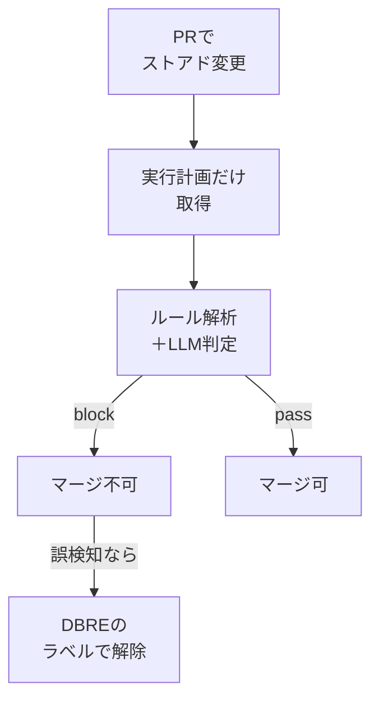

## AI

### [中国製AIモデル「GLM-5.3」が約束通りオープンモデルとして無償公開される、Claude Fable 5やGPT-5.6 Solに匹敵する高性能モデル](https://gigazine.net/news/20260829-glm-5-3-open)
<!-- categories: LLM, OSS -->

Gigazineによると、中国のZ.aiが日本時間8月29日0時に「GLM-5.3」の中身（ウェイト。学習済みのパラメータそのもの）を無償公開した。総パラメータ数は7440億、そのうち実際に動くのは400億というMoE（入力ごとに一部の担当部分だけを働かせ、規模のわりに計算量を抑える設計）で、第三者評価のArtificial Analysis Intelligence Indexでは60点とClaude Opus 4.8を上回り、エージェント能力を測るAgentic Indexでも59点でGPT-5.6 SolとGrok 4.6を超えたとされる。入手先はHugging FaceとModelScopeで、Unslothによる量子化版を使えばメモリ256GBのMacやVRAM 24GBのPCでも動かせるという。ライセンスは独自の「GLM-5.3 License」で、年間収益100億ドル超の企業だけはZ.aiのセキュリティ審査を通す必要がある。[Fable 5とも戦える「GLM-5.3」登場](/blog/2026-08-15/#fable-5とも戦えるglm-53登場事後学習の拡張のみで大幅性能アップ)の時点では「ウェイトの一般公開は2週間以内」という予告にとどまっていたので、期限どおりに果たされた形になる。

### [Anthropic、AIエージェントによる物理デバイス操作の共通規格「Model Hardware Standard」を発表](https://gihyo.jp/article/2026/08/model-hardware-standard)
<!-- categories: Anthropic, AI Agent, Standards -->

gihyo.jpが報じたところでは、Anthropicは2026年8月27日、AIエージェントが顕微鏡やロボットアーム、測定装置といった実物の機器を安全に扱うための共通仕様「Model Hardware Standard」（MHS）のリサーチプレビューを公開した。機器の側が「自分に何ができるか」「どこから先は危ないか」をAIに伝える形式を決めておくことで、メーカーの違う装置を同じ手順で操作できるようにする狙いだ。提供先はまず一部の科学研究機関と先端製造分野のパートナーに限られ、研究用顕微鏡の調整や量子コンピューター向けレーザーの復旧といった用途で試されている。Anthropicは将来的にMHSをオープンソース化し、他社のAIや機器でも使えるようにする方針を示している。ソフトウェア側の接続口を決めた[MCPのロードマップ](/blog/2026-08-26/#mcpが最新ロードマップを発表エージェンティックai非同期通信セキュリティなど5つの重点分野を定義)と並べると、AIの手が届く範囲を画面の外へ広げる作業が始まったと読める。

### [国防総省によるAnthropicのサプライチェーンリスク指定は違法だと連邦判事が判断](https://gigazine.net/news/20260828-anthropic-pentagon-blacklist-lawsuit)
<!-- categories: Anthropic, Business, Security -->

Gigazineの記事によると、連邦地方裁判所のリタ・リン判事は8月28日、アメリカ国防総省がAnthropicを「国家安全保障上のサプライチェーンリスク」に指定した処分を、合衆国憲法修正第1条（言論の自由）に違反するとして違法と認定した。発端は2026年2月にさかのぼる。Anthropicが自社モデルの用途から大規模な国内監視と完全自律型兵器を除くよう求めたのに対し、ヘグセス国防長官がその制限の撤廃を要求し、拒まれたという経緯だ。判事は「『国家安全保障』という空虚な主張は、政府批判者を罰して報復する白紙小切手ではない」と述べ、指定をブロックした。AIベンダーが利用規約で用途を絞ることと、政府調達での立場が両立しうるかを問う判断で、同種の争いの前例になりうる。

### [OpenAI、AnthropicやAWS、Google、Microsoft、Oracleなど100以上の企業・団体とサイバー防御強化を求める公開書簡を発表](https://gihyo.jp/article/2026/08/a-call-for-collective-action-on-cyber-defense)
<!-- categories: Security, OpenAI, Anthropic -->

gihyo.jpによると、OpenAIは2026年8月27日、Anthropic・AWS・Google・Microsoft・Oracleを含む128の企業・団体と連名で、サイバー防御の立て直しを求める公開書簡を出した。署名者はAI企業やクラウド事業者にとどまらず、セキュリティ・通信・金融・製造まで広がる。書簡は宛先を4つに分けており、一般企業にはAIが書いたコードも含めたセキュリティ基準の引き上げと危険度の高い脆弱性の優先修正を、セキュリティ企業には最先端AIを想定した継続的な防御テストを、政府には重要インフラへの資金支援と国際的な連携を、AI企業には防御側の実務者へのリソース提供とAIエージェントの追跡可能性の確保を求めている。背景にあるのは、AIを使った攻撃が数カ月単位で高度化し、病院や浄水施設のような設備に残された猶予が短いという危機感だ。防御側にモデルを配る取り組みは[Claude Mythos 5の防御向け提供](/blog/2026-08-23/#bringing-the-cybersecurity-capabilities-of-claude-mythos-5-to-more-defenders)でも進んでいたが、今回は業界横断の合意という形を取っている。

### [AIに同じミスを繰り返させない「ハーネスエンジニアリング」とは？](https://gigazine.net/news/20260828-harness-engineering)
<!-- categories: AI Agent, LLM -->

Gigazineが紹介したのは、AI支援開発の専門家であるビルギッタ・ベッケラー氏がMartin Fowlerのサイトで公開した「ハーネスエンジニアリング」という考え方だ。AIコーディングエージェントには人間の開発者が持つ経験や暗黙のルールが備わっていないので、その不足をAIの周りの仕組みで埋めていくという発想である。構成要素は2つで、作業前にプロジェクトの方針やコーディング規約を渡す「ガイド」と、作業後にテストや自動チェックで検証して問題をAIへ返す「センサー」だ。肝心なのは、同じ間違いが繰り返されたときにその場のコードを直すのではなく、ハーネス自体を直すという扱い方にある。[ハーネスこそが主役だと示したNVIDIAの実験](/blog/2026-08-23/#nvidia-just-showed-that-the-harness-not-the-ai-model-is-now-the-real-hero)が効果の大きさを数字で見せたのに対し、こちらは日々の開発でどう積み上げるかの手順に落とし込んでいる。

## Infra

### [How we saved 100 terabytes of memory by optimizing 1.1.1.1's DNS cache](https://blog.cloudflare.com/dns-cache-memory-optimization-1111)
<!-- categories: Cloudflare, DNS, Performance -->

Cloudflareが公式ブログで、パブリックDNSサービス「1.1.1.1」などを支える基盤のキャッシュ構造を作り直し、全体で約100TBのメモリを空けたと明かした。手を入れたのはRustのデータ構造の細部だ。`Vec`や`String`を余分な容量を持たない`Box<[T]>`／`Box<str>`に置き換え、回答・権威・追加の3セクションを1本のリストとオフセットにまとめ、問い合わせたドメイン名と同じになる所有者名は保存せずキーから復元する、といった積み重ねである。仕上げにレコードの中身を解析済みの型ではなく受信したままのバイト列で持たせた結果、キャッシュ1件あたりのメモリは953バイトから420バイトへ56％減った。速度も落ちるどころか、書き込みは毎秒62.5万件から89.3万件へ43％向上し、参照は828ナノ秒から670ナノ秒へ短縮している。同社の環境には2500億件のキャッシュがあり、1件あたり数十バイトの削減が桁違いの効果に化けることを示した事例だ。

### [HBMの再設計でAI性能アップへ。NVIDIAが「NVHBM」発表](https://pc.watch.impress.co.jp/docs/news/2136398.html)
<!-- categories: NVIDIA, Hardware, GPU -->

PC Watchによると、NVIDIAは8月26日、HBM（GPUの隣に積んで使う超高速メモリ）の構成を見直す技術「NVHBM」を発表した。これまでGPU側のチップに置いていたメモリコントローラをHBMの内部へ移し、両者をつなぐ回路を専用設計の狭いものに置き換えるのが要点だ。これによりGPU側から通信回路とその周辺が最大67％分なくなり、空いた面積を計算のための回路に回せる。NVIDIAの説明では、スタックあたりの帯域幅（データを運ぶ太さ）が最大30％増え、HBM部分の消費電力は15％減り、NVLink Fusionと組み合わせればチップあたりの総合性能が30％上がるとされる。[Samsungが示したHBMベースダイの構想](/blog/2026-08-24/#samsung-evolving-hbm-base-die-at-hot-chips-2026)も同じくGPUの仕事をメモリ側へ寄せる方向で、性能の伸びしろがメモリとの境目に移りつつあることが立て続けに示された形だ。

### [AWSとNVIDIA、AIインフラの需要拡大に向けた戦略的協業拡大 AWSのグローバルインフラ全体に200万個のNVIDIA GPU](https://ai.watch.impress.co.jp/docs/news/2136488.html)
<!-- categories: AWS, NVIDIA, Datacenter -->

AI Watchが報じたところでは、AWSとNVIDIAは8月26日、協業を拡大すると発表した。柱はAWSの世界中のインフラへ2027年から2028年にかけてNVIDIA GPUを200万個追加導入する計画で、需要の急増に供給側を合わせにいく規模感がそのまま数字に出ている。あわせてNVIDIA Vera CPUを使った基盤の導入、GPU 10万個規模となる米国政府向けAIファクトリーの構築、オープンモデルNVIDIA Nemotronのサポート継続、Amazon RoboticsへのNVIDIAのフィジカルAI基盤の採用が並ぶ。クラウド事業者が自社チップを進める一方で、実際に積む台数の大半はまだNVIDIA製という現状を確認する内容でもある。GPUの調達計画がクラウドの価格や在庫に跳ね返ることを考えると、2027年以降にGPUインスタンスを使う前提で設計する側にとっては読んでおく価値がある発表だ。

### [GitHubが落ちまくっている履歴を集計しているサイト「Is GitHub Cooked？」](https://gigazine.net/news/20260828-is-github-cooked)
<!-- categories: GitHub, Incident -->

Gigazineが紹介したのは、GitHubの障害履歴を集めて可視化する「Is GitHub Cooked？」というサイトだ。2016年3月以降に記録されたインシデントは1128件、直近3カ月に絞ると月平均24.3件で、最も多かったのは2026年2月の37件。障害が1件も起きなかった最長記録がわずか8日というのも、頻度の高さを示している。背景として挙がっているのはAI利用の急増で、月間コミット数は2026年4月の14億件から8月には29億件へ倍増し、基盤の自動拡張が追いつかなくなっているという。[8月17日の大規模障害の事後報告](/blog/2026-08-22/#the-august-17-outage-and-the-work-ahead)でGitHub自身が容量不足を原因に挙げていたことと符合しており、単発の事故ではなく傾向として現れていることが外部の集計からも見える。

### [Scale before the spike: Predictive autoscaling for GPU workloads on Kubernetes](https://www.cncf.io/blog/2026/08/28/scale-before-the-spike-predictive-autoscaling-for-gpu-workloads-on-kubernetes)
<!-- categories: Kubernetes, GPU, CNCF -->

CNCFのブログに載った、GPUを使う処理のオートスケール（負荷に応じてサーバー台数を自動で増減させる仕組み）を、需要が来る前に先回りさせる試みの報告。著者らが遭遇した障害では、6時にアクセスが急増し5分後に増設が始まったものの、GPUノードが使える状態になったのは6時45分で、その頃には山が過ぎ、15〜20％のエラーを出した後だった。負荷を見てから動く従来のやり方は、準備に3〜5分かかるGPUには間に合わないという診断である。提案は3点構成で、直近1時間の指標から10分先の需要を予測する2層のBi-LSTMモデル、学習していない急変を拾う変動幅ベースの検知、そして毎分20Pod以下に増やす速度を抑えた増設だ。予測の的中率は10分先で実測の±10％以内に85％とされるが、本番投入後のコストやエラー率の改善幅までは示されていない。

## Backend

### [DBの性能検証を人の判断に委ねない ── ストアド改修の実行計画をCIで取得しLLMがレビューする仕組み](https://techblog.zozo.com/entry/stored-procedure-plan-check-ci)
<!-- categories: Database, CI, LLM -->

ZOZOのSRE部が、SQL Serverのストアドプロシージャ（データベース側に置いておくSQLのまとまり）を書き換えたときの性能劣化を、人の裁量に頼らず必ず検査する仕組みを公開した。きっかけは、WHERE句で参照する列を変えたことでインデックスが効かなくなり、負荷が高まるイベント中にDBが悲鳴を上げた事例だ。仕組みはこうだ。GitHub Actionsが変更を検出し、EKS上のArgo Workflowsが本番相当のデータを持つステージング環境へ接続して、`SET SHOWPLAN_XML ON`で「推定の実行計画」（DBがどの順序でどう探しに行くかの計画表）だけを取り出す。実際には実行しないのでパラメータも要らず、本番に負荷もかからない。取れた計画XMLとルールベースの解析結果をAmazon Bedrock経由でClaudeに渡し、重大な性能懸念があるかを`block`／`pass`で返させ、その判定がCIの合否になる。

誤検知に備えて`dbre-review-passed`ラベルによる救済路も用意しつつ、ラベルの不正利用は自動で取り消される設計にしている点が、運用を回すうえでの現実的な落としどころになっている。

### [Testcontainersで実DBを使う並列テスト基盤を設計する](https://www.m3tech.blog/entry/2026/08/28/160000)
<!-- categories: Testing, PostgreSQL -->

エムスリーのUnit7チームが、モックを極力使わず実際のPostgreSQLに繋いでテストする方針のもとで、並列実行しても壊れないテスト基盤をどう組んだかを書いている。複数のテストが同じDBの状態をいじると相互に干渉してFlakyなテスト（同じコードなのに通ったり落ちたりするテスト）になるが、直列に流すと所要時間が3倍以上に伸びるというジレンマがあった。採った解は、資源ごとに分離の粒度を変えることだ。Testcontainersで立てるPostgreSQLコンテナはテストスイート全体で1つ共有し、データベースはスレッドごとに1つ割り当て、スキーマはマイグレーション済みのテンプレートから複製、データだけをテストごとにTRUNCATEして入れ直す。スキーマ単位の分離では`search_path`を書き換えれば他スレッドのデータに手が届いてしまうため、データベース単位まで下げたという判断も書かれている。リセット方式の実測では、同時実行数1ではテンプレート複製が9.51msとやや速いものの、同時実行数10ではTRUNCATE方式の27.20msに対し複製が47.15msと逆転しており、`CREATE`がサーバー全体で競合してスケールしないことが示されている。

### [多観点で比較する Lambdalith vs 単一目的 Lambda](https://dev.classmethod.jp/articles/lambdalith-vs-single-purpose-lambda)
<!-- categories: AWS -->

DevelopersIOの記事が、AWSでAPIを作るときにLambdaをエンドポイントごとに分けるか、Honoで1つにまとめる「Lambdalith」にするかを7つの観点で比較している。単一目的Lambdaに分があるのは、Lambdaを起動する前にルート単位で認証や検証を効かせられる点と、ルートごとに最小権限のIAMロールを当てられる点だ。逆にLambdalithが勝つのは、AWSに依存しないHonoだけでローカル実行とテストが完結すること、正規表現やクエリでの分岐といったルーティングの表現力、そしてエンドポイントを増やしてもインフラの差分がゼロになることである。数として効いてくるのがCloudFormationのリソース上限で、記事は27関数・51メソッドのスタックが492／500まで達した実例を挙げている。コールドスタート（久しぶりの呼び出しで初回だけ待たされる現象）については、Lambdalithは1回が長いかわりに起こる頻度が少ないため、低〜中トラフィックでは一概に不利とは限らないと整理している。

### [【MySQL】SELECT MAX(id) FOR UPDATEでID採番すると同時実行でデッドロックする理由を調べてみた](https://dev.classmethod.jp/articles/mysql-select-max-id-for-update-deadlock)
<!-- categories: MySQL, Database -->

DevelopersIOが、`SELECT MAX(id) FOR UPDATE`で次のIDを決めるという素朴な採番方法が、並列実行でデッドロック（互いに相手の解放待ちになり進めなくなる状態）を起こす仕組みを解きほぐしている。このSQLは最大値のレコードそのものへのロックに加えて、そのレコードから表の末尾までの隙間を押さえるギャップロックも取る。ギャップロックは複数のトランザクションが同時に持てるがレコードロックは1つしか持てないので、先行したセッションAがレコードロックを握っている間、セッションBはギャップロックだけ取って待つ状態になる。そこでAがINSERTしようとすると、挿入に必要なロックがBの持つギャップロックに阻まれ、AはBを、BはAを待つ循環ができあがる。記事は代替として`AUTO_INCREMENT`、カウンター用テーブルと`LAST_INSERT_ID()`の組み合わせ、`GET_LOCK()`によるアドバイザリーロック、UUIDの4案を挙げ、それぞれの向き不向きを添えている。

### [[アップデート] Aurora DSQL が外部キー制約をサポートしたので確認してみた](https://dev.classmethod.jp/articles/aurora-dsql-foreign-key-constraints)
<!-- categories: AWS, Database, PostgreSQL -->

DevelopersIOによると、AWSの分散データベースAurora DSQLが2026年8月のアップデートで外部キー制約（別の表に存在する値しか入れられないようにする仕組み）に対応し、東京・大阪リージョンでも使えるようになった。これまでは分散構成の都合で非対応とされ、参照の整合性はアプリ側で担保するしかなかったので、設計の前提が1つ変わる。ただし記事は使う前に知っておくべき制限も並べている。既存テーブルへ後から追加するときは`NOT VALID`を付ける必要があるうえ、既存行を検査する`VALIDATE CONSTRAINT`は未対応なので、追加時点で不整合が残っていても気づけない。もう1つは1トランザクションで変更できる行数が3000行までという制限で、`CASCADE`で連鎖削除される子の行数もここに数えられる。子の件数が読めないなら`NO ACTION`か`RESTRICT`にしておくのが安全だ、というのが記事の結論になっている。

## Frontend

### [htmx 4.0.0 has been released](https://four.htmx.org/announcements/2026-08-28-htmx-4.0.0-is-released)
<!-- categories: HTMX, JavaScript -->

HTMLに属性を書くだけで通信と画面更新ができるライブラリhtmxが、公式サイトでバージョン4.0.0の公開を告知した。最も影響が大きい変更は属性の継承が明示的になったことで、親から子へ自動的に引き継がれていた設定は`hx-confirm:inherited="..."`のように書き分ける必要がある。イベント名も`htmx:before:request`のような`フェーズ:動作`の形へ統一され、通信の中身がXMLHttpRequestから`fetch()`に変わったため`htmx:xhr:*`系は廃止された。履歴管理も既定では`localStorage`を使わなくなり、戻る操作ではキャッシュからの復元ではなく再取得になる。新機能としては差分だけを当てるMorph Swapの本体取り込みと、範囲外の差し替えを書きやすくする`<hx-partial>`タグが入った。ただし公式は、npmの`latest`タグは2.xのままで4.0は2027年初頭まで`next`扱いとし、2系は今後も無期限にサポートするので急いで上げる必要はないと明言している。[「史上最悪のhtmx」を40行で作った記事](/blog/2026-08-02/#40行のjavascriptで作る史上最悪のhtmxから学ぶ設計の勘所)が示したように、この手のライブラリは核が小さいほど拡張で伸びる。今回の変更もその線に沿っている。

### [Brave's browser one-ups Chrome with its new support for email aliases](https://techcrunch.com/2026/08/28/braves-browser-one-ups-chrome-with-its-new-support-for-email-aliases)
<!-- categories: Browser, Privacy -->

TechCrunchが報じたところでは、Braveがブラウザに使い捨てメールアドレス（エイリアス）を作る機能を追加した。Braveアカウントを本来のメールアドレスで作っておくと、サイトのメール入力欄をクリックしたときにエイリアスの生成を提案するポップアップが出て、そこ宛に届いたメールは本来のアドレスへ転送される。ポップアップが出ない欄では右クリックからも呼び出せる。無料で作れるのは5個までで、それ以上は有料のBrave Premiumが必要だ。Brave側はエイリアス宛メールの本文は読まずスパムとウイルスの判定にだけ使い、アカウントのデータは保管時に暗号化すると説明している。ただし、Braveがメール送信元としての評価を積み上げている途中のため、転送されたメールが最初のうちは迷惑メールに入ることがあると注意も添えられている。

### [GoogleがAIボットによる検索結果スクレイピングを防ぐためパススルーURLとして「google.com/goto」の展開を開始](https://gigazine.net/news/20260828-google-search-goto-tracking-parameters)
<!-- categories: Google, Browser -->

Gigazineによると、Googleは検索結果のリンクを直接リンク先へ飛ばすのをやめ、`google.com/goto`というURLをいったん経由させるサーバー側リダイレクトの展開を始めた。目的は第三者ツールやAI企業、スクレイパー（ページを機械的に収集するプログラム）による検索結果の吸い出しを防ぐことで、Google広報も進化する不正行為への技術的対策だと説明している。テストは2026年7月から段階的に始まり、8月第1週に大規模なテストが確認され、8月時点では複数の家庭向けIPで展開率がほぼ100％に達しているという。一般の利用者への影響はリンクにマウスを乗せたときに表示されるURLが変わる程度にとどまるが、検索順位の計測ツールなど検索結果を自動で読んでいる仕組みは動かなくなる可能性がある。この手のツールを業務で使っているなら、異常が出たときに原因の見当をつける材料として押さえておきたい。

### [Undefined CSS variables fail silently: two failures in one evening, and the guard that checks reality](https://dev.to/pm25coder/undefined-css-variables-fail-silently-two-failures-in-one-evening-and-the-guard-that-checks-i1c)
<!-- categories: CSS, Testing -->

一晩に2度も見た目が壊れた経験から、CSS変数（`--bg-1`のように名前を付けて色や余白を使い回す仕組み）の危うさと、その検査方法を書いた記事。1度目はテーマ変数を経由せずダークテーマ用の色をコンポーネントに直接書いてしまい、ライトテーマで文字が読めなくなった。2度目はそれを直した後で、`tokens.css`に定義されていない4つの変数を参照してしまい、フォームの背景が透明になったりバッジのサイズが狂ったりした。厄介なのは、フォールバック値を書かない`var(--x)`が未定義でもエラーにならないことだ。著者の説明どおり、その宣言は計算時点で無効になり、そのプロパティは最初から書かれていなかったものとして扱われる。つまりブラウザは黙って既定のスタイルを当てるので、テストにも引っかからない。対策として著者は、全CSSファイルの`var(--x)`が`tokens.css`に定義済みかを走査し、`tokens.css`の外にダークテーマ用の色コードが漏れていないかも検査する静的解析ツールを作り、ビルドを落とすようにした。

### [GUIs should be fully keyboard-driven](https://ckardaris.com/blog/2026/08/28/keyboard-driven-guis.html)
<!-- categories: Accessibility, Design -->

「キーボードだけで完結できるのはターミナル画面の利点だ」という通説に、著者が異を唱えた記事。著者は、GUIがキーボードで操作しづらいのは技術的な限界ではなく、作り手がそこに手をかけていないだけだと主張する。根拠として引くのがGNOMEのヒューマンインターフェイスガイドラインで、マウスでできることはすべてキーボードでもできるべきであり、画面のどの部分にもキーボードで移動して操作できるべきだと明記されている。著者自身が開発するGUIアプリKlisiでは、全機能にショートカットを割り当てる方針で実装したという。TUIのほうがキーボード操作が効くという傾向は事実としても、それはGUI側の実装の不備を映しているにすぎず、アプリの種類ではなく設計の意図の問題だ、というのが結論だ。アクセシビリティの観点でも同じことが言えるので、自分の作るUIをキーボードだけで一周してみる価値はある。

## Products

### [Firecrawl Developer Index](https://www.producthunt.com/products/extract-by-firecrawl)
<!-- categories: AI Agent, MCP -->

コーディングエージェントが調べ物のために使う専用の検索インデックス。GitHubのREADMEやIssue・プルリクエスト、技術ドキュメント、エージェント向けスキルなど7000万件超をあらかじめ集めてあり、汎用のウェブ検索と違ってコードやAPIの仕様、既知の不具合にたどり着くことに絞って作られている。1179件の実際の開発者向け質問での再現率（上位10件に正解が含まれる割合）は63％で、競合より約10ポイント高いと提供元は説明している。APIのほかCLIとMCP経由でも呼べて、APIキーなしで試せる。

### [Speko](https://www.producthunt.com/products/speko)
<!-- categories: LLM, AI Agent -->

音声アプリを作るときに、音声認識・言語モデル・音声合成のどれをどこの製品にするかを自動で選んでくれる中継サービス。LLMを取り次ぐOpenRouterの音声版という位置づけで、使いたい用途と言語を渡すと、独立した公開ベンチマークの結果をもとに各段の担当を割り振る。音声データ自体はSpekoを通さず各社のサービスへ直接流れ、振り分けの判断はセッションを始める前に済ませる作りなので、リアルタイムの双方向通話でも間に挟まらない。自社モデルを持たず売りもしないため中立を保てる、というのが提供元の主張だ。

### [Revalvo](https://www.producthunt.com/products/revalvo)
<!-- categories: LLM, Testing -->

プロンプトを本番に出す前に鍛えるための、手元で動くデスクトップアプリ。同じプロンプトを複数のモデルへ同時に投げて出力を並べ、正規表現やJSONスキーマ検証など約25個のルールベースの検査と、別のAIに採点させる14個の判定を組み合わせて点数を付けられる。プロンプトをGitのように版管理して差分を見たり、データセットに対してまとめて試したりもできる。開発元によればAPIキーは利用者が自分で持ち込む方式で、キーを預けずAPI料金への上乗せもないため、LangSmithのようなホスト型の観測基盤を入れる前段として使いやすい。

### [Traccia](https://www.producthunt.com/products/traccia)
<!-- categories: AI Agent, Observability -->

本番で動くAIエージェントに対して、記録を残すだけでなく「その操作を許すかどうか」を実行時に効かせる管理基盤。従来のトレース（処理の記録）は何が起きたかは分かっても、それが許されるべき操作だったかは判定できない、というのが開発チームの問題意識だ。ツールの呼び出し回数の上限、使ってよいモデル、実行時間といった制約をポリシーとして書いておくと、実行中に止められる。SDKはPythonとNode.js向けにOpenTelemetryの上でオープンソース公開されており、LangChainやOpenAI、Google Geminiなどモデルもフレームワークも問わずに使える。

### [IQ Routing](https://www.producthunt.com/products/iq-routing)
<!-- categories: LLM, AI Agent -->

エージェントの1回の実行を「独立したリクエストの列」ではなく「ひと続きの軌跡」として捉え、その中での位置づけに応じてモデルを割り振るゲートウェイ。定型的な手順には安いモデルを、判断が要る場面だけ高価なモデルを当てることで、全ステップに最上位モデルを使う無駄をなくす狙いだ。あわせて、会話履歴全体をキーにした内容ベースのキャッシュで同じ処理の繰り返しも避ける。コードを書き換えずに差し込めるのが特徴で、Claude CodeやCodexといった既存のツールからそのまま使えるとしている。

## Others

### [イエローハット、最大180万人分の情報漏えいか 作業予約システムに不正アクセス](https://www.itmedia.co.jp/news/article/2608/28/2000000922)
<!-- categories: Security, Incident -->

ITmediaによると、イエローハットは8月28日、店舗での作業予約に使う「イエローハットWEB作業予約システム」が不正なプログラムによる攻撃を受け、最大180万1499人分の個人情報が漏えいした可能性があると発表した。含まれるのは氏名・電話番号・メールアドレス・会員番号で、クレジットカード情報やパスワード、車両情報は対象外としている。異常に気づいたのは8月18日の朝で、システムの外部接続を遮断する緊急措置を取ったうえで調査を進め、個人情報保護委員会への報告と警察への相談を済ませた。対象となる顧客には準備が整い次第、個別に案内するという。同グループでは4月にも子会社が不正アクセスを受け、345万人超の情報漏えいが確認されており、グループ全体での対策の実効性が問われる形になっている。

### [Luanti removed from Google Play due to baseless AI copyright notice](https://blog.luanti.org/2026/08/27/luanti-dmca-tracer-ai)
<!-- categories: OSS, Google -->

オープンソースのボクセルゲームエンジンLuantiが、公式ブログで、Androidアプリが根拠のない著作権侵害の申し立てによってGoogle Playから削除されたと明かした。申し立てを出したのは、Microsoftの代理としてAIで侵害を自動検知する「ブランド保護プラットフォーム」を名乗るTracer.AIで、Minecraftの著作権登録番号を挙げてはいるものの、どの素材がどう侵害にあたるのかは一切示していないという。Luanti側は、同梱しているのは実用的なテクスチャだけでMinecraft由来のコードも素材も入っておらず、コミュニティ製のゲームはアプリ内カタログのContentDBから別途取得する構造だと反論している。プロジェクトはすでに異議申立てを提出しており、DMCAが定める10〜14営業日での復帰を望むとしつつ、同じ相手から受けた2023年3月の削除では復帰まで46日かかったとも書き添えている。AIによる自動検知が誤って撃った1発を、人手で撤回させるコストを誰が負うのかという問題が生々しく出た事例だ。

### [Android 17で通信のプライバシーが強化、「アクセス先」を隠すECHや2G詐欺対策に対応](https://gigazine.net/news/20260828-android-17-encrypted-client-hello)
<!-- categories: Android, Security, Privacy -->

Gigazineが伝えたところでは、GoogleはAndroid 17でネットワーク周りの守りを4方向から固める。1つ目はECH（Encrypted Client Hello）で、HTTPS通信の最初のやり取りに平文で載ってしまうアクセス先のドメイン名を暗号化する。プライベートDNSと組み合わせれば、名前解決と接続の両方でどこに繋いだかを隠せる。2つ目はローカルネットワーク保護で、家庭内LANの機器に触るアプリは`ACCESS_LOCAL_NETWORK`権限を取り、利用者の許可を得る必要が出てくる。3つ目は証明書の発行記録を公開ログで検証できるようにする証明書透明性への対応、4つ目は携帯通信会社が契約者の2G接続を初期状態で無効にできるようにする措置で、偽の基地局が端末をわざと古い規格へ落として盗聴する手口を封じる狙いがある。

### [GoogleがAndroidアプリ開発者にメモリ使用量を削減するよう警告、2027年2月から新しい基準値が設定される](https://gigazine.net/news/20260828-google-android-app-developers-reducing-memory)
<!-- categories: Android, Google -->

Gigazineによると、Google Playが品質要件を2つ追加した。1つは2027年2月からアプリのメモリ使用量に新しいしきい値を設けるもので、対象は動作中のメモリ量とビットマップ（画像を展開したときに占める領域）の保持のしかた、それにR8などによるDEXコードの最適化を最低25％の適用率で行うこと。基準を外れると既存の指標と同じく、端末上でアプリが強制終了されやすくなるという。もう1つは2027年4月からで、Android Restore Credentials APIを使い、機種変更後もサインイン状態が自動で戻るようにすることを求める（ゲームは当面除外）。[Android 17はメモリを使い過ぎるアプリを強制終了](/blog/2026-08-22/#android-17はメモリを使い過ぎるアプリを強制終了)がOS側からの締め付けだったのに対し、こちらはストアの掲載基準として同じ方向へ圧力をかけるもので、端末の余裕を当てにした実装は両側から通用しなくなりつつある。

### [トランプ政権が半導体を対象にした新関税の導入を検討、影響が大きいとしてテック業界は反発](https://gigazine.net/news/20260828-trump-new-tariff)
<!-- categories: Hardware, Business -->

Gigazineが、ニュースサイトPOLITICOの報道（関係者8人の証言）として、トランプ政権が半導体に包括的な新関税をかける計画を検討していると伝えた。対象は半導体そのものにとどまらず、ノートPCやゲーム機、サーバーまで及ぶとされる。テック業界は、半導体をできるだけ国内で作るという目標自体には反対していないものの、最先端の工場を建てるには数千億円単位の費用と数年から十数年単位の時間がかかるため、関税だけを先に課してもアメリカを破滅させかねないと警告しているという。記事は、最先端半導体の生産は台湾が世界の90％以上を占めており、代わりの供給元をすぐには用意できない点も指摘している。データセンターの建設計画が頓挫する可能性にも触れられており、実現すればサーバーやPCの調達コストに直接跳ね返る話だ。
