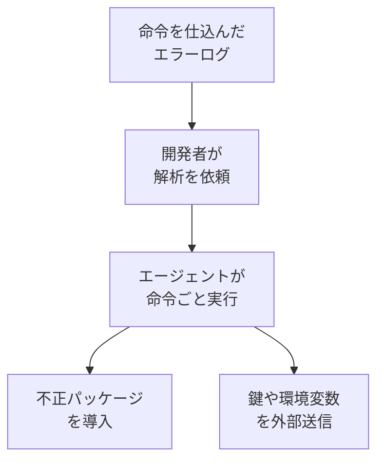

## AI

### [AIが自身の安全研究を自動化、6時間で人間超えの手法を開発。Anthropicの「AAR」](https://pc.watch.impress.co.jp/docs/news/2136931.html)
<!-- categories: Anthropic, LLM -->

PC Watchの記事によると、AnthropicはAIの安全性研究そのものをAIに任せる仕組み「AAR（Automated Alignment Researcher）」を公開した。AARはClaude Opus 4.8を土台にしたエージェントで、関連文献を調べる、対策の手法を考える、コードを書く、モデルを学習し直す、結果を評価する、という一連の作業を人手を介さず繰り返す。狙いは、嘘をつく・利用者に迎合する・禁止された指示に乗ってしまうといった、アラインメント（AIを人間の意図どおりに振る舞わせる調整）の失敗を減らす手法を見つけることだ。10種類の失敗パターンで試したところ、平均2.5年の経験を持つ28人の研究者が出した最良の結果に、AARは約6時間で到達したという。見つかった手法は4.7倍大きいモデルに適用しても効果が保たれ、記事は「性質がはっきり分かっている問題については、安全性研究の自動化が実用段階に近づいた」という研究者の見方を伝えている。

### [「エラーログをAIに解析させる」だけで感染　社内のAIを乗っ取る攻撃、対策は？](https://atmarkit.itmedia.co.jp/ait/articles/2608/31/news035.html)
<!-- categories: Security, AI Agent -->

@ITが、セキュリティ企業Kasperskyの調査をもとに、コーディング用のAIエージェントを踏み台にする攻撃の手口を整理している。攻撃者は、エージェントが読み込むテキスト——たとえばエラーログ——のなかに命令文を仕込んでおく。開発者が何気なく「このログを解析して」と頼むと、エージェントはログ内の命令にも従ってしまい、不正なパッケージを入れたり、環境変数やAPIキーを外部に送り出したりする。承認ダイアログを飛ばすフラグ（`--dangerously-skip-permissions` や `--yolo`）を常用していると、人間が一度も目にしないまま完結してしまう点が厄介だ。以前の[AIエージェントに「安全なコマンド」を許可しただけで任意コード実行](/blog/2026-08-20/#aiエージェントに安全なコマンドを許可しただけで任意コード実行dockerが解説するコマンド承認の落とし穴)と同じく、狙われているのは「エージェントは読んだ文章を素直に信じる」という性質そのものである。

記事が挙げる対策は、エージェント本体・MCPサーバー・ツール・パッケージのバージョンを実行前に明示的に確かめること、インストールや機微な操作は必ず人が承認すること、エージェントが到達できるネットワークの範囲を絞ることなどだ。

### [OpenAIが数万台のMac miniとMac Studioを買い占め](https://gigazine.net/news/20260831-openai-tens-of-thousands-apple-mac-mini-studio/)
<!-- categories: OpenAI, Apple, Hardware -->

Gigazineの記事によると、OpenAIがMac miniとMac Studioを数万台規模で購入したとWCCFtechなどが報じている。用途は強化学習（試行錯誤の結果に点数を付けてAIを鍛える学習法）と、AIが人間の代わりにPCを操作するエージェントの実行環境だという。Apple Siliconは、CPUとGPUがひとつのメモリを共有するユニファイドメモリ構成のため、両者の間でデータを写し替える手間が生じにくく、この種の作業と相性がよい。さらにThunderbolt 5で複数台をつなげば、大きなメモリと計算資源をひとまとまりに扱えるとされる。先日の[Apple introduces M6 and M5 Ultra](/blog/2026-08-26/#apple-introduces-m6-and-m5-ultra-for-a-big-leap-in-performance-and-ai-compute)で最大512GBのユニファイドメモリという数字が出たばかりで、記事はAppleのMac売上が2026年第3四半期に前年同期比29%増だったことにも触れている。

### [Claude Codeの週間上限、9月14日から25%増。現状比では17%減に](https://pc.watch.impress.co.jp/docs/news/2136857.html)
<!-- categories: Claude Code, Anthropic -->

PC Watchが伝えたところでは、Claude Codeの1週間あたりの使用量上限が2026年9月14日から恒久的に25%引き上げられる。対象はPro、Max、Team、および席数で課金する従来型のEnterpriseプランだ。ただし現在は上限を50%増やす期間限定の措置が走っており、これが9月13日で終わるため、いま使える量を基準にすると実質17%の目減りになる。以前の[Claude Code May–August 2026 weekly limits promotion](/blog/2026-08-19/#claude-code-mayaugust-2026-weekly-limits-promotion)で告知された延長キャンペーンが、恒久的な底上げに置き換わる形だ。毎週上限近くまで使っている人は、9月14日をまたいで使い方を見直しておくとよい。

### [The Pentagon now has its own version of ChatGPT and Grok](https://techcrunch.com/2026/08/31/the-pentagon-now-has-its-own-version-of-chatgpt-and-grok/)
<!-- categories: OpenAI, xAI, Business -->

TechCrunchによると、米国防総省が自前のAI基盤GenAI.mil上で「ChatGPT Mil」と「Grok for Government」の提供を始めた。利用対象は文民・軍人あわせて300万人で、すでに170万人が登録済みだという。一般向けサービスと違い、入力したデータが商用のデータ収集の対象にならない点を売りにしており、機微な情報が消費者向けの経路に流れ込むのを防ぐ設計になっている。ChatGPT Milは文書やプロジェクトを扱う事務作業、Grokは調達やサプライチェーン管理といった運用寄りの用途を想定する。なおAnthropicのClaudeは含まれておらず、TechCrunchは、同社が国防総省への無制限のアクセス提供を断り、安全上の制限を維持したことでサプライチェーンリスクに指定された経緯を背景として挙げている。

## Infra

### [Introducing Adaptive Intelligence: Undermining the economics of every bot attack](https://blog.cloudflare.com/introducing-adaptive-intelligence/)
<!-- categories: Cloudflare, Security -->

Cloudflareが公式ブログで、ボット検知の新エンジン「Adaptive Intelligence」を発表した。前提を「すべての攻撃者を締め出す」から「攻撃側の採算が合わないようにする」へ置き換えたのが要点で、同社は「本気の攻撃者はいずれ通り抜ける。問題はその後に何が起きるかだ」と書いている。仕組みは3つで、ネットワークを流れる実際の通信で機械学習モデルを止めずに学習し直すこと、攻撃ごとの使い捨てルールをランダムな間隔で投入しては解析される前に引っ込めること、顧客から届く誤判定の報告を検知の調整に戻すことだ。固定の的が存在しなくなるため、攻撃側は突破手法を作り直し続けるコストを払わされる。以前の[CloudflareがAIエージェントの「不自然な振る舞い」を見破る新技術「Precursor」を発表](/blog/2026-07-15/#cloudflareがaiエージェントの不自然な振る舞いを見破る新技術precursorを発表)と同じく、なりすましの単価を上げにいく発想が一貫している。判断のもとになるのは、同社が1日に1兆件を超える規模で分析している不正の兆候だという。

### [Snowflake's Aug 27 outage was a bad load balancer config which took down private connectivity for an hour](https://www.reddit.com/r/sre/comments/1w3c3dp/snowflakes_aug_27_outage_was_a_bad_load_balancer/)
<!-- categories: Snowflake, Incident, SRE -->

r/sreに投稿された報告によると、Snowflakeで8月27日18時21分から19時34分（協定世界時）までの約1時間、プライベート接続——インターネットを経由せずクラウド内部の専用経路でつなぐ方式——が使えなくなった。原因はロードバランサー（通信を複数のサーバーへ振り分ける装置）まわりの設定不備で、切り戻しは不要、問題のある機材を入れ替えるだけで復旧している。投稿者が評価しているのは復旧の速さより情報の出し方で、「問題を特定し解決しました」という中身のない定型文で済ませず、事業者が原因をすぐ名指しした点を挙げている。障害そのものは小さいが、利用者がリスクを見積もれるかどうかは、こうした説明の粒度で決まる。

### [Microsoft tests fix for latest hours-long Outlook outage](https://techcrunch.com/2026/08/31/microsoft-tests-fix-for-latest-hours-long-outlook-outage/)
<!-- categories: Microsoft, Incident -->

TechCrunchによると、8月31日の米東部時間午前11時半ごろからMicrosoftのExchange Onlineで障害が発生し、同日午後5時の時点でも解消していなかった。メールの送受信の遅延・失敗、メールボックス内の検索、認証エラーなどが起き、Downdetectorへの報告は午後2時までに5000件を超えた。Microsoftは原因を認証コンポーネントの問題と説明し、その後「設定の誤りにより、認証部品が一部のインフラへ想定どおり展開されていない可能性がある」と述べている。同社は影響がExchange Online以外のサービスにも及ぶことを認めており、修正案を一部のインフラに適用して効果を確かめる段階だと説明した。認証という共通部品が倒れると、その上に載っているサービスが揃って巻き添えになるという構図がそのまま出ている。

### [日立とNTTドコモビジネス、600km超離れたデータセンター間で災害発生時にシステムの完全自動復旧を実現する共同実証](https://cloud.watch.impress.co.jp/docs/news/2136889.html)
<!-- categories: Datacenter, Network, Oracle -->

クラウドWatchが伝えたところでは、日立製作所・日立ヴァンタラ・NTTドコモビジネスの3社が、600km以上離れたデータセンター間でシステムを自動的に切り替える実証に成功したと発表した（3社は世界初としている）。組み合わせたのは、日立のストレージ仮想化技術、NTTドコモビジネスのIOWN APN（遅延が極めて小さい光の専用線）、Red Hat OpenShift Virtualization、そしてOracle AI Databaseだ。主系の停止から副系での再開までにかかった時間は約10分で、そのうちデータベースの再起動は2分未満だったという。距離が離れるほどデータの同期が遅れて整合性が崩れやすくなるのが遠隔地バックアップの難所だが、今回はストレージからデータベース、アプリケーションまで一貫して食い違いが出ないことを確認したとしている。

### [VMwareが「ターンキー化」　AI基盤の構築を数週間から30～45分に短縮](https://atmarkit.itmedia.co.jp/ait/articles/2608/31/news103.html)
<!-- categories: Datacenter, Kubernetes -->

@ITの記事によると、BroadcomのVMwareがVMware Explore 2026で「VMware AI Factory」を発表した。何もインストールされていないサーバーを用意してから、AIモデルが実際に応答を返せる状態になるまでを30〜45分に短縮すると説明している。中身は4層で、GPU管理とKubernetesを含む基盤、Google Gemini・NVIDIA Nemotron・Alibaba Qwenなど150以上のモデルを揃えたカタログ、AI Gatewayや隔離実行環境などのセキュリティ、そしてTanzu上でAIエージェントを動かし監視する仕組みが束ねられている。自社の設備内でAIを動かしたい企業にとっての面倒は、部品を個別に調達して繋ぎ合わせ、その後もばらばらに更新し続けなければならない点にあり、まとめて面倒を見る形にしたのが主眼といえる。

## Backend

### [AWS Lambda がフル IAM リソースベースポリシーをサポートしたのでクロスアカウントで試してみた](https://dev.classmethod.jp/articles/lambda-full-iam-resource-based-policy/)
<!-- categories: AWS, Security -->

DevelopersIOの記事が、AWS Lambdaに追加された `PutResourcePolicy` APIを実際に叩いて確かめている。これまでLambdaの「誰にこの関数を呼ばせるか」という設定は `AddPermission` で1回に1文だけ足す形で、指定できる条件も呼び出し元のARNやアカウントなどに限られ、明示的な拒否は書けなかった。新しいAPIではポリシー全体をJSONで一括して置き換えられ、IAMの条件キーをひととおり使えるうえ、Denyも書ける。著者は、アカウント全体に許可を出しつつ特定のロールだけを拒否する組み合わせ、`ArnNotEquals` や `NotIpAddress` で「指定した相手以外すべて拒否」とする書き方、別アカウントへエイリアス作成などの管理操作を委ねる設定を検証している。要するに、S3のバケットポリシーで当たり前にやっていた細かい制御が、Lambdaでもそのままできるようになったということだ。

### [[アップデート] Amazon Cognito に GetClientToken API が追加され、ドメインなしで M2M のアクセストークンを取得できるようになりました](https://dev.classmethod.jp/articles/amazon-cognito-get-client-token/)
<!-- categories: AWS, OAuth -->

同じくDevelopersIOより、Amazon Cognitoに `GetClientToken` というAPIが加わった。プログラム同士が人間を介さずに認証し合うM2M（マシン・トゥ・マシン）用のトークンを取るには、これまでCognitoにドメインを設定し、その `/oauth2/token` というURLへHTTPで問い合わせる必要があった。新しいAPIを使えば、ドメインを一切用意していないユーザープールからでも、AWS CLIやSDKからそのままトークンを受け取れる。著者はCLIで実際に発行してみて、従来の方式と同じ形のトークンが返り、スコープ（そのトークンで何ができるかの範囲指定）も同様に効くことを確かめている。利用にはクライアントシークレットと、認証フローで `ALLOW_CLIENT_TOKEN_AUTH` を有効にすることの2条件が必要だ。

### [Rootless Docker and Its Hidden Security Trade-Offs](https://www.kenmuse.com/blog/rootless-docker-and-its-hidden-security-trade-offs/)
<!-- categories: Docker, Security, Linux -->

Ken Muse氏が自身のブログで、Dockerを管理者権限なしで動かすrootlessモードは、危険をなくすのではなく別の場所へ移し替えているだけだと論じている。たしかに、デーモンが乗っ取られてもroot（システムの全権を持つ利用者）ではなく一般利用者として動くため、被害の広がりは抑えられる。一方でrootlessが依存するユーザー名前空間の機能は、本来は信頼された管理者しか触れなかったカーネルの入り口を一般利用者に開くもので、その周辺は入力検査が緩い。さらにコンテナの中でrootlessビルドを回すためにseccompやAppArmorといった保護を切る運用が広まっており、これは明確な後退だ。著者はカーネル開発者Andy Lutomirski氏の「あそこに権限昇格がひとつもなければ帽子を食べてやる」という言葉を引き、rootlessは「信用できない処理を安全に動かせる」という意味ではないと結論づけている。

### [C++26: Standard Library Hardening Experiments](https://www.cppstories.com/2026/hardening-experiments/)
<!-- categories: C++, Security -->

C++26で標準ライブラリに入る「hardening（堅牢化）」を、C++ Storiesの著者が手元のコンパイラで実際に試した記録。これまで `std::vector` に範囲外の添字でアクセスするような操作は未定義動作（何が起きても文法上は正しいとされる状態）で、運が悪いと壊れたまま処理が進んでしまっていた。堅牢化された実装では、こうした前提条件の違反を検出した時点で処理を必ず止めることが求められ、静かに走り続けることがなくなる。著者の実験では、GCC 16.1で範囲外アクセスがアサート失敗を経てSIGSEGVで停止し、Clangのlibc++ではDEBUGモードで `__n < size()` という条件名を含むメッセージが出た。対象は添字だけでなく、空のコンテナへの `front()` / `back()`、値を持たない `std::optional` の中身の参照、`span` や `string_view`、イテレーター、スマートポインターにも及ぶ。有効化の方法はコンパイラごとに異なり（GCCは `-fhardened`、Clangは `_LIBCPP_HARDENING_MODE`、MSVCは `_MSVC_STL_HARDENING`）、2026年8月時点では実装の進み具合もまちまちだ。

### [Bootstrappable builds: how and why](https://lwn.net/Articles/1088279/)
<!-- categories: OSS, Security, Linux -->

LWNが、FOSSY 2026でのTimothy Sample氏の講演を伝えている。テーマはブートストラップ可能なビルド、つまり「配布された実行ファイルを一切使わず、極小のプログラムから順に大きなものを組み上げていく」方式だ。動機はKen Thompson氏が示した「Trusting Trust」問題——コンパイラ自身に裏口が仕込まれていた場合、ソースコードをいくら読んでも見つけられない——にある。講演では、NixOSで `strip` に裏口を仕込むだけでシステム上のほぼ全プログラムを汚染できた実例が紹介された。現状はGuixが出発点を250MBから256バイトまで縮め、live-bootstrapは182段階を踏んで最小のLinux環境に到達している。難物はRustで、現行の1.97に至るまで1.54以降のほぼ全バージョンを順に構築する必要があり、カーネルのブートストラップは今も手つかずだという。

## Frontend

### [July in Servo: more platforms, faster canvas, web fonts in SVG, and more](https://servo.org/blog/2026/08/31/july-in-servo/)
<!-- categories: Browser, Rust -->

Rust製のブラウザエンジンServoが、7月の進捗を公式ブログで公開した。バージョン0.5.0は488件のコミットを含み、Linux aarch64向けのバイナリ配布が始まったほか、Android対応が13以上から10以上へ広がって市場の91%を覆う計算になった。目立つのは2Dキャンバス（JavaScriptから絵を描く領域）の描画を複数スレッドに分けた改善で、フレームレートが最大55%向上し、1フレームあたりの消費電力は最大42%下がった。同じ文字を異なるサイズで描く場合の文字描画は最大10倍速くなっている。機能面では、インラインSVGの中でWebフォントが使えるようになり、字幕を扱うWebVTTの実装にも着手した。実際のサイトでの見え方も進んでおり、DuckDuckGoのトップページのイラストが表示されるようになり、Gumroadの一部ページはほぼ正しく描けるという。

### [なんとなくでUIをAIに実装させない](https://dev.classmethod.jp/articles/do-not-let-ai-implement-ui-by-guesswork/)
<!-- categories: Design, AI Agent -->

DevelopersIOに掲載された、AIにUIを書かせるときの前提を整理した記事。AIは見た目の整った画面をすぐ出せるようになったが、「モダンで使いやすく」といった曖昧な依頼から出てくるのは、無難ではあっても利用者を目的地へ導かない画面だと著者は指摘する。提案されているのは、実装を頼む前に人間側で言語化しておくべき4点で、利用者が課題から解決に至るまでの流れ、その瞬間ごとに必要な情報の優先順位、読み込み中・成功・失敗・操作不可といった状態のフィードバック、そして「信頼できる」「モダン」のような感覚を「なぜそれが要るのか、どんな行動を促したいのか」という言葉に翻訳することだ。結論として著者は、デザインを「考えること」と「描くこと」に分け、前者は人間、後者はAIという分担を提案している。UI実装の難所が絵を描く技能から意図の明確さへ移った、という整理は納得しやすい。

### [創作の主体は、人間だった。 - 初音ミクのお誕生日なので TextAlive App API を使ってみた -](https://zenn.dev/tokium_dev/articles/textalive-miku-2026)
<!-- categories: JavaScript, Claude Code -->

TOKIUMの新入社員である著者が、産業技術総合研究所が公開しているTextAlive App APIを使い、曲に合わせて歌詞が1文字ずつ現れるWebページを作った記録。このAPIは、歌詞をフレーズ・単語・文字の単位に分解したタイミング情報と、ビートやサビの位置といった楽曲解析の結果をJavaScriptから取り出せるようにしたものだ。制作の過程が興味深く、著者はドキュメントを渡さず最小限の指示だけでClaude Codeに任せたところ、AIは公式資料を見ないまま既知の知識でAPIを扱い、詰まると圧縮済みのライブラリのソースを読んで原因を突き止め、足りない依存（axios）を実行の流れから割り出したという。一方でサビの自動検出の結果は実際の曲とずれており、著者が耳で聴いて手作業で補正している。タイトルどおり、最後に判断を引き受けたのは人間だった、という筋立てになっている。

### [Merge PDFs in the browser with JavaScript (no uploads, no server)](https://dev.to/jalalkhn/merge-pdfs-in-the-browser-with-javascript-no-uploads-no-server-213o)
<!-- categories: JavaScript, Privacy -->

Dev.toに投稿された、複数のPDFをブラウザだけで1つに結合する実装の解説。使うのはpdf-libとPDF.jsで、`FileReader` でファイルを読み、pdf-libで解析し、ページを新しい文書へ複製して、ダウンロード用のデータとして書き出す、という流れになる。すべての処理が利用者の端末で完結するため、ファイルが1バイトも外へ出ないこと、サーバー費用がかからないこと、無料のオンライン変換サービスにありがちなサイズ制限や透かしの混入がないことが利点として挙げられている。制約も率直に書かれており、暗号化された文書や構造の変わったPDFは追加の処理が要ること、端末側で処理する以上、大きなファイルはメモリを大量に食うこと、珍しいフォントを使った文書は再現度が落ちる場合があることに触れている。書類をどこへ送ったか分からなくなりがちなPDF加工の分野で、素直な選択肢といえる。

## Products

### [Superagent](https://www.producthunt.com/products/superagent-a-home-for-your-ai-agents)
<!-- categories: Claude Code, AI Agent, OSS -->

Claude Codeに「コンピューター」を渡すデスクトップアプリ。ターミナルに文字が流れ続ける代わりに、実際のブラウザとiOSシミュレーター、ファイルへのアクセスをGUIから扱えるようにしており、エージェントの操作を見ながら途中で人が引き取ることもできる。会話ごとに別のGitブランチとワークツリーが割り当てられるため、複数の作業を並行させてもチェックアウトが衝突しない。アカウント登録もサーバーも不要で手元だけで動き、MITライセンスで公開されている。

### [WebTerm Learn](https://www.producthunt.com/products/webterm)
<!-- categories: Git, Linux -->

ブラウザ内の使い捨て環境でコマンドラインを練習できる学習サービス。手描きのスライドで説明したあと実際にコマンドを打たせ、入力が正しいかその場で検証する形式で、ターミナルの基本・Git・Vimを扱う12コース129レッスンが無料で公開されている。障害対応やセキュリティ事故を模した実務寄りのシナリオが用意されているのが、単なるコマンド暗記型のチュートリアルとの違いだ。自分の環境を壊す心配がないので、AIが書いたコードを読んで判断する側に回りたい非エンジニアにも向く。

### [Almanac](https://www.producthunt.com/products/almanac-5)
<!-- categories: AI Agent, Slack -->

SlackやiMessageから使う、業務の記憶を自分で溜めていくAIエージェント。GmailやカレンダーやGitHubなどとつなぐと、個人の好みや連絡先をまとめた個人用の記録と、ロードマップや詰まりどころを追う組織用の記録を自動で育てていく。APIのないツールにはブラウザやターミナルを人間と同じように操作して触りにいき、夜間の計算で複数の情報源の食い違いを整理し直すという。ログインや支払い、判断の分かれる場面では手を止めて人に投げ返す作りになっている。

### [StackScope](https://www.producthunt.com/products/stackscope-dev)
<!-- categories: MCP, Business -->

新しく公開されたWebサイトが何の技術で作られているかを調べるサービス。220万件超のサイトを公開情報の手がかりから監視し、StripeやShopify、Next.jsといった技術の採用を、公開直後——プロダクト紹介サイトに載るより2週間ほど早く——検知するとしている。検索は無料で、特定の技術を採用したサイトが現れたら通知する機能、API、一括書き出しが用意されている。ClaudeやChatGPT、Cursorから直接問い合わせられるMCPサーバーも提供されており、競合の技術選定を追いたい人には手数が減る。

### [FrameOS](https://www.producthunt.com/products/frameos-3)
<!-- categories: Apple, Android -->

iOSとAndroid端末の画面を、Macから録画してそのまま仕上げまで済ませるアプリ。端末をつなぐと画面・カメラ・マイクを同時に収録でき、音がずれないように同期したうえで、トリミングや切り抜き、レイアウト調整、見せたくない部分のマスクまで単体で行える。従来は端末とカメラを別々に録って、ファイルを揃えて、外部の編集ソフトに持ち込む必要があり、30秒のデモを作るだけで手間がかかっていた。バグ報告や機能紹介の短い動画を日常的に撮るチームには効く。

## Others

### [FTC accuses Amazon of running a 'secret ad surcharge scheme' in new lawsuit](https://techcrunch.com/2026/08/31/ftc-accuses-amazon-of-running-a-secret-ad-surcharge-scheme-in-new-lawsuit/)
<!-- categories: Business -->

TechCrunchによると、米連邦取引委員会（FTC）と22州の司法長官が8月31日、Amazonの広告オークションをめぐって同社を提訴した。訴状の主張は、Amazonが7年以上にわたり、広告主に知らせないまま「ソフトな最低価格」という上乗せを課し、さらに実在しない入札者を混ぜて価格を吊り上げていたというものだ。表向きは2位の価格で落札できる方式（セカンドプライス）を掲げながら、実際にはSponsored Productsの広告主のおよそ8割が自分の入札額をそのまま満額請求されていたとされる。影響は100万を超えるブランドや出品者に及び、Amazonは数百億ドル規模の追加収入を得たと訴えられている。Amazonは訴えを「的外れ」とし、広告主の実務を根本的に誤解していると反論している。

### [Steamからゲーム史上最大規模の12TBものゲーム関連ファイルが流出](https://gigazine.net/news/20260831-12tb-steam-leak/)
<!-- categories: Security, Incident -->

Gigazineの記事によると、Steamから2003年から2013年にかけての開発用ビルドやベータ版など、合計12TBに及ぶファイルが流出した。侵入や脆弱性を突かれたわけではなく、Valveが古い基盤の接続口を公開したまま残していたことが原因だと伝えられている。含まれていたのはPortalやHalf-Lifeシリーズの内部ビルド、Portal 2の前身とされる未発表作「F-Stop」、Call of DutyやResident Evil、Batman: Arkham Asylumといった他社タイトルのベータ版で、没になった仕掛けや使われなかった台詞、試作段階のマップまで含まれる。タイトルごとに中身の充実度はばらつきがあり、ほぼ完全なビルドが出たものもあれば断片しか残っていないものもあるという。攻撃を受けていなくても、畳み忘れた古いインフラがそのまま入口になるという典型例だ。

### [Tim Cook's parting message: Apple is in the hands of a product builder](https://techcrunch.com/2026/08/31/tim-cooks-parting-message-apple-is-in-the-hands-of-a-product-builder/)
<!-- categories: Apple, Business -->

TechCrunchによると、ティム・クック氏が8月31日をもってAppleのCEOを退き、executive chairman（会長職）に移った。後任は、ハードウェアエンジニアリングを統括してきたジョン・ターナス氏で、iPhone AirやMacBook Neo、健康機能を備えたAirPodsなど近年の製品開発を率いてきた人物だ。クック氏は社内メッセージで「Appleを去るわけではない」と述べ、深く愛した役職から離れるだけだと説明したうえで、世界を変える製品を作るのに何が要るかを理解している数少ない人物として後任を評した。会長としては、トランプ政権や中国政府との関係といった政治面の役回りを引き続き担うとされる。同日にはApp Storeを率いてきたフィル・シラー氏の退任も伝えられており、経営陣の入れ替えがまとめて進んでいる。

### [個人開発のオンライン将棋「飛角」終了　「ほとんどがBOT対局、人同士が成立しない」状況に](https://www.itmedia.co.jp/news/article/2608/31/2000000982/)
<!-- categories: Business -->

ITmediaが伝えたところでは、個人が開発したオンライン将棋サービス「飛角」が、2026年4月29日の公開からおよそ4か月で終了した。人と人が指す場を作りたかったが、それが成り立たなくなったというのが開発者の説明だ。ピーク時に1日1000局近くあった対局は約100局まで落ち、そのうち人間同士の対局は1日数人分にとどまり、夜間や週末でも誰もいない時間が増えていたという。サーバー費用は月2万円ほどだった。自動で指すプログラムが場の多数派になると、人が来ない、だからさらに人が来ないという循環に入る——対戦相手の存在そのものが価値になるサービスに共通する構造的な弱さが、はっきり出た事例といえる。

### [VLC crosses 7 billion downloads](https://techcrunch.com/2026/08/31/vlc-crosses-7-billion-downloads/)
<!-- categories: OSS -->

TechCrunchによると、非営利団体VideoLANが開発するメディアプレイヤーVLCの累計ダウンロード数が、全プラットフォーム合計で70億回を超えた。2025年1月に60億回を達成してからの到達で、発表したのはVideoLANの代表であり主要開発者でもあるジャン＝バティスト・ケンプ氏だ。最近ではAmazonのテレビ向けOSであるVega OSへの移植も行われている。開発中のVLC 4では、対応プラットフォームとコーデック（動画や音声の圧縮方式）の拡大に力を入れているという。有料のストリーミングサービスが当たり前になった時代に、無料でオフラインでも動く再生ソフトが伸び続けているという事実が、この数字の意味するところだろう。
